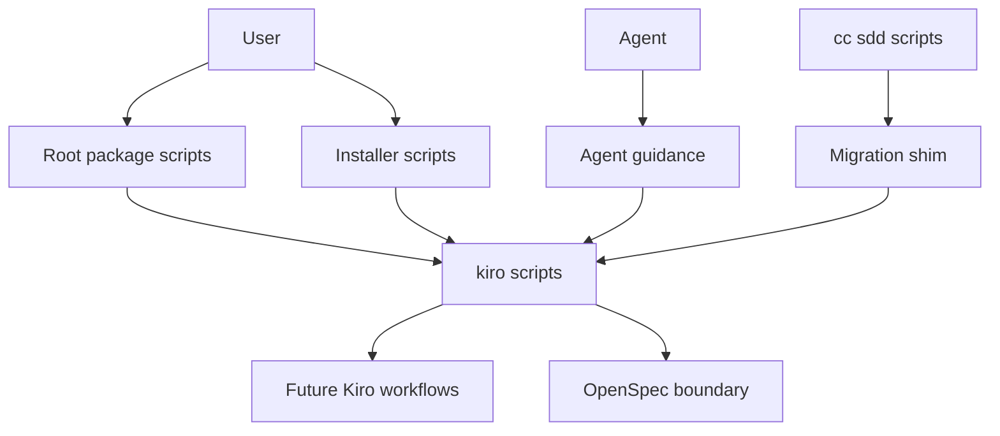
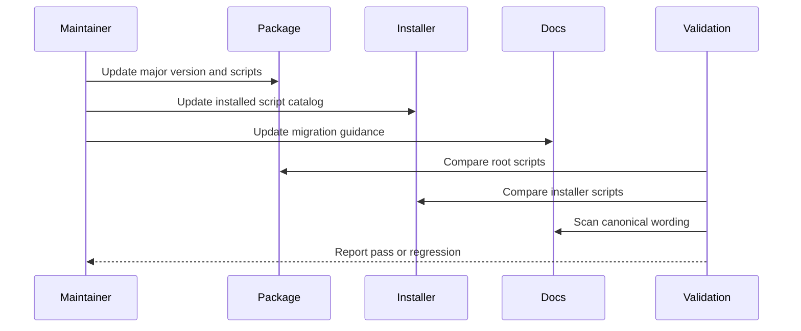
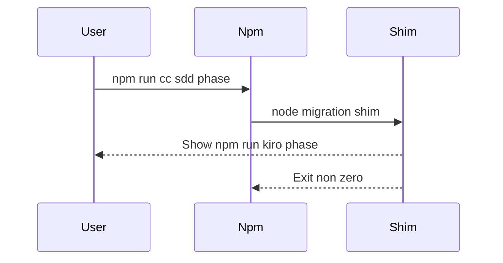

# Design Document

## Overview

`kiro-workflow-surface` は、takt-sdd の公開面を `cc-sdd:*` から `kiro:*` へ切り替えるための release surface 設計です。対象は package metadata、root/installer の npm script 定義、README/README.ja、agent guidance、旧入口の migration shim、公開 surface の回帰検証に限定します。

この spec は Kiro workflow の中身を実装しません。後続の `kiro-shared-workflow-contracts`、`kiro-status-validation-workflows`、`kiro-spec-generation-workflows` などは、この spec が定める `kiro:*` namespace と major-version policy を前提にします。

### Goals

- `kiro:*` を npm scripts とドキュメント上の canonical SDD entrypoint にする
- 旧 `cc-sdd:*` を正規入口として残さず、fail-fast migration shim で移行先を示す
- root package と installer が配る script set のずれを検証できるようにする
- README/README.ja/agent guidance の説明を同じ migration policy にそろえる

### Non-Goals

- `kiro-spec-status` など個別 workflow YAML/facet の実装
- Kiro output contract、review/debug/verify gate、skill identity resolver の詳細設計
- OpenSpec workflow の入口や実行契約の変更
- `.kiro/specs/*` artifact lifecycle の実装

## Boundary Commitments

### This Spec Owns

- root `package.json` の version と SDD npm script surface
- installer が project に追加または生成する SDD npm script surface
- `cc-sdd:*` から `kiro:*` への migration shim の公開挙動
- README/README.ja/agent guidance における migration 説明
- 公開 script と migration guidance の回帰検証

### Out of Boundary

- 個別 `kiro-*` workflow の YAML/facet/output contract
- `kiro-impl` の task selection、review、debug、completion verification
- `.claude/skills` / `.agents/skills` の source asset resolution
- OpenSpec の `opsx:*` scripts と OpenSpec artifact model

### Allowed Dependencies

- OpenSpec change `takt-native-kiro-workflows` の decision と roadmap
- 既存の installer 実装 (`installer/src/install.ts`) と i18n message model
- 既存の `.takt/{en,ja}/workflows/cc-sdd-*.yaml` naming を、移行時の対応関係を決めるための入力として参照すること
- package manager と Node.js runtime による npm script 実行

### Revalidation Triggers

- `kiro:*` script 名、workflow 名、phase 名の追加・削除・改名
- `cc-sdd:*` shim を削除へ切り替える decision
- installer の script merge policy 変更
- README/agent guidance の Kiro workflow section 更新
- 後続 spec が `kiro:*` namespace に新しい canonical entrypoint を追加したとき

## Architecture

### Existing Architecture Analysis

現在の root `package.json` と `installer/src/install.ts` の `SDD_SCRIPTS` は、`cc-sdd:*` を SDD workflow の正規 script として定義しています。README/README.ja も Kiro 互換 workflow の実行例として `cc-sdd:*` を案内しています。

一方で OpenSpec workflow は `opsx:*` として分離済みです。この spec は `opsx:*` を変更せず、Kiro-compatible SDD workflow surface だけを `kiro:*` へ切り替えます。

### Architecture Pattern & Boundary Map

Selected pattern: release surface adapter。内部 workflow 実装を直接変えるのではなく、npm script と documentation/guidance の公開面を一段そろえて、後続 spec が実 workflow を置き換えられる契約にします。



Key decisions:

- `kiro:*` が canonical script namespace です。
- 旧 `cc-sdd:*` は透過 alias にしません。残す場合は、対応する `kiro:*` を表示して非ゼロ終了する fail-fast shim にします。
- `opsx:*` は Kiro surface の一部ではないため変更しません。
- surface unit test は個別 workflow YAML/facet の完成を必須にしません。ただし release readiness では cross-spec release gate を必須にし、未提供の public `kiro:*` は後続 spec または既存 steering 系実装へ接続済みであること、または staged migration として明示的な fail-fast 案内を返すことを検証します。

### Technology Stack

| Layer | Choice / Version | Role in Feature | Notes |
|-------|------------------|-----------------|-------|
| Package metadata | npm `package.json` | version と root scripts の公開 surface | 次の major version を示す |
| Installer | TypeScript / Node.js 22+ | project へ scripts と dependencies を追加する | `SDD_SCRIPTS` を canonical source として更新する |
| Runtime shim | Node.js script | 旧 `cc-sdd:*` 実行時の fail-fast migration guidance | 実 workflow は起動しない |
| Documentation | Markdown | 利用者と agent への migration 説明 | README/README.ja/agent guidance を同期する |
| Validation | Node.js test または existing test runner | script set と doc guidance の回帰検出 | 個別 workflow 完成は検証対象外 |

## File Structure Plan

### Directory Structure

```text
.
├── package.json
├── README.md
├── README.ja.md
├── CC-SDD-CODEX.md
├── CC-SDD-CLAUDE.md
├── COMMON.md
├── scripts/
│   └── cc-sdd-migrate.mjs
├── installer/
│   └── src/
│       ├── install.ts
│       └── i18n.ts
└── tests/
    └── kiro-workflow-surface.test.mjs
```

### Modified Files

- `package.json` — version を次の major version に更新し、canonical `kiro:*` scripts と旧 `cc-sdd:*` shim scripts を定義する。`opsx:*` は維持する。
- `installer/src/install.ts` — installer が追加/生成する SDD scripts を `kiro:*` canonical set に更新し、必要な旧 `cc-sdd:*` shim scripts と shim 実体の配置処理を含める。
- `installer/src/i18n.ts` — installer の追加/skip message が `kiro:*` surface と migration shim を自然に説明できるようにする。
- `README.md` — Kiro compatibility workflow section を `kiro:*` 中心に更新し、migration table を追加する。
- `README.ja.md` — README.md と同じ migration policy を自然な日本語で説明する。
- `CC-SDD-CODEX.md` — Codex 向け guidance が `$kiro-*` / `kiro:*` を正規 surface として案内するようにする。
- `CC-SDD-CLAUDE.md` — Claude 向け guidance が `$kiro-*` / `kiro:*` を正規 surface として案内するようにする。
- `COMMON.md` — 共通 agent guidance に旧 `cc-sdd:*` を正規入口として残す記述があれば更新する。

### Created Files

- `scripts/cc-sdd-migrate.mjs` — `cc-sdd:*` shim から呼ばれ、対応する `kiro:*` 移行先を表示して非ゼロ終了する。
- `tests/kiro-workflow-surface.test.mjs` — root scripts、installer scripts、migration shim、README/agent guidance、cross-spec release gate の公開 surface 回帰を検証する。

## Requirements Traceability

| Requirement | Summary | Components | Interfaces | Flows |
|-------------|---------|------------|------------|-------|
| 1.1 | root `package.json` に `kiro:*` を表示する | ReleaseSurfaceMetadata, CanonicalKiroScripts | npm scripts | Surface migration |
| 1.2 | installer が `kiro:*` を追加する | InstallerScriptCatalog, CanonicalKiroScripts | installer script catalog | Install script merge |
| 1.3 | 新規 package 生成時に `kiro:*` を含める | InstallerScriptCatalog | generated package.json | Install script create |
| 1.4 | `opsx:*` を Kiro surface と分離する | ReleaseSurfaceMetadata | npm scripts | Surface migration |
| 1.5 | public `kiro:*` が未提供 workflow へ無説明に接続されない | SurfaceValidation, CanonicalKiroScripts | automated release gate | Cross-spec release gate |
| 2.1 | 次の major version へ更新する | ReleaseSurfaceMetadata | package metadata | Surface migration |
| 2.2 | metadata と README が主 surface を示す | ReleaseSurfaceMetadata, MigrationDocumentation | Markdown docs | Documentation update |
| 2.3 | OpenSpec 継続提供を別 compatibility として説明する | MigrationDocumentation | Markdown docs | Documentation update |
| 3.1 | 旧入口が正規ではないことを示す | LegacyCompatibilityShim, MigrationDocumentation | npm scripts, Markdown docs | Legacy invocation |
| 3.2 | shim が実 workflow を起動せず移行案内を出す | LegacyCompatibilityShim | CLI exit behavior | Legacy invocation |
| 3.3 | 削除時にも migration table を示す | MigrationDocumentation | Markdown docs | Documentation update |
| 3.4 | 旧入口を透過 alias にしない | LegacyCompatibilityShim | CLI exit behavior | Legacy invocation |
| 3.5 | installer 導入先でも shim 実体が実行できる | InstallerScriptCatalog, LegacyCompatibilityShim | installed project files | Install script merge |
| 4.1 | README が `kiro:*` canonical を示す | MigrationDocumentation | README.md | Documentation update |
| 4.2 | README.ja が同じ policy を自然な日本語で示す | MigrationDocumentation | README.ja.md | Documentation update |
| 4.3 | agent guidance が新 surface を案内する | AgentGuidanceSurface | guidance Markdown | Documentation update |
| 4.4 | command 置換表を示す | MigrationDocumentation | migration table | Documentation update |
| 5.1 | root と installer の canonical set 一致を検証する | SurfaceValidation | automated test | Validation |
| 5.2 | docs/guidance の旧正規入口記述を検出する | SurfaceValidation | automated test | Validation |
| 5.3 | shim の非ゼロ終了と移行先表示を検証する | SurfaceValidation, LegacyCompatibilityShim | automated test | Validation |
| 5.4 | 個別 workflow YAML/facet 完成を成功条件に含めない | SurfaceValidation | test scope | Validation |
| 5.5 | installer 経由の shim が module-not-found にならない | SurfaceValidation, InstallerScriptCatalog | automated test | Validation |
| 5.6 | public `kiro:*` の未提供 workflow が素の missing-file error にならない | SurfaceValidation, CanonicalKiroScripts | automated release gate | Validation |

## Components and Interfaces

| Component | Domain/Layer | Intent | Req Coverage | Key Dependencies | Contracts |
|-----------|--------------|--------|--------------|------------------|-----------|
| ReleaseSurfaceMetadata | Package | version と root script surface を管理する | 1.1, 1.4, 2.1, 2.2 | package.json P0 | State |
| CanonicalKiroScripts | Package / Installer | canonical `kiro:*` script set を定義する | 1.1, 1.2, 1.3, 1.5 | takt runtime P0 | Service, State |
| InstallerScriptCatalog | Installer | project に追加/生成する script catalog と shim 実体を配る | 1.2, 1.3, 3.5, 5.5 | installer install flow P0 | Service |
| LegacyCompatibilityShim | Runtime | 旧 `cc-sdd:*` 実行時に移行先を案内して失敗する | 3.1, 3.2, 3.4, 3.5, 5.3, 5.5 | Node.js P0 | Batch |
| MigrationDocumentation | Documentation | README/README.ja の migration 説明を同期する | 2.2, 2.3, 3.1, 3.3, 4.1, 4.2, 4.4 | script mapping P0 | State |
| AgentGuidanceSurface | Documentation | agent guidance の正規入口を `kiro:*` / `$kiro-*` にそろえる | 4.3, 5.2 | migration docs P1 | State |
| SurfaceValidation | Test | 公開 surface と cross-spec release gate の回帰を検出する | 1.5, 5.1, 5.2, 5.3, 5.4, 5.5, 5.6 | package/docs/shim/downstream workflow ownership P0 | Service, Batch |

### Package Surface

#### ReleaseSurfaceMetadata

| Field | Detail |
|-------|--------|
| Intent | breaking Kiro surface release の version と npm script surface を表す |
| Requirements | 1.1, 1.4, 2.1, 2.2 |

**Responsibilities & Constraints**

- root `package.json` の version を次の major version にする。
- `opsx:*` scripts を変更対象から外し、OpenSpec workflow の入口として維持する。
- root scripts に `kiro:*` canonical set と、必要な `cc-sdd:*` shim set を同時に表現する。

**Dependencies**

- Inbound: npm users — script discovery と実行に使う (P0)
- Outbound: `CanonicalKiroScripts` — canonical script mapping を共有する (P0)
- Outbound: `LegacyCompatibilityShim` — 旧 script の fail-fast 挙動を委譲する (P0)

**Contracts**: Service [ ] / API [ ] / Event [ ] / Batch [ ] / State [x]

##### State Management

- State model: `package.json.version`、`package.json.scripts`
- Persistence & consistency: root package と installer catalog の canonical `kiro:*` set は同一であること
- Concurrency strategy: script catalog 更新は validation test で差分を検出する

#### CanonicalKiroScripts

| Field | Detail |
|-------|--------|
| Intent | Kiro-compatible SDD workflow の canonical npm script 名と workflow 名の対応を定義する |
| Requirements | 1.1, 1.2, 1.3, 1.5 |

**Responsibilities & Constraints**

- `kiro:discovery`、`kiro:spec:init`、`kiro:spec:requirements`、`kiro:validate:gap`、`kiro:spec:design`、`kiro:validate:design`、`kiro:spec:tasks`、`kiro:spec:quick`、`kiro:spec:batch`、`kiro:spec:status`、`kiro:impl`、`kiro:validate:impl`、`kiro:steering`、`kiro:steering-custom` を canonical set とする。
- script value は TAKT workflow 実行形式を使う。ただし個別 workflow の YAML 実装内容はこの spec の責務ではない。
- 旧 `cc-sdd:*` と同名の workflow を canonical として参照しない。
- public `kiro:*` scripts は後続 spec または既存 steering 系が所有する workflow identity へ接続し、release readiness では workflow 実装済みまたは staged fail-fast 案内済みであることを確認する。

**Dependencies**

- Inbound: `ReleaseSurfaceMetadata`、`InstallerScriptCatalog` — script catalog として使用する (P0)
- Outbound: future `kiro-*` workflow YAML — 実行先名として参照する (P1)
- External: `takt` CLI — npm script から workflow を起動する (P0)

**Contracts**: Service [x] / API [ ] / Event [ ] / Batch [ ] / State [x]

##### Service Interface

```typescript
type KiroScriptName =
  | "kiro:discovery"
  | "kiro:spec:init"
  | "kiro:spec:requirements"
  | "kiro:validate:gap"
  | "kiro:spec:design"
  | "kiro:validate:design"
  | "kiro:spec:tasks"
  | "kiro:spec:quick"
  | "kiro:spec:batch"
  | "kiro:spec:status"
  | "kiro:impl"
  | "kiro:validate:impl"
  | "kiro:steering"
  | "kiro:steering-custom";

interface KiroScriptCatalog {
  readonly canonical: Readonly<Record<KiroScriptName, string>>;
  readonly legacyShim: Readonly<Record<string, string>>;
}
```

- Preconditions: script catalog は root package と installer で同じ canonical key set を持つ。
- Postconditions: `kiro:*` scripts は `takt --pipeline --skip-git -w kiro-* -t` 形式で起動できる。
- Invariants: `opsx:*` scripts は canonical Kiro set に含めない。
- Release invariant: public `kiro:*` scripts は、対応する `kiro-*` workflow が後続 spec または既存 steering 系実装として存在するか、staged migration として明示的な fail-fast 案内を返す。素の workflow missing error を release-ready と扱わない。

### Installer

#### InstallerScriptCatalog

| Field | Detail |
|-------|--------|
| Intent | `create-takt-sdd` が project に配る script set を canonical Kiro surface へ更新する |
| Requirements | 1.2, 1.3, 3.5, 5.5 |

**Responsibilities & Constraints**

- 既存 `package.json` への merge 時に `kiro:*` を追加対象にする。
- 新規 `package.json` 生成時に `kiro:*` と `opsx:*` を含める。
- 既存 script を上書きしない installer policy は維持する。
- 旧 `cc-sdd:*` shim を配る場合も、正規入口として案内しない。
- legacy shim set を導入先に追加する場合は、shim script が参照する実体も同じ install transaction で配置する。
- 導入先の `cc-sdd:*` が `node scripts/cc-sdd-migrate.mjs <legacy>` を呼ぶ設計を採る場合、installer は導入先の `scripts/cc-sdd-migrate.mjs` を作成または管理下の内容に同期する。package-resolved shim を採る場合は、導入先 script が package 内の shim module を解決できることを test fixture で保証する。

**Dependencies**

- Inbound: installer CLI — install flow から呼ばれる (P0)
- Outbound: `CanonicalKiroScripts` — canonical set を参照する (P0)
- Outbound: `LegacyCompatibilityShim` — shim command を script value として参照する (P0)

**Contracts**: Service [x] / API [ ] / Event [ ] / Batch [ ] / State [ ]

##### Service Interface

```typescript
interface InstallerScriptCatalogService {
  buildScriptCatalog(): KiroScriptCatalog;
  mergeScripts(existing: Readonly<Record<string, string>>): Readonly<Record<string, string>>;
  ensureLegacyShimAsset(targetRoot: string): Promise<void>;
}
```

- Preconditions: installer は current `package.json` の scripts を JSON object として読める。
- Postconditions: missing canonical `kiro:*` scripts が追加され、既存 script は上書きされない。legacy shim script を追加した導入先では shim 実体も存在する。
- Invariants: root package と installer catalog の canonical Kiro key set は一致する。

### Legacy Runtime

#### LegacyCompatibilityShim

| Field | Detail |
|-------|--------|
| Intent | 旧 `cc-sdd:*` 実行時に、対応する `kiro:*` へ移行する必要があることを明示する |
| Requirements | 3.1, 3.2, 3.4, 3.5, 5.3, 5.5 |

**Responsibilities & Constraints**

- `cc-sdd:*` を透過 alias として実 workflow へ流さない。
- 実行された旧 script 名と `Script Mapping` で定義された対応先 `kiro:*` script を表示する。
- `cc-sdd:full` のように legacy phase 名と canonical script 名が一致しないものを、`kiro:<phase>` の文字列補間で案内しない。
- 終了コードは非ゼロにして、CI や shell script が旧入口を使い続けていることを検出できるようにする。

**Dependencies**

- Inbound: root/installed `cc-sdd:*` npm script — legacy invocation から呼ばれる (P0)
- Outbound: `CanonicalKiroScripts` — migration mapping を参照する (P0)
- External: Node.js runtime — shim script を実行する (P0)

**Contracts**: Service [ ] / API [ ] / Event [ ] / Batch [x] / State [ ]

##### Batch / Job Contract

- Trigger: `npm run cc-sdd:<phase>` から `node scripts/cc-sdd-migrate.mjs <phase>` が呼ばれる
- Input / validation: `<phase>` は legacy phase name。既知の phase は `Script Mapping` の legacy script key と照合し、未知の phase は generic な `kiro:*` migration guidance を表示する。
- Output / destination: stderr または stdout に `Script Mapping` で定義された対応先だけを表示する。`cc-sdd:full` のように phase 名と canonical 名が一致しない場合も、`npm run kiro:<phase>` のような補間で案内してはならない。
- Idempotency & recovery: 何度実行しても project state は変更せず、常に非ゼロで終了する

### Documentation

#### MigrationDocumentation

| Field | Detail |
|-------|--------|
| Intent | 人間向け README で `kiro:*` migration を一貫して説明する |
| Requirements | 2.2, 2.3, 3.1, 3.3, 4.1, 4.2, 4.4 |

**Responsibilities & Constraints**

- README/README.ja の Kiro workflow section を `kiro:*` canonical に更新する。
- `cc-sdd:*` から `kiro:*` への対応表を置く。
- OpenSpec `opsx:*` は別 workflow として説明し、Kiro migration と混同しない。
- 日本語 README は直訳調にせず、破壊的変更と移行先を自然に説明する。

**Dependencies**

- Inbound: human users — migration 時の一次情報として読む (P0)
- Outbound: `CanonicalKiroScripts` — command examples と migration table を参照する (P0)
- Outbound: `AgentGuidanceSurface` — agent 向け説明と用語を合わせる (P1)

**Contracts**: Service [ ] / API [ ] / Event [ ] / Batch [ ] / State [x]

##### State Management

- State model: README/README.ja の Kiro compatibility section、migration table、direct takt command examples
- Persistence & consistency: 英語/日本語で command mapping と breaking policy が一致すること
- Concurrency strategy: validation test で旧 canonical 表現の残存を検出する

#### AgentGuidanceSurface

| Field | Detail |
|-------|--------|
| Intent | coding agent が `$kiro-*` / `kiro:*` を正規 Kiro workflow として扱うようにする |
| Requirements | 4.3, 5.2 |

**Responsibilities & Constraints**

- `CC-SDD-CODEX.md`、`CC-SDD-CLAUDE.md`、`COMMON.md` の該当箇所を `kiro:*` surface に合わせる。
- agent guidance では OpenSpec workflow と Kiro workflow を分けて説明する。
- source asset resolution や workflow internals の詳細は後続 spec へ委譲する。

**Dependencies**

- Inbound: coding agents — task execution時のガイダンスとして読む (P0)
- Outbound: `MigrationDocumentation` — migration policy と用語を共有する (P1)

**Contracts**: Service [ ] / API [ ] / Event [ ] / Batch [ ] / State [x]

##### State Management

- State model: Markdown guidance の Kiro workflow instructions
- Persistence & consistency: README と同じ canonical command を使う
- Concurrency strategy: validation test で `cc-sdd:*` 正規入口表現の残存を検出する

### Validation

#### SurfaceValidation

| Field | Detail |
|-------|--------|
| Intent | 公開 surface が旧 `cc-sdd:*` canonical へ戻る回帰を検出する |
| Requirements | 1.5, 3.5, 5.1, 5.2, 5.3, 5.4, 5.5, 5.6 |

**Responsibilities & Constraints**

- root `package.json` と installer catalog の `kiro:*` canonical key set が一致することを検証する。
- README/README.ja/agent guidance に旧 `cc-sdd:*` を canonical として案内する表現が残っていないことを検証する。
- shim が移行先を表示して非ゼロ終了することを検証する。
- installer fixture で legacy shim 実体が導入先に存在し、module-not-found ではなく migration guidance を返すことを検証する。
- surface unit validation では個別 `kiro-*` workflow YAML/facet の完成を必須条件にしない。
- release readiness validation では public `kiro:*` が後続 spec または既存 steering 系実装へ接続されているか、未提供時に staged migration fail-fast へ接続されていることを検証する。

**Dependencies**

- Inbound: CI/test command — release 前の検証で実行される (P0)
- Outbound: `ReleaseSurfaceMetadata`、`InstallerScriptCatalog`、`LegacyCompatibilityShim`、`MigrationDocumentation`、`AgentGuidanceSurface` — 検証対象として読む (P0)
- Outbound: downstream workflow specs と既存 steering 系実装 — release readiness gate の照合対象として読む (P1)

**Contracts**: Service [x] / API [ ] / Event [ ] / Batch [x] / State [ ]

##### Service Interface

```typescript
interface SurfaceValidationResult {
  readonly ok: boolean;
  readonly failures: readonly string[];
}

interface SurfaceValidationService {
  validateCanonicalScripts(): SurfaceValidationResult;
  validateGuidanceText(): SurfaceValidationResult;
  validateLegacyShim(): SurfaceValidationResult;
  validateInstalledLegacyShimAsset(): SurfaceValidationResult;
  validateCrossSpecReleaseGate(): SurfaceValidationResult;
}
```

- Preconditions: root files と installer source が repository checkout に存在する。
- Postconditions: regression があれば失敗理由を示して test が失敗する。
- Invariants: surface unit validation は YAML/facet の実装完了を要求しない。release readiness validation は素の workflow missing error を許可しない。

## System Flows

### Surface Migration



### Legacy Invocation



## Data Models

### Script Mapping

| Legacy script | Canonical script | Canonical workflow / skill identity |
|---------------|------------------|-------------------------------------|
| `cc-sdd:full` | `kiro:spec:quick` | `kiro-spec-quick` |
| `cc-sdd:requirements` | `kiro:spec:requirements` | `kiro-spec-requirements` |
| `cc-sdd:validate-gap` | `kiro:validate:gap` | `kiro-validate-gap` |
| `cc-sdd:design` | `kiro:spec:design` | `kiro-spec-design` |
| `cc-sdd:validate-design` | `kiro:validate:design` | `kiro-validate-design` |
| `cc-sdd:tasks` | `kiro:spec:tasks` | `kiro-spec-tasks` |
| `cc-sdd:impl` | `kiro:impl` | `kiro-impl` |
| `cc-sdd:validate-impl` | `kiro:validate:impl` | `kiro-validate-impl` |
| `cc-sdd:steering` | `kiro:steering` | `kiro-steering` |
| `cc-sdd:steering-custom` | `kiro:steering-custom` | `kiro-steering-custom` |

| New canonical script | Canonical workflow / skill identity | Public? |
|----------------------|-------------------------------------|---------|
| `kiro:discovery` | `kiro-discovery` | yes |
| `kiro:spec:init` | `kiro-spec-init` | yes |
| `kiro:spec:quick` | `kiro-spec-quick` | yes |
| `kiro:spec:batch` | `kiro-spec-batch` | yes |
| `kiro:spec:status` | `kiro-spec-status` | yes |
| `kiro:impl` | `kiro-impl` | yes |
| none | `kiro-review`、`kiro-debug`、`kiro-verify-completion` | internal only |

### Invariants

- `kiro:*` key set は root package と installer で一致する。
- `cc-sdd:*` は migration shim 以外の実 workflow を起動しない。
- `opsx:*` は Kiro script mapping に含めない。
- `LegacyCompatibilityShim` の出力は `Script Mapping` 表を唯一の正とし、legacy phase 名から `kiro:<phase>` を文字列補間しない。
- installer が legacy shim script を導入先に追加する場合、導入先には shim 実体も存在し、`npm run cc-sdd:*` が module-not-found ではなく移行案内付き fail-fast になる。
- public `kiro:*` script は、対応する `kiro-*` workflow が後続 spec または既存 steering 系実装として存在するか、staged migration として明示的な fail-fast 案内を返す。素の workflow missing error を release-ready と扱わない。

## Testing Strategy

- `ReleaseSurfaceMetadata` と `InstallerScriptCatalog`: root `package.json` と installer `SDD_SCRIPTS` から canonical `kiro:*` key set を抽出し、一致を検証する。対象: 1.1, 1.2, 1.3, 5.1
- `LegacyCompatibilityShim`: 各 legacy phase の shim を実行し、`Script Mapping` の対応先と非ゼロ終了を検証する。`cc-sdd:full` は `kiro:spec:quick` を案内し、`kiro:full` や `kiro:<phase>` 補間を許可しない。対象: 3.2, 3.4, 5.3
- `InstallerScriptCatalog` と `LegacyCompatibilityShim`: installer の既存 project merge と新規 package 生成 fixture を作り、導入先で `npm run cc-sdd:*` が module-not-found ではなく migration guidance を返すことを検証する。対象: 3.5, 5.5
- `MigrationDocumentation`: README/README.ja に migration table と `kiro:*` 実行例があり、旧 `cc-sdd:*` を canonical として案内していないことを検証する。対象: 4.1, 4.2, 4.4, 5.2
- `AgentGuidanceSurface`: agent guidance が `$kiro-*` / `kiro:*` を正規 surface として説明し、OpenSpec `opsx:*` と分けていることを検証する。対象: 4.3, 5.2
- Scope guard: validation test が `.takt/*/workflows/kiro-*.yaml` の存在を必須にしないことを検証し、後続 spec の未実装でこの spec が失敗しないようにする。対象: 5.4
- Cross-spec release gate: release readiness 用 test では public `kiro:*` script の workflow identity が後続 spec または既存 steering 系の実装ファイルで提供されているか、未提供時に staged migration として明示的な fail-fast 案内へ接続されていることを検証する。この gate は surface 単体の unit test ではなく、multi-spec PR stack の統合確認として扱う。対象: 1.5, 5.6

## Integration & Migration Notes

- 旧 `cc-sdd:*` は 1 major release の間 fail-fast shim として残す設計にする。削除へ切り替える場合は `LegacyCompatibilityShim` と関連 test を削除し、README の migration policy を更新する。
- installer は既存 script を上書きしないため、既存 project にすでに `cc-sdd:*` がある場合は `kiro:*` を追加し、既存 legacy scripts の上書きはしない。上書きしない policy との兼ね合いは README の migration note に書く。
- installer が legacy shim scripts を新規追加する場合は、shim 実体も導入先へ配置する。既存 `cc-sdd:*` を上書きしない project では shim 実体だけを配置しても既存 script 挙動は変えず、README の手動移行手順で置換先を示す。
- root package は開発 repository 自身の canonical surface なので、`cc-sdd:*` を残す場合も shim に置き換える。
- `kiro-spec-generation-workflows`、`kiro-status-validation-workflows`、`kiro-discovery-batch-workflows`、`kiro-iterative-implementation-workflow` と既存 steering 系実装が public `kiro:*` に対応する workflow YAML/facet を所有する。surface spec はそれらを実装しないが、release readiness では同一 PR stack または staged fail-fast 契約で未提供 entrypoint を検出する。

## Open Questions / Risks

- 後続 spec が `kiro-spec-quick` などの workflow YAML をまだ実装していない時点で script だけ先行すると、利用者が canonical command を実行して workflow missing error に遭遇する可能性がある。これは `Cross-spec release gate` で release readiness の失敗として扱い、後続 spec の実装と同じ PR stack で閉じるか、明示的な staged fail-fast 案内を接続する。
- installer の既存 script 非上書き policy により、既存 project の `cc-sdd:*` を自動で shim に置換できない。これは破壊的変更 release note と migration table で補う。
