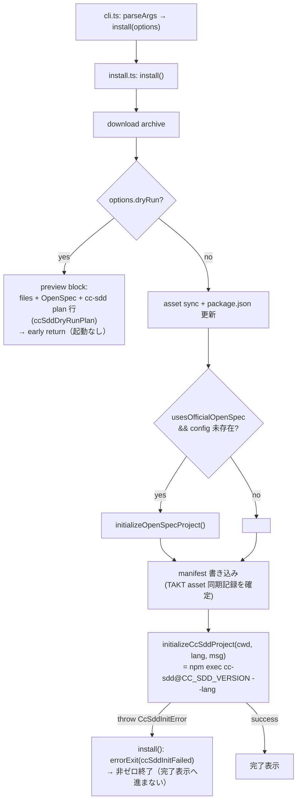

# Design Document — create-takt-sdd-fixed-cc-sdd

## Overview

**Purpose**: create-takt-sdd の利用者に対し、TAKT 資産・OpenSpec 初期化に加えて cc-sdd（Kiro 互換初期化）を、別途 `npx cc-sdd@...` を手動実行することなく 1 回の install で確実に提供する。

**Users**: `npx create-takt-sdd [--lang ja|en]` を実行する開発者。install 完了時に、create-takt-sdd と同一言語で cc-sdd 初期化済みのワークスペースを得る。

**Impact**: 現在の installer は OpenSpec 初期化までしか内部起動しない。本変更で、固定バージョン `CC_SDD_VERSION` の cc-sdd CLI を OpenSpec と同じ install completion path で内部起動する。既存の TAKT asset manifest・customized file skip・update 上書き判定・OpenSpec 初期化条件は不変。

### Goals
- installer source 内で固定した `CC_SDD_PACKAGE` / `CC_SDD_VERSION` により cc-sdd CLI を特定する。
- 通常 install 時に `npx cc-sdd@<CC_SDD_VERSION> --lang <lang>` 相当を内部起動し、`options.lang` を `--lang` に伝播する。
- dry-run では起動せず実行予定のみ表示する。
- cc-sdd 起動失敗時は OpenSpec 失敗と同等に明示的 installer error で非ゼロ停止する。
- 既存 install 挙動（manifest/skip/update/OpenSpec 起動条件）を非回帰で維持する。
- 上記主要挙動を `node:test` ベースの検証可能テストで自動確認する。

### Non-Goals
- cc-sdd CLI 自体のコード・package・依存・仕様変更。
- TAKT asset manifest schema 変更、`OPENSPEC_PACKAGE` / `OPENSPEC_VERSION` の値変更。
- `kiro:*` workflow surface / `.kiro/specs/*` lifecycle の再設計。
- `.coderabbit.yml` / `.coderabbit.yaml` の変更、既存 TAKT workflow/facet の改修。

## Boundary Commitments

### This Spec Owns
- `installer/src/install.ts` における cc-sdd 固定バージョン定数（`CC_SDD_PACKAGE`, `CC_SDD_VERSION`）。
- cc-sdd CLI の内部起動ロジック（引数生成・起動・失敗ハンドリング）と、その install completion path への配置。
- `options.lang` から cc-sdd `--lang` への伝播契約。
- dry-run 時の cc-sdd 実行予定プレビュー（非起動）契約。
- `installer/src/i18n.ts` の cc-sdd 初期化 en/ja メッセージ。
- cc-sdd 起動挙動と既存 install 非回帰を検証する installer テスト。
- README.md / README.ja.md / COMMON.md の install behavior 説明の最小更新。

### Out of Boundary
- cc-sdd CLI のコード・package・依存・バグ修正・仕様変更。
- TAKT asset install の manifest schema 変更。
- `OPENSPEC_PACKAGE` / `OPENSPEC_VERSION` の値変更、OpenSpec 起動条件（`usesOfficialOpenSpec` かつ config 未存在）の変更。
- `kiro:*` workflow surface / `.kiro/specs/*` lifecycle の再設計。
- cc-sdd 起動以外を理由とする install 順序・manifest 計算の変更。

### Allowed Dependencies
- 既存 `installer/src/install.ts` のユーティリティ: `getNpmCliPath()`, `formatExecError()`, `errorExit()`, `info()`, dry-run preview block, completion path 構造。
- `installer/src/i18n.ts` の `getMessages()`・その戻り値型 `ReturnType<typeof getMessages>`・`Lang` 型（`Messages` インターフェースは未 export のため消費側では戻り値型経由で参照）。
- Node.js 組み込み: `node:child_process`（`execFileSync`）, `node:test`, `node:assert/strict`, `node:fs`, `node:os`, `node:path`。
- 外部: npm CLI 経由で解決される `cc-sdd@<CC_SDD_VERSION>`（runtime dependency としては追加しない）。

### Revalidation Triggers
- `initializeOpenSpecProject` の起動契約（`process.execPath` + `getNpmCliPath()` 経路、`formatExecError` 整形）の変更。
- install completion path の順序（asset sync → package.json 更新 → OpenSpec init → manifest 書き込み → cc-sdd init）の変更。
- `Messages` インターフェースの破壊的変更。
- cc-sdd CLI の起動契約（`--lang` フラグ、subcommand 要否）の変更。
- installer の Node engines（`>=20.19.0`）引き下げによる `node:test` 利用可否の変化。

## Architecture

### Existing Architecture Analysis
- `installer/src/install.ts`（651 行）は単一モジュールで download → asset sync → package.json マージ → OpenSpec init → legacy cleanup → manifest 書き込みを行う手続き的フロー。
- 外部 CLI 起動は `initializeOpenSpecProject()` に集約され、`execFileSync(process.execPath, args, { cwd, encoding, stdio:["ignore","pipe","pipe"] })` を使用。失敗時は `errorExit(msg.openspecInitFailed(formatExecError(error)))`。
- dry-run は preview block（実起動・書き込み前に早期 return）で 1 行ずつ予定を表示。
- 維持すべき既存パターン: manifest（`syncRelativeFiles()` の hash 記録・customized skip・tracked overwrite）、completion path の順序、i18n の en/ja 対称メッセージ。
- 既存の構造的負債（install.ts が 651 行で複数責務を内包）はあるが、本タスクのスコープ外。cc-sdd 起動は OpenSpec と同パターンの最小追加に留め、大規模リファクタは行わない（テスト容易化に必要な範囲の純粋関数抽出・export のみ実施）。

### Architecture Pattern & Boundary Map

- 採用パターン: 既存 installer の手続き的フローへの **最小侵襲な機能追加**（OpenSpec 初期化パターンの踏襲）。テスト容易化のため「純粋引数ビルダー + runner 注入可能な init 関数」の薄い seam を導入。
- ドメイン／機能境界: cc-sdd 起動は `installer/src/install.ts` 内の専用関数群に閉じる。i18n 文言は `installer/src/i18n.ts` に閉じる。
- 維持する既存パターン: manifest/skip/update、OpenSpec 起動条件、completion path 順序、dry-run preview の粒度。
- 新規コンポーネントの根拠: cc-sdd 専用の引数ビルダー・init 関数・i18n メッセージ・テストは、いずれも Req 1〜8 を満たすために必要な最小単位。



### Technology Stack

| Layer | Choice / Version | Role in Feature | Notes |
|-------|------------------|-----------------|-------|
| CLI / Installer | TypeScript（Node16 module, target ES2022） | install フローと cc-sdd 起動実装 | 既存 `installer/` 構成を踏襲 |
| Runtime | Node.js >= 20.19.0 | `execFileSync` で cc-sdd 起動、`node:test` でテスト | `installer/package.json` engines |
| External CLI | `cc-sdd@3.0.2`（npm, bin `cc-sdd`） | Kiro 互換初期化 | npm exec 経由で解決、runtime dependency 追加なし |
| Test | `node:test` + `node:assert/strict` | deterministic unit tests | 新規依存ゼロ |

> 固定バージョン `3.0.2` は npm registry の `cc-sdd@latest`（2026-06-09 確認）。詳細は `research.md` の References を参照。

## File Structure Plan

### Modified Files

- `installer/src/install.ts` — cc-sdd 起動の中核。以下を追加/変更する（各々 1 責務）:
  - 定数 `CC_SDD_PACKAGE = "cc-sdd"` / `CC_SDD_VERSION = "3.0.2"`（`OPENSPEC_PACKAGE` 付近、L28-29 と同区画）。**export** する（テスト参照のため）。（Req 1.1, 1.2, 1.3）
  - 純粋関数 `buildCcSddExecArgs(npmCliPath: string, lang: Lang): string[]` を **export**。`[npmCliPath, "exec", "--yes", `--package=${CC_SDD_PACKAGE}@${CC_SDD_VERSION}`, "--", "cc-sdd", "--lang", lang]` を返す。（Req 2.1, 2.2, 3.1, 3.2, 3.3, 8.1, 8.2）
  - `class CcSddInitError extends Error` を **export**（失敗詳細を保持）。（Req 5.2, 8.3）
  - 関数 `initializeCcSddProject(cwd: string, lang: Lang, msg: ReturnType<typeof getMessages>, run: CommandRunner = defaultCcSddRun): void` を **export**（型注記は sibling `initializeOpenSpecProject` と同一・`Messages` の export は不要）。`info(msg.ccSddInitializing(CC_SDD_VERSION))` → `run(process.execPath, buildCcSddExecArgs(getNpmCliPath(), lang), { cwd })`、失敗時 `throw new CcSddInitError(formatExecError(error))`、成功時 `info(msg.ccSddInitialized())`。（Req 2.2, 5.2, 8.3）
  - `type CommandRunner = (file: string, args: readonly string[], options: { cwd: string }) => void` と既定実装 `defaultCcSddRun`（`execFileSync(file, [...args], { cwd, encoding:"utf-8", stdio:["ignore","pipe","pipe"] })`）。
  - dry-run preview block（L474-504 内、OpenSpec preview 行付近）に `console.log(msg.ccSddDryRunPlan(CC_SDD_VERSION, options.lang))` を 1 行追加。（Req 4.2）
  - completion path（OpenSpec init / `removeLegacyOpsxScript` 後、manifest 書き込み後）に cc-sdd 起動を **無条件**（非 dry-run 時のみ到達）で追加する。manifest は TAKT asset 同期記録のため、外部 cc-sdd CLI 起動前に確定し、cc-sdd 失敗後の retry が update path に乗れる状態を維持する:
    ```ts
    try {
      initializeCcSddProject(options.cwd, options.lang, msg);
    } catch (error) {
      if (error instanceof CcSddInitError) errorExit(msg.ccSddInitFailed(error.message));
      throw error;
    }
    ```
    （Req 2.1, 2.3, 2.4, 5.1, 5.3, 5.4, 4.1, 7.4）
  - 既存 `syncRelativeFiles`（L253）を **export**（非回帰テストから参照するため。挙動は変更しない）。（Req 8.5）
- `installer/src/i18n.ts` — cc-sdd 初期化メッセージ。`Messages` インターフェースに 4 フィールド追加し、en / ja 両方を実装:
  - `ccSddInitializing: (version: string) => string`（Req 6.1）
  - `ccSddInitialized: () => string`（成功表示、OpenSpec 対称・任意だが整合のため追加）
  - `ccSddInitFailed: (details: string) => string`（Req 6.2）
  - `ccSddDryRunPlan: (version: string, lang: Lang) => string`（dry-run 予定 1 行、Req 4.2）
  - 表示は `options.lang` 対応言語で行う（Req 6.3、既存 `getMessages(lang)` 経由で自動充足）。
- `installer/package.json` — テスト導線:
  - `scripts.test` に `"npm run build && node --test \"dist/**/*.test.js\""` を追加。（Req 8）
  - `files` を `["dist", "!dist/**/*.test.js"]` に変更し、test 成果物を publish から除外。
- `README.md` — install behavior 説明に「install 時に cc-sdd（固定バージョン）初期化が含まれ、`--lang` が伝播する」旨を最小追記。（Req 9.1）
- `README.ja.md` — 同上の最小追記。（Req 9.2）
- `COMMON.md` — install フロー説明（L40 付近の installer 記述）に cc-sdd 初期化を含む旨を必要最小限で追記。（Req 9.3）

### New Files

- `installer/src/install.test.ts` — `node:test` による deterministic unit tests（Req 8.1〜8.5）。詳細は Testing Strategy 参照。

> 各ファイルは 1 責務。install.ts への追加は cc-sdd 起動に限定し、既存 manifest/OpenSpec/順序ロジックは変更しない。新規モジュール分割（cc-sdd.ts）は現規模では過剰のため行わず、テスト容易化に必要な export のみ付与する。

## System Flows

cc-sdd 起動の配置と失敗時分岐は Architecture の Mermaid 図に集約。フローレベルの判断は以下:

- dry-run 判定は実起動・実書き込みより前。dry-run では cc-sdd preview を 1 行表示し early return するため、起動経路（completion path）へ構造的に到達しない（Req 4.1/4.3 を構造保証）。
- cc-sdd 起動は OpenSpec init と `removeLegacyOpsxScript` の後、manifest 書き込みの後に置く。これにより asset sync・package.json 更新（Req 2.4）と OpenSpec 結果を破壊せず、失敗時も TAKT asset manifest を保持して retry を update path に乗せる（Req 5.4）。
- 失敗は `CcSddInitError` を install() が捕捉して `errorExit`（非ゼロ終了）にマップ。`CcSddInitError` 以外は再 throw し既存 `main().catch` 経由で停止。

## Requirements Traceability

| Requirement | Summary | Components | Interfaces | Flows |
|-------------|---------|------------|------------|-------|
| 1.1 | 固定 `CC_SDD_PACKAGE` 保持 | install.ts 定数 | `CC_SDD_PACKAGE` | — |
| 1.2 | 固定 `CC_SDD_VERSION` 保持 | install.ts 定数 | `CC_SDD_VERSION = "3.0.2"` | — |
| 1.3 | 特定に両定数を使用・別値代替禁止 | buildCcSddExecArgs | `--package=${CC_SDD_PACKAGE}@${CC_SDD_VERSION}` | — |
| 2.1 | 通常モードで cc-sdd 内部起動 | initializeCcSddProject 呼び出し | completion path call | dry-run 後 |
| 2.2 | `process.execPath` + npm CLI 経由 | initializeCcSddProject / defaultCcSddRun | `execFileSync(process.execPath, [getNpmCliPath(), "exec", ...])` | — |
| 2.3 | OpenSpec と同じ completion path | install() 配置 | call after OpenSpec and manifest write | 起動配置 |
| 2.4 | asset sync・package.json 更新後に起動 | install() 配置 | 順序保証 | 起動配置 |
| 3.1 | `options.lang` を `--lang` に伝播 | buildCcSddExecArgs | `"--lang", lang` | — |
| 3.2 | `ja` → `--lang ja` | buildCcSddExecArgs | `lang==="ja"` | — |
| 3.3 | `en` → `--lang en` | buildCcSddExecArgs | `lang==="en"` | — |
| 4.1 | dry-run で cc-sdd 非起動 | dry-run early return | 構造保証（preview block→return） | dry-run 分岐 |
| 4.2 | OpenSpec と同粒度の予定表示 | ccSddDryRunPlan / preview block | `console.log(msg.ccSddDryRunPlan(...))` | dry-run 分岐 |
| 4.3 | dry-run で cc-sdd 由来書き込みなし | dry-run early return | 構造保証 | dry-run 分岐 |
| 5.1 | 失敗時 OpenSpec 同等の明示 error 停止 | install() catch → errorExit | `errorExit(msg.ccSddInitFailed(...))` | 失敗分岐 |
| 5.2 | `formatExecError()` で詳細整形 | initializeCcSddProject | `new CcSddInitError(formatExecError(error))` | 失敗分岐 |
| 5.3 | 非ゼロ終了・完了表示へ進まない | install() catch → errorExit | `process.exit(1)` | 失敗分岐 |
| 5.4 | cc-sdd 失敗後も retry 可能な manifest を保持 | manifest write before cc-sdd | `.takt/.manifest.json` | 失敗分岐 |
| 6.1 | initializing メッセージ en/ja | i18n.ts | `ccSddInitializing` | — |
| 6.2 | init failed メッセージ en/ja | i18n.ts | `ccSddInitFailed` | — |
| 6.3 | `options.lang` 対応言語で表示 | getMessages(lang) | 既存経路 | — |
| 7.1 | TAKT manifest 挙動維持 | syncRelativeFiles（無変更） | 既存 hash 記録 | — |
| 7.2 | customized file skip 維持 | syncRelativeFiles（無変更） | 既存 skip 判定 | — |
| 7.3 | update 上書き判定維持 | syncRelativeFiles（無変更） | 既存 overwrite 判定 | — |
| 7.4 | OpenSpec 起動条件維持 | install()（無変更） | `usesOfficialOpenSpec && !config` | — |
| 7.5 | `OPENSPEC_PACKAGE/VERSION` 不変 | install.ts 定数（無変更） | — | — |
| 8.1 | 固定 version 起動テスト | install.test.ts | buildCcSddExecArgs assertion | — |
| 8.2 | `--lang ja` 伝播テスト | install.test.ts | buildCcSddExecArgs("...","ja") | — |
| 8.3 | 失敗時 error 停止テスト | install.test.ts | throwing runner → CcSddInitError | — |
| 8.4 | dry-run 非起動テスト | install.test.ts | preview 関数が runner を呼ばない検証 | — |
| 8.5 | manifest/update 非回帰テスト | install.test.ts | tmp dir syncRelativeFiles 検証 | — |
| 9.1 | README.md 最小更新 | README.md | install behavior 節 | — |
| 9.2 | README.ja.md 最小更新 | README.ja.md | install behavior 節 | — |
| 9.3 | COMMON.md 最小更新 | COMMON.md | installer 記述 | — |

## Components and Interfaces

| Component | Domain/Layer | Intent | Req Coverage | Key Dependencies (P0/P1) | Contracts |
|-----------|--------------|--------|--------------|--------------------------|-----------|
| cc-sdd 定数 | Installer | cc-sdd package/version 固定 | 1.1,1.2,1.3,7.5 | — | State |
| `buildCcSddExecArgs` | Installer | npm exec 引数生成（純粋） | 2.1,2.2,3.1-3.3,8.1,8.2 | getNpmCliPath (P1) | Service |
| `initializeCcSddProject` | Installer | cc-sdd 起動・失敗整形 | 2.2,5.2,8.3 | buildCcSddExecArgs (P0), formatExecError (P0), execFileSync (P0) | Service |
| install() 統合 | Installer | 配置・dry-run・errorExit マップ | 2.3,2.4,4.1-4.3,5.1,5.3 | initializeCcSddProject (P0), errorExit (P0) | Service |
| cc-sdd i18n メッセージ | Installer | en/ja 文言 | 6.1,6.2,6.3,4.2 | getMessages 戻り値型 (P0) | State |
| install.test.ts | Test | 主要挙動検証 | 8.1-8.5 | node:test (P0), syncRelativeFiles (P1) | — |

### Installer

#### buildCcSddExecArgs / initializeCcSddProject

| Field | Detail |
|-------|--------|
| Intent | cc-sdd CLI を固定バージョン・指定言語で npm exec 起動する |
| Requirements | 2.1, 2.2, 3.1, 3.2, 3.3, 5.2, 8.1, 8.2, 8.3 |

**Responsibilities & Constraints**
- `buildCcSddExecArgs` は副作用のない純粋関数。`CC_SDD_PACKAGE`/`CC_SDD_VERSION` を埋め込み、`--lang <lang>` を必ず付与する。
- `initializeCcSddProject` は起動のみを担い、失敗時は `CcSddInitError` を throw する（`process.exit` を内包しない）。errorExit へのマップは install() の責務。
- 起動方法は OpenSpec init と同じ `execFileSync(process.execPath, ...)` 契約を維持する。

**Dependencies**
- Inbound: `install()` — completion path から呼び出し（P0）
- Outbound: `getNpmCliPath()`（P1）, `formatExecError()`（P0）, `execFileSync`（P0, 既定 runner）
- External: npm exec 経由の `cc-sdd@3.0.2`（P0）

**Contracts**: Service [x] / State [x]

##### Service Interface
```typescript
type CommandRunner = (file: string, args: readonly string[], options: { cwd: string }) => void;

export const CC_SDD_PACKAGE: "cc-sdd";
export const CC_SDD_VERSION: "3.0.2";

export function buildCcSddExecArgs(npmCliPath: string, lang: Lang): string[];

export class CcSddInitError extends Error {}

export function initializeCcSddProject(
  cwd: string,
  lang: Lang,
  msg: ReturnType<typeof getMessages>,
  run?: CommandRunner, // 既定: execFileSync ラッパー
): void; // 成功: void / 失敗: throw CcSddInitError
```
- Preconditions: `lang` は `"en" | "ja"`。`getNpmCliPath()` が npm CLI パスを返せる Node 環境。
- Postconditions: 成功時 cc-sdd 初期化が実行され、進行メッセージを表示。失敗時 `CcSddInitError(formatExecError(error))` を throw。
- Invariants: `--package` は常に `cc-sdd@CC_SDD_VERSION`。`--lang` は常に `options.lang` と同値。

**Implementation Notes**
- Integration: install() の completion path（OpenSpec init 後、manifest 書き込み後）に配置。
- Validation: dry-run 経路には配置しない（early return で到達不能）。
- Risks: cc-sdd の対話プロンプト（research.md の Risks 参照）。smoke で非対話完了を確認。

## Error Handling

### Error Strategy
- cc-sdd 起動失敗は `initializeCcSddProject` が `CcSddInitError(formatExecError(error))` を throw。install() が `catch` し `errorExit(msg.ccSddInitFailed(error.message))` で `process.exit(1)`。
- `CcSddInitError` 以外の例外は再 throw し、既存 `main().catch` で停止。

### Error Categories and Responses
- System Errors（cc-sdd プロセス失敗 / npm exec 解決失敗）: `formatExecError()` で stderr→stdout→message の優先で詳細抽出 → `ccSddInitFailed` メッセージで提示 → 非ゼロ終了。manifest 書き込み・完了表示には進まない（Req 5.3）。

### Monitoring
- 進行は `info(ccSddInitializing/ccSddInitialized)`、失敗は `errorExit(ccSddInitFailed)` を stdout/stderr に出力（既存 `info`/`errorExit` 経路）。

## Testing Strategy

> ランナーは `node:test` + `node:assert/strict`（新規依存なし）。`installer/package.json` の `test` script = `npm run build && node --test "dist/**/*.test.js"`（dist の `*.test.js` を探索）。全テストは offline・deterministic。

### Unit Tests（`installer/src/install.test.ts`）
- **固定バージョン（Req 8.1）**: `buildCcSddExecArgs("/npm", "ja")` が `--package=cc-sdd@3.0.2` を含むこと、かつ `CC_SDD_VERSION !== "latest"`（浮動タグでない）こと、`CC_SDD_PACKAGE === "cc-sdd"` を assert。
- **`--lang` 伝播（Req 8.2）**: `buildCcSddExecArgs("/npm", "ja")` が連続要素 `"--lang","ja"` を含み、`"en"` 指定で `"--lang","en"` になることを assert。
- **失敗時 error（Req 8.3）**: `stderr` を持つエラーを throw する fake `CommandRunner` を注入し、`initializeCcSddProject(cwd,"ja",msg,run)` が `CcSddInitError` を throw、`error.message` が `formatExecError`（stderr 優先）で整形されていることを assert。
- **dry-run 非起動（Req 8.4）**: spy `CommandRunner`（呼ばれたら記録）を `initializeCcSddProject` に渡した正常系では runner が 1 回・正しい引数で呼ばれること、かつ dry-run 経路で用いる `ccSddDryRunPlan(version,lang)` が runner を一切起動せず予定文字列のみを返す（純粋）ことを assert。dry-run では completion path 自体へ到達しない構造を併記コメントで明示。
- **manifest/update 非回帰（Req 8.5）**: tmp ディレクトリ（`mkdtempSync`）上で `syncRelativeFiles` を実行し、(a) 未存在ファイル→追加・hash 記録、(b) manifest 追跡済み・未改変（hash 一致）→上書き、(c) 追跡済み・改変（hash 不一致）→skip、(d) manifest 未追跡→skip を assert。

### Integration / Smoke（任意・CI 補助）
- isolated tmp dir で built CLI を `--lang ja --dry-run` 実行し、exit 0・出力に cc-sdd 実行予定行が含まれ・cc-sdd 由来書き込みが無いことを確認（network 依存のため必須ゲートにはしない）。
- 実 `--lang ja` smoke で固定バージョンの非対話完了を確認（research.md の Risks フォローアップ）。

## Supporting References
- 詳細な調査ノート・代替案比較・固定バージョン根拠は `research.md` を参照。
