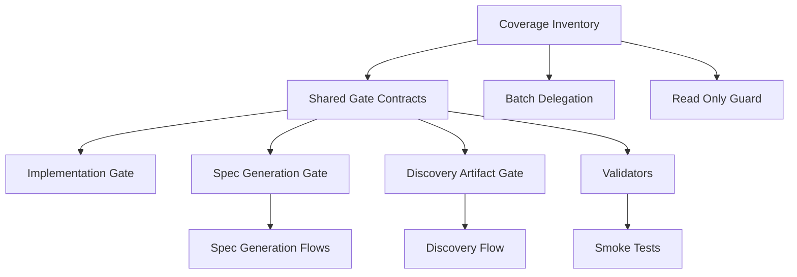
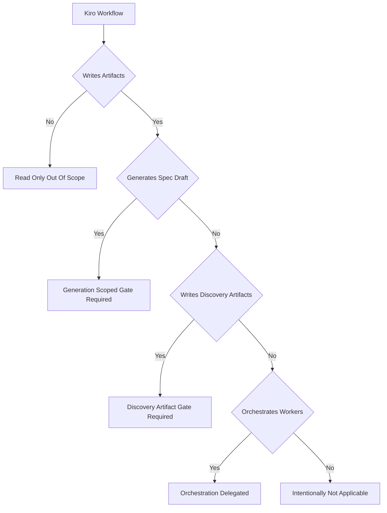
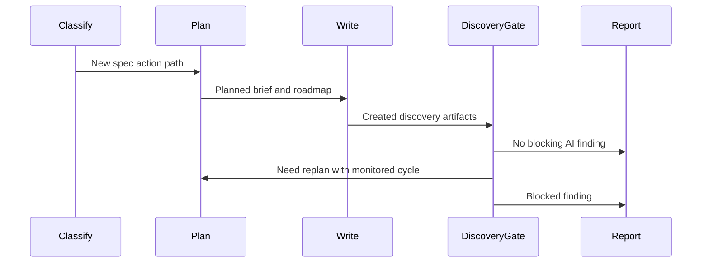
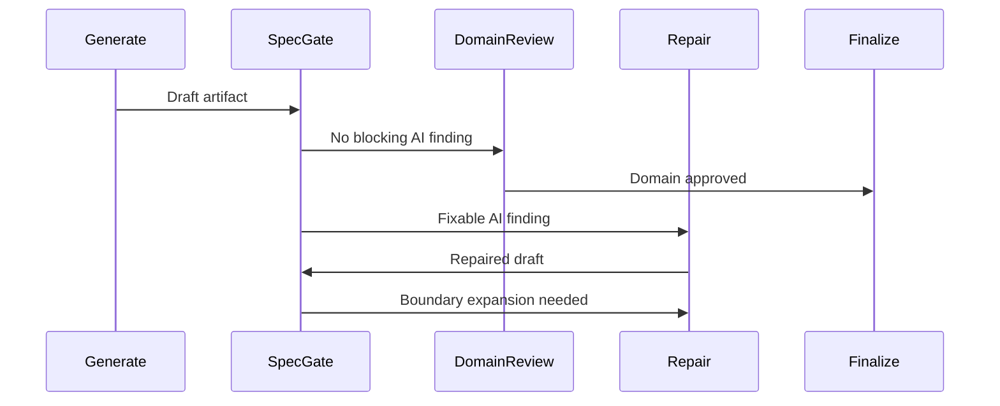

# Design Document

## Overview

この機能は TAKT Kiro workflow maintainer に、PR #90 で確立した AI quality gate 契約を Kiro workflow 群へ安全に横展開するための coverage inventory、scoped callable gate、validator-backed contract を提供する。対象は `.takt/{en,ja}/workflows/kiro-*` と関連 facet / validator / test であり、`cc-sdd-*`、`opsx-*`、OpenSpec-compatible workflow は対象にしない。

主な変更は、spec generation draft と discovery-owned artifact を別々の責任境界で gate することである。`kiro-spec-requirements/design/tasks/quick` は generation-scoped gate、`kiro-discovery` は discovery artifact gate を通す。read-only validation/status workflow は read-only のまま維持し、`kiro-spec-batch` は worker generation workflows へ artifact-level AI review を委譲する。

### Goals

- 全 `.takt/{en,ja}/workflows/kiro-*` に対して AI quality gate coverage category を定義し、未分類を validator failure にする。
- `kiro-spec-requirements`、`kiro-spec-design`、`kiro-spec-tasks`、`kiro-spec-quick` の generated draft を domain review / finalize 前に generation-scoped AI quality gate へ通す。
- `kiro-discovery` が `brief.md` または roadmap artifact を書いた場合、`report-discovery` 前に discovery-scoped AI quality gate を通す。
- PR #90 の 6 点契約を implementation / spec generation / discovery gate caller に対して共有 validator と smoke test で検出可能にする。
- en/ja workflow と facet の machine contract を揃え、upstream `.agents/skills/kiro-*` は直接変更しない。

### Non-Goals

- `cc-sdd-*`、`opsx-*`、OpenSpec-compatible workflow への横展開。
- upstream `.agents/skills/kiro-*` asset や `CC-SDD-CODEX.md` の直接修正。
- `kiro-spec-status`、`kiro-validate-*` を edit-capable workflow に変えること。
- `kiro-spec-batch` に direct artifact-level AI fix loop を追加すること。
- `kiro-discovery` gate で requirements/design/tasks artifact、既存 spec の ownership、または implementation progress を直接修正すること。
- roadmap checkbox marker を implementation progress として扱うこと。

## Boundary Commitments

### This Spec Owns

- Kiro workflow AI quality gate coverage inventory の正本。
- generation-scoped AI quality gate workflow と report semantics。
- discovery-scoped AI quality gate workflow と report semantics。
- eligible generation caller workflow から generation gate への routing。
- `kiro-discovery` の artifact write 成功 path から discovery gate への routing と caller loop monitor。
- downstream generation review/finalize と discovery report が AI gate evidence を消費するための facet 指示。
- coverage inventory、allowed `workflow_call`、read-only exclusion、en/ja parity、runtime smoke を検証する validator/test。

### Out of Boundary

- implementation gate 自体の仕様変更。ただし shared contract validation のため既存 `kiro-ai-quality-gate` と `kiro-impl` は read/validate 対象に含める。
- `kiro-spec-batch` の worker orchestration、cross-spec review、remediation coordination の責務変更。
- Kiro upstream skill asset の修正。TAKT workflow/facet/validator による実行時優先指示で補正する。
- read-only workflow への修正 step、repair step、debug step、nested Kiro workflow call の追加。
- discovery gate から `.kiro/specs/<feature>/requirements.md`、`design.md`、`tasks.md`、または implementation files へ越境する修正。

### Allowed Dependencies

- `.takt/{en,ja}/workflows/kiro-ai-quality-gate.yaml` と `kiro-impl.yaml` の PR #90 契約。
- `.takt/{en,ja}/workflows/kiro-spec-ai-quality-gate.yaml` の generation gate 契約。
- TAKT workflow schema の `workflow_call`、`rules`、`loop_monitors`、facet composition。
- built-in `ai-antipattern-reviewer` の routing vocabulary。
- 既存 Kiro spec generation workflow の generate/review/repair/finalize 境界。
- 既存 `kiro-discovery` の classify/plan/write/report 境界。
- 既存 validators: `validate-kiro-shared-contracts.mjs`、`validate-kiro-ai-quality-gate-workflow-coverage.mjs`、`validate-kiro-spec-generation-workflows.mjs`、`validate-kiro-discovery-batch-workflows.mjs`、`validate-kiro-status-validation-workflows.mjs`。
- Node.js built-in test runner と既存 npm scripts。

### Revalidation Triggers

- built-in `ai-antipattern-reviewer` の routing vocabulary または report contract が変わる。
- `workflow_call` の schema、relative path 解釈、または TAKT callable subworkflow 実行方式が変わる。
- `.takt/{en,ja}/workflows/kiro-*` が追加、削除、名称変更される。
- `kiro-discovery` の actionPath、plannedFiles、createdFiles、または `report-discovery` completion 条件が変わる。
- `kiro-spec-quick` の no phase reuse ルールが変わる。
- read-only validation/status workflow が write-capable な責務を持つように変わる。
- gate report names、optional fix report semantics、loop monitor threshold semantics が変わる。

## Architecture

### Existing Architecture Analysis

`kiro-impl` は `execute-task -> ai-quality-gate -> review-task` の callable subworkflow 構造を持つ。PR #90 で、relative `workflow_call`、built-in review vocabulary、catch-all routing、optional fix report、loop exhaustion の replan routing、caller loop monitor への gate step 追加が runtime wiring 上の重要契約になった。

spec generation workflows は generate/review/repair/finalize を分け、draft generation と lifecycle promotion を分離している。既存実装は `kiro-spec-ai-quality-gate.yaml` を generation draft 用に分離しているため、implementation progress semantics と spec artifact semantics は混ざらない。

`kiro-discovery` は `classify-action-path -> plan-discovery-artifacts -> write-discovery-artifacts -> report-discovery` の形を持つ。`write-discovery-artifacts` だけが edit-capable で、`brief.md` と `.kiro/steering/roadmap.md` を生成または更新する。discovery gate の最小挿入点は `write-discovery-artifacts` の成功 path と `report-discovery` の間である。`need_replan` は `plan-discovery-artifacts` に戻すため、caller workflow は `plan-discovery-artifacts -> write-discovery-artifacts -> ai-quality-gate-discovery` を含む loop monitor を持つ。

### Architecture Pattern & Boundary Map

採用パターンは「coverage inventory + scoped callable gates + validator-backed allowlist」である。implementation、spec generation、discovery はそれぞれ report names と fix instruction を分けるが、PR #90 の 6 点契約は shared helper で共通化する。



### Technology Stack

| Layer | Choice / Version | Role in Feature | Notes |
|---|---|---|---|
| Workflow runtime | TAKT `^0.43.0` | `workflow_call`、rules、loop monitor の実行基盤 | 新規外部依存なし |
| Validation | Node.js ESM scripts | YAML text/shape validation、coverage inventory validation | 既存 validator pattern を拡張 |
| Tests | `node --test` | validator unit tests と runtime smoke | 既存 npm scripts に追加または更新 |
| Facets | TAKT Markdown facets | scoped gate instruction/output contract、downstream evidence consumption | en/ja machine terms は一致させる |

## File Structure Plan

### Directory Structure

```text
.takt/
├── en/
│   ├── workflows/
│   │   ├── kiro-discovery-ai-quality-gate.yaml
│   │   ├── kiro-discovery.yaml
│   │   ├── kiro-spec-ai-quality-gate.yaml
│   │   ├── kiro-spec-requirements.yaml
│   │   ├── kiro-spec-design.yaml
│   │   ├── kiro-spec-tasks.yaml
│   │   └── kiro-spec-quick.yaml
│   └── facets/
│       ├── instructions/
│       │   ├── kiro-ai-antipattern-fix-discovery.md
│       │   ├── kiro-ai-antipattern-fix-spec-generation.md
│       │   ├── kiro-discovery.md
│       │   ├── kiro-spec-requirements-review.md
│       │   ├── kiro-validate-design-readiness.md
│       │   ├── kiro-spec-tasks-review.md
│       │   └── kiro-spec-quick-sanity-review.md
│       ├── output-contracts/
│       │   ├── kiro-discovery-ai-antipattern-fix-result.md
│       │   └── kiro-spec-ai-antipattern-fix-result.md
│       └── policies/
│           └── kiro-ai-quality-gate-coverage.md
├── ja/
│   └── same as en with Japanese prose and identical machine terms
scripts/
├── kiro-ai-quality-gate-contracts.mjs
├── validate-kiro-ai-quality-gate-workflow-coverage.mjs
├── validate-kiro-shared-contracts.mjs
├── validate-kiro-spec-generation-workflows.mjs
├── validate-kiro-discovery-batch-workflows.mjs
└── validate-kiro-status-validation-workflows.mjs
tests/
├── kiro-ai-quality-gate-workflow-coverage.test.mjs
├── kiro-discovery-batch-workflows.test.mjs
├── kiro-spec-ai-quality-gate-runtime-smoke.test.mjs
└── kiro-discovery-ai-quality-gate-runtime-smoke.test.mjs
```

### Modified Files

- `.takt/{en,ja}/workflows/kiro-discovery-ai-quality-gate.yaml` — 新規 discovery-scoped callable gate。`kiro-discovery-ai-antipattern-review.md` と optional `kiro-discovery-ai-antipattern-fix.md` を出力する。
- `.takt/{en,ja}/workflows/kiro-discovery.yaml` — `write-discovery-artifacts` 成功 path を `ai-quality-gate-discovery` に接続し、gate `COMPLETE` を `report-discovery`、`need_replan` を `plan-discovery-artifacts`、`ABORT` を `ABORT` に接続する。caller loop monitor は `plan-discovery-artifacts`、`write-discovery-artifacts`、`ai-quality-gate-discovery` を含む。
- `.takt/{en,ja}/workflows/kiro-spec-ai-quality-gate.yaml` — 既存 generation-scoped callable gate。discovery と report names を共有しない。
- `.takt/{en,ja}/workflows/kiro-spec-requirements.yaml`、`kiro-spec-design.yaml`、`kiro-spec-tasks.yaml`、`kiro-spec-quick.yaml` — 既存 generation gate integration を維持し、discovery gate 追加に合わせた shared contract allowlist と parity を満たす。
- `.takt/{en,ja}/facets/instructions/kiro-ai-antipattern-fix-discovery.md` — `brief.md` と roadmap artifact 境界内で修正できる AI antipattern の修正指示。requirements/design/tasks/implementation files の直接修正を禁止する。
- `.takt/{en,ja}/facets/output-contracts/kiro-discovery-ai-antipattern-fix-result.md` — discovery fix report の machine fields と optional semantics。
- `.takt/{en,ja}/facets/instructions/kiro-discovery.md` — `report-discovery` が namespaced discovery gate evidence を確認する指示を追加する。
- `.takt/{en,ja}/facets/policies/kiro-ai-quality-gate-coverage.md` — `discovery_artifact_gate_required` category と `kiro-discovery` の分類理由を説明する。
- `scripts/kiro-ai-quality-gate-contracts.mjs` — coverage category、`kiro-discovery` entry、allowed discovery gate call site、discovery report names を追加する。
- `scripts/validate-kiro-ai-quality-gate-workflow-coverage.mjs` — discovery gate required / forbidden implementation fix instruction / report evidence / parity checks を追加する。
- `scripts/validate-kiro-shared-contracts.mjs` — allowed `workflow_call` を helper 由来の allowlist に同期し、discovery gate だけを追加許可する。
- `scripts/validate-kiro-discovery-batch-workflows.mjs` — `kiro-discovery` の approved discovery gate call は許可し、phase reuse と `kiro-spec-batch` direct gate は禁止し続ける。
- `scripts/validate-kiro-status-validation-workflows.mjs` — read-only workflow への discovery/spec/implementation gate 混入を forbidden terms に含める。
- `tests/kiro-ai-quality-gate-workflow-coverage.test.mjs` — discovery category、call site、report names、negative cases を追加する。
- `tests/kiro-discovery-batch-workflows.test.mjs` — discovery gate insertion と batch non-insertion を検証する。
- `tests/kiro-discovery-ai-quality-gate-runtime-smoke.test.mjs` — deterministic successful path で discovery gate wiring を検証する。
- `package.json`、`.github/workflows/ci.yml` — 既存 script 列挙方式の場合のみ、新 validator/test を追加する。

## System Flows

### Coverage Classification



`kiro-ai-quality-gate`、`kiro-spec-ai-quality-gate`、`kiro-discovery-ai-quality-gate` は existing gate coverage、`kiro-impl` は existing gate coverage caller、`kiro-spec-requirements/design/tasks/quick` は generation-scoped gate required、`kiro-discovery` は discovery artifact gate required、`kiro-spec-batch` は orchestration delegated、`kiro-spec-init` は intentionally not applicable、`kiro-spec-status` と `kiro-validate-*` は read-only out of scope と分類する。

### Discovery Gate Sequence



discovery gate は `write-discovery-artifacts` の成功後にだけ実行する。`EXISTING_SPEC_UPDATE` や `DIRECT_IMPLEMENTATION` のように discovery artifact を書かない path は gate を通さず `report-discovery` へ進む。

### Generation Gate Sequence



gate は draft を review し、fixable issue は既存 repair path に返す。upstream phase 変更、roadmap 再分解、artifact boundary 拡張が必要な場合は、silent edit ではなく replan/upstream-repair outcome にする。

## Requirements Traceability

| Requirement | Summary | Components | Interfaces | Flows |
|---|---|---|---|---|
| 1.1 | 全 Kiro workflow を一意に分類 | CoverageInventoryContract, CoverageValidator | coverage entries | Coverage Classification |
| 1.2 | category set を定義 | CoverageInventoryContract | `CoverageCategory` | Coverage Classification |
| 1.3 | out-of-scope 理由を記録 | CoverageInventoryContract | reason field | Coverage Classification |
| 1.4 | 未分類を maintainer decision にする | CoverageValidator | classification failure | Coverage Classification |
| 2.1 | artifact generation/repair を eligible にする | CoverageInventoryContract, GenerationWorkflowIntegration | eligibility rules | Coverage Classification |
| 2.2 | read-only workflow を fix loop 外に保つ | ReadOnlyGuardValidator | forbidden gate checks | Coverage Classification |
| 2.3 | orchestration は明示判断 | CoverageInventoryContract | decision category | Coverage Classification |
| 2.4 | read-only edit 化を拒否 | ReadOnlyGuardValidator | edit capability checks | Coverage Classification |
| 2.5 | 機械的な全挿入を防止 | CoverageValidator | exact allowlist | Coverage Classification |
| 2.6 | discovery artifacts を eligible にする | DiscoveryWorkflowIntegration | discovery category | Discovery Gate Sequence |
| 2.7 | discovery と implementation fix を分離 | DiscoveryAiQualityGateWorkflow | discovery fix instruction | Discovery Gate Sequence |
| 3.1 | relative workflow path を要求 | SharedGateContractHelper | allowed call site | Discovery Gate Sequence, Generation Gate Sequence |
| 3.2 | built-in vocabulary 互換 | SharedGateContractHelper | routing terms | Discovery Gate Sequence, Generation Gate Sequence |
| 3.3 | ambiguous/blocked/inconsistent を catch | SpecAiQualityGateWorkflow, DiscoveryAiQualityGateWorkflow | catch-all routing | Discovery Gate Sequence, Generation Gate Sequence |
| 3.4 | fix report optional | SpecAiQualityGateWorkflow, DiscoveryAiQualityGateWorkflow, GateEvidenceAdapters | optional report semantics | Discovery Gate Sequence, Generation Gate Sequence |
| 3.5 | loop exhaustion を repair/replan へ返す | SpecAiQualityGateWorkflow, DiscoveryAiQualityGateWorkflow | loop monitor outcomes | Discovery Gate Sequence, Generation Gate Sequence |
| 3.6 | caller loop monitor に gate step を含める | GenerationWorkflowIntegration, DiscoveryWorkflowIntegration | monitored caller cycle | Discovery Gate Sequence, Generation Gate Sequence |
| 3.7 | discovery outcomes に同じ契約を適用 | DiscoveryAiQualityGateWorkflow | discovery routing | Discovery Gate Sequence |
| 4.1 | requirements draft を gate する | GenerationWorkflowIntegration | requirements gate call | Generation Gate Sequence |
| 4.2 | design/research draft を gate する | GenerationWorkflowIntegration | design gate call | Generation Gate Sequence |
| 4.3 | task plan draft を gate する | GenerationWorkflowIntegration | tasks gate call | Generation Gate Sequence |
| 4.4 | boundary 内修正は repair path | SpecAiQualityGateWorkflow | repair routing | Generation Gate Sequence |
| 4.5 | upstream/boundary 拡張は replan | SpecAiQualityGateWorkflow | upstream repair routing | Generation Gate Sequence |
| 5.1 | downstream review が unresolved findings を見る | GateEvidenceAdapters | review facet terms | Discovery Gate Sequence, Generation Gate Sequence |
| 5.2 | stale/cross-run/evidence-free fix を拒否 | GateEvidenceAdapters | fix report validation | Discovery Gate Sequence, Generation Gate Sequence |
| 5.3 | missing optional fix report を許容 | GateEvidenceAdapters | optional report semantics | Discovery Gate Sequence, Generation Gate Sequence |
| 5.4 | rejected evidence を repair/replan/blocked へ返す | GateEvidenceAdapters | downstream routing | Discovery Gate Sequence, Generation Gate Sequence |
| 5.5 | promotion は verified result に依存 | GenerationWorkflowIntegration | finalize dependency | Generation Gate Sequence |
| 5.6 | discovery report が gate evidence を見る | DiscoveryWorkflowIntegration, GateEvidenceAdapters | report-discovery evidence check | Discovery Gate Sequence |
| 6.1 | status/validate は edit gate なし | ReadOnlyGuardValidator | forbidden edit behavior | Coverage Classification |
| 6.2 | discovery 完了前に AI quality 評価 | DiscoveryWorkflowIntegration | discovery gate call | Discovery Gate Sequence |
| 6.3 | discovery 境界内修正は repair | DiscoveryAiQualityGateWorkflow | discovery repair routing | Discovery Gate Sequence |
| 6.4 | decomposition/ownership/human clarification は replan | DiscoveryAiQualityGateWorkflow | need_replan routing | Discovery Gate Sequence |
| 6.5 | batch の委譲先を分類 | CoverageInventoryContract | adjacent owner field | Coverage Classification |
| 6.6 | orchestration out-of-scope に owner を記録 | CoverageInventoryContract | adjacent owner field | Coverage Classification |
| 6.7 | roadmap marker を progress 判断に使わない | CoverageInventoryContract | evidence rule | Coverage Classification |
| 7.1 | eligible bypass を検出 | CoverageValidator | required gate checks | Coverage Classification |
| 7.2 | read-only fix loop 追加を検出 | ReadOnlyGuardValidator | forbidden loop checks | Coverage Classification |
| 7.3 | PR #90 contract drift を検出 | SharedGateContractHelper | six contract checks | Discovery Gate Sequence, Generation Gate Sequence |
| 7.4 | deterministic successful path smoke | RuntimeSmokeFixture | smoke command | Discovery Gate Sequence, Generation Gate Sequence |
| 7.5 | 判定不能を actionable failure にする | CoverageValidator | failure message contract | Coverage Classification |
| 7.6 | missing discovery gate を検出 | CoverageValidator | discovery required gate check | Discovery Gate Sequence |
| 7.7 | implementation fix instruction の誤配線を検出 | CoverageValidator | discovery fix instruction guard | Discovery Gate Sequence |
| 8.1 | en/ja workflow structure parity | CoverageValidator | parity checks | Coverage Classification |
| 8.2 | facet machine fields parity | CoverageValidator | report/routing term checks | Coverage Classification |
| 8.3 | upstream skill asset を変更しない | CoverageInventoryContract | out-of-boundary guard | Coverage Classification |
| 8.4 | TAKT runtime prompt priority で補正 | GateEvidenceAdapters | facet policy/instruction | Discovery Gate Sequence, Generation Gate Sequence |
| 8.5 | language drift を covered 前に報告 | CoverageValidator | parity failure | Coverage Classification |

## Components and Interfaces

| Component | Domain / Layer | Intent | Req Coverage | Key Dependencies | Contracts |
|---|---|---|---|---|---|
| CoverageInventoryContract | Policy / Config | Kiro workflow coverage の分類正本 | 1.1-1.4, 2.1-2.6, 6.5-6.7, 8.3 | workflows P0 | State |
| SharedGateContractHelper | Validation / Shared | PR #90 の 6 点契約を validator 間で共有 | 3.1-3.6, 7.3 | existing validators P0 | Service |
| SpecAiQualityGateWorkflow | Workflow Runtime | generation draft 用 AI review/fix gate | 3.2-3.5, 4.1-4.5 | built-in reviewer P0 | Batch |
| DiscoveryAiQualityGateWorkflow | Workflow Runtime | discovery artifact 用 AI review/fix gate | 2.7, 3.2-3.7, 6.2-6.4, 7.7 | built-in reviewer P0 | Batch |
| GenerationWorkflowIntegration | Workflow Runtime | eligible generation workflows への gate insertion | 2.1, 3.6, 4.1-4.5, 5.5, 8.1 | spec workflows P0 | Batch |
| DiscoveryWorkflowIntegration | Workflow Runtime | discovery artifact write path への gate insertion | 2.6, 3.6, 5.6, 6.2-6.4, 8.1 | kiro-discovery P0 | Batch |
| GateEvidenceAdapters | Facets | downstream review/finalize/report が gate evidence を消費 | 5.1-5.6, 8.2, 8.4 | review/report facets P0 | State |
| CoverageValidator | Validation | coverage/parity/allowlist drift を検出 | 1.1-1.4, 7.1, 7.3, 7.5-7.7, 8.1-8.5 | helper P0, filesystem P0 | Service |
| ReadOnlyGuardValidator | Validation | read-only workflow への gate/fix 混入を拒否 | 2.2, 2.4, 6.1, 7.2 | status validator P0 | Service |
| RuntimeSmokeFixture | Tests | deterministic successful gate path を実行 | 7.4 | npm scripts P0, TAKT runtime P0 | Batch |

### Policy and Validation

#### CoverageInventoryContract

| Field | Detail |
|---|---|
| Intent | 各 Kiro workflow の coverage category、理由、allowed gate call、adjacent owner を定義する |
| Requirements | 1.1, 1.2, 1.3, 1.4, 2.1, 2.2, 2.3, 2.4, 2.5, 2.6, 6.5, 6.6, 6.7, 8.3 |

**Responsibilities & Constraints**
- `scripts/kiro-ai-quality-gate-contracts.mjs` を machine-readable 正本にする。
- `discovery_artifact_gate_required` を category set に追加する。
- `kiro-discovery-ai-quality-gate` は callable gate 自体として `existing_gate_coverage` に分類し、全 workflow exactly once invariant を満たす。
- `kiro-discovery` は `allowedGateCall: "./kiro-discovery-ai-quality-gate.yaml"` を持つ。
- `kiro-spec-batch` は `orchestration_delegated` のまま adjacent owner を worker generation workflows にする。

**Contracts**: State
- State model: immutable coverage entry list。
- Invariants: every Kiro workflow appears exactly once; allowed call path is relative; category reason is non-empty。

#### SharedGateContractHelper

| Field | Detail |
|---|---|
| Intent | implementation/spec/discovery gate の allowed call sites と shared routing terms を提供する |
| Requirements | 3.1, 3.2, 3.3, 3.4, 3.5, 3.6, 7.3 |

**Responsibilities & Constraints**
- allowed call site は workflow name、step name、call path、gate kind を持つ。
- gate kind は `implementation`、`spec_generation`、`discovery_artifact` を区別する。
- shared terms は built-in reviewer vocabulary と PR #90 catch-all semantics に揃える。

**Contracts**: Service
```typescript
type GateKind = "implementation" | "spec_generation" | "discovery_artifact";

interface AllowedGateCallSite {
  workflowName: string;
  stepName: string;
  callPath: `./${string}.yaml`;
  gateKind: GateKind;
}
```

### Workflow Runtime

#### DiscoveryAiQualityGateWorkflow

| Field | Detail |
|---|---|
| Intent | discovery-owned `brief.md` / roadmap artifact を AI antipattern review/fix gate に通す |
| Requirements | 2.7, 3.2, 3.3, 3.4, 3.5, 3.7, 6.2, 6.3, 6.4, 7.7 |

**Responsibilities & Constraints**
- `ai-antipattern-reviewer` を最初に実行し、blocking issue がなければ fix report なしで `COMPLETE` を返す。
- fix step は `kiro-ai-antipattern-fix-discovery` だけを使う。
- `brief.md` と `.kiro/steering/roadmap.md` 以外へ越境する修正は `need_replan` または blocked report にする。
- report names は `kiro-discovery-ai-antipattern-review.md` と `kiro-discovery-ai-antipattern-fix.md` にする。

**Contracts**: Batch
- Trigger: `kiro-discovery` の `ai-quality-gate-discovery` step。
- Input / validation: discovery-created artifacts and context。
- Output / destination: namespaced subworkflow reports。
- Idempotency & recovery: no blocking issue path does not require fix report; loop exhaustion returns `need_replan` where caller can replan。

#### DiscoveryWorkflowIntegration

| Field | Detail |
|---|---|
| Intent | artifact-writing discovery path だけを discovery gate へ接続する |
| Requirements | 2.6, 3.6, 5.6, 6.2, 6.3, 6.4, 8.1 |

**Responsibilities & Constraints**
- `write-discovery-artifacts` success rules は `report-discovery` ではなく `ai-quality-gate-discovery` に進む。
- `ai-quality-gate-discovery` は `kind: workflow_call` と `call: ./kiro-discovery-ai-quality-gate.yaml` を使う。
- `COMPLETE` は `report-discovery`、`need_replan` は `plan-discovery-artifacts`、`ABORT` は `ABORT` に接続する。
- caller loop monitor は `plan-discovery-artifacts`、`write-discovery-artifacts`、`ai-quality-gate-discovery` を cycle に含め、threshold 到達時は `report-discovery` の blocked path へ進む。
- artifact を書かない action path は gate を通さない。

**Contracts**: Batch
- Trigger: `SINGLE_SPEC`、`MULTI_SPEC`、`MIXED_DECOMPOSITION` の successful write path。
- Output / destination: final `kiro-discovery-result.md` reports gate evidence status。
- Recovery: replan path returns to `plan-discovery-artifacts`; loop monitor threshold turns repeated non-convergence into blocked discovery reporting before abort。

#### SpecAiQualityGateWorkflow and GenerationWorkflowIntegration

| Field | Detail |
|---|---|
| Intent | spec generation draft を domain review / finalize 前に AI quality gate へ通す |
| Requirements | 2.1, 3.2, 3.3, 3.4, 3.5, 3.6, 4.1, 4.2, 4.3, 4.4, 4.5, 5.5 |

**Responsibilities & Constraints**
- 既存 `kiro-spec-ai-quality-gate.yaml` の separate report names と generation-specific fix instruction を維持する。
- quick path は phase workflow reuse をしないが、single approved AI gate call は許可する。
- domain review/finalize は unresolved/stale/cross-run/evidence-free gate evidence を拒否する。

**Contracts**: Batch
- Trigger: generate/repair draft success。
- Output / destination: namespaced spec AI reports。
- Recovery: fixable issue は current generation artifact repair、boundary expansion は replan/upstream-repair outcome。

### Facets

#### GateEvidenceAdapters

| Field | Detail |
|---|---|
| Intent | review/finalize/report facets が scoped gate reports を解釈する |
| Requirements | 5.1, 5.2, 5.3, 5.4, 5.5, 5.6, 8.2, 8.4 |

**Responsibilities & Constraints**
- spec generation review facets は `kiro-spec-ai-antipattern-review.md` と optional fix report を検査する。
- `kiro-discovery.md` は namespaced `kiro-discovery-ai-antipattern-review.md` と optional fix report を検査する。
- missing optional fix report は first review clean の場合だけ許容する。
- stale/cross-run/evidence-free no-fix は rejection とし、既存 repair/replan/blocked path に戻す。

**Contracts**: State
- State model: gate evidence is scoped by subworkflow report path and report name。
- Invariants: implementation report names are not accepted as discovery/spec evidence。

### Validation and Tests

#### CoverageValidator and ReadOnlyGuardValidator

| Field | Detail |
|---|---|
| Intent | coverage drift、forbidden gate insertion、language parity drift を検出する |
| Requirements | 1.1-1.4, 2.2, 2.4, 2.5, 7.1, 7.2, 7.3, 7.5, 7.6, 7.7, 8.1, 8.2, 8.5 |

**Responsibilities & Constraints**
- helper の allowed call sites 以外の Kiro `workflow_call` は failure にする。
- `kiro-discovery` には discovery gate call が必須で、implementation/spec generation fix instruction は forbidden とする。
- `kiro-spec-batch` と read-only workflows には direct gate/fix loop がないことを検証する。
- en/ja の workflow call structure、report names、routing terms を比較する。

**Contracts**: Service
```typescript
interface ValidationResult {
  ok: boolean;
  failures: readonly string[];
}
```

#### RuntimeSmokeFixture

| Field | Detail |
|---|---|
| Intent | mock provider で gate wiring の successful path を決定論的に確認する |
| Requirements | 7.4 |

**Responsibilities & Constraints**
- existing spec generation smoke を維持する。
- discovery smoke は artifact write success から discovery gate clean path を通って `report-discovery` に到達することだけを確認する。
- provider は opt-in mock path を使い、通常実行が Codex provider に切り替わらないようにする。

**Contracts**: Batch
- Trigger: npm test script。
- Output / destination: TAP result。
- Recovery: fixture failure is CI failure; no repository artifacts are mutated。

## Data Models

### Domain Model

- `CoverageEntry`: workflow name、category、reason、optional `allowedGateCall`、optional `adjacentOwner`。
- `AllowedGateCallSite`: workflow name、step name、relative call path、gate kind。
- `DiscoveryGateCycle`: caller cycle containing `plan-discovery-artifacts`、`write-discovery-artifacts`、`ai-quality-gate-discovery` and a threshold outcome。
- `GateContractTerms`: gate kind ごとの review report names、optional fix report names、shared routing terms。

### Logical Data Model

Coverage inventory は `scripts/kiro-ai-quality-gate-contracts.mjs` の immutable array を正本にする。policy facet は category semantics の説明だけを持ち、workflow-by-workflow table を複製しない。

## Error Handling

- 未分類 workflow は `MAINTAINER_DECISION_REQUIRED` として actionable failure にする。
- read-only workflow への gate/fix loop 混入は validator failure にする。
- `kiro-discovery` に implementation-scoped fix instruction が配線された場合は validator failure にする。
- discovery gate の ambiguous/blocked/internally inconsistent outcome は catch-all replan path にする。
- discovery replan cycle が loop monitor threshold に到達した場合は、追加修正を試みず blocked discovery result として報告する。
- discovery artifact 境界を越える修正要求は silent edit せず `need_replan` または blocked report にする。

## Testing Strategy

- Coverage inventory tests: every Kiro workflow exactly once、category set、`kiro-discovery-ai-quality-gate` の `existing_gate_coverage`、`kiro-discovery` の `discovery_artifact_gate_required`、`kiro-spec-batch` の delegated owner。
- Workflow call allowlist tests: implementation/spec/discovery approved calls only allowed、bare workflow name forbidden、relative path required。
- Discovery workflow tests: successful write path routes to `ai-quality-gate-discovery`、artifact-less path bypasses gate、gate `COMPLETE` routes to `report-discovery`、`need_replan` routes to `plan-discovery-artifacts`、caller loop monitor includes `plan-discovery-artifacts` / `write-discovery-artifacts` / `ai-quality-gate-discovery`。
- Discovery facet tests: `kiro-discovery.md` が namespaced discovery gate reports、optional fix report、stale/cross-run/evidence-free rejection、implementation report rejection を含む。
- Read-only/batch negative tests: status/validate/batch workflows do not gain direct AI fix loop。
- Language parity tests: en/ja workflow structure、report names、routing terms、facet machine terms。
- Runtime smoke: spec generation clean path と discovery clean path を mock provider で決定論的に実行する。

## Security and Performance

新規外部依存は導入しない。discovery gate は edit-capable subworkflow だが、fix instruction と validator で writable boundary を `brief.md` / roadmap artifact に限定する。runtime cost は discovery artifact write path に 1 callable gate を追加する分だけ増えるため、artifact-less path は gate を bypass する。

## Migration and Rollout

1. Coverage inventory と validators を discovery category 対応へ更新する。
2. discovery gate workflow/facets を en/ja で追加する。
3. `kiro-discovery` の successful artifact write path に gate call を挿入する。
4. discovery-batch validator の `workflow_call` 一律禁止を allowlist ベースへ狭める。
5. unit tests と runtime smoke を追加し、既存 generation gate tests を維持する。
