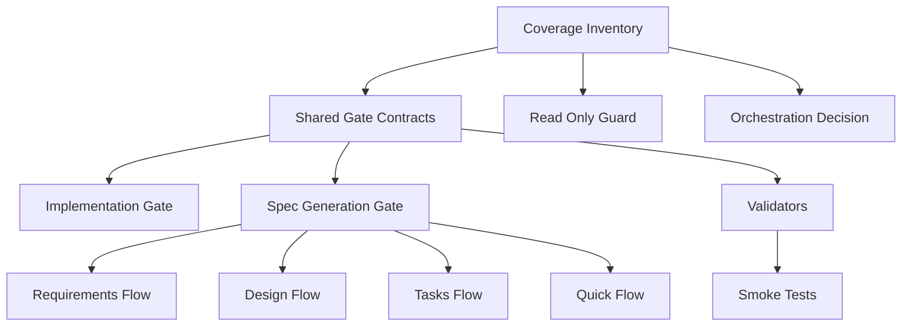
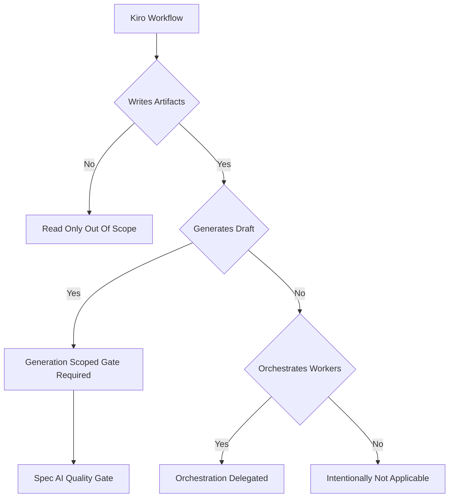
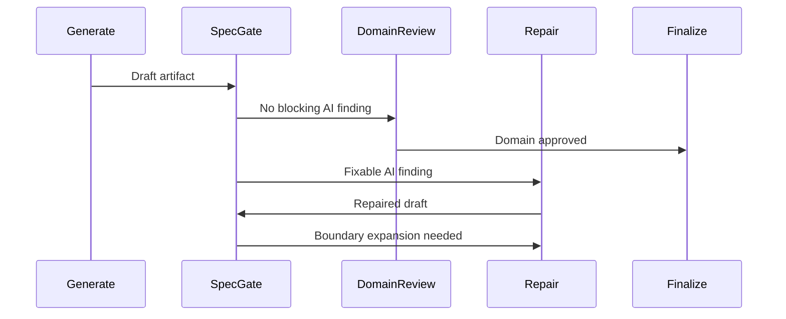

# Design Document

## Overview

この機能は TAKT Kiro workflow maintainer に、PR #90 で確立した AI quality gate 契約を Kiro workflow 群へ安全に横展開するための分類、generation-scoped gate、検証基盤を提供する。対象は `.takt/{en,ja}/workflows/kiro-*` と関連 facet / validator / test であり、`cc-sdd-*`、`opsx-*`、OpenSpec-compatible workflow は対象にしない。

主な変更は、全 Kiro workflow を coverage category に分類し、artifact draft を生成または修正する spec generation workflow にだけ AI antipattern review / fix gate を追加することである。read-only validation/status workflow は read-only のまま維持し、orchestration workflow は downstream generation workflow への委譲を明示する。

### Goals

- 全 `.takt/{en,ja}/workflows/kiro-*` に対して AI quality gate coverage category を定義し、未分類を validator failure にする。
- `kiro-spec-requirements`、`kiro-spec-design`、`kiro-spec-tasks`、`kiro-spec-quick` の generation draft を domain review / finalize 前に generation-scoped AI quality gate へ通す。
- PR #90 の 6 点契約を callable gate caller と downstream review/finalize に対して validator と smoke test で検出可能にする。
- en/ja workflow と facet の machine contract を揃え、upstream `.agents/skills/kiro-*` は直接変更しない。

### Non-Goals

- `cc-sdd-*`、`opsx-*`、OpenSpec-compatible workflow への横展開。
- upstream `.agents/skills/kiro-*` asset や `CC-SDD-CODEX.md` の直接修正。
- `kiro-spec-status`、`kiro-validate-*` を edit-capable workflow に変えること。
- `kiro-discovery` と `kiro-spec-batch` に artifact-level AI fix loop を追加すること。
- roadmap checkbox marker を implementation progress として扱うこと。

## Boundary Commitments

### This Spec Owns

- Kiro workflow AI quality gate coverage inventory の正本。
- generation-scoped AI quality gate workflow と、その report semantics。
- eligible generation caller workflow から generation-scoped gate への routing。
- downstream generation review/finalize が AI gate evidence を消費するための facet 指示。
- coverage inventory、allowed `workflow_call`、read-only exclusion、en/ja parity、runtime smoke を検証する validator/test。

### Out of Boundary

- implementation gate 自体の仕様変更。ただし shared contract validation のため既存 `kiro-ai-quality-gate` と `kiro-impl` は read/validate 対象に含める。
- discovery/batch の生成物に対する新しい AI review/fix ループ。これらは分類と委譲先記録のみを所有する。
- Kiro upstream skill asset の修正。TAKT workflow/facet/validator による実行時優先指示で補正する。
- read-only workflow への修正 step、repair step、debug step、nested Kiro workflow call の追加。

### Allowed Dependencies

- `.takt/{en,ja}/workflows/kiro-ai-quality-gate.yaml` と `kiro-impl.yaml` の PR #90 契約。
- TAKT workflow schema の `workflow_call`、`rules`、`loop_monitors`、facet composition。
- built-in `ai-antipattern-reviewer` の routing vocabulary。
- 既存 Kiro spec generation workflow の generate/review/repair/finalize 境界。
- 既存 validators: `validate-kiro-shared-contracts.mjs`、`validate-kiro-spec-generation-workflows.mjs`、`validate-kiro-status-validation-workflows.mjs`、`validate-kiro-iterative-implementation-workflow.mjs`。
- Node.js built-in test runner と既存 npm scripts。

### Revalidation Triggers

- built-in `ai-antipattern-reviewer` の routing vocabulary または report contract が変わる。
- `workflow_call` の schema、relative path 解釈、または TAKT callable subworkflow 実行方式が変わる。
- `.takt/{en,ja}/workflows/kiro-*` が追加、削除、名称変更される。
- `kiro-spec-quick` の no phase reuse ルールが変わる。
- read-only validation/status workflow が write-capable な責務を持つように変わる。
- gate report names、optional fix report semantics、loop monitor threshold semantics が変わる。

## Architecture

### Existing Architecture Analysis

`kiro-impl` は `execute-task -> ai-quality-gate -> review-task` の callable subworkflow 構造を持つ。PR #90 で、relative `workflow_call`、built-in review vocabulary、catch-all routing、optional fix report、loop exhaustion の replan routing、caller loop monitor への gate step 追加が runtime wiring 上の重要契約になった。

spec generation workflows は generate/review/repair/finalize を分け、draft generation と lifecycle promotion を分離している。この設計ではその既存境界を維持し、draft が domain review に入る前に AI-specific quality gate を挟む。`kiro-spec-quick` は standalone phase workflow reuse を避ける既存設計なので、許可する `workflow_call` は generation-scoped AI gate に限定する。

read-only workflows は collect/validate/report の責務を持ち、`edit: false` を維持する。gate coverage は validator で禁止する側に倒し、AI fix loop の混入を drift として扱う。

### Architecture Pattern & Boundary Map

採用パターンは「coverage inventory + scoped callable gate + validator-backed contracts」である。implementation gate と generation gate は report semantics と fix instruction を分けるが、PR #90 の 6 点契約は shared validator helper で共通化する。



### Technology Stack

| Layer | Choice / Version | Role in Feature | Notes |
|---|---|---|---|
| Workflow runtime | TAKT `^0.43.0` | `workflow_call`、rules、loop monitor の実行基盤 | 新規外部依存なし |
| Validation | Node.js ESM scripts | YAML text/shape validation、coverage inventory validation | 既存 validator pattern を拡張 |
| Tests | `node --test` | validator unit tests と runtime smoke | 既存 npm scripts に追加 |
| Facets | TAKT Markdown facets | generation gate instruction/output contract、downstream evidence consumption | en/ja machine terms は一致させる |

## File Structure Plan

### Directory Structure

```text
.takt/
├── en/
│   ├── workflows/
│   │   ├── kiro-spec-ai-quality-gate.yaml
│   │   ├── kiro-spec-requirements.yaml
│   │   ├── kiro-spec-design.yaml
│   │   ├── kiro-spec-tasks.yaml
│   │   └── kiro-spec-quick.yaml
│   └── facets/
│       ├── instructions/
│       │   ├── kiro-ai-antipattern-fix-spec-generation.md
│       │   ├── kiro-spec-requirements-review.md
│       │   ├── kiro-validate-design-readiness.md
│       │   ├── kiro-spec-tasks-review.md
│       │   └── kiro-spec-quick-sanity-review.md
│       ├── output-contracts/
│       │   └── kiro-spec-ai-antipattern-fix-result.md
│       └── policies/
│           └── kiro-ai-quality-gate-coverage.md
├── ja/
│   └── same as en with Japanese prose and identical machine terms
scripts/
├── kiro-ai-quality-gate-contracts.mjs
├── validate-kiro-ai-quality-gate-workflow-coverage.mjs
├── validate-kiro-shared-contracts.mjs
├── validate-kiro-spec-generation-workflows.mjs
└── validate-kiro-status-validation-workflows.mjs
tests/
├── kiro-ai-quality-gate-workflow-coverage.test.mjs
└── kiro-spec-ai-quality-gate-runtime-smoke.test.mjs
```

### Modified Files

- `.takt/{en,ja}/workflows/kiro-spec-ai-quality-gate.yaml` — 新規 generation-scoped callable gate。implementation gate と別 report names を持つ。
- `.takt/{en,ja}/workflows/kiro-spec-requirements.yaml` — requirements draft generation/repair と review の間に spec AI gate call を追加し、loop monitor を実際の循環に合わせる。
- `.takt/{en,ja}/workflows/kiro-spec-design.yaml` — design/research draft generation/repair と readiness review の間に spec AI gate call を追加する。
- `.takt/{en,ja}/workflows/kiro-spec-tasks.yaml` — task plan draft generation/repair と task review の間に spec AI gate call を追加する。
- `.takt/{en,ja}/workflows/kiro-spec-quick.yaml` — quick requirements/design/tasks phase に同じ spec AI gate call を追加する。phase workflow reuse は引き続き禁止する。
- `.takt/{en,ja}/facets/instructions/kiro-ai-antipattern-fix-spec-generation.md` — spec artifact boundary 内で修正できる AI antipattern の修正指示。
- `.takt/{en,ja}/facets/output-contracts/kiro-spec-ai-antipattern-fix-result.md` — generation fix report の machine fields と optional semantics。
- `.takt/{en,ja}/facets/policies/kiro-ai-quality-gate-coverage.md` — coverage category と各 Kiro workflow の分類理由。
- `.takt/{en,ja}/facets/instructions/kiro-spec-requirements-review.md`、`kiro-validate-design-readiness.md`、`kiro-spec-tasks-review.md`、`kiro-spec-quick-sanity-review.md` — unresolved gate findings と optional fix report の扱いを追加する。
- `scripts/kiro-ai-quality-gate-contracts.mjs` — coverage inventory、allowed call sites、routing/report contract terms の shared helper。
- `scripts/validate-kiro-ai-quality-gate-workflow-coverage.mjs` — Kiro workflow coverage の主 validator。
- `scripts/validate-kiro-shared-contracts.mjs` — allowed `workflow_call` を helper 由来の allowlist に更新する。
- `scripts/validate-kiro-spec-generation-workflows.mjs` — gate placement、quick の限定的 `workflow_call` 許可、downstream evidence terms を検証する。
- `scripts/validate-kiro-status-validation-workflows.mjs` — read-only workflow への gate/fix loop 混入禁止を helper と同期する。
- `tests/kiro-ai-quality-gate-workflow-coverage.test.mjs` — validator の positive/negative coverage。
- `tests/kiro-spec-ai-quality-gate-runtime-smoke.test.mjs` — generation-scoped gate の決定論的 successful path smoke。
- `package.json` — validator/test npm scripts を追加する。
- `.github/workflows/ci.yml` — 既存 CI が Kiro validator/test scripts を個別列挙している場合のみ、新 scripts を追加する。

## System Flows

### Coverage Classification



`kiro-impl` は existing gate coverage、`kiro-spec-requirements/design/tasks/quick` は generation-scoped gate required、`kiro-spec-init` は intentionally not applicable、`kiro-discovery` と `kiro-spec-batch` は orchestration delegated、`kiro-spec-status` と `kiro-validate-*` は read-only out of scope と分類する。新規または未判断の orchestration workflow は orchestration decision required とし、maintainer が delegated / covered / out of scope のいずれかへ明示的に決めるまで covered と扱わない。

### Generation Gate Sequence



gate は draft を review し、fixable issue は既存 repair path に返す。upstream phase 変更、roadmap 再分解、artifact boundary 拡張が必要な場合は、silent edit ではなく replan/upstream-repair outcome にする。

## Requirements Traceability

| Requirement | Summary | Components | Interfaces | Flows |
|---|---|---|---|---|
| 1.1 | 全 Kiro workflow を一意に分類 | CoverageInventoryContract, CoverageValidator | coverage categories | Coverage Classification |
| 1.2 | 必要な category を定義 | CoverageInventoryContract | `CoverageCategory` | Coverage Classification |
| 1.3 | out-of-scope 理由を記録 | CoverageInventoryContract | helper reason field and policy explanation | Coverage Classification |
| 1.4 | 未分類を maintainer decision にする | CoverageValidator | classification failure | Coverage Classification |
| 2.1 | artifact generation/repair を eligible にする | CoverageInventoryContract, GenerationWorkflowIntegration | eligibility rules | Coverage Classification |
| 2.2 | read-only workflow を out of scope に保つ | ReadOnlyGuardValidator | forbidden gate/fix checks | Coverage Classification |
| 2.3 | orchestration は明示判断 | CoverageInventoryContract | delegated owner field | Coverage Classification |
| 2.4 | read-only から edit 化する plan を拒否 | ReadOnlyGuardValidator | edit capability checks | Coverage Classification |
| 2.5 | 機械的な全挿入を防止 | CoverageValidator | exact allowlist | Coverage Classification |
| 3.1 | relative workflow path を要求 | SharedGateContractHelper | allowed call site | Generation Gate Sequence |
| 3.2 | built-in vocabulary 互換 | SharedGateContractHelper, SpecAiQualityGateWorkflow | routing terms | Generation Gate Sequence |
| 3.3 | ambiguous/blocked/inconsistent を catch | SpecAiQualityGateWorkflow | catch-all routing | Generation Gate Sequence |
| 3.4 | fix report optional | SpecAiQualityGateWorkflow, GateEvidenceAdapters | optional report semantics | Generation Gate Sequence |
| 3.5 | loop exhaustion を repair/replan へ返す | SpecAiQualityGateWorkflow | loop monitor outcomes | Generation Gate Sequence |
| 3.6 | caller loop monitor に gate step を含める | GenerationWorkflowIntegration | loop monitor cycle | Generation Gate Sequence |
| 4.1 | requirements draft を gate する | GenerationWorkflowIntegration | requirements gate call | Generation Gate Sequence |
| 4.2 | design/research draft を gate する | GenerationWorkflowIntegration | design gate call | Generation Gate Sequence |
| 4.3 | task plan draft を gate する | GenerationWorkflowIntegration | tasks gate call | Generation Gate Sequence |
| 4.4 | boundary 内修正は repair path | SpecAiQualityGateWorkflow | repair routing | Generation Gate Sequence |
| 4.5 | upstream/boundary 拡張は replan | SpecAiQualityGateWorkflow | upstream repair routing | Generation Gate Sequence |
| 5.1 | downstream review が unresolved findings を見る | GateEvidenceAdapters | review facet terms | Generation Gate Sequence |
| 5.2 | stale/cross-run/evidence-free fix を拒否 | GateEvidenceAdapters | fix report validation | Generation Gate Sequence |
| 5.3 | missing optional fix report を許容 | GateEvidenceAdapters | optional report semantics | Generation Gate Sequence |
| 5.4 | rejected evidence を repair/replan/blocked へ返す | GateEvidenceAdapters | downstream routing | Generation Gate Sequence |
| 5.5 | promotion は verified review/finalize に依存 | GenerationWorkflowIntegration | finalize dependency | Generation Gate Sequence |
| 6.1 | status/validate は edit gate なし | ReadOnlyGuardValidator | forbidden edit behavior | Coverage Classification |
| 6.2 | discovery の委譲先を分類 | CoverageInventoryContract | delegated owner field | Coverage Classification |
| 6.3 | batch の委譲先を分類 | CoverageInventoryContract | delegated owner field | Coverage Classification |
| 6.4 | orchestration out-of-scope に adjacent owner を記録 | CoverageInventoryContract | adjacent workflow field | Coverage Classification |
| 6.5 | roadmap marker を progress 判断に使わない | CoverageInventoryContract | classification evidence rule | Coverage Classification |
| 7.1 | eligible bypass を検出 | CoverageValidator | required gate checks | Coverage Classification |
| 7.2 | read-only fix loop 追加を検出 | ReadOnlyGuardValidator | forbidden loop checks | Coverage Classification |
| 7.3 | PR #90 contract drift を検出 | SharedGateContractHelper | six contract checks | Generation Gate Sequence |
| 7.4 | deterministic successful path smoke | RuntimeSmokeFixture | smoke command | Generation Gate Sequence |
| 7.5 | 判定不能を actionable failure にする | CoverageValidator | failure message contract | Coverage Classification |
| 8.1 | en/ja workflow structure parity | CoverageValidator | parity checks | Coverage Classification |
| 8.2 | facet machine fields parity | CoverageValidator | report/routing term checks | Coverage Classification |
| 8.3 | upstream skill asset を変更しない | CoverageInventoryContract | out-of-boundary guard | Coverage Classification |
| 8.4 | TAKT runtime prompt priority で補正 | GateEvidenceAdapters | facet policy/instruction | Generation Gate Sequence |
| 8.5 | language drift を covered 前に報告 | CoverageValidator | parity failure | Coverage Classification |

## Components and Interfaces

| Component | Domain / Layer | Intent | Req Coverage | Key Dependencies | Contracts |
|---|---|---|---|---|---|
| CoverageInventoryContract | Policy / Config | Kiro workflow coverage の分類正本 | 1.1-1.4, 2.1-2.5, 6.2-6.5, 8.3 | workflows P0, TAKT.md policy P1 | State |
| SharedGateContractHelper | Validation / Shared | PR #90 の 6 点契約を validator 間で共有 | 3.1-3.6, 7.3 | existing validators P0 | Service |
| SpecAiQualityGateWorkflow | Workflow Runtime | generation draft 用 AI antipattern review/fix gate | 3.2-3.5, 4.1-4.5 | built-in reviewer P0, generation fix facet P0 | Batch |
| GenerationWorkflowIntegration | Workflow Runtime | eligible generation workflows への gate insertion | 2.1, 3.6, 4.1-4.5, 5.5, 8.1 | spec generation workflows P0 | Batch |
| GateEvidenceAdapters | Facets | downstream review/finalize が gate evidence を消費 | 5.1-5.5, 8.2, 8.4 | review facets P0 | State |
| CoverageValidator | Validation | coverage/parity/allowlist drift を検出 | 1.1-1.4, 7.1, 7.3, 7.5, 8.1-8.5 | helper P0, filesystem P0 | Service |
| ReadOnlyGuardValidator | Validation | read-only workflow への gate/fix 混入を拒否 | 2.2, 2.4, 6.1, 7.2 | status validation validator P0 | Service |
| RuntimeSmokeFixture | Tests | deterministic successful gate path を実行 | 7.4 | npm scripts P0, TAKT runtime P0 | Batch |

### Policy and Validation

#### CoverageInventoryContract

| Field | Detail |
|---|---|
| Intent | 各 Kiro workflow の coverage category、理由、adjacent owner を定義する |
| Requirements | 1.1, 1.2, 1.3, 1.4, 2.1, 2.2, 2.3, 2.4, 2.5, 6.2, 6.3, 6.4, 6.5, 8.3 |

**Responsibilities & Constraints**

- `scripts/kiro-ai-quality-gate-contracts.mjs` に workflow ごとの machine-readable classification、reason、adjacent owner を置き、validator の正本にする。
- `.takt/{en,ja}/facets/policies/kiro-ai-quality-gate-coverage.md` は category semantics、判断基準、operator 向け説明を置く。workflow ごとの分類表は再掲しない。
- roadmap checkbox marker は spec 生成済み marker として扱い、implementation progress 判断には使わない。
- `kiro-discovery` は discovery output を直接 gate せず、`kiro-spec-init` 以降の spec generation を adjacent owner とする。
- `kiro-spec-batch` は worker generation workflows を artifact-level gate owner とする。

**Service Interface**

```typescript
type CoverageCategory =
  | "existing_gate_coverage"
  | "generation_scoped_gate_required"
  | "orchestration_decision_required"
  | "orchestration_delegated"
  | "read_only_out_of_scope"
  | "intentionally_not_applicable"
  | "maintainer_decision_required";

interface KiroWorkflowCoverageEntry {
  workflowName: string;
  category: CoverageCategory;
  reason: string;
  adjacentOwner?: string;
  allowedGateCall?: string;
}
```

**Implementation Notes**

- Integration: helper を分類の正本にし、policy facet は helper の category semantics を説明する補助文書に留める。
- Validation: 全 workflow が正確に 1 category を持つことを検証する。
- Risks: policy facet が workflow 別分類を再掲し始めると drift source になるため、validator/test は policy facet に category semantics と正本参照があることだけを検証する。

#### SharedGateContractHelper

| Field | Detail |
|---|---|
| Intent | implementation gate と generation gate に共通する contract terms と call allowlist を提供する |
| Requirements | 3.1, 3.2, 3.3, 3.4, 3.5, 3.6, 7.3 |

**Responsibilities & Constraints**

- allowed `workflow_call` は workflow name、step name、relative call path で定義する。
- bare workflow name call、未分類 caller、read-only caller を拒否する。
- routing vocabulary、optional fix report、catch-all routing、loop exhaustion outcome、caller loop monitor membership の検証語彙を提供する。

**Service Interface**

```typescript
interface AllowedWorkflowCallSite {
  workflowName: string;
  stepName: string;
  callPath: string;
  gateKind: "implementation" | "spec_generation";
}

interface GateContractTerms {
  reviewReports: readonly string[];
  optionalFixReports: readonly string[];
  routingTerms: readonly string[];
  catchAllTerms: readonly string[];
  loopOutcomeTerms: readonly string[];
}
```

**Implementation Notes**

- Integration: `validate-kiro-shared-contracts.mjs` と新 coverage validator が同じ helper を import する。
- Validation: `kiro-impl` の既存 call site を壊さず、spec generation caller を相対 path のみ許可する。
- Risks: helper が肥大化しないよう、YAML parser ではなく既存 validator style に沿った bounded text/shape checks に留める。

### Workflow Runtime

#### SpecAiQualityGateWorkflow

| Field | Detail |
|---|---|
| Intent | requirements/design/tasks draft に対する AI antipattern review/fix を domain review 前に実行する |
| Requirements | 3.2, 3.3, 3.4, 3.5, 4.1, 4.2, 4.3, 4.4, 4.5 |

**Responsibilities & Constraints**

- `.takt/{en,ja}/workflows/kiro-spec-ai-quality-gate.yaml` は `workflow_call` 専用の subworkflow とする。
- built-in `ai-antipattern-reviewer` を first-pass review に使う。
- report names は implementation gate と分離し、`kiro-spec-ai-antipattern-review.md` と optional `kiro-spec-ai-antipattern-fix.md` を使う。
- fix instruction は current spec artifact boundary 内だけを修正対象にし、upstream phase 変更や roadmap 再分解を silent edit しない。
- ambiguous、blocked、inconsistent outcome は repair/replan/maintainer-decision へ routing する。

**Batch / Job Contract**

- Trigger: caller workflow の draft generation または repair step の直後。
- Input: draft artifact content、feature name、phase、requirements/design/tasks context、generation-specific fix instruction。
- Output: AI review report、optional fix report、next route。
- Idempotency & recovery: no blocking finding の場合は fix report なしで完了できる。loop exhaustion 時は ABORT ではなく repair/replan outcome を返す。

#### GenerationWorkflowIntegration

| Field | Detail |
|---|---|
| Intent | eligible generation workflow に spec AI gate を最小限の位置で挿入する |
| Requirements | 2.1, 3.6, 4.1, 4.2, 4.3, 4.4, 4.5, 5.5, 8.1 |

**Responsibilities & Constraints**

- `kiro-spec-requirements/design/tasks` は generate/repair の後、domain review の前に gate call を置く。
- `kiro-spec-quick` は quick requirements/design/tasks の各 phase で同じ gate call を使う。standalone phase workflow call は許可しない。
- caller loop monitor は実際の循環に gate step を含める。
- finalize step は gate report を直接再評価せず、domain review/finalize の verified result に依存する。

**Canonical step placement**

| Workflow | Gate step names | Required route shape | Loop monitor requirement |
|---|---|---|---|
| `kiro-spec-requirements` | `ai-quality-gate-requirements` | `generate-requirements -> ai-quality-gate-requirements -> review-requirements`; `repair-requirements -> ai-quality-gate-requirements` | cycle includes `ai-quality-gate-requirements`, `review-requirements`, `repair-requirements`, and finalize repair return if present |
| `kiro-spec-design` | `ai-quality-gate-design` | `generate-design -> ai-quality-gate-design -> review-design`; `repair-design -> ai-quality-gate-design` | cycle includes `ai-quality-gate-design`, `review-design`, `repair-design`, and finalize repair return if present |
| `kiro-spec-tasks` | `ai-quality-gate-tasks` | `generate-tasks -> ai-quality-gate-tasks -> review-tasks`; `repair-tasks -> ai-quality-gate-tasks` | cycle includes `ai-quality-gate-tasks`, `review-tasks`, `repair-tasks`, and finalize repair return if present |
| `kiro-spec-quick` | `quick-ai-quality-gate-requirements`, `quick-ai-quality-gate-design`, `quick-ai-quality-gate-tasks` | each quick generate/repair step routes to its matching gate, then to the existing quick review step | each phase loop monitor includes its matching quick gate step plus existing review/repair/finalize cycle |

Every gate step uses `kind: workflow_call` and `call: ./kiro-spec-ai-quality-gate.yaml`. No quick gate step may call `./kiro-spec-requirements.yaml`, `./kiro-spec-design.yaml`, or `./kiro-spec-tasks.yaml`.

**Batch / Job Contract**

- Trigger: spec generation workflow execution。
- Input: workflow-specific draft result。
- Output: existing generation result contract に compatible な route。
- Idempotency & recovery: existing repair/finalize loop を維持し、gate は新しい artifact promotion owner にならない。

### Facets

#### GateEvidenceAdapters

| Field | Detail |
|---|---|
| Intent | downstream generation review/finalize が AI gate evidence を無視しないようにする |
| Requirements | 5.1, 5.2, 5.3, 5.4, 5.5, 8.2, 8.4 |

**Responsibilities & Constraints**

- review facets は unresolved `kiro-spec-ai-antipattern-review.md` findings を rejection/repair signal として扱う。
- optional `kiro-spec-ai-antipattern-fix.md` が存在する場合、stale、cross-run、blocked、evidence-free no-fix を拒否する。
- first-pass no blocking で fix report が存在しない場合は failure にしない。
- en/ja で report names、routing terms、machine fields を一致させる。

**State Management**

- State model: gate reports は runtime evidence であり、spec lifecycle metadata の正本ではない。
- Persistence & consistency: lifecycle promotion は review/finalize の output contract によってのみ進む。
- Concurrency strategy: 同一 workflow run の evidence と draft content の対応を review facet が確認する。

### Validation and Tests

#### CoverageValidator

| Field | Detail |
|---|---|
| Intent | required gate coverage、allowed calls、language parity、classification drift を検出する |
| Requirements | 1.1, 1.2, 1.3, 1.4, 7.1, 7.3, 7.5, 8.1, 8.2, 8.3, 8.4, 8.5 |

**Responsibilities & Constraints**

- 全 Kiro workflow を `.takt/en` と `.takt/ja` の両方から列挙し、coverage entry の過不足を fail する。
- eligible generation workflow が required gate call を持たない場合は fail する。
- quick の `workflow_call` は `./kiro-spec-ai-quality-gate.yaml` のみ許可し、phase reuse call は引き続き fail する。
- en/ja の step names、call paths、report names、machine routing terms の drift を fail する。

**Service Interface**

```typescript
interface ValidationFinding {
  filePath: string;
  code: string;
  message: string;
}

interface ValidationResult {
  ok: boolean;
  findings: readonly ValidationFinding[];
}
```

#### ReadOnlyGuardValidator

| Field | Detail |
|---|---|
| Intent | read-only workflow に AI fix loop や edit-capable behavior が入る回帰を防ぐ |
| Requirements | 2.2, 2.4, 6.1, 7.2 |

**Responsibilities & Constraints**

- `kiro-spec-status` と `kiro-validate-*` に `workflow_call`、gate step、repair/debug/fix step、loop monitor、`edit: true` が追加されたら fail する。
- existing `validate-kiro-status-validation-workflows.mjs` の責務を維持し、coverage helper で対象 workflow list を共有する。

#### RuntimeSmokeFixture

| Field | Detail |
|---|---|
| Intent | generation-scoped gate の successful path が TAKT runtime で決定論的に wire されることを確認する |
| Requirements | 7.4 |

**Batch / Job Contract**

- Trigger: `npm run test:kiro-spec-ai-quality-gate-runtime-smoke`。
- Input: fixture feature name と deterministic prompt/fixture context。
- Output: `npm run kiro:spec:requirements -- "fixture"` 相当の successful gate path evidence。
- Recovery: runtime smoke は artifact 品質評価ではなく wiring 検証だけを目的とし、mock/fake 可能な最小経路に限定する。

## Data Models

### Domain Model

- `KiroWorkflowCoverageEntry` は workflow coverage の単位である。
- `AllowedWorkflowCallSite` は `workflow_call` の許可単位である。
- `GateContractTerms` は PR #90 の six-contract validator vocabulary の単位である。
- `SpecGateEvidence` は review report と optional fix report の runtime evidence であり、spec lifecycle metadata ではない。

### Logical Data Model

| Entity | Natural Key | Required Attributes | Integrity Rules |
|---|---|---|---|
| CoverageEntry | `workflowName` | `category`, `reason` | 全 Kiro workflow に exactly one entry |
| AllowedCallSite | `workflowName + stepName` | `callPath`, `gateKind` | `callPath` は relative path のみ |
| GateEvidence | `workflowRun + phase` | `reviewReport`, optional `fixReport` | optional fix report absence は first-pass pass のみ許容 |

## Error Handling

- 未分類 workflow は `maintainer_decision_required` として明示 failure にする。
- eligible workflow に gate call がない場合、どの workflow/phase にどの call を追加すべきかを validator message に含める。
- read-only workflow に gate/fix behavior が入った場合、対象 step と read-only boundary violation を報告する。
- downstream evidence が stale/cross-run/blocked の場合、review/finalize は既存 repair/replan/blocked route を返す。

## Testing Strategy

- `validate-kiro-ai-quality-gate-workflow-coverage.mjs` は、全 Kiro workflow の classification、eligible bypass、read-only illegal gate、unknown workflow を検出する。対象: 1.1-1.4, 2.1-2.5, 6.1-6.5, 7.1, 7.2, 7.5。
- shared contract tests は relative call path、built-in routing vocabulary、catch-all routing、optional fix report、loop exhaustion outcome、caller loop monitor membership を検証する。対象: 3.1-3.6, 7.3。
- spec generation validator tests は requirements/design/tasks/quick の gate placement と quick の限定的 `workflow_call` 許可を検証する。対象: 4.1-4.5, 8.1。
- facet parity tests は en/ja の report names、machine fields、routing terms、upstream asset boundary terms を検証する。対象: 5.1-5.5, 8.2-8.5。
- runtime smoke は generation-scoped gate の no blocking successful path を 1 本実行し、fix report がなくても pass できることを確認する。対象: 3.4, 7.4。

## Rollout and Migration

1. coverage helper を正本として追加し、policy facet には category semantics と正本参照だけを追加して、既存 workflow の分類を validator で固定する。
2. generation-scoped gate workflow と facets を en/ja に追加する。
3. requirements/design/tasks/quick caller に gate call と loop monitor 更新を入れる。
4. downstream review/finalize facets に evidence consumption を追加する。
5. validators/tests/smoke を追加し、CI に組み込む。

この順序により、分類と禁止境界を先に固定してから runtime wiring を広げる。
