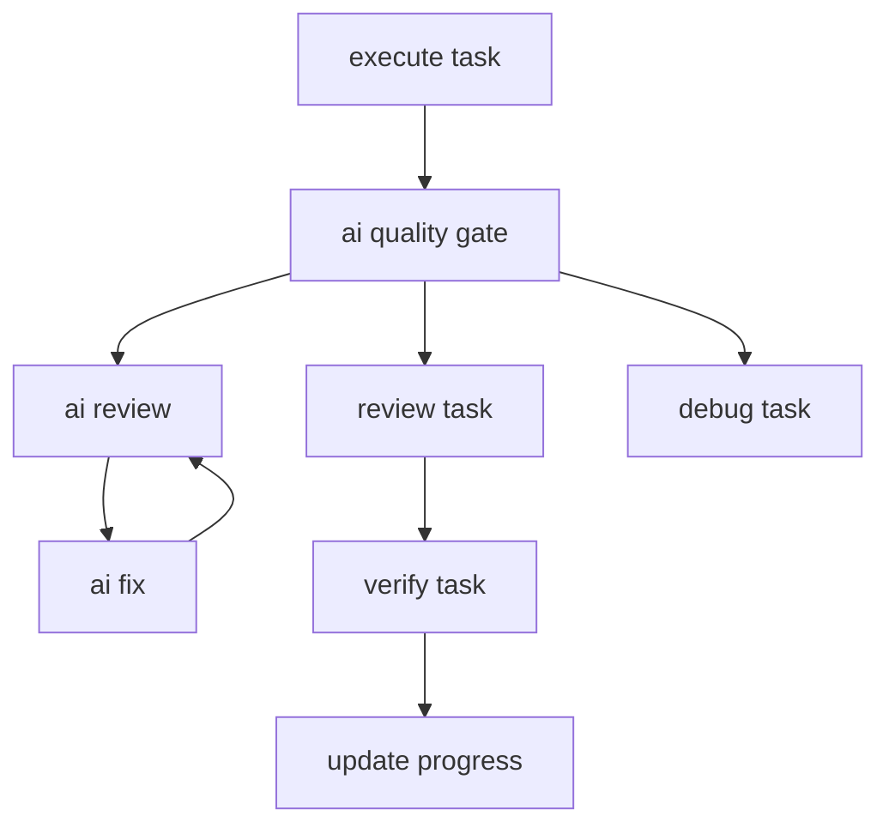
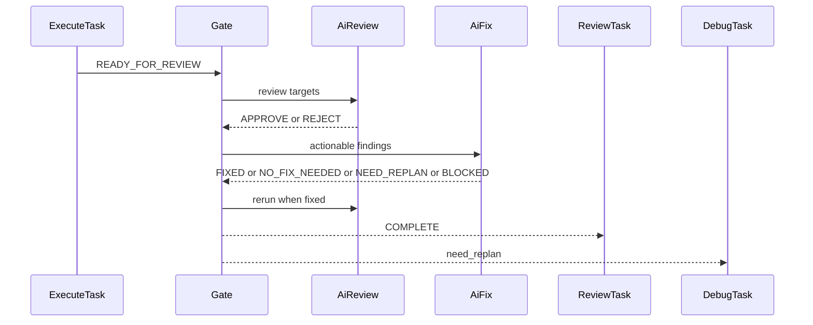
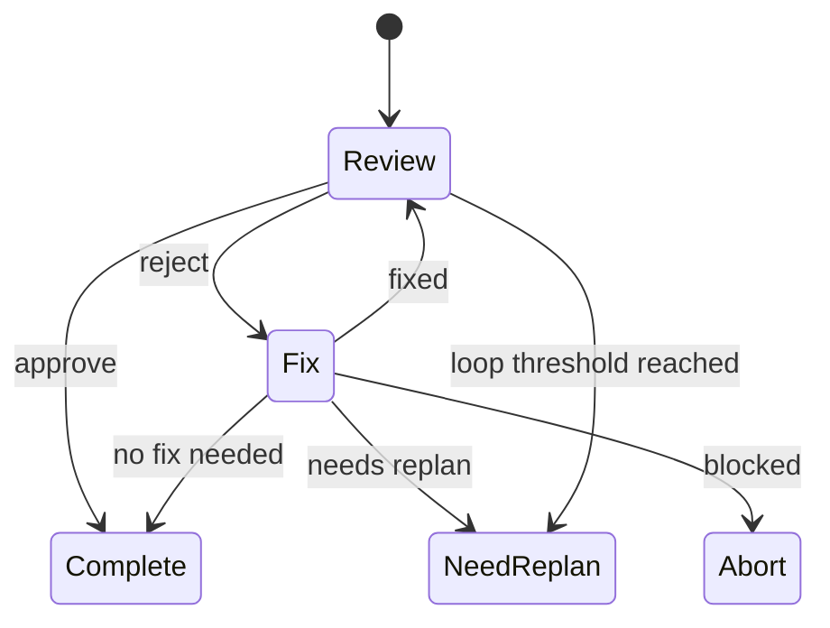

# Design Document

## Overview

`kiro-ai-quality-gate` は、`kiro-impl` の `execute-task` 後に挿入する reusable な TAKT callable subworkflow である。AI antipattern review/fix loop を Kiro selected task boundary に合わせて実行し、通常の `review-task` に渡す前にハルシネーション、スコープ逸脱、証跡不足、修正したふりを検出・修復する。

この設計は TAKT built-in の AI antipattern review 資産を採用し、Kiro 固有の修正結果契約と downstream evidence consumption を追加する。初期 rollout は `kiro-impl` のみを対象にし、requirements/design/tasks/discovery/batch や OpenSpec `opsx:*` への横展開は後続 spec に委ねる。

### Goals

- `execute-task -> ai-quality-gate -> review-task` の初期 integration を成立させる。
- TAKT の `workflow_call` / callable subworkflow を使い、後続横展開に耐える gate contract を定義する。
- AI antipattern findings の review/fix/no-fix/blocking evidence を report と validation で機械的に追跡する。
- selected task boundary と progress update safety を崩さない。

### Non-Goals

- OpenSpec / `opsx:*` workflows への適用。
- Kiro requirements/design/tasks/discovery/batch/quick workflows への横展開。
- `.agents/skills/kiro-*` や `CC-SDD-CODEX.md` の直接修正。
- TAKT engine、built-in facet、built-in workflow の変更。
- `execute-task` の実装責務そのものの置換。

## Boundary Commitments

### This Spec Owns

- `kiro-ai-quality-gate` callable subworkflow の workflow contract、return statuses、loop semantics。
- `kiro-impl` から AI quality gate への routing と、gate 結果の downstream routing。
- Kiro implementation scope 用の AI antipattern fix instruction と fix output contract。
- `review-task` と `verify-task-completion` が gate reports を読むための Kiro adapter instruction 差分。
- `scripts/validate-kiro-iterative-implementation-workflow.mjs` と対応 tests による gate contract drift detection。
- ルート `TAKT.md` に記録する project-local TAKT 開発規約。

### Out of Boundary

- Requirements/design/tasks/discovery/batch/quick への AI quality gate 適用。
- OpenSpec / `opsx:*` workflows。
- archive 機能。
- 上流 Kiro skill asset の独自拡張または直接修正。
- built-in `default-draft` の挙動変更。
- `update-progress` に AI report の再レビュー責務を持たせる変更。

### Allowed Dependencies

- TAKT workflow features: `subworkflow.callable`、`workflow_call`、`returns`、`facet_ref` / `facet_ref[]` params、`loop_monitors`。
- TAKT built-in facets: `ai-antipattern-reviewer` persona、`ai-antipattern` policy、`ai-antipattern-review` instruction/output contract、`loop-monitor-ai-antipattern-fix` instruction。
- Existing Kiro facets: `kiro-artifact-operations`、`kiro-impl-task-progress`、`kiro-review-task`、`kiro-verify-task-completion`、`kiro-implementation-result`。
- Existing repository validation pattern in `scripts/validate-kiro-iterative-implementation-workflow.mjs` and `tests/kiro-iterative-implementation-workflow.test.mjs`。

### Revalidation Triggers

- TAKT `workflow_call`、`subworkflow.params`、`facet_ref`、または `facet_ref[]` の schema が変わる。
- `kiro-implementation-result` の `changed_files`、`selected_task`、`validation_evidence` contract が変わる。
- `ai-antipattern-review` output contract の `APPROVE` / `REJECT` または finding fields が変わる。
- `kiro-impl` の step order、`execute-task` statuses、`debug-task` routing、`verify-task-completion` gate が変わる。
- `.takt/en` と `.takt/ja` の parity validation 方針が変わる。

## Architecture

### Existing Architecture Analysis

`kiro-impl` は `plan-one-task -> execute-task -> review-task -> verify-task-completion -> update-progress` を中心に、失敗時は `debug-task` に戻す state machine である。現状の `execute-task` は `STATUS READY_FOR_REVIEW` を直接 `review-task` に送るため、AI-specific defects の前段検査は存在しない。

既存の validation script は workflow shape、facet refs、output contract refs、language parity を検査する。現在は nested Kiro workflow を boundary drift として禁止しているため、この設計では `kiro-ai-quality-gate` だけを明示的に許可し、その他の nested Kiro workflow 禁止は維持する。

### Architecture Pattern & Boundary Map

採用パターンは「Kiro-specific callable gate + existing facet reuse」である。実装責務は既存 `execute-task` に残し、AI品質修復だけを callable subworkflow に切り出す。



Key decisions:
- `default-draft` は参照元であり、直接呼び出し対象ではない。
- Gate loop の不達成は `COMPLETE` ではなく `need_replan` として caller の `debug-task` に戻す。
- `update-progress` は AI reports を直接読まず、`verify-task-completion` の `safe_to_update_progress` だけを信頼する。

### Technology Stack

| Layer | Choice / Version | Role in Feature | Notes |
|-------|------------------|-----------------|-------|
| Workflow Runtime | `takt` | `workflow_call` と callable subworkflow の実行 | 新規 runtime dependency なし |
| Workflow Assets | YAML under `.takt/{en,ja}/workflows` | `kiro-ai-quality-gate` と `kiro-impl` routing | 言語ペアの構造一致を維持 |
| Prompt Assets | Markdown facets under `.takt/{en,ja}/facets` | fix instruction、fix output contract、review/verify adapter 差分 | built-in facets を参照し、上流 skill は変更しない |
| Validation | Node.js 22 ES modules | workflow/facet/report contract drift detection | 既存 validator を拡張 |
| Testing | `node:test` | current repository と drift fixtures の検証 | 既存 test style を継続 |

## File Structure Plan

### Directory Structure

```text
.takt/
├── en/
│   ├── workflows/
│   │   ├── kiro-impl.yaml
│   │   └── kiro-ai-quality-gate.yaml
│   └── facets/
│       ├── instructions/
│       │   ├── kiro-ai-antipattern-fix-implementation.md
│       │   ├── kiro-review-task.md
│       │   └── kiro-verify-task-completion.md
│       └── output-contracts/
│           └── kiro-ai-antipattern-fix-result.md
├── ja/
│   ├── workflows/
│   │   ├── kiro-impl.yaml
│   │   └── kiro-ai-quality-gate.yaml
│   └── facets/
│       ├── instructions/
│       │   ├── kiro-ai-antipattern-fix-implementation.md
│       │   ├── kiro-review-task.md
│       │   └── kiro-verify-task-completion.md
│       └── output-contracts/
│           └── kiro-ai-antipattern-fix-result.md
├── scripts/
│   └── validate-kiro-iterative-implementation-workflow.mjs
├── tests/
│   └── kiro-iterative-implementation-workflow.test.mjs
└── TAKT.md
```

### Modified Files

- `.takt/en/workflows/kiro-impl.yaml` — `execute-task` の `READY_FOR_REVIEW` routing を `ai-quality-gate` workflow call に変更し、gate returns を `review-task` / `debug-task` / `ABORT` に接続する。
- `.takt/ja/workflows/kiro-impl.yaml` — 英語版と同じ構造変更を日本語表現で反映する。
- `.takt/en/facets/instructions/kiro-review-task.md` — gate reports の unresolved findings、no-fix rationale、scope guard evidence を review input に追加する。
- `.takt/ja/facets/instructions/kiro-review-task.md` — 同上。
- `.takt/en/facets/instructions/kiro-verify-task-completion.md` — gate fix status と review acceptance を `safe_to_update_progress` 判定に含める。
- `.takt/ja/facets/instructions/kiro-verify-task-completion.md` — 同上。
- `scripts/validate-kiro-iterative-implementation-workflow.mjs` — gate workflow、allowed workflow call、return statuses、loop threshold、report contracts、downstream evidence hooks、language parity を検査する。
- `tests/kiro-iterative-implementation-workflow.test.mjs` — bypass/missing contract/drift fixture tests を追加する。

### New Files

- `.takt/en/workflows/kiro-ai-quality-gate.yaml` — English callable AI quality gate workflow。
- `.takt/ja/workflows/kiro-ai-quality-gate.yaml` — Japanese callable AI quality gate workflow。
- `.takt/en/facets/instructions/kiro-ai-antipattern-fix-implementation.md` — implementation-scope AI antipattern fix instruction。
- `.takt/ja/facets/instructions/kiro-ai-antipattern-fix-implementation.md` — 同上。
- `.takt/en/facets/output-contracts/kiro-ai-antipattern-fix-result.md` — fix report machine fields contract。
- `.takt/ja/facets/output-contracts/kiro-ai-antipattern-fix-result.md` — 同上。
- `TAKT.md` — project-local TAKT 開発規約。上流 `.agents/skills/kiro-*` を変更せず、TAKT workflow/facet prompt で曖昧さを上書きする方針を記録する。

## System Flows

### Implementation Gate Flow



Gate-level `ABORT` stops the caller workflow. The `need_replan` return always maps to `debug-task` for `kiro-impl`.

### Gate State Flow



## Requirements Traceability

| Requirement | Summary | Components | Interfaces | Flows |
|-------------|---------|------------|------------|-------|
| 1.1 | `execute-task` から gate へ routing | Kiro Impl Integration, Callable Gate | `kiro-impl.yaml` rule | Implementation Gate Flow |
| 1.2 | gate `COMPLETE` で `review-task` へ進む | Kiro Impl Integration | workflow call rules | Implementation Gate Flow |
| 1.3 | gate `need_replan` で `debug-task` へ戻る | Kiro Impl Integration | workflow call rules | Implementation Gate Flow |
| 1.4 | gate `ABORT` で progress update なしに停止 | Kiro Impl Integration, Validation Contract | workflow call rules | Gate State Flow |
| 2.1 | reusable gate contract | Callable Gate | `subworkflow.callable` | Implementation Gate Flow |
| 2.2 | `artifact_scope: implementation` handling | Callable Gate, Context Resolver | fixed prompt contract | Gate State Flow |
| 2.3 | missing context blocking | Context Resolver, Fix Contract | `BLOCKED` / `ABORT` | Gate State Flow |
| 2.4 | out-of-scope workflows excluded | Validation Contract | boundary checks | N/A |
| 3.1 | AI-specific review coverage | AI Review Step | `ai-antipattern-review` | Gate State Flow |
| 3.2 | review evidence report | AI Review Step | `kiro-ai-antipattern-review.md` | Gate State Flow |
| 3.3 | no issues complete without modification | Callable Gate | review rules | Gate State Flow |
| 3.4 | Kiro review remains downstream | Kiro Impl Integration, Review Adapter | `review-task` | Implementation Gate Flow |
| 4.1 | actionable findings fixed within scope | AI Fix Step | fix instruction | Gate State Flow |
| 4.2 | bounded loop below threshold | Callable Gate | `loop_monitors.threshold` | Gate State Flow |
| 4.3 | unresolved after 3 attempts returns `need_replan` | Callable Gate | loop monitor judge | Gate State Flow |
| 4.4 | missing information returns `ABORT` | Context Resolver, Callable Gate | workflow rules | Gate State Flow |
| 5.1 | implementation fixes stay in boundary | AI Fix Step, Fix Contract | scope guard fields | Gate State Flow |
| 5.2 | gate does not update progress | AI Fix Step, Validation Contract | forbidden update checks | N/A |
| 5.3 | boundary/progress change requires `need_replan` | AI Fix Step | `NEED_REPLAN` status | Gate State Flow |
| 5.4 | unresolved changed files returns `ABORT` | Context Resolver | `BLOCKED` status | Gate State Flow |
| 6.1 | fix decisions recorded | AI Fix Step | `kiro-ai-antipattern-fix.md` | Gate State Flow |
| 6.2 | fixed issue evidence included | Fix Contract | `FIXED` fields | N/A |
| 6.3 | no-fix rationale evidence included | Fix Contract | `NO_FIX_NEEDED` fields | N/A |
| 6.4 | no evidence aborts | Fix Contract, Callable Gate | `BLOCKED` / `ABORT` | Gate State Flow |
| 7.1 | `review-task` consumes gate reports | Review Adapter | instruction facet | Implementation Gate Flow |
| 7.2 | `verify-task-completion` checks gate status | Verification Adapter | instruction facet | Implementation Gate Flow |
| 7.3 | review rejection follows existing failure path | Kiro Impl Integration | `VERDICT REJECTED` rule | Implementation Gate Flow |
| 7.4 | `update-progress` depends on verify output | Verification Adapter, Validation Contract | `safe_to_update_progress` | N/A |
| 8.1 | validation detects gate drift | Validation Contract | validator checks | N/A |
| 8.2 | tests cover integration | Validation Contract | node:test fixtures | N/A |
| 8.3 | en/ja structural parity | Validation Contract | language parity checks | N/A |
| 8.4 | project-local policy documented | TAKT Project Policy | `TAKT.md` | N/A |

## Components and Interfaces

| Component | Domain/Layer | Intent | Req Coverage | Key Dependencies | Contracts |
|-----------|--------------|--------|--------------|------------------|-----------|
| Callable Gate Workflow | TAKT workflow | AI review/fix loop and returns | 2.1, 2.2, 3.1, 3.3, 4.2, 4.3 | TAKT workflow_call P0, built-in AI facets P0 | Service, State |
| Kiro Impl Integration | TAKT workflow | Insert gate into `kiro-impl` routing | 1.1, 1.2, 1.3, 1.4, 3.4, 7.3 | `kiro-impl.yaml` P0 | State |
| Context Resolver Contract | Prompt contract | Define required implementation context | 2.3, 5.4 | `kiro-implementation-result` P0 | Service |
| AI Review Step | TAKT agent step | Run built-in AI antipattern review | 3.1, 3.2 | built-in `ai-antipattern-review` P0 | Batch |
| AI Fix Step | TAKT agent step | Repair or classify findings within selected task boundary | 4.1, 5.1, 5.2, 5.3, 6.1 | fix instruction P0, fix output contract P0 | Batch |
| Fix Result Contract | Output contract | Machine-readable fix/no-fix/blocking status | 6.1, 6.2, 6.3, 6.4 | review report P0 | State |
| Review Adapter | Prompt facet | Re-evaluate gate evidence during Kiro review | 7.1, 7.3 | `kiro-review-task` P0 | Batch |
| Verification Adapter | Prompt facet | Gate progress update on accepted AI evidence | 7.2, 7.4 | `kiro-verify-task-completion` P0 | Batch |
| Validation Contract | Node validation | Detect workflow/facet/report drift | 2.4, 5.2, 8.1, 8.2, 8.3 | Node.js P0 | Batch |
| TAKT Project Policy | Documentation | Record local override policy | 8.4 | Root docs P2 | N/A |

### TAKT Workflow Layer

#### Callable Gate Workflow

| Field | Detail |
|-------|--------|
| Intent | Kiro write/edit artifact を AI antipattern review/fix loop に通す |
| Requirements | 2.1, 2.2, 3.1, 3.3, 4.2, 4.3 |

**Responsibilities & Constraints**
- `subworkflow.callable: true` として提供する。
- 初期 caller は `kiro-impl` のみ。
- implementation 専用 gate として、`kiro-task-implementation-result.md` とその `changed_files` を review target として扱う。
- `subworkflow.params` は TAKT schema に合わせ、`facet_ref` / `facet_ref[]` だけを使う。
- AI review/fix loop threshold は 3。
- Persistent findings after threshold は `need_replan` を返す。

**Dependencies**
- Inbound: `kiro-impl.yaml` — `workflow_call` caller（P0）
- Outbound: AI Review Step — findings generation（P0）
- Outbound: AI Fix Step — bounded repair（P0）
- External: TAKT runtime — workflow call execution（P0）

**Contracts**: Service [x] / API [ ] / Event [ ] / Batch [ ] / State [x]

##### Service Interface

```typescript
type ArtifactScope = "implementation";
type GateReturn = "COMPLETE" | "need_replan" | "ABORT";
type FacetRef = string;

interface KiroAiQualityGateArgs {
  fix_instruction: FacetRef;
  domain_knowledge: readonly FacetRef[];
}

interface KiroAiQualityGateFixedContext {
  artifact_scope: ArtifactScope;
  target_report: "kiro-task-implementation-result.md";
  target_artifacts_strategy: "changed_files_from_target_reports";
  source_context_strategy: "kiro_selected_task_context";
}

interface KiroAiQualityGateResult {
  return_status: GateReturn;
  review_report: "kiro-ai-antipattern-review.md";
  fix_report: "kiro-ai-antipattern-fix.md" | "N/A";
}
```

- Preconditions（事前条件）: caller invokes the implementation-specific gate after `kiro-task-implementation-result.md` exists.
- Postconditions（事後条件）: gate returns only `COMPLETE`、`need_replan`、or `ABORT`.
- Invariants（不変条件）: gate does not update `tasks.md` progress fields.

##### State Management
- State model（状態モデル）: `Review -> Fix -> Review` loop, then `Complete` / `NeedReplan` / `Abort`.
- Persistence & consistency（永続化と整合性）: reports are written to TAKT report directory via output contracts.
- Concurrency strategy（並行制御戦略）: no concurrent writes; fix step runs serially inside gate loop.

**Implementation Notes**
- Integration: use TAKT built-in `workflow_call` pattern; do not shell out to `takt -w`.
- Validation: validator checks callable workflow shape, facet params, returns, threshold 3, report names.
- Risks: non-facet context is intentionally not represented as workflow args; it stays in the instruction and output contract.

#### Kiro Impl Integration

| Field | Detail |
|-------|--------|
| Intent | `execute-task` と `review-task` の間に gate を挿入する |
| Requirements | 1.1, 1.2, 1.3, 1.4, 3.4, 7.3 |

**Responsibilities & Constraints**
- `execute-task` の `STATUS READY_FOR_REVIEW` は `ai-quality-gate` step に進む。
- `ai-quality-gate` step は `kind: workflow_call` として `kiro-ai-quality-gate` を呼ぶ。
- `COMPLETE` は `review-task`、`need_replan` は `debug-task`、`ABORT` は `ABORT` に進む。
- Existing `review-task` / `debug-task` / `verify-task-completion` / `update-progress` semantics は維持する。

**Dependencies**
- Inbound: `execute-task` output — implementation result（P0）
- Outbound: Callable Gate Workflow — AI quality screening（P0）
- Outbound: `review-task` — downstream domain review（P0）
- Outbound: `debug-task` — replanning/debug route（P0）

**Contracts**: Service [ ] / API [ ] / Event [ ] / Batch [ ] / State [x]

##### State Management
- `READY_FOR_REVIEW` path: `execute-task -> ai-quality-gate -> review-task`。
- Gate failure path: `ai-quality-gate -> debug-task` for `need_replan`。
- Gate abort path: `ai-quality-gate -> ABORT`。

**Implementation Notes**
- Integration: maintain existing loop monitors for execute/review/debug and add separate gate loop monitor only inside callable gate.
- Validation: step order includes `ai-quality-gate` between `execute-task` and `review-task`.
- Risks: Allowing unrestricted nested Kiro workflow calls reopens previous boundary drift; validator permits only this named gate.

### Prompt Contract Layer

#### Context Resolver Contract

| Field | Detail |
|-------|--------|
| Intent | Gate が確認すべき source context と target artifacts を定義する |
| Requirements | 2.3, 5.4 |

**Responsibilities & Constraints**
- Required source context is selected task, requirements, design, tasks, implementation plan, and implementation result.
- Required target artifacts are resolved from `changed_files` in `kiro-task-implementation-result.md`.
- Empty or missing `changed_files` is blocking for implementation scope.

**Dependencies**
- Inbound: `kiro-implementation-result` — selected task and changed files（P0）
- Outbound: AI Review Step — target scope（P0）
- Outbound: AI Fix Step — allowed edit boundary（P0）

**Contracts**: Service [x] / API [ ] / Event [ ] / Batch [ ] / State [ ]

##### Service Interface

```typescript
interface KiroSelectedTaskContext {
  feature_name: string;
  selected_task: string;
  requirements_path: string;
  design_path: string;
  tasks_path: string;
  implementation_plan_report: string;
  implementation_result_report: string;
  changed_files: readonly string[];
}
```

- Preconditions（事前条件）: implementation report is readable.
- Postconditions（事後条件）: context either resolves completely or gate returns `ABORT`.
- Invariants（不変条件）: context resolution does not infer files not present in evidence.

#### AI Review Step

| Field | Detail |
|-------|--------|
| Intent | Built-in AI antipattern review を Kiro target artifacts に適用する |
| Requirements | 3.1, 3.2 |

**Responsibilities & Constraints**
- Use `ai-antipattern-reviewer` persona and `ai-antipattern` policy.
- Review tools are read-only.
- Report name is `kiro-ai-antipattern-review.md`.
- Report format is built-in `ai-antipattern-review`.

**Dependencies**
- Inbound: Context Resolver Contract — source and target artifacts（P0）
- Outbound: AI Fix Step — findings（P0）
- External: built-in `ai-antipattern-review` instruction and output contract（P0）

**Contracts**: Service [ ] / API [ ] / Event [ ] / Batch [x] / State [ ]

##### Batch / Job Contract
- Trigger（トリガー）: gate start and every successful fix attempt.
- Input / validation（入力／検証）: selected task context, target artifacts, prior review/fix reports when present.
- Output / destination（出力／宛先）: `kiro-ai-antipattern-review.md`.
- Idempotency & recovery（冪等性と回復）: repeat review overwrites or refreshes the latest report in TAKT report context.

#### AI Fix Step

| Field | Detail |
|-------|--------|
| Intent | AI findings を selected task boundary 内で修正、または evidence 付きで no-fix/blocking に分類する |
| Requirements | 4.1, 5.1, 5.2, 5.3, 6.1 |

**Responsibilities & Constraints**
- Use Kiro local instruction `kiro-ai-antipattern-fix-implementation`.
- Allowed outcomes are `FIXED`、`NO_FIX_NEEDED`、`NEED_REPLAN`、`BLOCKED`。
- `NO_FIX_NEEDED` requires finding-level evidence.
- The step can edit implementation artifacts but does not update `tasks.md` checkboxes or Implementation Notes.
- No external web research is part of the initial implementation fix path.

**Dependencies**
- Inbound: AI Review Step — findings（P0）
- Inbound: Context Resolver Contract — selected task boundary（P0）
- Outbound: Fix Result Contract — status and evidence（P0）

**Contracts**: Service [ ] / API [ ] / Event [ ] / Batch [x] / State [ ]

##### Batch / Job Contract
- Trigger（トリガー）: AI review `REJECT`.
- Input / validation（入力／検証）: finding IDs, changed files, selected task context, validation evidence.
- Output / destination（出力／宛先）: `kiro-ai-antipattern-fix.md`.
- Idempotency & recovery（冪等性と回復）: repeated attempts reference previous findings and avoid expanding scope.

#### Fix Result Contract

| Field | Detail |
|-------|--------|
| Intent | Downstream review/verify が gate decision を機械的に読める形にする |
| Requirements | 6.1, 6.2, 6.3, 6.4 |

**Responsibilities & Constraints**
- Define machine field `STATUS` as `FIXED`、`NO_FIX_NEEDED`、`NEED_REPLAN`、or `BLOCKED`.
- Include `finding_decisions`, `changed_files`, `scope_guard`, `validation_evidence`, `no_fix_rationale`, `missing_context`.
- `NO_FIX_NEEDED` cannot be summary-only.

**Dependencies**
- Inbound: AI Fix Step — fix decision（P0）
- Outbound: Review Adapter — evidence review（P0）
- Outbound: Verification Adapter — progress safety check（P0）

**Contracts**: Service [ ] / API [ ] / Event [ ] / Batch [ ] / State [x]

##### State Management
- Acceptable final statuses before downstream review: `FIXED` and `NO_FIX_NEEDED`.
- Replanning status: `NEED_REPLAN`.
- Blocking status: `BLOCKED`.

### Downstream Kiro Adapter Layer

#### Review Adapter

| Field | Detail |
|-------|--------|
| Intent | Kiro review が AI gate evidence を通常 review に含める |
| Requirements | 7.1, 7.3 |

**Responsibilities & Constraints**
- Read `kiro-ai-antipattern-review.md` and `kiro-ai-antipattern-fix.md` when present.
- Evaluate unresolved findings, `NO_FIX_NEEDED` rationale, and scope guard.
- Do not redo the entire AI antipattern review; verify the evidence is acceptable for Kiro task review.

**Dependencies**
- Inbound: Callable Gate Workflow reports（P0）
- Outbound: existing `VERDICT APPROVED` / `VERDICT REJECTED` workflow rules（P0）

**Contracts**: Service [ ] / API [ ] / Event [ ] / Batch [x] / State [ ]

##### Batch / Job Contract
- Trigger（トリガー）: `kiro-impl` `review-task`.
- Input / validation（入力／検証）: implementation result, gate reports, selected task artifacts.
- Output / destination（出力／宛先）: existing `kiro-task-review-verdict.md`.
- Idempotency & recovery（冪等性と回復）: rejection follows existing `debug-task` path.

#### Verification Adapter

| Field | Detail |
|-------|--------|
| Intent | Progress update 前に gate evidence が受理済みであることを確認する |
| Requirements | 7.2, 7.4 |

**Responsibilities & Constraints**
- Verify gate reports before setting `safe_to_update_progress: true`.
- Require acceptable fix status and accepted review evidence.
- Keep `update-progress` free of AI report re-review responsibility.

**Dependencies**
- Inbound: `review-task` verdict and gate reports（P0）
- Outbound: `update-progress` `safe_to_update_progress` rule（P0）

**Contracts**: Service [ ] / API [ ] / Event [ ] / Batch [x] / State [ ]

##### Batch / Job Contract
- Trigger（トリガー）: `review-task` approval.
- Input / validation（入力／検証）: gate reports, review verdict, implementation evidence.
- Output / destination（出力／宛先）: existing `kiro-task-completion-verification.md`.
- Idempotency & recovery（冪等性と回復）: `NOT_VERIFIED` and `MANUAL_VERIFY_REQUIRED` follow existing `debug-task` path.

### Validation Layer

#### Validation Contract

| Field | Detail |
|-------|--------|
| Intent | AI quality gate contract drift を機械的に検出する |
| Requirements | 2.4, 5.2, 8.1, 8.2, 8.3 |

**Responsibilities & Constraints**
- Confirm `.takt/{en,ja}/workflows/kiro-ai-quality-gate.yaml` exists and is callable.
- Confirm `kiro-impl.yaml` step order includes `ai-quality-gate`.
- Confirm gate returns `COMPLETE` / `need_replan` / `ABORT`.
- Confirm threshold 3 and report names/contracts.
- Confirm `review-task` and `verify-task-completion` instruction facets mention gate reports and evidence checks.
- Confirm `update-progress` is not assigned direct AI report review.
- Confirm English and Japanese asset structural parity.

**Dependencies**
- Inbound: repository files（P0）
- Outbound: npm validation scripts（P0）

**Contracts**: Service [ ] / API [ ] / Event [ ] / Batch [x] / State [ ]

##### Batch / Job Contract
- Trigger（トリガー）: `npm run validate:kiro-iterative-implementation-workflow` and test fixtures.
- Input / validation（入力／検証）: `.takt/{en,ja}` workflow/facet files.
- Output / destination（出力／宛先）: process exit code and failure messages.
- Idempotency & recovery（冪等性と回復）: read-only validation.

#### TAKT Project Policy

| Field | Detail |
|-------|--------|
| Intent | takt-sdd 開発側の local policy を短く記録する |
| Requirements | 8.4 |

**Responsibilities & Constraints**
- Document that `.agents/skills/kiro-*` are upstream assets and are not directly modified.
- Document that TAKT workflow/facet prompts cover upstream ambiguity at higher prompt priority.
- Document that `.kiro/settings/**` is project-local and may be changed when needed.

**Dependencies**
- Inbound: maintainer decisions（P2）
- Outbound: future contributors and task generation（P2）

**Contracts**: Service [ ] / API [ ] / Event [ ] / Batch [ ] / State [ ]

## Data Models

This feature does not introduce application storage. The data model is report-oriented and lives in TAKT report artifacts.

### Domain Model

- **Gate Invocation**: caller, artifact scope, target report references, source context strategy.
- **AI Finding**: finding ID, family tag, category, location, problem, fix suggestion.
- **Fix Decision**: status, finding decisions, changed files, scope guard, evidence, missing context.
- **Verification Evidence**: downstream review acceptance and safe-to-update-progress decision.

### Logical Data Model

```typescript
type FixStatus = "FIXED" | "NO_FIX_NEEDED" | "NEED_REPLAN" | "BLOCKED";

interface KiroAiFindingDecision {
  finding_id: string;
  decision: "fixed" | "false_positive" | "overreach" | "needs_replan" | "blocked";
  evidence: readonly string[];
}

interface KiroAiAntipatternFixReport {
  STATUS: FixStatus;
  finding_decisions: readonly KiroAiFindingDecision[];
  changed_files: readonly string[];
  scope_guard: {
    selected_task_only: boolean;
    tasks_progress_updated: false;
    rationale: string;
  };
  validation_evidence: readonly string[];
  no_fix_rationale: readonly string[];
  missing_context: readonly string[];
  summary: string;
}
```

### Consistency & Integrity

- `STATUS: NO_FIX_NEEDED` requires at least one finding-level evidence entry when prior review was `REJECT`.
- `scope_guard.tasks_progress_updated` is always `false`.
- `changed_files` in the fix report is a subset of selected-task allowed artifacts, otherwise the gate returns `NEED_REPLAN`.
- Missing required source artifacts produce `BLOCKED`, which caller maps to `ABORT`.

## Testing Strategy

- **Workflow routing tests**: mutate `kiro-impl.yaml` to bypass `ai-quality-gate` and assert validator failure for 1.1, 1.2, 1.3, 1.4.
- **Callable gate shape tests**: remove `subworkflow.callable`, returns, facet params, or `loop_monitors.threshold: 3` from fixture gate workflow and assert validator failure for 2.1, 4.2, 4.3.
- **Report contract tests**: remove `kiro-ai-antipattern-review.md` or `kiro-ai-antipattern-fix.md` report contract and assert validator failure for 3.2, 6.1.
- **Scope guard tests**: remove `tasks.md` progress prohibition or `scope_guard` fields from fix instruction/contract and assert validator failure for 5.1, 5.2, 6.2, 6.3.
- **Downstream evidence tests**: remove gate report references from `kiro-review-task` or `kiro-verify-task-completion` and assert validator failure for 7.1, 7.2, 7.4.
- **Language parity tests**: introduce en/ja mismatch for gate workflow or facets and assert validator failure for 8.3.
- **Current repository smoke test**: existing `current repository satisfies kiro iterative implementation workflow validation` test passes after implementation for 8.1, 8.2.

## Security Considerations

- Review step remains read-only.
- Initial fix step uses local repository evidence only; no external web research is part of the implementation fix path.
- Gate does not write task progress or broaden selected task scope.
- Validation scripts remain read-only and do not execute workflow actions.

## Performance Considerations

- The gate adds at least one AI review step to successful `kiro-impl` executions.
- The bounded loop threshold of 3 caps review/fix repetition.
- No new package dependency or runtime service is introduced.

## Migration and Rollout

- Initial rollout changes only `kiro-impl`.
- Existing `debug-task` and `review-task` paths remain available.
- Existing npm validation/test command names remain unchanged.
- Horizontal rollout to other write/edit Kiro workflows requires a follow-up spec after `kiro-impl` behavior is validated.

## Open Questions and Risks

- TAKT callable params are limited to `facet_ref` / `facet_ref[]`; implementation context is represented by fixed Kiro prompt contracts instead of workflow args.
- Report overwrite semantics across repeated review/fix attempts depend on TAKT report handling. The design relies on latest report availability through `{report:...}` references.
- Validation avoids overfitting to Japanese/English prose while still detecting required machine terms.
