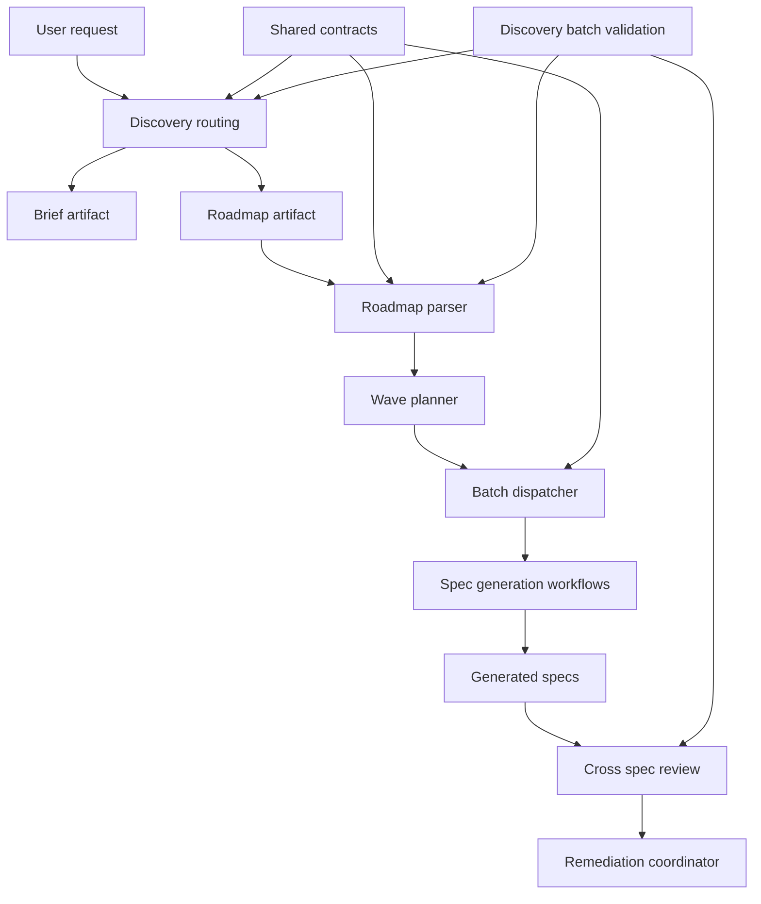
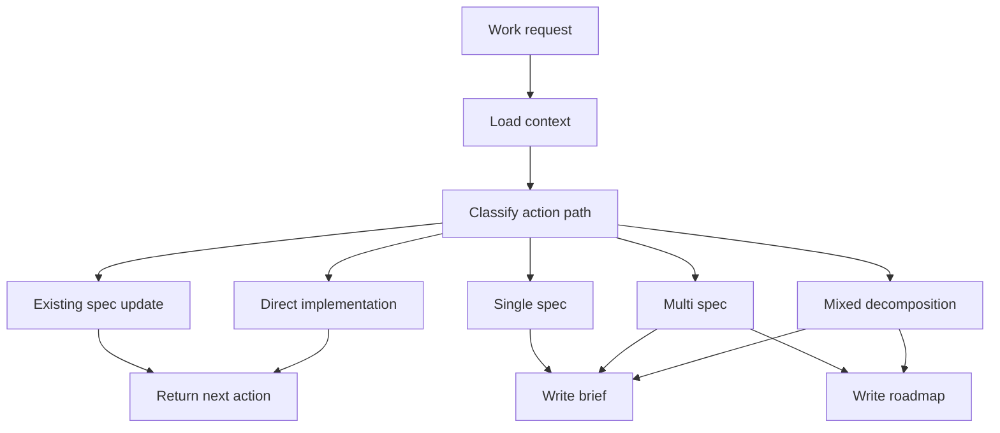
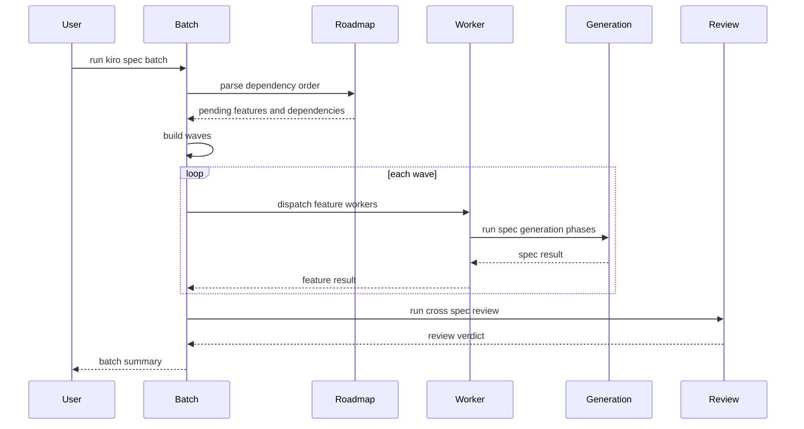

# Design Document

## Overview

`kiro-discovery-batch-workflows` は、Kiro workflow の入口である discovery routing と、複数 spec を依存順に作る batch orchestration を TAKT workflow として実装可能にします。利用者は新しい作業説明を渡し、workflow は action path、`brief.md`、roadmap、dependency wave、cross-spec review result を artifact として残します。

この spec は上流の `kiro-shared-workflow-contracts` と `kiro-spec-generation-workflows` に依存します。shared contracts は `.kiro/*` artifact 操作、skill identity、`spec.json` lifecycle を提供し、spec generation workflows は個別 feature の init/requirements/design/tasks 生成を提供します。本 spec はそれらを呼び出す controller と review orchestration に閉じます。

### Goals

- `kiro-discovery` が作業説明を action path へ分類し、後続 workflow の source of truth になる `brief.md` と roadmap を残せる
- `kiro-spec-batch` が roadmap の `## Specs (dependency order)` から dependency wave を作り、wave ごとの spec generation を実行できる
- cross-spec review が data model、interface、dependency、boundary overlap、decomposition issue を検出できる
- discovery/batch workflow の facet、output contract、roadmap parser、上流 lifecycle 参照の drift を repository-local validation で検出できる

### Non-Goals

- requirements/design/tasks の本文生成 rules と standalone phase workflow の再実装
- `kiro-impl` の task execution、code edit、review/debug/verify loop
- `kiro-spec-status` や `kiro-validate-*` の full behavior
- package script migration、README migration table、legacy `cc-sdd:*` shim
- OpenSpec artifact model を `.kiro/*` artifact contract に統合すること

## Boundary Commitments

### This Spec Owns

- `kiro-discovery` workflow の action path routing と discovery artifact planning
- `brief.md` と `.kiro/steering/roadmap.md` の discovery/batch 用 structure と更新判断
- `kiro-spec-batch` workflow の roadmap dependency parsing、wave planning、worker dispatch、batch summary
- cross-spec review の対象、issue categories、remediation routing、decomposition return
- discovery/batch workflow/facet/output contract/roadmap parser の validation harness

### Out of Boundary

- `kiro-spec-init`、`kiro-spec-requirements`、`kiro-spec-design`、`kiro-spec-tasks`、`kiro-spec-quick` の phase-local generation logic
- 個別 spec artifact の EARS drafting、design synthesis、task graph sanity review の中身
- `kiro-impl` の implementation execution と task checkbox 更新
- status/validation workflow の individual shared verdict 判定
- roadmap に含まれる `Existing Spec Updates` と `Direct Implementation Candidates` の実作業

### Allowed Dependencies

- `kiro-shared-workflow-contracts` の `SkillIdentityResolver`、`KiroArtifactAccessPolicy`、`SpecLifecycleStateContract`、`KiroOutputContractCatalog`
- `kiro-spec-generation-workflows` の standalone phase workflow と generation result contract
- `.agents/skills/kiro-discovery*`、`.agents/skills/kiro-spec-batch`、`.kiro/settings/templates/specs/*` の source asset
- `.kiro/steering/roadmap.md` と `.kiro/specs/<feature>/brief.md`
- Node.js 22+ による repository-local validation script/test 実行

### Revalidation Triggers

- roadmap の `## Specs (dependency order)` format、dependency notation、completion status の変更
- `brief.md` の required section、Boundary Candidates、Upstream/Downstream 表現の変更
- `kiro-spec-generation-workflows` の phase result、auto-approve semantics、task annotation contract の変更
- cross-spec review の issue severity、remediation verdict、decomposition return enum の変更
- `kiro:*` script surface や canonical skill identity mapping の変更

## Architecture

### Existing Architecture Analysis

上流 spec は、共通契約と個別 spec generation を分離しています。`kiro-shared-workflow-contracts` は `.kiro/*` artifact 操作、skill identity、`spec.json` lifecycle を共有 contract として扱い、`kiro-spec-generation-workflows` は individual feature spec の init/requirements/design/tasks/quick を phase-gated workflow bundle として扱います。

この spec は、そのさらに上位に位置します。`kiro-discovery` は spec generation の前段で action path と artifact plan を決め、`kiro-spec-batch` は生成済み roadmap を読んで individual generation workflow を wave ごとに呼びます。batch は generation logic を持たず、roadmap dependency と cross-spec review だけを所有します。

### Architecture Pattern & Boundary Map

Selected pattern: orchestration controller with artifact-backed routing。discovery は action path と artifact を作り、batch は roadmap から wave を作り、個別 spec は上流 generation workflow に委譲します。



Key decisions:

- discovery は routing と source artifact 作成だけを行い、spec 本文生成を始めるかどうかは action path と user intent に従う。
- roadmap parser は `## Specs (dependency order)` を batch の唯一の authoritative input とし、他 section は awareness-only にする。
- worker dispatch は same-wave parallel を許すが、wave ordering は strict に守る。
- cross-spec review は generated design を主入力にし、tasks は `_Boundary:_` annotation を優先して読む。
- decomposition 問題は affected spec の局所修正ではなく discovery/roadmap へ戻す。
- Kiro-specific discovery/batch facets は shared `BuiltinFacetInheritancePolicy` に従い、`node_modules/takt/builtins/{lang}/facets` の research/planning/review 系 built-in facet を継承できる場合は差分だけを書く。

### Technology Stack

| Layer | Choice / Version | Role in Feature | Notes |
|-------|------------------|-----------------|-------|
| Workflow runtime | TAKT workflow YAML | `kiro-discovery` と `kiro-spec-batch` の routing/controller 実行 | `.takt/{en,ja}/workflows/` に配置 |
| Facets | TAKT facet Markdown | discovery instruction、batch policy、cross-spec review contract | built-in facet 継承を優先し、en/ja の machine fields をそろえる |
| Built-in facet inheritance | TAKT builtins facet Markdown | research/planning/review 系の親 facet と差分記述 | shared `BuiltinFacetInheritancePolicy` を参照 |
| Shared contracts | Kiro shared facets | artifact access、lifecycle、skill identity、error shape | 上流 spec を参照 |
| Spec generation | `kiro-spec-generation-workflows` | individual spec phase generation | batch worker が呼び出すだけ |
| Spec workspace | `.kiro/steering/`, `.kiro/specs/` | `roadmap.md`、`brief.md`、generated specs の永続化 | OpenSpec artifacts とは分離 |
| Validation | Node.js 22+ script/test | roadmap parser、facet references、cross-spec output drift を検出 | individual generation の full behavior は scope 外 |

## File Structure Plan

### Directory Structure

```text
.
├── .takt/
│   ├── en/
│   │   ├── workflows/
│   │   │   ├── kiro-discovery.yaml
│   │   │   └── kiro-spec-batch.yaml
│   │   └── facets/
│   │       ├── instructions/
│   │       │   ├── kiro-discovery.md
│   │       │   ├── kiro-spec-batch.md
│   │       │   └── kiro-cross-spec-review.md
│   │       ├── output-contracts/
│   │       │   ├── kiro-discovery-result.md
│   │       │   ├── kiro-batch-summary.md
│   │       │   └── kiro-cross-spec-review.md
│   │       └── policies/
│   │           ├── kiro-discovery-routing.md
│   │           ├── kiro-roadmap-dependency-waves.md
│   │           └── kiro-cross-spec-boundaries.md
│   ├── ja/
│   │   ├── workflows/
│   │   │   ├── kiro-discovery.yaml
│   │   │   └── kiro-spec-batch.yaml
│   │   └── facets/
│   │       ├── instructions/
│   │       │   ├── kiro-discovery.md
│   │       │   ├── kiro-spec-batch.md
│   │       │   └── kiro-cross-spec-review.md
│   │       ├── output-contracts/
│   │       │   ├── kiro-discovery-result.md
│   │       │   ├── kiro-batch-summary.md
│   │       │   └── kiro-cross-spec-review.md
│   │       └── policies/
│   │           ├── kiro-discovery-routing.md
│   │           ├── kiro-roadmap-dependency-waves.md
│   │           └── kiro-cross-spec-boundaries.md
├── scripts/
│   └── validate-kiro-discovery-batch-workflows.mjs
└── tests/
    └── kiro-discovery-batch-workflows.test.mjs
```

### Created Files

- `.takt/{en,ja}/workflows/kiro-discovery.yaml` — user request を action path へ分類し、必要な `brief.md` と roadmap artifact を作る workflow。
- `.takt/{en,ja}/workflows/kiro-spec-batch.yaml` — roadmap dependency order を読み、dependency wave、worker dispatch、cross-spec review、summary を実行する workflow。
- `.takt/{en,ja}/facets/instructions/kiro-discovery.md` — discovery の context loading、classification、artifact write、stop condition を定義する instruction。
- `.takt/{en,ja}/facets/instructions/kiro-spec-batch.md` — roadmap parsing、wave execution、generation workflow delegation、failure handling を定義する instruction。
- `.takt/{en,ja}/facets/instructions/kiro-cross-spec-review.md` — generated specs の読み方、issue categories、remediation/decomposition verdict を定義する instruction。
- `.takt/{en,ja}/facets/policies/kiro-discovery-routing.md` — action path enum、single/multi/mixed/existing/direct の routing policy。
- `.takt/{en,ja}/facets/policies/kiro-roadmap-dependency-waves.md` — roadmap section parsing、dependency wave、awareness-only section の扱い。
- `.takt/{en,ja}/facets/policies/kiro-cross-spec-boundaries.md` — data model、interface、duplicate functionality、task boundary、roadmap continuity の review policy。
- `.takt/{en,ja}/facets/output-contracts/kiro-discovery-result.md` — selected action path、created files、next action、blocking reason を返す output contract。
- `.takt/{en,ja}/facets/output-contracts/kiro-batch-summary.md` — wave plan、feature result、failed features、cross-spec review status を返す output contract。
- `.takt/{en,ja}/facets/output-contracts/kiro-cross-spec-review.md` — issue severity、affected specs、suggested fix、decomposition return を返す output contract。
- `scripts/validate-kiro-discovery-batch-workflows.mjs` — workflow/facet references、roadmap parser fixtures、action path enum、cross-spec review contract を検証する script。
- `tests/kiro-discovery-batch-workflows.test.mjs` — validation script を repository-local test runner から実行する regression test。

### Modified Files

- `tests/kiro-discovery-batch-workflows.test.*` — discovery/batch validation を既存 test/check command で検出できる場所に追加する。`package.json` の script wiring は `kiro-workflow-surface` の所有範囲に残す。
- `.kiro/steering/roadmap.md` — runtime の `kiro-discovery` が multi-spec roadmap を作成または更新する対象。この spec 実装時に既存 roadmap を実装タスクとして更新しない。
- `.kiro/specs/<feature>/brief.md` — runtime の `kiro-discovery` が feature ごとに作成する対象。この spec 実装時に固定の downstream feature brief を作らない。

### Component to File Mapping

- `DiscoveryWorkflow` — `.takt/{en,ja}/workflows/kiro-discovery.yaml`、`.takt/{en,ja}/facets/instructions/kiro-discovery.md`
- `DiscoveryRoutingPolicy` — `.takt/{en,ja}/facets/policies/kiro-discovery-routing.md`
- `DiscoveryArtifactPlanner` — `.takt/{en,ja}/facets/output-contracts/kiro-discovery-result.md`、`.takt/{en,ja}/facets/instructions/kiro-discovery.md`
- `RoadmapDependencyParser` — `.takt/{en,ja}/facets/policies/kiro-roadmap-dependency-waves.md`、`scripts/validate-kiro-discovery-batch-workflows.mjs`
- `BatchWavePlanner` — `.takt/{en,ja}/workflows/kiro-spec-batch.yaml`、`.takt/{en,ja}/facets/policies/kiro-roadmap-dependency-waves.md`
- `BatchWorkerDispatcher` — `.takt/{en,ja}/workflows/kiro-spec-batch.yaml`、`.takt/{en,ja}/facets/instructions/kiro-spec-batch.md`
- `CrossSpecReviewWorkflow` — `.takt/{en,ja}/facets/instructions/kiro-cross-spec-review.md`、`.takt/{en,ja}/facets/output-contracts/kiro-cross-spec-review.md`
- `BatchRemediationCoordinator` — `.takt/{en,ja}/facets/output-contracts/kiro-batch-summary.md`、`.takt/{en,ja}/workflows/kiro-spec-batch.yaml`
- `DiscoveryBatchValidationHarness` — `scripts/validate-kiro-discovery-batch-workflows.mjs`、`tests/kiro-discovery-batch-workflows.test.mjs`

## System Flows

### Discovery Routing Flow



Discovery は、routing decision を artifact と output contract の両方に残します。新規 spec generation を始める場合でも、個別 spec 本文の生成は `kiro-spec-generation-workflows` に任せます。

### Batch Wave Flow



wave ordering は strict です。同じ wave の worker は互いに独立した feature directory だけを書き、roadmap と cross-spec summary の扱いは batch controller に戻します。

## Requirements Traceability

| Requirement | Summary | Components | Interfaces | Flows |
|-------------|---------|------------|------------|-------|
| 1.1 | action path classification | DiscoveryWorkflow, DiscoveryRoutingPolicy | Output contract | Discovery routing |
| 1.2 | `brief.md` creation | DiscoveryWorkflow, DiscoveryArtifactPlanner | Artifact write | Discovery routing |
| 1.3 | roadmap creation | DiscoveryWorkflow, DiscoveryArtifactPlanner | Artifact write | Discovery routing |
| 1.4 | existing/direct stop action | DiscoveryRoutingPolicy, DiscoveryArtifactPlanner | Output contract | Discovery routing |
| 1.5 | Japanese output and machine fields | DiscoveryArtifactPlanner, DiscoveryBatchValidationHarness | Output contract | Validation |
| 2.1 | `brief.md` required sections | DiscoveryArtifactPlanner | Artifact contract | Discovery routing |
| 2.2 | roadmap dependency order | RoadmapDependencyParser, DiscoveryArtifactPlanner | Artifact contract | Batch wave |
| 2.3 | awareness-only sections | RoadmapDependencyParser | Parser policy | Batch wave |
| 2.4 | brief/roadmap contradiction blocking | DiscoveryWorkflow, RoadmapDependencyParser | Output contract | Discovery routing |
| 2.5 | OpenSpec separation | DiscoveryRoutingPolicy | Policy | Discovery routing |
| 3.1 | authoritative roadmap section | RoadmapDependencyParser | Parser policy | Batch wave |
| 3.2 | wave classification | BatchWavePlanner | Batch contract | Batch wave |
| 3.3 | dependency errors | RoadmapDependencyParser, BatchWavePlanner | Output contract | Batch wave |
| 3.4 | missing brief blocking | BatchWavePlanner | Output contract | Batch wave |
| 3.5 | strict wave execution | BatchWorkerDispatcher | Batch contract | Batch wave |
| 4.1 | generation workflow delegation | BatchWorkerDispatcher | Workflow call | Batch wave |
| 4.2 | auto-approve lifecycle | BatchWorkerDispatcher, BatchRemediationCoordinator | Lifecycle contract | Batch wave |
| 4.3 | generation boundary separation | BatchWorkerDispatcher | Policy | Batch wave |
| 4.4 | partial failure reporting | BatchRemediationCoordinator | Output contract | Batch wave |
| 4.5 | implementation exclusion | BatchWorkerDispatcher | Policy | Batch wave |
| 5.1 | generated specs review | CrossSpecReviewWorkflow | Review contract | Cross-spec review |
| 5.2 | consistency checks | CrossSpecReviewWorkflow | Review contract | Cross-spec review |
| 5.3 | task boundary checks | CrossSpecReviewWorkflow | Review contract | Cross-spec review |
| 5.4 | local remediation routing | BatchRemediationCoordinator, CrossSpecReviewWorkflow | Output contract | Cross-spec review |
| 5.5 | decomposition return | BatchRemediationCoordinator, CrossSpecReviewWorkflow | Output contract | Cross-spec review |
| 6.1 | workflow/facet validation | DiscoveryBatchValidationHarness | Validation script | Validation |
| 6.2 | roadmap parser validation | DiscoveryBatchValidationHarness, RoadmapDependencyParser | Validation script | Validation |
| 6.3 | upstream lifecycle reference validation | DiscoveryBatchValidationHarness, BatchWorkerDispatcher | Validation script | Validation |
| 6.4 | cross-spec output validation | DiscoveryBatchValidationHarness, CrossSpecReviewWorkflow | Validation script | Validation |
| 6.5 | out-of-scope validation guard | DiscoveryBatchValidationHarness | Validation scope | Validation |
| 6.6 | built-in facet inheritance validation | DiscoveryBatchValidationHarness | Validation script | Validation |

## Components and Interfaces

| Component | Domain/Layer | Intent | Req Coverage | Key Dependencies | Contracts |
|-----------|--------------|--------|--------------|------------------|-----------|
| DiscoveryWorkflow | Workflow | work request を action path へ分類し、必要な artifact を作る | 1.1, 1.2, 1.3, 1.4, 2.4 | Shared contracts P0 | Batch |
| DiscoveryRoutingPolicy | Policy | action path enum と routing stop condition を定義する | 1.1, 1.4, 2.5 | Kiro artifact policy P0 | State |
| DiscoveryArtifactPlanner | Artifact contract | `brief.md` と roadmap の required structure と output result を定義する | 1.2, 1.3, 1.5, 2.1, 2.2 | `.kiro/*` P0 | State |
| RoadmapDependencyParser | Parser | roadmap の dependency order と awareness-only section を分ける | 2.2, 2.3, 3.1, 3.3 | roadmap P0 | Service |
| BatchWavePlanner | Batch planning | pending specs を dependency wave に分類する | 3.2, 3.3, 3.4 | RoadmapDependencyParser P0 | Service |
| BatchWorkerDispatcher | Workflow controller | wave ごとに individual spec generation workflow を呼び出す | 3.5, 4.1, 4.2, 4.3, 4.5, 6.3 | Spec generation workflows P0 | Batch |
| CrossSpecReviewWorkflow | Review | generated specs の boundary と contract consistency を確認する | 5.1, 5.2, 5.3, 5.4, 5.5, 6.4 | generated specs P0 | Batch |
| BatchRemediationCoordinator | Controller | worker failure と review issue の next action をまとめる | 4.2, 4.4, 5.4, 5.5 | CrossSpecReviewWorkflow P0 | State |
| DiscoveryBatchValidationHarness | Validation | discovery/batch workflow と parser contract の drift を検出する | 1.5, 6.1, 6.2, 6.3, 6.4, 6.5 | Node.js 22+ P0 | Service, Batch |

### Discovery Layer

#### DiscoveryWorkflow

| Field | Detail |
|-------|--------|
| Intent | user request を Kiro action path に分類し、必要な discovery artifact を作る |
| Requirements | 1.1, 1.2, 1.3, 1.4, 2.4 |

**Responsibilities & Constraints**

- work request、既存 `.kiro/specs/`、roadmap、steering context を読み、action path を選ぶ。
- single/multi/mixed の場合は `brief.md` を、multi/mixed の場合は roadmap を作る。
- existing spec update と direct implementation は新規 spec generation を開始せず next action で止める。
- `kiro-spec-generation-workflows` の requirements/design/tasks 本文生成 rules を持たない。

**Dependencies**

- Inbound: `kiro:*` script surface または `$kiro-discovery` invocation — discovery 開始 (P0)
- Outbound: `KiroArtifactAccessPolicy` — `.kiro/*` read/write 境界 (P0)
- Outbound: `DiscoveryRoutingPolicy` — action path 判定 (P0)
- Outbound: `DiscoveryArtifactPlanner` — artifact structure (P0)

**Contracts**: Service [ ] / API [ ] / Event [ ] / Batch [x] / State [ ]

##### Batch / Job Contract

- Trigger: `kiro-discovery` invocation。
- Input / validation: work request、optional existing feature hint、current `.kiro/steering/roadmap.md`。
- Output / destination: discovery result、optional `.kiro/specs/<feature>/brief.md`、optional `.kiro/steering/roadmap.md`。
- Idempotency & recovery: existing/direct path は write なしで next action を返し、artifact contradiction は `BLOCKED` 相当で止める。

#### DiscoveryRoutingPolicy

| Field | Detail |
|-------|--------|
| Intent | discovery の action path と stop condition を定義する |
| Requirements | 1.1, 1.4, 2.5 |

**Responsibilities & Constraints**

- supported action path を `EXISTING_SPEC_UPDATE`、`DIRECT_IMPLEMENTATION`、`SINGLE_SPEC`、`MULTI_SPEC`、`MIXED_DECOMPOSITION` として扱う。
- routing 判断は artifact と next action に残す。
- OpenSpec artifact を `.kiro/*` routing の source of truth にしない。

**Dependencies**

- Inbound: `DiscoveryWorkflow` — classification policy として参照する (P0)
- Outbound: `KiroOutputContractCatalog` — blocking/error shape (P0)

**Contracts**: Service [ ] / API [ ] / Event [ ] / Batch [ ] / State [x]

##### State Management

- State model: action path enum、routing reason、next action。
- Persistence & consistency: discovery result contract と written artifact の action path が一致する。
- Concurrency strategy: discovery は project-level roadmap を更新する可能性があるため、batch worker と同時に同じ roadmap を更新しない。

#### DiscoveryArtifactPlanner

| Field | Detail |
|-------|--------|
| Intent | `brief.md` と roadmap の required structure を定義する |
| Requirements | 1.2, 1.3, 1.5, 2.1, 2.2 |

**Responsibilities & Constraints**

- `brief.md` に problem、current state、desired outcome、approach、scope、boundary candidates、out of boundary、upstream/downstream を要求する。
- roadmap に overview、approach decision、scope、constraints、boundary strategy、`## Specs (dependency order)` を要求する。
- awareness-only section は roadmap に残せるが batch 対象にはしない。

**Dependencies**

- Inbound: `DiscoveryWorkflow` — artifact write plan として参照する (P0)
- Outbound: `.kiro/steering/roadmap.md`、`.kiro/specs/<feature>/brief.md` — persisted artifact (P0)

**Contracts**: Service [ ] / API [ ] / Event [ ] / Batch [ ] / State [x]

##### State Management

- State model: discovery artifact text sections と batch-readable roadmap entry。
- Persistence & consistency: feature name、dependency、out-of-boundary が brief と roadmap で矛盾しない。
- Concurrency strategy: discovery artifact creation は feature directory 単位、roadmap update は project 単位。

### Batch Layer

#### RoadmapDependencyParser

| Field | Detail |
|-------|--------|
| Intent | roadmap の dependency order を batch plan に変換する |
| Requirements | 2.2, 2.3, 3.1, 3.3 |

**Responsibilities & Constraints**

- `## Specs (dependency order)` の checklist entry から feature、description、dependencies、completion status を抽出する。
- `## Existing Spec Updates` と `## Direct Implementation Candidates` は awareness-only として返し、wave には入れない。
- circular dependency、missing dependency、unknown completion marker を blocking result にする。

**Dependencies**

- Inbound: `BatchWavePlanner` — dependency graph input として参照する (P0)
- Outbound: `.kiro/steering/roadmap.md` — parse source (P0)

**Contracts**: Service [x] / API [ ] / Event [ ] / Batch [ ] / State [ ]

##### Service Interface

```typescript
type RoadmapCompletionStatus = "done" | "pending";

interface RoadmapSpecEntry {
  readonly featureName: string;
  readonly description: string;
  readonly dependencies: readonly string[];
  readonly status: RoadmapCompletionStatus;
}

interface RoadmapParseResult {
  readonly specs: readonly RoadmapSpecEntry[];
  readonly awarenessOnlySections: readonly string[];
  readonly errors: readonly RoadmapParseError[];
}
```

- Preconditions: `.kiro/steering/roadmap.md` が存在し、`## Specs (dependency order)` section を持つ。
- Postconditions: batch 対象と awareness-only item が分離される。
- Invariants: completed spec は wave execution から除外される。

#### BatchWavePlanner

| Field | Detail |
|-------|--------|
| Intent | pending specs を strict dependency wave に分ける |
| Requirements | 3.2, 3.3, 3.4 |

**Responsibilities & Constraints**

- dependencies が完了済み、または先行 wave に含まれる pending feature を同じ wave に入れる。
- wave をまたいだ dependency direction を固定し、cycle があれば batch を止める。
- pending feature の `brief.md` existence を wave execution 前に確認する。

**Dependencies**

- Inbound: `BatchWorkerDispatcher` — execution plan として参照する (P0)
- Outbound: `RoadmapDependencyParser` — parsed entries (P0)
- Outbound: `.kiro/specs/<feature>/brief.md` — worker prerequisite (P0)

**Contracts**: Service [x] / API [ ] / Event [ ] / Batch [ ] / State [ ]

##### Service Interface

```typescript
interface DependencyWave {
  readonly waveNumber: number;
  readonly featureNames: readonly string[];
}

interface BatchPlan {
  readonly waves: readonly DependencyWave[];
  readonly skippedCompleted: readonly string[];
  readonly awarenessOnlyItems: readonly string[];
}
```

- Preconditions: roadmap parse result に blocking error がない。
- Postconditions: all pending feature はちょうど 1 つの wave に入る。
- Invariants: wave N の feature は wave N 以降の feature に依存しない。

#### BatchWorkerDispatcher

| Field | Detail |
|-------|--------|
| Intent | wave ごとに individual spec generation workflow を呼び出す |
| Requirements | 3.5, 4.1, 4.2, 4.3, 4.5, 6.3 |

**Responsibilities & Constraints**

- same wave の feature worker を並列可能な単位として扱う。
- worker は feature directory に閉じて `kiro-spec-generation-workflows` を実行する。
- auto-approve mode では shared lifecycle contract に沿って ready state まで進める。
- worker failure は feature result として返し、implementation execution は呼ばない。

**Dependencies**

- Inbound: `kiro-spec-batch` workflow — wave execution controller (P0)
- Outbound: `kiro-spec-generation-workflows` — individual spec generation (P0)
- Outbound: `SpecLifecycleStateContract` — auto-approve lifecycle (P0)

**Contracts**: Service [ ] / API [ ] / Event [ ] / Batch [x] / State [ ]

##### Batch / Job Contract

- Trigger: batch plan の wave execution。
- Input / validation: feature name、brief path、auto-approve flag、upstream spec completion state。
- Output / destination: `.kiro/specs/<feature>/{spec.json,requirements.md,design.md,tasks.md}` と optional `.kiro/specs/<feature>/research.md`。
- Idempotency & recovery: worker は feature directory だけを更新し、failure は feature result として返す。

### Review and Validation Layer

#### CrossSpecReviewWorkflow

| Field | Detail |
|-------|--------|
| Intent | generated specs の境界、依存、contract 整合性を確認する |
| Requirements | 5.1, 5.2, 5.3, 5.4, 5.5, 6.4 |

**Responsibilities & Constraints**

- generated `design.md` を主入力にし、requirements は acceptance scope、tasks は `_Boundary:_` を重点的に読む。
- data model consistency、interface alignment、duplicate functionality、dependency completeness、naming、shared infrastructure ownership を検査する。
- issue は `CRITICAL`、`IMPORTANT`、`MINOR`、`DECOMPOSITION_RETURN` のように remediation path を分ける。
- decomposition 問題は affected spec の局所修正ではなく roadmap/discovery に戻す。

**Dependencies**

- Inbound: `kiro-spec-batch` workflow — planned waves 完了後の review phase controller (P0)
- Outbound: generated specs、roadmap — review input (P0)
- Outbound: `BatchRemediationCoordinator` — review result を remediation に渡す (P0)

**Contracts**: Service [ ] / API [ ] / Event [ ] / Batch [x] / State [ ]

##### Batch / Job Contract

- Trigger: planned waves 完了後、または partial completion 後の review phase。
- Input / validation: generated specs、roadmap、worker result。
- Output / destination: cross-spec review output contract。
- Idempotency & recovery: review は read-only で issue を返し、修正が必要な場合は coordinator が next action を決める。

#### BatchRemediationCoordinator

| Field | Detail |
|-------|--------|
| Intent | worker failure と cross-spec issue を batch summary と next action に整理する |
| Requirements | 4.2, 4.4, 5.4, 5.5 |

**Responsibilities & Constraints**

- feature ごとの success、failed、blocked、skipped を summary に集約する。
- local remediation 可能な issue と decomposition return を区別する。
- roadmap 更新は batch completion の一部として必要な場合だけ扱い、failure を隠して完了扱いにしない。

**Dependencies**

- Inbound: `BatchWorkerDispatcher`、`CrossSpecReviewWorkflow` — result aggregation (P0)
- Outbound: `kiro-batch-summary` output contract — user-visible and machine-readable result (P0)

**Contracts**: Service [ ] / API [ ] / Event [ ] / Batch [ ] / State [x]

##### State Management

- State model: wave plan、feature result、review verdict、remaining follow-up。
- Persistence & consistency: summary の feature status と actual generated artifact state が矛盾しない。
- Concurrency strategy: summary aggregation は controller 単位で行い、worker から project-level file を直接更新しない。

#### DiscoveryBatchValidationHarness

| Field | Detail |
|-------|--------|
| Intent | discovery/batch workflow と上流 contract 参照の drift を検出する |
| Requirements | 1.5, 6.1, 6.2, 6.3, 6.4, 6.5, 6.6 |

**Responsibilities & Constraints**

- `kiro-discovery` と `kiro-spec-batch` の workflow/facet/output contract reference を検証する。
- roadmap parser fixture で dependency order と awareness-only section の分離を検証する。
- generation workflow result と lifecycle contract の参照名を検証する。
- cross-spec review output が severity、affected specs、suggested fix、decomposition return を持つことを検証する。
- Kiro-specific facet が `BuiltinFacetInheritancePolicy` に従い、継承可能な built-in facet を全文コピーしていないことを検証する。
- `kiro-impl` の code edit behavior と individual generation の full behavior を検証対象にしない。

**Dependencies**

- Inbound: repository test/check command — validation 実行 (P0)
- Outbound: `.takt/{en,ja}/workflows/kiro-*.yaml`、facets、fixtures — validation input (P0)

**Contracts**: Service [x] / API [ ] / Event [ ] / Batch [x] / State [ ]

##### Service Interface

```typescript
interface DiscoveryBatchValidationResult {
  readonly validation: KiroSharedContractValidationResult;
  readonly checkedWorkflows: readonly string[];
  readonly checkedFacets: readonly string[];
  readonly findings: readonly DiscoveryBatchValidationFinding[];
}
```

- Preconditions: repository root から validation script が実行される。
- Postconditions: discovery/batch の workflow/facet/parser contract drift が finding として返る。
- Invariants: downstream implementation workflow 未実装は failure にしない。

## Error Handling

### Error Strategy

- Discovery ambiguity は `BLOCKED` 相当の result とし、推測で `brief.md` や roadmap を確定しない。
- Roadmap parse error、cycle、missing dependency、missing brief は batch execution 前に止める。
- Worker failure は feature result として集約し、同じ wave の他 worker result を破棄しない。
- Cross-spec issue は severity と remediation path を分け、decomposition issue を local fix として処理しない。

### Error Categories and Responses

- User input ambiguity: action path を決められない場合は clarification を返す。
- Artifact missing: roadmap または brief がない場合は missing path と再実行すべき workflow を返す。
- Dependency invalid: cycle、unknown dependency、completion status mismatch を blocking result にする。
- Generation blocked: individual spec generation result を batch summary に保持する。
- Cross-spec mismatch: affected specs と suggested fix、または roadmap/discovery return を返す。

### Monitoring

validation harness は workflow/facet/path/enum drift を test failure として検出します。runtime の長時間監視や PR monitoring はこの spec の対象外です。

## Testing Strategy

### Unit Tests

- `RoadmapDependencyParser` が `## Specs (dependency order)` の checklist、dependencies、completion status を抽出できることを検証する。
- awareness-only section が batch wave に入らないことを検証する。
- circular dependency、missing dependency、missing brief が blocking result になることを検証する。
- action path enum と discovery result contract の machine fields が en/ja で一致することを検証する。

### Integration Tests

- `kiro-spec-batch` fixture で Wave 1、Wave 2、Wave 3 の plan が dependency order に沿って作られることを検証する。
- batch worker が individual generation workflow result を feature summary に集約し、failure feature と success feature を分けることを検証する。
- auto-approve mode が shared lifecycle contract と矛盾しない phase/approval/ready state を期待することを検証する。
- cross-spec review output が `CRITICAL`、`IMPORTANT`、`MINOR`、`DECOMPOSITION_RETURN` を区別できることを検証する。

### Regression Tests

- `.takt/en` と `.takt/ja` の workflow/facet basename、output contract field、enum が drift していないことを検証する。
- roadmap parser fixture で `Existing Spec Updates` と `Direct Implementation Candidates` を batch 対象にしないことを検証する。
- Kiro-specific facet の `extends` frontmatter が shared `BuiltinFacetInheritancePolicy` に従い、親 built-in facet が存在すること、または full custom の理由があることを検証する。
- validation harness が `kiro-impl` の full behavior と individual generation body を成功条件に含めないことを検証する。
