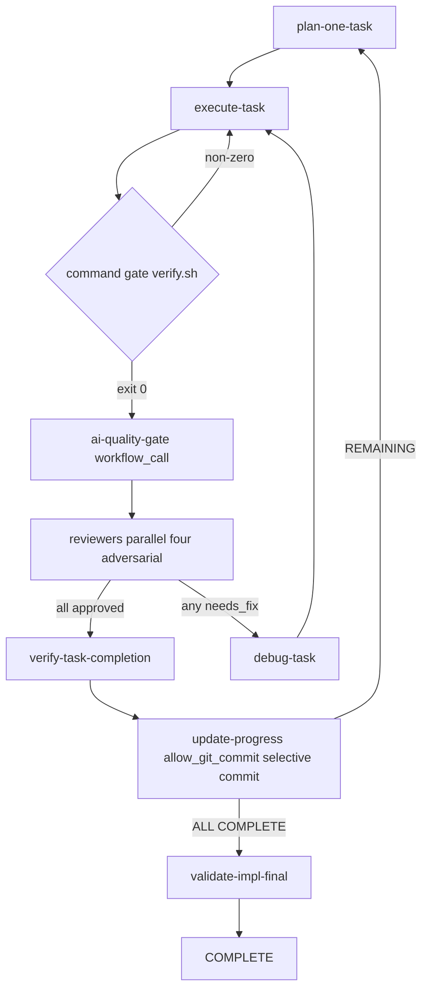
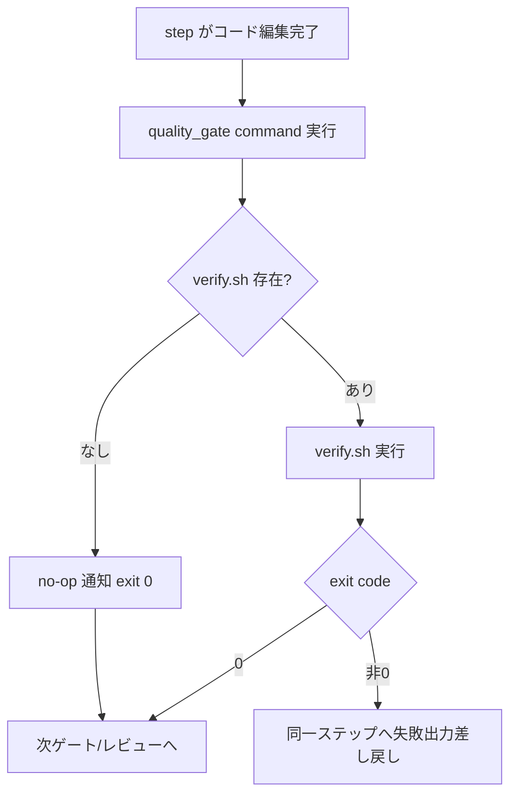

# 技術設計

## 概要

**Purpose（目的）**: 本機能は takt-sdd のメンテナと kiro-impl 利用者に対し、タスク完了判定の「機械的正しさ」を LLM の自己申告ではなく**コマンドの終了コード**で裏打ちし、レビューを**証拠ベースの不同意（adversarial）**へ、コミットを**タスク単位の粒度**へ、知識伝播を**明示化**することで、進捗表示と実態の乖離を減らす。

**Users（ユーザー）**: kiro-impl を回すメンテナ／実装者と、ワークフロー契約を保守する maintainer。

**Impact（影響）**: 既存 `kiro-iterative-implementation-workflow`（8 step）の**ステップ topology を変えず**、step 属性（`quality_gates` / `allow_git_commit`）と facet 内容、検証層・skill 正本の拡張で実現する。

### 目標
- コード編集ステップ完了後に決定論的コマンドゲートを実行し、終了コードで完了候補進行を gate する（要件1）。
- 再実行制御を `loop_monitors` のみに保ったままゲートを統合する（要件2）。
- 4観点レビューを adversarial 化しつつ `all("approved")` 集約と security 非常時を維持（要件3）。
- 検証済みタスク単位の選択的コミットを行う（要件4）。
- Implementation Notes を後続 execute/debug に明示伝播（要件5）。
- 全変更を ja/en・validate・node:test・SKILL 正本へ整合反映（要件6）。
- **成功基準**: `npm run validate:kiro-iterative-implementation-workflow` と該当 node:test が、新契約（ゲート配置・commit・adversarial・知識伝播）の drift を検出し、緑であること。

### 非目標
- 提案5（リスク階層化 / model 階層化。takt 0.45.0 は parallel サブステップ条件スキップ非対応）。
- 提案6（loop_monitors threshold 数値変更）。
- ai-quality-gate サブワークフロー本体の責務再設計。
- per-task 単位の検証コマンド自動絞り込み（当面はリポジトリ標準の test/build を実行）。
- 新規 reviewer 観点の常時追加。

## 境界コミットメント

### このスペックが所有するもの
- `kiro-impl.yaml` の `execute-task` への command 型 `quality_gates` 付与と、`update-progress` への `allow_git_commit` + 選択的コミット手順。
- 4 review facet（coding/architecture/qa/testing）の adversarial 振る舞い定義。
- `execute-task` / `debug-task` facet への Implementation Notes 読込手順。
- 検証コマンド解決の**規約**（リポジトリ提供の任意フック `.kiro/settings/verify.sh`）と、その規約に対する validate/test アサーション。
- 上記の ja/en 両資産・SKILL 正本（`.claude` / `.agents`）への反映。

### 境界外
- ai-quality-gate サブワークフローの内部ステップ構成・ループ設計（本 spec は `ai-antipattern-fix` への gate 属性付与のみ）。
- 共有 output contract（review verdict / completion 等）の構造変更。
- インストーラ本体のコピー範囲変更（`.kiro/settings/verify.sh` は利用リポジトリが所有する任意フック）。
- status/validation・spec 生成・batch の各ワークフロー。

### 許可する依存
- takt 0.45.0 engine: `quality_gates(type: command, shell:true)`、`allow_git_commit`、`loop_monitors`、step 単位 `provider_options`。
- `kiro-shared-workflow-contracts`: review verdict / completion / artifact policy contract（消費のみ）。
- `kiro-ai-quality-gate`: `ai-antipattern-fix` step への gate 属性付与（最小の Adjacent 変更）。
- 依存方向: SKILL.md（正本）→ facet（adapter delta）→ workflow YAML → validate/test。`verify.sh` は gate から呼ばれる leaf。上位へ逆流させない。

### 再検証トリガー
- `quality_gates` / `allow_git_commit` のスキーマや既定挙動が takt 側で変わったとき。
- `expectedSteps`（ステップ topology）を変更せざるを得なくなったとき（validator の固定配列・loop_monitors 文字列の同時更新が必要）。
- インストーラが `.takt/` 資産のコピー範囲を変えたとき（gate コマンドの解決前提が崩れる）。
- review verdict / completion output contract の形状変更。

## アーキテクチャ

### 既存アーキテクチャ分析
- `kiro-impl.yaml` 8 step: `plan-one-task → execute-task → ai-quality-gate(workflow_call) → reviewers(parallel×4) → debug-task → verify-task-completion → update-progress → validate-impl-final`。
- 検証層 `scripts/validate-kiro-iterative-implementation-workflow.mjs` が **step 順序・reviewer 構成・loop_monitors 文字列・ja/en parity・package scripts を厳格固定**。`tests/kiro-iterative-implementation-workflow.test.mjs` が reject ケースを網羅。
- takt 0.45.0 制約（ソース確認済み）: gate コマンドはテンプレート変数なしで `spawn(command, {shell:true})` に逐語渡し、prior-step 出力は env 注入されない。pipeline `--skip-git` で auto-commit 完全無効。`allow_git_commit:true` は「commitするな」指示の抑止のみ（自動 stage しない）。

### アーキテクチャパターンと境界マップ

- **採用パターン**: 既存ステートマシンへの**属性付加（非侵襲拡張）**。新規ステップを作らず、step 属性 + facet 内容で振る舞いを足す。
- **新規コンポーネントの根拠**: `verify.sh` 規約のみが新規。takt gate がテンプレート非対応のため、汎用ワークフローが repo 固有コマンドを実行する唯一の非侵襲手段。
- **ステアリング準拠**: ファセット分離・ja/en parity・検証スクリプト第一級・SKILL 正本（Req 8）。



> ゲートはステップ完了後に走り、失敗時は**同一ステップへ差し戻し**（takt ネイティブ）。これは loop_monitors のサイクル制御とは別レイヤで、独自カウンタを増やさない（要件2）。ai-quality-gate 内の `ai-antipattern-fix` にも同型ゲートを付与する（図では AIGate に内包）。

### 技術スタック

| レイヤー | 選択／バージョン | 機能内での役割 | メモ |
|-------|------------------|-----------------|-------|
| ワークフローエンジン | takt 0.45.0 | quality_gates / allow_git_commit / loop_monitors | 既存依存。新規依存なし |
| ゲート実行 | POSIX sh（gate の shell:true） | verify.sh の有無判定と実行 | インライン one-liner、ja/en 同一文字列 |
| 検証フック | リポジトリ提供 `.kiro/settings/verify.sh`（任意） | repo 固有の test/build を実行 | 不在時は no-op 通知で exit 0（非破壊） |
| 検証 | Node.js 22 + node:test | validate スクリプト + テスト | 既存ファイルを拡張 |

## ファイル構造計画

### 変更対象ファイル
- `.takt/{ja,en}/workflows/kiro-impl.yaml` — `execute-task` に `quality_gates`（command型）、`update-progress` に `allow_git_commit: true` を追加。**step 名・順序は不変**。
- `.takt/{ja,en}/workflows/kiro-ai-quality-gate.yaml` — `ai-antipattern-fix` に同型 `quality_gates` を追加（Adjacent 最小変更）。
- `.takt/{ja,en}/facets/instructions/kiro-review-task.md` / `kiro-review-architecture-task.md` / `kiro-review-qa-task.md` / `kiro-review-testing-task.md` — adversarial 振る舞い（既定 reject・証拠引用で承認・機械検証は緑証跡確認に集中）を追記。
- `.takt/{ja,en}/facets/instructions/kiro-impl-execute-task.md` — 着手前の関連 Implementation Notes 読込 + コマンドゲート前提を追記。
- `.takt/{ja,en}/facets/instructions/kiro-debug-task.md` — 関連 Implementation Notes を root cause 入力に追記。
- `.takt/{ja,en}/facets/instructions/kiro-impl-update-progress.md` — VERIFIED 時に選択的 per-task commit（`git add <changed_files> tasks.md && git commit`、`git add -A` 禁止）を追記。
- `scripts/validate-kiro-iterative-implementation-workflow.mjs` — 新アサーション（後述）。
- `scripts/validate-kiro-ai-quality-gate-workflow-coverage.mjs` — `ai-antipattern-fix` の gate アサーション。
- `tests/kiro-iterative-implementation-workflow.test.mjs` / `tests/kiro-ai-quality-gate-workflow-coverage.test.mjs` — reject ケース追加。
- `.claude/skills/kiro-impl/SKILL.md` / `.agents/skills/kiro-impl/SKILL.md` — 正本に「コマンドゲート検証・per-task commit・adversarial review・知識伝播」を記述。

### 新規ファイル
- `.kiro/settings/verify.sh` — takt-sdd 自身の dogfooding フック（`npm run validate:kiro-iterative-implementation-workflow` 等を実行）。利用リポジトリ向けには「任意フック規約」の参照実装。

> 各ファイルは単一責務。挙動は SKILL.md（正本）→ facet（差分）→ workflow YAML の順で反映し、本文コピーをしない（Req 8）。

## システムフロー

ゲートの差し戻し挙動（要件1.2 / 2.1）:



> ゲート失敗（非0）は takt が同一 agent step へ差し戻して再修正させる。これは review/verify 失敗の `debug-task` ルートとは別経路であり（要件2.1）、両者が重複リトライを作らないよう facet/SKILL で「ゲート失敗＝同一step修復、review/verify失敗＝debug-task」を明記する。再実行上限は loop_monitors のみ。

## 要件トレーサビリティ

| 要件 | 要約 | 設計要素 |
|---|---|---|
| 1 | 決定論的コマンドゲート | `execute-task`/`ai-antipattern-fix` の `quality_gates`、`verify.sh` 規約、verify-completion による未解決時の NOT_VERIFIED（1.5） |
| 2 | loop 一本化整合 | ゲート差し戻し vs debug-task の経路分離、`customLoopSourcePattern` 維持、loop_monitors 文字列温存 |
| 3 | adversarial review | 4 review facet 内容、`all("approved")`/`any("needs_fix")` 集約温存、security 非常時 |
| 4 | per-task commit | `update-progress` の `allow_git_commit` + 選択的コミット facet、auto-commit 調停 |
| 5 | 知識伝播 | `execute-task`/`debug-task` facet の Implementation Notes 読込 |
| 6 | 整合 | 2 validator + 2 test 拡張、ja/en parity、SKILL 正本2箇所、builtin facet 継承維持 |

## コンポーネントとインターフェース

| コンポーネント | レイヤー | 意図 | 要件 | 契約 |
|---|---|---|---|---|
| 検証コマンドゲート | workflow 属性 | 終了コードで完了候補を gate | 1, 2 | Batch（command gate） |
| verify.sh 規約 | runtime hook | repo 固有検証の実行点 | 1 | Batch |
| adversarial review facets | facet | 証拠ベース不同意 | 3 | State（verdict 消費） |
| per-task commit | workflow 属性 + facet | タスク単位コミット | 4 | Batch（git） |
| 知識伝播 facets | facet | Notes の明示伝播 | 5 | State |
| 検証層拡張 | scripts/tests | 契約 drift 検出 | 6 | Service |

### 検証コマンドゲート（要件1, 2）
**責務**: `execute-task` と `ai-antipattern-fix` のコード編集完了後に検証コマンドを実行し、非0で同一ステップへ差し戻す。

**gate 契約（YAML, ja/en 同一文字列）**:
```yaml
quality_gates:
  - type: command
    name: kiro-impl task verification
    command: >-
      sh -c 'if [ -f .kiro/settings/verify.sh ]; then sh .kiro/settings/verify.sh;
      else echo "[kiro-impl] .kiro/settings/verify.sh not found; skipping deterministic gate"; fi'
```
- Precondition: gate は agent step のみ（execute-task / ai-antipattern-fix は該当）。
- Postcondition: exit 0 で次ゲート/レビューへ、非0で同一ステップ差し戻し。
- 制約: コマンドはテンプレート非対応のため固定文字列。repo 固有性は `verify.sh` に委譲。`verify.sh` 編集はタスク境界外＝scope-guard/レビューで検出。
- 1.5 の担保: `verify.sh` 不在かつ coder-run 検証証跡も無い場合、既存 `verify-task-completion` が証跡欠落として NOT_VERIFIED を返す（ゲートは additive backstop）。

### per-task commit（要件4）
**責務**: `verify-task-completion` が VERIFIED の後、`update-progress` が選択的コミットする。

**契約**:
- `update-progress` に `allow_git_commit: true`（「commitするな」指示を抑止）。
- facet 手順: checkbox を `- [x]` 更新後、`git add <changed_files> tasks.md && git commit -m "feat(<feature>): <task>"`。`git add -A` 禁止。blocker 経路ではコミットしない。
- 調停（4.4）: pipeline `--skip-git`（canonical）では takt 自動コミットが無いため本コミットが唯一でタスク粒度になる。worktree モードでは末尾 `git add -A` 自動コミットが残るが、per-task で clean tree を保つため残差のみ（実質空）。auto-commit 無効化 config は存在しないため、worktree 末尾コミットは許容として SKILL に明記。

### adversarial review facets（要件3）
**責務**: 4 reviewer が既定 reject・証拠引用で承認。command gate が機械検証を担保するため、coding review は緑証跡確認とコード正当性/境界/diff の判断に集中。
- 構造（reviewer 名・順序・persona・report・`approved`/`needs_fix`・`all("approved")`/`any("needs_fix")`）は不変。security 常時 reviewer 追加禁止（3.5）。

### 知識伝播 facets（要件5）
**責務**: `execute-task` は着手前に関連 Implementation Notes を読み再発防止に充て、`debug-task` は root cause 入力に使う。追記は選択タスク/共有 notes 範囲に限定。

### 検証層拡張（要件6）
**新アサーション（`hasRuleWithTerms`/`containsAll`/`stepScalar` 機構で表現）**:
- `execute-task` に `quality_gates:` と command 型エントリが存在し、command 文字列が `verify.sh` 規約を含む。
- `ai-antipattern-fix` に同型 gate が存在（ai-quality-gate validator）。
- `update-progress` に `allow_git_commit: true` が存在。
- 4 review facet に adversarial 語彙（既定 reject/証拠引用）を含む。
- `execute-task`/`debug-task` facet に `Implementation Notes` を含む。
- ja/en の gate command 文字列・`allow_git_commit` の parity。
- **新 reject テスト名**を `validateTaskFixtureCoverage` の配列とテストファイルへ追加（例: "validator rejects execute-task without command quality gate" / "validator rejects update-progress without allow_git_commit" / "validator rejects non-adversarial review facet" / "validator rejects execute-task facet missing implementation notes intake"）。

## エラーハンドリング
- **ゲート失敗（非0）**: 同一ステップ差し戻し（takt ネイティブ）。facet で「ゲート失敗は debug-task ではなく同一step修復」を明記し二重ループを防ぐ（要件2.1）。
- **verify.sh 不在**: no-op 通知 + exit 0。完了可否は既存 verify-completion 証跡ゲートが担保（要件1.5）。
- **commit 失敗（衝突・空ステージ等）**: update-progress facet で「stale 時は他 worker を上書きせず停止」（既存 policy 準拠）。worktree 末尾自動コミットの空コミットは無害として扱う。

## テスト戦略

### Unit / Validator Tests（受け入れ基準由来）
- validator が `execute-task` の command gate 欠落を reject（1.1）。
- validator が `ai-antipattern-fix` の gate 欠落を reject（1.1）。
- validator が `update-progress` の `allow_git_commit` 欠落を reject（4.1）。
- validator が非 adversarial な review facet を reject（3.1）。
- validator が `execute-task`/`debug-task` の Implementation Notes 不在を reject（5.1/5.2）。
- validator が gate command の ja/en parity 不一致を reject（6.1）。
- validator が既存契約（step 順序・all approved・loop_monitors 文字列・security 非常時）を引き続き保持（2/3/6 の回帰防止）。

### Integration / Runtime Smoke
- 既存 `kiro-ai-quality-gate-runtime-smoke` を維持しつつ、gate 付き `execute-task` の wiring が runtime で解決されることを確認（必要に応じ smoke 追加）。

### 手動確認
- takt-sdd 自身で `.kiro/settings/verify.sh` を置き、ゲート非0 でタスクが完了に進まないことを観察（dogfooding）。

## Open Questions / Risks
- **R1（中）**: `.kiro/settings/verify.sh` の利用リポジトリへの配布。takt-sdd 自身では機能するが、配布先での既定有効化はインストーラのコピー範囲に依存（Adjacent: takt-sdd-global-cli）。当面は「任意フック・不在は no-op」で非破壊。
- **R2（低）**: ゲートは当面リポジトリ標準の test/build を実行（per-task 絞り込みなし）。重い場合は verify.sh 側で調整可能。
- **R3（低）**: worktree モードの末尾 `git add -A` 自動コミットは無効化 config が無いため残存。per-task commit で clean tree を保ち実害を最小化、SKILL に明記。
- **R4（低）**: タスク agent が verify.sh を改変するとゲートを骨抜きにできる。タスク境界外編集として scope-guard/レビューで検出する前提。
- **R5（中）**: ゲート失敗は同一ステップへ差し戻される（takt ネイティブ）。恒常的に赤いゲートがステップを無限再実行しないよう、実装時に takt のゲート再試行上限の有無を確認し、無い場合は loop_monitors（execute-task 再入の計数）で停止に至ることを runtime smoke で確認する。
