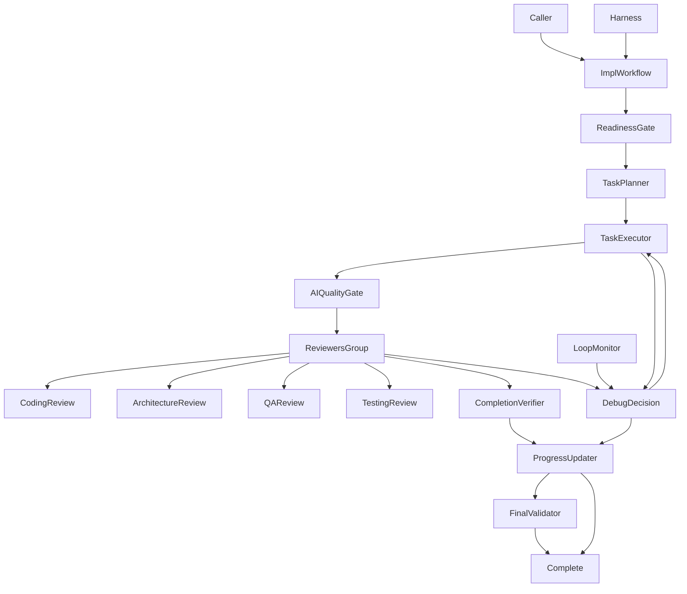
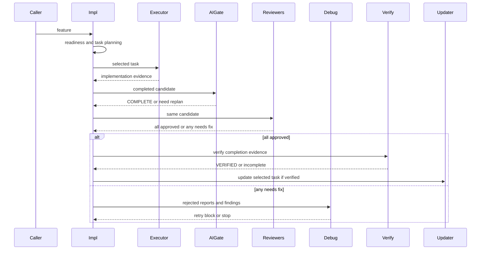
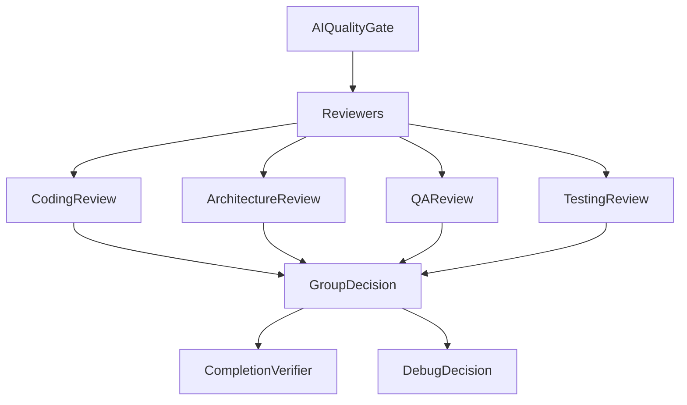
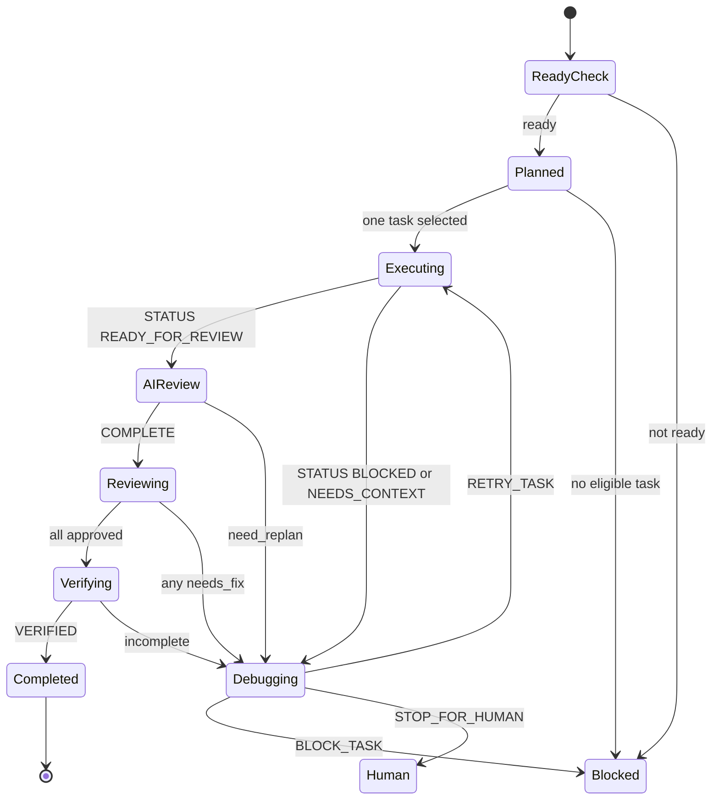

# Design Document

## Overview

`kiro-iterative-implementation-workflow` は、承認済み Kiro spec の implementation phase を TAKT workflow として実行可能にする。対象ユーザーは `kiro-impl` を使う実装者、reviewer、maintainer であり、1 回の workflow iteration で 1 つの eligible task だけを選択、実装、AI antipattern gate、並行複数観点 review、debug、completion verification、progress update へ進める。

この設計は既存 `kiro-impl` の one-task / progress update / loop monitor 方針を維持しつつ、単一 `review-task` を `reviewers.parallel` group に置き換える。TAKT built-in の `review-default` / `peer-review` にある `parallel:` reviewer pattern と reviewer persona / instruction / output contract を活用するが、security-specific reviewer は常時必須 gate に含めない。

### Goals

- `kiro-impl` が実装開始前に readiness と task annotation を確認する。
- 実装後、通常 review より前に AI antipattern gate を実行する。
- AI gate 通過後、coding / architecture / QA / testing reviewer を `parallel:` group として並行実行する。
- 全 reviewer が approved 相当の場合だけ completion verification へ進む。
- いずれかの reviewer が needs-fix / rejected 相当の場合は debug decision へ進む。
- completion verification が `VERIFIED` になるまで selected task の checkbox と implementation notes を更新しない。
- workflow/facet/contract drift を repository-local validation で検出する。

### Non-Goals

- requirements/design/tasks の生成または roadmap 更新。
- `kiro-spec-batch` の dependency wave orchestration。
- `kiro:*` public script surface、major-version migration、legacy shim の変更。
- PR monitoring、GitHub review comment 対応、CI gate の実行。
- security-specific reviewer の常時必須 gate 化。
- built-in `review-default` / `peer-review` をそのまま `workflow_call` すること。

## Boundary Commitments

### This Spec Owns

- `.takt/{en,ja}/workflows/kiro-impl.yaml` の implementation workflow order。
- selected task readiness、one-task planning、execution、AI quality gate、parallel reviewers、debug、completion verification、progress update の接続。
- `reviewers.parallel` child steps の mandatory set: coding、architecture、QA、testing。
- selected task に限定した checkbox / blocker / implementation notes 更新規約。
- AI gate evidence と reviewer reports を completion verification に渡す証跡契約。
- `kiro-iterative-implementation-workflow` 向け validator / test による workflow drift detection。

### Out of Boundary

- `.agents/skills/kiro-*` 上流 skill 本文の修正。
- Kiro spec generation workflow や status validation workflow の内部実装。
- requirements / design / tasks の artifact generation。
- OpenSpec / opsx workflow の完了判定。
- security / requirements reviewer を `kiro-impl` mandatory reviewer group に追加すること。
- built-in TAKT workflow 自体の改変。
- provider quality の評価。runtime smoke は deterministic wiring のみを扱う。

### Allowed Dependencies

- `kiro-shared-workflow-contracts` の artifact policy、lifecycle policy、debug / completion / validation contracts。
- `kiro-status-validation-workflows` の `ready_for_implementation` readiness / implementation validation signal。
- `kiro-spec-generation-workflows` が生成する `_Boundary:_`、`_Depends:_`、numeric requirement coverage。
- `.takt/{en,ja}/workflows/kiro-ai-quality-gate.yaml` reusable subworkflow。
- TAKT built-in reviewer assets: `coding-reviewer`、`architecture-reviewer`、`qa-reviewer`、`testing-reviewer`、`review-coding`、`review-arch`、`review-qa`、`review-test`、対応 output contracts。
- Node.js 22+ の repository-local validation script と `node:test`。

### Revalidation Triggers

- `kiro-ai-quality-gate.yaml` の return condition または report name が変わる。
- reviewer child step の condition vocabulary が `approved` / `needs_fix` から変わる。
- `kiro-review-verdict`、built-in `architecture-review`、`qa-review`、`testing-review` の machine fields が変わる。
- `tasks.md` annotation、checkbox、blocker / implementation notes 形式が変わる。
- `spec.json` readiness / approval semantics が変わる。
- TAKT `parallel:` group rule semantics または `loop_monitors` semantics が変わる。

## Architecture

### Existing Architecture Analysis

現在の `kiro-impl.yaml` は `plan-one-task -> execute-task -> ai-quality-gate -> review-task -> verify/debug -> update-progress -> validate-impl-final` の流れを持つ。AI antipattern gate、one-task selection、completion-before-checkbox-update、`loop_monitors.threshold` は既に現在の requirements と整合している。

主な gap は、AI gate 後の review が単一 `review-task` であり、architecture / QA / testing 観点が deterministic workflow gate として表現されていない点である。TAKT built-in には `review-default.yaml` の `reviewers.parallel` pattern があるため、Kiro-specific workflow 内に同じ形の reviewer group を定義し、selected task と AI gate evidence に合わせて adapter 化する。

### Architecture Pattern & Boundary Map

採用パターンは gated one-task implementation loop with parallel review fan-out。実装と validation evidence 収集は 1 task に閉じ、AI gate 通過後に複数 reviewer が同じ完了候補を並行に検査する。



Key decisions:

- `execute-task` の `STATUS READY_FOR_REVIEW` は `ai-quality-gate` へ進む。
- `ai-quality-gate` の `COMPLETE` は `reviewers` へ進む。`need_replan` は `debug-task`、`ABORT` は `ABORT` へ進む。
- `reviewers` は top-level step で、`parallel:` child steps として `coding-review`、`arch-review`、`qa-review`、`testing-review` を持つ。
- `reviewers` group rule は `all("approved")` で `verify-task-completion`、`any("needs_fix")` で `debug-task` へ進む。
- child reviewer は selected task、implementation result、AI gate reports、requirements/design/tasks evidence を読む。
- `security-reviewer` は built-in に存在するが mandatory child step には含めない。
- loop monitor は `execute-task -> ai-quality-gate -> reviewers -> debug-task` cycle と `execute-task -> debug-task` cycle を監視する。

### Technology Stack

| Layer | Choice / Version | Role in Feature | Notes |
|-------|------------------|-----------------|-------|
| Workflow runtime | TAKT workflow YAML | `kiro-impl` step order、`parallel:` reviewer group、`loop_monitors` | 既存 stack を継続 |
| Facets | TAKT facet Markdown | Kiro-specific instruction / policy / output contract | built-in facet 継承を優先 |
| Review assets | TAKT built-in reviewers | coding / architecture / QA / testing review persona と instruction | security は mandatory gate に含めない |
| Validation | Node.js 22+ / node:test | workflow/facet/contract drift detection | repository-local script pattern を継続 |

## File Structure Plan

### Directory Structure

```text
.takt/
├── en/
│   ├── workflows/
│   │   └── kiro-impl.yaml
│   └── facets/
│       ├── instructions/
│       │   ├── kiro-impl-plan-one-task.md
│       │   ├── kiro-impl-execute-task.md
│       │   ├── kiro-review-task.md
│       │   ├── kiro-review-architecture-task.md
│       │   ├── kiro-review-qa-task.md
│       │   ├── kiro-review-testing-task.md
│       │   ├── kiro-debug-task.md
│       │   ├── kiro-verify-task-completion.md
│       │   ├── kiro-impl-update-progress.md
│       │   └── kiro-validate-impl-final.md
│       └── output-contracts/
│           ├── kiro-implementation-result.md
│           └── kiro-review-verdict.md
├── ja/
│   └── 同じ basename 構造
scripts/
└── validate-kiro-iterative-implementation-workflow.mjs
tests/
└── kiro-iterative-implementation-workflow.test.mjs
```

### Modified Files

- `.takt/{en,ja}/workflows/kiro-impl.yaml` — `review-task` を `reviewers.parallel` group に置き換え、AI gate / reviewer / debug / completion routing と loop monitor cycle を更新する。
- `.takt/{en,ja}/facets/instructions/kiro-review-task.md` — coding review child step 用に selected task、AI gate evidence、validation evidence を明示する。
- `.takt/{en,ja}/facets/instructions/kiro-verify-task-completion.md` — AI gate report と 4 reviewer reports を required evidence として扱う。
- `.takt/{en,ja}/facets/instructions/kiro-debug-task.md` — rejected child review reports の viewpoint / report file / finding refs を debug input として読む。
- `scripts/validate-kiro-iterative-implementation-workflow.mjs` — `parallel:` child structure、all/any routing、security reviewer 非必須、loop monitor cycle、report references を検証する。
- `tests/kiro-iterative-implementation-workflow.test.mjs` — validator の fixture と regression tests を追加・更新する。

### Created Files

- `.takt/{en,ja}/facets/instructions/kiro-review-architecture-task.md` — built-in `review-arch` を Kiro selected task context に接続する adapter。
- `.takt/{en,ja}/facets/instructions/kiro-review-qa-task.md` — built-in `review-qa` を Kiro selected task context に接続する adapter。
- `.takt/{en,ja}/facets/instructions/kiro-review-testing-task.md` — built-in `review-test` を Kiro selected task context に接続する adapter。

## System Flows

### One Task Implementation Flow



### Reviewers Group Shape



### Task State Flow



## Requirements Traceability

| Requirement | Summary | Components | Interfaces | Flows |
|-------------|---------|------------|------------|-------|
| 1.1 | readiness と artifact state 確認 | KiroImplementationReadinessGate | Status signal, artifact policy | One Task |
| 1.2 | non-ready feature の停止 | KiroImplementationReadinessGate | Implementation result | Task State |
| 1.3 | task annotation 不足の blocker | KiroOneTaskPlanner | Task annotation policy | One Task |
| 1.4 | readiness 確認は read-only | KiroImplementationReadinessGate | Artifact policy | One Task |
| 2.1 | eligible task selection | KiroOneTaskPlanner | Planning report | One Task |
| 2.2 | `_Depends:_ none` の扱い | KiroOneTaskPlanner | Task annotation policy | One Task |
| 2.3 | 複数 eligible でも 1 task | KiroOneTaskPlanner | Planning report | One Task |
| 2.4 | eligible task 不在の停止 | KiroOneTaskPlanner, KiroDebugAdapterStep | Debug decision | Task State |
| 2.5 | batch orchestration 非依存 | KiroImplementationWorkflow | Boundary policy | One Task |
| 3.1 | boundary / dependency / coverage plan | KiroOneTaskPlanner | Planning report | One Task |
| 3.2 | change scope と validation plan | KiroOneTaskPlanner, KiroTaskExecutor | Implementation result | One Task |
| 3.3 | design boundary 矛盾の block | KiroOneTaskPlanner | Debug decision | Task State |
| 3.4 | unverified item の分離 | KiroTaskExecutor, KiroCompletionVerifier | Evidence contract | One Task |
| 4.1 | selected task の code edit | KiroTaskExecutor | Implementation result | One Task |
| 4.2 | validation evidence collection | KiroTaskExecutor | Implementation result | One Task |
| 4.3 | validation failure で checkbox 更新しない | KiroTaskExecutor, KiroTaskProgressUpdater | Progress policy | Task State |
| 4.4 | selected task 限定更新 | KiroTaskProgressUpdater | Artifact policy | One Task |
| 5.1 | AI gate before review | KiroAIQualityGateCall | AI gate reports | One Task |
| 5.2 | AI gate failure / ambiguity 分岐 | KiroAIQualityGateCall, KiroDebugAdapterStep | need_replan, ABORT | Task State |
| 5.3 | debug decision | KiroDebugAdapterStep | NEXT_ACTION | Task State |
| 5.4 | stop for human | KiroDebugAdapterStep, KiroTaskProgressUpdater | Debug decision | Task State |
| 5.5 | loop monitor source of truth | KiroLoopMonitorConfig | loop_monitors | Task State |
| 5.6 | nonproductive loop stop | KiroLoopMonitorConfig, KiroTaskProgressUpdater | loop_monitors | Task State |
| 6.1 | completion verification after evidence | KiroCompletionVerifier | Completion report | One Task |
| 6.2 | incomplete で checkbox 更新しない | KiroCompletionVerifier, KiroTaskProgressUpdater | Progress policy | Task State |
| 6.3 | verified 後の task update | KiroTaskProgressUpdater | Artifact operation | One Task |
| 6.4 | machine field と summary 分離 | KiroParallelReviewersGroup, KiroDebugAdapterStep, KiroCompletionVerifier | Verdict fields | One Task |
| 6.5 | final implementation validation | KiroFinalImplValidator | DECISION | One Task |
| 7.1 | step/facet/contract validation | IterativeImplementationValidationHarness | Validation script | Harness |
| 7.2 | gate order validation | IterativeImplementationValidationHarness | Validation script | Harness |
| 7.3 | boundary violation detection | IterativeImplementationValidationHarness | Validation script | Harness |
| 7.4 | PR/CI/OpenSpec 非依存 | IterativeImplementationValidationHarness | Validation script | Harness |
| 7.5 | built-in facet inheritance | IterativeImplementationValidationHarness | Validation script | Harness |
| 7.6 | loop monitor validation | IterativeImplementationValidationHarness | Validation script | Harness |
| 8.1 | Kiro skill frontmatter | KiroImplementationWorkflow | Facet frontmatter | Harness |
| 8.2 | Kiro algorithm mapping | KiroImplementationWorkflow | Workflow order | One Task |
| 8.3 | adapter step connection | KiroImplementationWorkflow | Internal steps | One Task |
| 8.4 | no skill body copy | KiroImplementationWorkflow | Facets | Harness |
| 8.5 | stale standalone adapter removal | IterativeImplementationValidationHarness | Validation script | Harness |
| 9.1 | `parallel:` reviewer group | KiroParallelReviewersGroup | TAKT parallel step | Reviewers |
| 9.2 | coding review | KiroParallelReviewersGroup | coding review report | Reviewers |
| 9.3 | architecture review | KiroParallelReviewersGroup | architecture review report | Reviewers |
| 9.4 | QA review | KiroParallelReviewersGroup | QA review report | Reviewers |
| 9.5 | testing review | KiroParallelReviewersGroup | testing review report | Reviewers |
| 9.6 | all approved to completion | KiroParallelReviewersGroup | all rule | Reviewers |
| 9.7 | any needs fix to debug | KiroParallelReviewersGroup, KiroDebugAdapterStep | any rule | Reviewers |
| 9.8 | security reviewer not mandatory | KiroParallelReviewersGroup, IterativeImplementationValidationHarness | Boundary validation | Harness |
| 9.9 | distinguishable review evidence | KiroParallelReviewersGroup, KiroCompletionVerifier | Report names | Reviewers |

## Components and Interfaces

| Component | Domain/Layer | Intent | Req Coverage | Key Dependencies | Contracts |
|-----------|--------------|--------|--------------|------------------|-----------|
| KiroImplementationWorkflow | Workflow | main workflow order and routing | 2.3, 5.1, 6.5, 8.2, 8.3 | TAKT YAML P0 | Service |
| KiroImplementationReadinessGate | Workflow | readiness before edit | 1.1, 1.2, 1.4 | status signal P0 | State |
| KiroOneTaskPlanner | Workflow | select exactly one task | 1.3, 2.1, 2.2, 2.3, 3.1, 3.3 | tasks.md P0 | Service |
| KiroTaskExecutor | Workflow | implement selected task and collect evidence | 3.2, 3.4, 4.1, 4.2, 4.3 | repository files P0 | Batch |
| KiroAIQualityGateCall | Workflow call | reusable AI antipattern gate | 5.1, 5.2 | `kiro-ai-quality-gate.yaml` P0 | Service |
| KiroParallelReviewersGroup | Workflow | parallel coding / arch / QA / testing review | 6.4, 9.1-9.9 | TAKT built-ins P0 | Batch |
| KiroDebugAdapterStep | Workflow | root cause and next action | 2.4, 5.3, 5.4, 9.7 | debug skill P0 | Service |
| KiroCompletionVerifier | Workflow | completion evidence gate | 3.4, 6.1, 6.2, 9.9 | completion contract P0 | Service |
| KiroTaskProgressUpdater | Workflow | selected task progress update | 4.3, 4.4, 5.4, 6.3 | tasks.md P0 | State |
| KiroLoopMonitorConfig | Runtime config | retry health source of truth | 5.5, 5.6, 7.6 | TAKT runtime P0 | Service |
| IterativeImplementationValidationHarness | Validation | detect workflow drift | 7.1-7.6, 8.5, 9.8 | Node.js P0 | Batch |

### Workflow Layer

#### KiroImplementationWorkflow

| Field | Detail |
|-------|--------|
| Intent | `kiro-impl` の top-level step order と rule routing を制御する |
| Requirements | 2.3, 5.1, 6.5, 8.2, 8.3 |

**Responsibilities & Constraints**

- `plan-one-task -> execute-task -> ai-quality-gate -> reviewers -> verify-task-completion -> update-progress -> validate-impl-final` を main success path とする。
- `execute-task` failure、AI gate `need_replan`、reviewers `any("needs_fix")`、completion incomplete は `debug-task` へ送る。
- `kiro-debug`、`kiro-verify-completion`、`kiro-validate-impl` を standalone workflow ではなく adapter step として接続する。

**Contracts**: Service [x] / API [ ] / Event [ ] / Batch [ ] / State [ ]

##### Service Interface

```typescript
interface KiroImplementationWorkflow {
  run(input: KiroImplInput): KiroImplResult;
}
```

- Preconditions: feature name が解決でき、required artifacts が存在する。
- Postconditions: selected task が verified された場合だけ progress update が実行される。
- Invariants: selected task は 1 iteration に最大 1 件。

#### KiroParallelReviewersGroup

| Field | Detail |
|-------|--------|
| Intent | AI gate 通過後の完了候補を複数観点で並行 review する |
| Requirements | 6.4, 9.1, 9.2, 9.3, 9.4, 9.5, 9.6, 9.7, 9.8, 9.9 |

**Responsibilities & Constraints**

- top-level step name は `reviewers` とし、`parallel:` child steps を持つ。
- child steps は `coding-review`、`arch-review`、`qa-review`、`testing-review` の 4 つを mandatory とする。
- child step rules は `approved` / `needs_fix` を返し、group-level rules は `all("approved")` と `any("needs_fix")` を使う。
- `security-reviewer` と `requirements-reviewer` は mandatory child step に含めない。
- 各 report は review kind が識別できる filename と evidence fields を持つ。

**Dependencies**

- Inbound: `KiroAIQualityGateCall` — AI gate reports and complete candidate (P0)
- Outbound: built-in reviewer personas and instructions — review role behavior (P0)
- Outbound: `KiroDebugAdapterStep` — needs-fix reports (P0)
- Outbound: `KiroCompletionVerifier` — approved reports (P0)

**Contracts**: Service [ ] / API [ ] / Event [ ] / Batch [x] / State [ ]

##### Batch / Job Contract

- Trigger: `ai-quality-gate` returns `COMPLETE`.
- Input / validation: selected task, implementation result, validation evidence, AI gate reports, requirements/design/tasks refs.
- Output / destination:
  - `kiro-task-coding-review.md`
  - `kiro-task-architecture-review.md`
  - `kiro-task-qa-review.md`
  - `kiro-task-testing-review.md`
- Idempotency & recovery: reviewer reports are evidence only; code edits are not allowed in reviewer child steps.

#### KiroAIQualityGateCall

| Field | Detail |
|-------|--------|
| Intent | 通常 review 前に AI antipattern findings を検出または是正する |
| Requirements | 5.1, 5.2, 6.1, 7.2 |

**Responsibilities & Constraints**

- `workflow_call` で `./kiro-ai-quality-gate.yaml` を呼ぶ。
- `fix_instruction: kiro-ai-antipattern-fix-implementation` を渡す。
- `COMPLETE` は `reviewers` へ、`need_replan` は `debug-task` へ、`ABORT` は `ABORT` へ routing する。

**Contracts**: Service [x] / API [ ] / Event [ ] / Batch [ ] / State [ ]

#### KiroDebugAdapterStep

| Field | Detail |
|-------|--------|
| Intent | failure evidence と needs-fix reviewer reports から root cause と next action を決める |
| Requirements | 2.4, 3.3, 5.3, 5.4, 9.7 |

**Responsibilities & Constraints**

- `NEXT_ACTION: RETRY_TASK | BLOCK_TASK | STOP_FOR_HUMAN` を primary machine field とする。
- needs-fix child reports の viewpoint、report file、finding refs、task / requirement / design refs を読む。
- retry 回数や loop health は管理しない。

**Contracts**: Service [x] / API [ ] / Event [ ] / Batch [ ] / State [ ]

#### KiroCompletionVerifier

| Field | Detail |
|-------|--------|
| Intent | selected task の checkbox 更新前に required evidence が揃っているか検証する |
| Requirements | 3.4, 6.1, 6.2, 6.4, 9.9 |

**Responsibilities & Constraints**

- implementation result、validation evidence、AI gate report、4 reviewer reports、manual verification requirement を照合する。
- `STATUS: VERIFIED | NOT_VERIFIED | MANUAL_VERIFY_REQUIRED` を primary field とする。
- missing / stale / cross-run evidence を complete 根拠にしない。

**Contracts**: Service [x] / API [ ] / Event [ ] / Batch [ ] / State [ ]

#### KiroLoopMonitorConfig

| Field | Detail |
|-------|--------|
| Intent | retry health を TAKT runtime の `loop_monitors.threshold` に一本化する |
| Requirements | 5.5, 5.6, 7.6 |

**Responsibilities & Constraints**

- cycle `execute-task -> debug-task` を監視する。
- cycle `execute-task -> ai-quality-gate -> reviewers -> debug-task` を監視する。
- facet、frontmatter、validator に独自 retry counter、max-attempt、loop-health source of truth を置かない。

**Contracts**: Service [x] / API [ ] / Event [ ] / Batch [ ] / State [ ]

### Validation Layer

#### IterativeImplementationValidationHarness

| Field | Detail |
|-------|--------|
| Intent | workflow / facet / contract drift を repository-local test で検出する |
| Requirements | 7.1, 7.2, 7.3, 7.4, 7.5, 7.6, 8.5, 9.8 |

**Responsibilities & Constraints**

- `kiro-impl.yaml` に `ai-quality-gate` と `reviewers.parallel` がこの順で存在することを検証する。
- child reviewer set が coding / architecture / QA / testing であることを検証する。
- `security-reviewer` が mandatory child step に含まれないことを検証する。
- reviewer group rules が `all("approved") -> verify-task-completion` と `any("needs_fix") -> debug-task` を持つことを検証する。
- loop monitor cycle が `reviewers` を含むことを検証する。
- en/ja language pair と report names の drift を検出する。

**Contracts**: Service [ ] / API [ ] / Event [ ] / Batch [x] / State [ ]

##### Batch / Job Contract

- Trigger: `npm run validate:kiro-iterative-implementation-workflow` and `npm run test:kiro-iterative-implementation-workflow`.
- Input / validation: `.takt/{en,ja}` workflow/facet files, package scripts, validator fixtures.
- Output / destination: pass/fail and actionable failure strings.
- Idempotency & recovery: read-only validation.

## Error Handling

- Readiness failure returns `STATUS BLOCKED` and does not edit source files or `tasks.md`.
- AI quality gate ambiguity returns `need_replan` and routes to `debug-task`.
- Reviewer `needs_fix` returns to `debug-task` with review kind and finding source.
- Completion verification failure returns `STATUS NOT_VERIFIED` or `STATUS MANUAL_VERIFY_REQUIRED` and does not update checkbox.
- Nonproductive retry loops route to blocker / human stop via `loop_monitors.threshold`.

## Testing Strategy

### Unit Tests

- Validator rejects `kiro-impl.yaml` when `ai-quality-gate` routes directly to `verify-task-completion`.
- Validator rejects missing `reviewers.parallel`.
- Validator rejects missing `coding-review`、`arch-review`、`qa-review`、or `testing-review` child step.
- Validator rejects `security-reviewer` as mandatory child step.
- Validator rejects custom retry counters outside `loop_monitors.threshold`.

### Integration Tests

- Current repository satisfies `validate:kiro-iterative-implementation-workflow`.
- Fixture workflow with `all("approved")` missing fails validation.
- Fixture workflow with `any("needs_fix")` missing fails validation.
- Fixture completion verifier that ignores AI gate or reviewer report evidence fails validation.
- Fixture debug adapter that does not read child review reports fails validation.

### Runtime Smoke

- Optional deterministic smoke uses mock provider output to confirm `execute-task -> ai-quality-gate -> reviewers -> verify-task-completion` wiring.
- Smoke does not evaluate provider review quality and must remain opt-in.

## Integration and Validation Notes

- This design uses light discovery because it extends existing TAKT workflow assets and does not introduce external dependencies.
- The design adopts built-in reviewer personas / instructions but builds Kiro-specific adapter steps to keep selected task, AI gate evidence, and progress update semantics local to `kiro-impl`.
- The implementation must keep `.takt/en` and `.takt/ja` basename parity.
- Public `kiro:*` command surface remains unchanged.

## Open Questions / Risks

- Child reviewer vocabulary should be normalized before implementation: either all child reports use `approved` / `needs_fix`, or the validator must map `VERDICT APPROVED` / `VERDICT REJECTED` explicitly.
- Report filenames should be finalized before task generation so completion verification and debug adapter can cite stable paths.
- Runtime smoke should remain deterministic and opt-in to avoid accidentally invoking live provider review in default CI.
