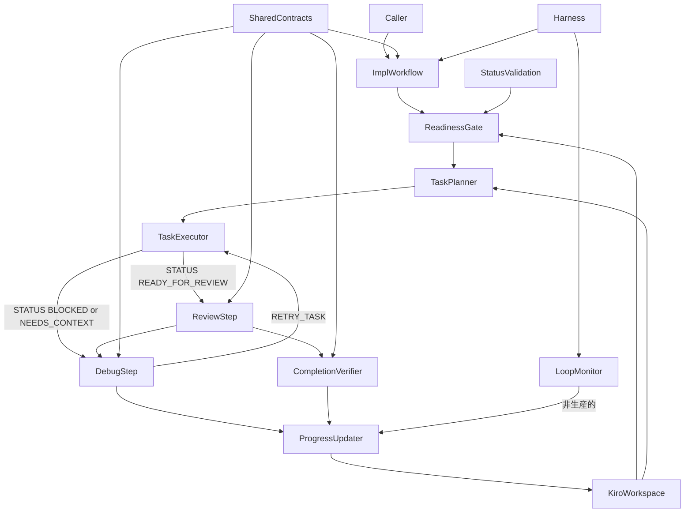
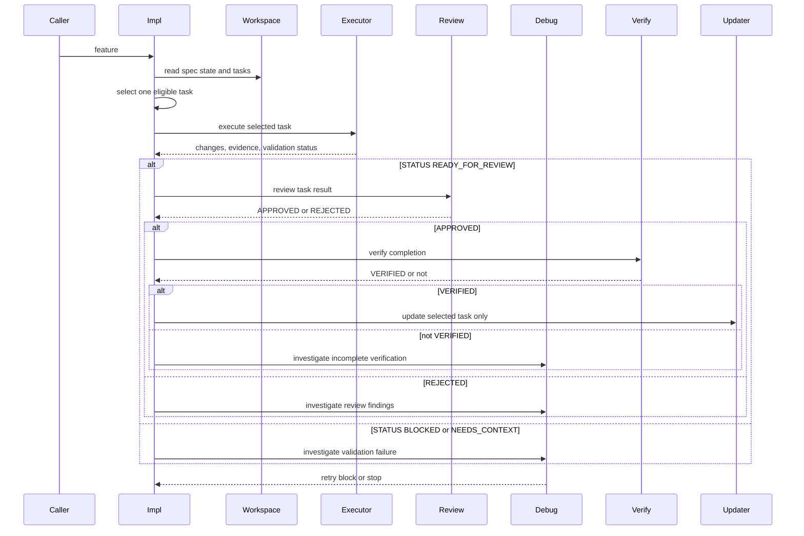
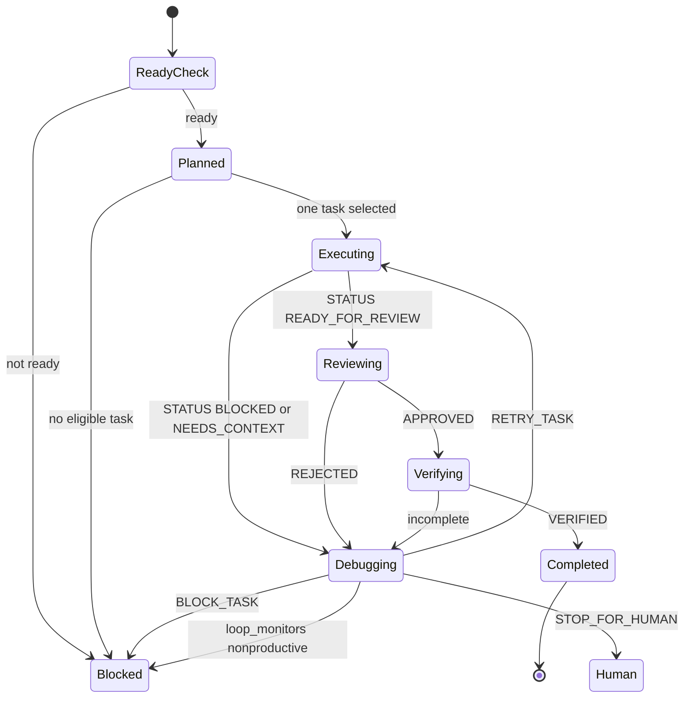

# Design Document

## Overview

`kiro-iterative-implementation-workflow` は、Kiro-compatible spec の implementation phase を TAKT workflow として実行可能にします。対象ユーザーは `kiro-impl` を使う実装者、reviewer、maintainer です。承認済み `tasks.md` から 1 task を選び、境界を固定して実装し、internal review/debug/completion verification を通過した場合だけ進捗 artifact を更新します。

この spec は code edit を伴う最後の workflow slice です。`kiro-shared-workflow-contracts` の review/debug/completion output contract、artifact operation policy、lifecycle policy を参照し、`kiro-status-validation-workflows` の readiness/validation signal と `kiro-spec-generation-workflows` が生成した task annotation を入力にします。spec generation、batch orchestration、public surface migration は取り込みません。

### Goals

- `kiro-impl` が実装開始前に readiness と task annotation を確認できる
- 1 iteration で 1 task のみを実行し、boundary/dependency/validation plan を固定できる
- `kiro-review`、`kiro-debug`、`kiro-verify-completion` を `kiro-impl.yaml` 内の internal adapter step として接続できる
- implementation/debug/review の再実行ループは TAKT runtime の `loop_monitors` で監視し、独自 retry 管理を持たない
- completion verification の `STATUS` が `VERIFIED` になるまで checkbox と実装メモを更新しない
- workflow/facet/contract drift を repository-local validation で検出できる

### Non-Goals

- requirements/design/tasks の生成または修正
- `kiro-discovery`、`kiro-spec-batch`、cross-spec review、roadmap 更新
- `kiro:*` npm script surface、major-version migration、legacy shim
- PR monitoring、GitHub review comment 対応、CI gate の実行
- OpenSpec artifact と `.kiro/*` artifact の統合

## Boundary Commitments

### This Spec Owns

- `kiro-impl` の planning、one-task execution、review/debug/verify loop、`loop_monitors` による loop health 判定、progress update workflow
- internal `kiro-review`、`kiro-debug`、`kiro-verify-completion` の workflow/facet wiring
- task boundary、dependency、validation plan、feature flag/manual verification 前提を implementation plan に出す規約
- selected task の checkbox、blocker notes、implementation notes、verification evidence の更新タイミング
- implementation workflow の validation harness

### Out of Boundary

- `kiro-spec-init`、requirements/design/tasks/quick の artifact generation
- `kiro-discovery` と `kiro-spec-batch` の roadmap/batch orchestration
- `kiro-spec-status` と `kiro-validate-*` の read-only validation full behavior
- `kiro-workflow-surface` の public command migration
- repo-specific PR monitoring、CI failure triage、GitHub review thread resolution

### Allowed Dependencies

- `kiro-shared-workflow-contracts` の `kiro-review-verdict`、`kiro-debug-decision`、`kiro-completion-verification`、`kiro-validation-result`、`kiro-artifact-operations`、`kiro-spec-lifecycle`
- `kiro-status-validation-workflows` の readiness/status/implementation validation verdict
- `kiro-spec-generation-workflows` が生成する `tasks.md` の `_Boundary:_`、`_Depends:_`、numeric requirement coverage、observable completion detail
- 既存 `.takt/{en,ja}/workflows/cc-sdd-impl.yaml` と対応 facet の配置・step 構成パターン、`loop_monitors` による runtime loop 監視
- repository-local Node.js 22+ validation script と test runner

### Revalidation Triggers

- shared review/debug/completion contract の verdict enum、field name、tag の変更
- `tasks.md` task annotation、checkbox、blocker/implementation notes の形式変更
- `spec.json` ready state または approval semantics の変更
- `kiro-status-validation-workflows` の readiness/verdict 語彙変更
- implementation workflow が複数 task batch や downstream orchestration を再導入するとき

## Architecture

### Existing Architecture Analysis

既存の `cc-sdd-impl` workflow は `plan`、`implement`、`ai_review`、`ai_fix`、`supervise` の流れを持ち、未完了 task をバッチ化して実装し、実装 step 内で `tasks.md` の checkbox を更新します。Kiro 版ではこの shape を参考にしますが、batch 実装ではなく one-task iteration に限定し、checkbox 更新を completion verification の後に移動します。

上流 spec では、shared contract が review/debug verdict と completion STATUS を定義し、status/validation workflow が read-only readiness を返し、spec generation workflow が task annotation を生成します。本 spec はこれらの出力を消費する実行 workflow です。

### Architecture Pattern & Boundary Map

Selected pattern: gated one-task implementation loop。planning、execution、review、debug、completion verification、progress update を明確に分け、progress update は completion gate の後だけ許可します。



Key decisions:

- `TaskPlanner` は実行可能な 1 task だけを選ぶ。複数 task の batch は扱わない。
- `TaskExecutor` は code edit と validation evidence 収集を行い、`STATUS: READY_FOR_REVIEW | BLOCKED | NEEDS_CONTEXT` を primary machine field として返すが、checkbox は更新しない。
- `TaskExecutor` の `STATUS: BLOCKED` または `STATUS: NEEDS_CONTEXT` は review を経由せず、直接 `kiro-debug` adapter step に渡す。
- `kiro-review`、`kiro-debug`、`kiro-verify-completion`、`kiro-validate-impl` は別 workflow を起動せず、`kiro-impl.yaml` 内の thin adapter step として接続する。
- `kiro-review` adapter は `VERDICT: APPROVED | REJECTED`、`kiro-debug` adapter は `NEXT_ACTION: RETRY_TASK | BLOCK_TASK | STOP_FOR_HUMAN`、`kiro-validate-impl` adapter は `DECISION: GO | NO-GO | MANUAL_VERIFY_REQUIRED` を primary machine field として使う。
- `kiro-debug` adapter は root cause と次 action を返すが、retry 回数や loop health は管理しない。
- `KiroImplementationWorkflow` は `loop_monitors.threshold` を定義し、`execute-task` / `debug-task` と `execute-task` / `review-task` / `debug-task` の再実行上限を runtime だけで管理する。
- `ProgressUpdater` は completion `STATUS` が `VERIFIED` のときだけ selected task に限定して `tasks.md` を更新する。
- validation harness は workflow/facet の順序、Kiro skill adapter reference、shared contract reference、`loop_monitors.threshold` presence、out-of-boundary reference を検証する。
- Kiro-specific implementation facets は shared `BuiltinFacetInheritancePolicy` に従い、`node_modules/takt/builtins/{lang}/facets` の coding/testing/review/debug 相当の built-in facet を継承できる場合は差分だけを書く。
- Kiro-specific implementation instruction facet は shared `KiroSkillInheritancePolicy` に従い、Kiro skill section を `extends_skill` / `extends_skill_section` で参照し、Kiro skill 本文をコピーしない。

### Technology Stack

| Layer | Choice / Version | Role in Feature | Notes |
|-------|------------------|-----------------|-------|
| Workflow runtime | TAKT workflow YAML | `kiro-impl` と skill adapter step orchestration | `.takt/{en,ja}/workflows/` に配置 |
| Loop monitoring | TAKT `loop_monitors` | implementation/debug/review の再実行ループを runtime で監視する | 独自 retry counter / 独自 max-attempt は置かない |
| Facets | TAKT facet Markdown | planning、execution、review/debug/verify、progress update の instruction/policy | built-in facet 継承を優先し、`.takt/{en,ja}/facets/` に配置 |
| Built-in facet inheritance | TAKT builtins facet Markdown | coding/testing/review 系の親 facet と差分記述 | shared `BuiltinFacetInheritancePolicy` を参照 |
| Kiro skill adapter | TAKT instruction facet | `kiro-impl` / `kiro-review` / `kiro-debug` / `kiro-verify-completion` / `kiro-validate-impl` skill section の写像 | `extends_skill` / `extends_skill_section` を使う |
| Shared contracts | Kiro shared contract facets | review/debug/completion/validation verdict と artifact policy | 上流 spec の成果物を参照 |
| Spec workspace | `.kiro/specs/<feature>` | `tasks.md` と `spec.json` の input/progress artifact | roadmap は read-only input にも含めない |
| Validation | Node.js 22+ script/test | workflow order、facet reference、boundary drift を検出 | implementation behavior の完全実行は対象外 |

## File Structure Plan

### Directory Structure

```text
.
├── .takt/
│   ├── en/
│   │   ├── workflows/
│   │   │   └── kiro-impl.yaml
│   │   └── facets/
│   │       ├── instructions/
│   │       │   ├── kiro-impl-plan-one-task.md
│   │       │   ├── kiro-impl-execute-task.md
│   │       │   ├── kiro-impl-update-progress.md
│   │       │   ├── kiro-review-task.md
│   │       │   ├── kiro-debug-task.md
│   │       │   ├── kiro-verify-task-completion.md
│   │       │   └── kiro-validate-impl-final.md
│   │       ├── output-contracts/
│   │       │   └── kiro-implementation-result.md
│   │       └── policies/
│   │           └── kiro-impl-task-progress.md
│   ├── ja/
│   │   ├── workflows/
│   │   │   └── kiro-impl.yaml
│   │   └── facets/
│   │       ├── instructions/
│   │       │   ├── kiro-impl-plan-one-task.md
│   │       │   ├── kiro-impl-execute-task.md
│   │       │   ├── kiro-impl-update-progress.md
│   │       │   ├── kiro-review-task.md
│   │       │   ├── kiro-debug-task.md
│   │       │   ├── kiro-verify-task-completion.md
│   │       │   └── kiro-validate-impl-final.md
│   │       ├── output-contracts/
│   │       │   └── kiro-implementation-result.md
│   │       └── policies/
│   │           └── kiro-impl-task-progress.md
├── scripts/
│   └── validate-kiro-iterative-implementation-workflow.mjs
└── tests/
    └── kiro-iterative-implementation-workflow.test.mjs
```

### Created Files

- `.takt/{en,ja}/workflows/kiro-impl.yaml` — readiness gate、one-task planning、execution、`kiro-review` / `kiro-debug` / `kiro-verify-completion` / `kiro-validate-impl` adapter step、progress update を接続する main workflow。
- `.takt/{en,ja}/facets/instructions/kiro-impl-plan-one-task.md` — feature readiness、task annotation、eligible task selection、implementation plan 出力の手順。
- `.takt/{en,ja}/facets/instructions/kiro-impl-execute-task.md` — selected task の scope-limited code edit、test update、validation evidence collection の手順。
- `.takt/{en,ja}/facets/instructions/kiro-impl-update-progress.md` — completion 後の selected task checkbox、blocker、implementation notes 更新手順。
- `.takt/{en,ja}/facets/instructions/kiro-review-task.md` — task-local review verdict 作成手順。
- `.takt/{en,ja}/facets/instructions/kiro-debug-task.md` — root-cause-first debug decision 作成手順。
- `.takt/{en,ja}/facets/instructions/kiro-verify-task-completion.md` — completion verification evidence と remaining work の判定手順。
- `.takt/{en,ja}/facets/instructions/kiro-validate-impl-final.md` — feature-level final validation の `DECISION` を progress completion 後に確認する手順。
- `.takt/{en,ja}/facets/output-contracts/kiro-implementation-result.md` — implementer `STATUS: READY_FOR_REVIEW | BLOCKED | NEEDS_CONTEXT`、changed files、validation evidence、missing context を返す execution result contract。
- `.takt/{en,ja}/facets/policies/kiro-impl-task-progress.md` — checkbox 更新前の completion gate、selected task 限定更新、blocker/notes 形式の policy。
- `scripts/validate-kiro-iterative-implementation-workflow.mjs` — workflow/facet references、shared contract reference、one-task gate order、boundary exclusions を検証する script。
- `tests/kiro-iterative-implementation-workflow.test.mjs` — validation script を repository-local test runner から実行する regression test。

### Modified Files

- `package.json` — public `kiro:*` surface ではなく repository-local validation wiring として `validate:kiro-iterative-implementation-workflow` と `test:kiro-iterative-implementation-workflow` を追加する。

### Component to File Mapping

- `KiroImplementationWorkflow` — `.takt/{en,ja}/workflows/kiro-impl.yaml`
- `KiroImplementationReadinessGate` — `.takt/{en,ja}/workflows/kiro-impl.yaml`、`.takt/{en,ja}/facets/instructions/kiro-impl-plan-one-task.md`
- `KiroOneTaskPlanner` — `.takt/{en,ja}/facets/instructions/kiro-impl-plan-one-task.md`
- `KiroTaskExecutor` — `.takt/{en,ja}/facets/instructions/kiro-impl-execute-task.md`
- `KiroLoopMonitorConfig` — `.takt/{en,ja}/workflows/kiro-impl.yaml` の `loop_monitors.threshold`
- `KiroReviewAdapterStep` — `.takt/{en,ja}/workflows/kiro-impl.yaml`、`.takt/{en,ja}/facets/instructions/kiro-review-task.md`
- `KiroDebugAdapterStep` — `.takt/{en,ja}/workflows/kiro-impl.yaml`、`.takt/{en,ja}/facets/instructions/kiro-debug-task.md`
- `KiroCompletionVerifier` — `.takt/{en,ja}/workflows/kiro-impl.yaml`、`.takt/{en,ja}/facets/instructions/kiro-verify-task-completion.md`
- `KiroFinalImplValidator` — `.takt/{en,ja}/workflows/kiro-impl.yaml`、`.takt/{en,ja}/facets/instructions/kiro-validate-impl-final.md`
- `KiroTaskProgressUpdater` — `.takt/{en,ja}/facets/instructions/kiro-impl-update-progress.md`、`.takt/{en,ja}/facets/policies/kiro-impl-task-progress.md`
- `IterativeImplementationValidationHarness` — `scripts/validate-kiro-iterative-implementation-workflow.mjs`、`tests/kiro-iterative-implementation-workflow.test.mjs`

## System Flows

### One Task Implementation Flow



Review が `REJECTED` または validation が失敗した場合、`Debug` が `NEXT_ACTION: RETRY_TASK | BLOCK_TASK | STOP_FOR_HUMAN` を返します。`RETRY_TASK` は再実行候補を示すだけで、retry 回数や loop health は `kiro-impl.yaml` の `loop_monitors.threshold` が判定します。`Updater` は `Verify` が complete state を返した場合、または `loop_monitors` が停止・blocker 記録へ分岐した場合だけ実行されます。

### Task State Flow



## Requirements Traceability

| Requirement | Summary | Components | Interfaces | Flows |
|-------------|---------|------------|------------|-------|
| 1.1 | readiness と artifact state 確認 | KiroImplementationReadinessGate | Status contract, Artifact policy | One Task Implementation |
| 1.2 | implementation-ready でない feature の停止 | KiroImplementationReadinessGate | Validation result contract | Task State |
| 1.3 | task annotation 不足の blocker | KiroOneTaskPlanner | Task annotation policy | One Task Implementation |
| 1.4 | readiness 確認の read-only 境界 | KiroImplementationReadinessGate | Artifact policy | One Task Implementation |
| 2.1 | eligible task selection | KiroOneTaskPlanner | Task plan output | One Task Implementation |
| 2.2 | one-task iteration | KiroOneTaskPlanner, KiroImplementationWorkflow | Workflow rules | Task State |
| 2.3 | eligible task 不在の停止 | KiroOneTaskPlanner, KiroDebugAdapterStep | Debug decision contract | Task State |
| 2.4 | batch orchestration 非依存 | KiroImplementationWorkflow | Boundary policy | One Task Implementation |
| 3.1 | boundary/dependency/coverage plan | KiroOneTaskPlanner | Implementation plan report | One Task Implementation |
| 3.2 | change scope と validation plan | KiroTaskExecutor | Execution report | One Task Implementation |
| 3.3 | design boundary 矛盾の block | KiroOneTaskPlanner, KiroDebugAdapterStep | Debug decision contract | Task State |
| 3.4 | unverified item の分離 | KiroTaskExecutor, KiroCompletionVerifier | Evidence contract | One Task Implementation |
| 4.1 | selected task の code edit | KiroTaskExecutor | Service workflow | One Task Implementation |
| 4.2 | validation evidence collection | KiroTaskExecutor | Implementation result contract | One Task Implementation |
| 4.3 | validation failure で checkbox 更新しない | KiroTaskExecutor, KiroTaskProgressUpdater | Progress policy | Task State |
| 4.4 | selected task 限定更新 | KiroTaskProgressUpdater | Artifact policy | One Task Implementation |
| 5.1 | review verdict | KiroReviewAdapterStep | Kiro review field | One Task Implementation |
| 5.2 | actionable findings mapping | KiroReviewAdapterStep | Kiro review field | One Task Implementation |
| 5.3 | debug decision と runtime loop monitoring | KiroDebugAdapterStep, KiroLoopMonitorConfig | Kiro debug field, loop_monitors | Task State |
| 5.4 | stop for human の blocker | KiroDebugAdapterStep, KiroTaskProgressUpdater | Debug decision, Progress policy | Task State |
| 5.5 | 再実行ループを `loop_monitors` で監視 | KiroImplementationWorkflow, KiroLoopMonitorConfig | loop_monitors | Task State |
| 5.6 | loop monitor threshold 到達時の停止分岐 | KiroLoopMonitorConfig, KiroTaskProgressUpdater | loop_monitors, Progress policy | Task State |
| 6.1 | completion verification | KiroCompletionVerifier | Completion verification contract | One Task Implementation |
| 6.2 | incomplete で checkbox 更新しない | KiroCompletionVerifier, KiroTaskProgressUpdater | Progress policy | Task State |
| 6.3 | complete 後の task progress update | KiroTaskProgressUpdater | Artifact operation policy | One Task Implementation |
| 6.4 | machine field と summary 分離 | KiroReviewAdapterStep, KiroDebugAdapterStep, KiroCompletionVerifier | Kiro skill fields, shared supplement | One Task Implementation |
| 7.1 | workflow/facet/contract reference validation | IterativeImplementationValidationHarness | Validation script | Harness validation |
| 7.2 | gate order と loop monitor validation | IterativeImplementationValidationHarness | Validation script | Harness validation |
| 7.3 | boundary violation detection | IterativeImplementationValidationHarness | Validation script | Harness validation |
| 7.4 | PR/CI/OpenSpec 非依存 | IterativeImplementationValidationHarness | Validation scope | Harness validation |
| 7.5 | built-in facet inheritance validation | IterativeImplementationValidationHarness | Validation script | Harness validation |
| 7.6 | loop monitor と独自 retry 管理禁止の検出 | IterativeImplementationValidationHarness | Validation script | Harness validation |

## Components and Interfaces

| Component | Domain/Layer | Intent | Req Coverage | Key Dependencies | Contracts |
|-----------|--------------|--------|--------------|------------------|-----------|
| KiroImplementationWorkflow | Workflow | implementation loop 全体の step、分岐、`loop_monitors` を制御する | 2.2, 2.4, 5.5, 5.6 | shared contracts P0, loop_monitors P0 | Service |
| KiroImplementationReadinessGate | Workflow | feature と artifact が実装可能か確認する | 1.1, 1.2, 1.4 | status validation P0, artifact policy P0 | Service, State |
| KiroOneTaskPlanner | Workflow | eligible な 1 task と execution plan を決める | 1.3, 2.1, 2.2, 2.3, 3.1, 3.3 | tasks.md P0, design.md P0 | Service, State |
| KiroTaskExecutor | Workflow | selected task の実装と evidence 収集を行い implementer `STATUS` を返す | 3.2, 3.4, 4.1, 4.2, 4.3, 6.4, 8.2 | validation plan P0 | Service, Batch |
| KiroLoopMonitorConfig | Workflow | runtime `loop_monitors.threshold` で再実行ループの上限を管理する | 5.3, 5.4, 5.5, 5.6, 7.2 | TAKT loop_monitors P0 | Service |
| KiroReviewAdapterStep | Workflow | `kiro-review` skill field を返す | 5.1, 5.2, 6.4, 8.3 | kiro-review skill P0 | Service |
| KiroDebugAdapterStep | Workflow | `kiro-debug` skill field を返す | 2.3, 3.3, 5.3, 5.4, 8.3 | kiro-debug skill P0 | Service |
| KiroCompletionVerifier | Workflow | completion 可否と remaining work を判定する | 3.4, 6.1, 6.2, 6.4 | completion contract P0 | Service |
| KiroFinalImplValidator | Workflow | `kiro-validate-impl` の final `DECISION` を返す | 6.5, 8.3 | kiro-validate-impl skill P0 | Service |
| KiroTaskProgressUpdater | Workflow | selected task の checkbox/blocker/notes を更新する | 4.3, 4.4, 5.4, 6.2, 6.3 | artifact policy P0 | State |
| IterativeImplementationValidationHarness | Validation | workflow drift と boundary violation を検出する | 7.1, 7.2, 7.3, 7.4, 7.5, 7.6 | workflow YAML P0 | Batch |

### Workflow Layer

#### KiroImplementationWorkflow

| Field | Detail |
|-------|--------|
| Intent | `kiro-impl` の main workflow として one-task loop の順序を制御する |
| Requirements | 2.2, 2.4, 5.5, 5.6 |

**Responsibilities & Constraints**

- readiness gate、planning、execution、review、debug、completion verification、progress update の順序を workflow rule で表現する。
- implementation/debug/review の再実行 cycle は `loop_monitors` で監視し、非生産的な場合は progress update または停止先へ分岐する。
- selected task は workflow state の中心情報として扱い、同一 iteration で複数 task に拡張しない。
- `kiro-spec-batch` や roadmap orchestration には依存しない。

**Dependencies**

- Inbound: caller — feature 名を渡す (P0)
- Outbound: shared output contracts — rule condition の machine verdict を参照する (P0)
- Outbound: internal adapter steps — review/debug/verify を `kiro-impl.yaml` 内の step として呼ぶ (P0)

**Contracts**: Service [x] / API [ ] / Event [ ] / Batch [ ] / State [ ]

##### Service Interface

```typescript
interface KiroImplementationWorkflow {
  run(input: KiroImplInput): KiroImplResult;
}
```

- Preconditions: feature 名が解決できる。
- Postconditions: selected task が complete した場合だけ progress update が実行される。
- Invariants: 1 iteration の selected task は最大 1 件。

#### KiroImplementationReadinessGate

| Field | Detail |
|-------|--------|
| Intent | code edit 前に feature lifecycle と artifact consistency を確認する |
| Requirements | 1.1, 1.2, 1.4 |

**Responsibilities & Constraints**

- `spec.json`、phase artifacts、approval、ready state、downstream implementation-ready signal を status/validation contract に沿って読む。
- `spec.json.ready_for_implementation` が true でも、batch-level readiness が cross-spec review/remediation 未完了または blocking issue 残存を示す場合は code edit を開始しない。
- readiness 不足は `BLOCKED` として返し、artifact を生成・修正しない。

**Dependencies**

- Outbound: `kiro-status-validation-workflows` — readiness signal を参照する (P0)
- Outbound: `KiroArtifactAccessPolicy` — artifact missing/error category を参照する (P0)

**Contracts**: Service [x] / API [ ] / Event [ ] / Batch [ ] / State [x]

##### State Management

- State model: `.kiro/specs/<feature>/spec.json`、phase artifact、status/readiness signal の current state。
- Persistence & consistency: read-only。矛盾は finding として返す。
- Concurrency strategy: progress update 前に selected task の checkbox を再読する。

#### KiroOneTaskPlanner

| Field | Detail |
|-------|--------|
| Intent | `tasks.md` から eligible な 1 task と implementation plan を決める |
| Requirements | 1.3, 2.1, 2.2, 2.3, 3.1, 3.3 |

**Responsibilities & Constraints**

- unchecked task、dependency、blocker、task order から実行可能な task を選ぶ。
- `_Boundary:_`、`_Depends:_`、numeric requirement coverage、observable completion detail を plan に含める。
- `_Depends:_ none` は empty dependency set として解釈し、数値 dependency は同じ `tasks.md` 内の task id として解釈する。
- boundary が design と矛盾する場合は実装へ進めない。

**Dependencies**

- Inbound: `KiroImplementationReadinessGate` — ready state を受け取る (P0)
- Outbound: `.kiro/specs/<feature>/tasks.md` — task list を読む (P0)
- Outbound: `.kiro/specs/<feature>/design.md` — component boundary を照合する (P0)

**Contracts**: Service [x] / API [ ] / Event [ ] / Batch [ ] / State [x]

##### Service Interface

```typescript
interface KiroOneTaskPlanner {
  selectTask(input: TaskPlanningInput): TaskPlanningResult;
}
```

- Preconditions: tasks artifact が存在し、generated/approved state が満たされている。
- Postconditions: `selectedTask` または blocking decision のどちらかを返す。
- Invariants: `selectedTask` は unchecked かつ dependency が満たされている。

#### KiroTaskExecutor

| Field | Detail |
|-------|--------|
| Intent | selected task の boundary 内で code edit と validation evidence を収集する |
| Requirements | 3.2, 3.4, 4.1, 4.2, 4.3 |

**Responsibilities & Constraints**

- plan に含まれる変更範囲だけを実装する。
- task に対応する test/build/check を実行し、command、result、未確認項目を分ける。
- `## Status Report` block の `STATUS: READY_FOR_REVIEW | BLOCKED | NEEDS_CONTEXT` を workflow rule が参照する primary machine field として返す。
- `STATUS: BLOCKED` または `STATUS: NEEDS_CONTEXT` では progress update を呼ばず、debug に必要な context を返す。

**Dependencies**

- Inbound: `KiroOneTaskPlanner` — selected task と validation plan を受け取る (P0)
- Outbound: repository source files — selected boundary 内で編集する (P0)
- Outbound: test runner/build command — evidence を収集する (P0)

**Contracts**: Service [x] / API [ ] / Event [ ] / Batch [x] / State [ ]

##### Batch / Job Contract

- Trigger: selected task が確定したとき。
- Input / validation: task boundary、dependency、validation plan、feature flag prerequisite。
- Output / destination: `kiro-implementation-result` の `STATUS`、changed files、validation evidence、manual verification requirement、missing context。
- Idempotency & recovery: retry 候補は `KiroDebugAdapterStep` の `NEXT_ACTION: RETRY_TASK` decision がある場合に限定する。ただし retry 回数、loop health、再実行上限は TAKT runtime の `loop_monitors.threshold` が担い、executor/debug facet は独自 counter を持たない。

#### KiroLoopMonitorConfig

| Field | Detail |
|-------|--------|
| Intent | `loop_monitors.threshold` によって再実行サイクルの上限を runtime で管理する |
| Requirements | 5.3, 5.4, 7.2 |

**Responsibilities & Constraints**

- `kiro-impl.yaml` の `loop_monitors.threshold` で `execute-task` / `debug-task` と `execute-task` / `review-task` / `debug-task` の繰り返し上限を表現する。
- attempt count、retry budget、loop threshold は workflow YAML の `loop_monitors.threshold` を source of truth とし、facet、frontmatter、validator に独自値を持たない。
- threshold 到達時は追加実装へ戻さず、blocker note または `STOP_FOR_HUMAN` 相当の停止先へ分岐させる。

**Dependencies**

- Inbound: TAKT runtime `loop_monitors` — cycle threshold management (P0)
- Outbound: `KiroTaskProgressUpdater` — 非生産的 loop の blocker 記録先 (P0)

**Contracts**: Service [x] / API [ ] / Event [ ] / Batch [ ] / State [ ]

#### KiroReviewAdapterStep

| Field | Detail |
|-------|--------|
| Intent | selected task の実装結果を task-local にレビューする |
| Requirements | 5.1, 5.2, 6.4 |

**Responsibilities & Constraints**

- review scope は selected task と関連 requirement/design boundary に限定する。
- verdict は `kiro-review` skill の `VERDICT: APPROVED | REJECTED` を primary machine field とし、human summary と分ける。
- `REJECTED` findings は actionable で、対象 task と requirement を持つ。
- この step は `kiro-impl.yaml` 内の adapter step であり、別 workflow を起動しない。

**Dependencies**

- Inbound: `KiroTaskExecutor` — implementation result と evidence を受け取る (P0)
- Outbound: `kiro-review` skill section — verdict shape を参照する (P0)

**Contracts**: Service [x] / API [ ] / Event [ ] / Batch [ ] / State [ ]

#### KiroDebugAdapterStep

| Field | Detail |
|-------|--------|
| Intent | validation failure と review finding から root cause と次 action を決める |
| Requirements | 2.3, 3.3, 5.3, 5.4 |

**Responsibilities & Constraints**

- root cause、selected action、abort reason を分ける。
- `NEXT_ACTION: RETRY_TASK | BLOCK_TASK | STOP_FOR_HUMAN` を workflow rule が参照できる primary machine field として返す。
- retry eligibility に相当する判断は「再実行候補かどうか」に限定し、回数、threshold、loop health は `loop_monitors` に委譲する。
- `STOP_FOR_HUMAN` では追加実装を続けない。
- この step は `kiro-impl.yaml` 内の adapter step であり、別 workflow を起動しない。

**Dependencies**

- Inbound: `KiroTaskExecutor`、`KiroReviewAdapterStep` — failure context を受け取る (P0)
- Outbound: `kiro-debug` skill section — decision shape を参照する (P0)
- Outbound: `KiroTaskProgressUpdater` — blocker notes を残す場合に接続する (P1)

**Contracts**: Service [x] / API [ ] / Event [ ] / Batch [ ] / State [ ]

#### KiroCompletionVerifier

| Field | Detail |
|-------|--------|
| Intent | checkbox 更新前に selected task の完了可否を検証する |
| Requirements | 3.4, 6.1, 6.2, 6.4 |

**Responsibilities & Constraints**

- implementation result、validation evidence、review verdict、remaining work を照合する。
- primary `STATUS` として `VERIFIED`、`NOT_VERIFIED`、`MANUAL_VERIFY_REQUIRED` を shared contract に従って返す。
- evidence がない項目を complete 根拠に含めない。

**Dependencies**

- Inbound: `KiroTaskExecutor`、`KiroReviewAdapterStep` — evidence と verdict を受け取る (P0)
- Outbound: `kiro-completion-verification` — completion shape を参照する (P0)

**Contracts**: Service [x] / API [ ] / Event [ ] / Batch [ ] / State [ ]

#### KiroTaskProgressUpdater

| Field | Detail |
|-------|--------|
| Intent | selected task の checkbox、blocker、implementation notes を安全に更新する |
| Requirements | 4.3, 4.4, 5.4, 6.2, 6.3 |

**Responsibilities & Constraints**

- completion `STATUS` が `VERIFIED` の場合だけ selected task の checkbox を `- [x]` にする。
- `BLOCK_TASK`、`STOP_FOR_HUMAN`、または `loop_monitors` の非生産的判定では checkbox を更新せず、blocker notes を selected task へ残す。
- selected task 外の progress artifact は変更しない。

**Dependencies**

- Inbound: `KiroCompletionVerifier`、`KiroDebugAdapterStep` — completion/debug decision を受け取る (P0)
- Outbound: `.kiro/specs/<feature>/tasks.md` — selected task section だけを更新する (P0)

**Contracts**: Service [ ] / API [ ] / Event [ ] / Batch [ ] / State [x]

##### State Management

- State model: selected task checkbox、blocker notes、implementation notes、verification evidence。
- Persistence & consistency: update 前に current checkbox を再読し、他 worker の変更があれば上書きしない。
- Concurrency strategy: selected task section のみを最小差分で更新する。

### Validation Layer

#### IterativeImplementationValidationHarness

| Field | Detail |
|-------|--------|
| Intent | implementation workflow の safety gate と boundary drift を検出する |
| Requirements | 7.1, 7.2, 7.3, 7.4, 7.5 |

**Responsibilities & Constraints**

- en/ja workflow/facet parity、shared contract reference、gate order を検証する。
- `kiro-impl` に `loop_monitors.threshold` があり、debug/review 再実行 cycle と threshold 到達時の停止分岐が定義されていることを検証する。
- facet や validation script が独自 retry counter、独自 max-attempt、独自 loop-health 判定を source of truth として持っていないことを検出する。
- Kiro-specific implementation facet が `BuiltinFacetInheritancePolicy` に従い、継承可能な built-in facet を全文コピーしていないことを検証する。
- `kiro-impl` が `kiro-spec-*` generation、`kiro-spec-batch`、major-version surface、PR monitoring を成功条件にしていないことを検出する。
- full code edit behavior は実行せず、workflow contract の drift detection に限定する。

**Dependencies**

- Inbound: repository test runner — validation script を実行する (P0)
- Outbound: `.takt/{en,ja}/workflows/kiro-*.yaml`、`.takt/{en,ja}/facets/` — file references を検証する (P0)

**Contracts**: Service [ ] / API [ ] / Event [ ] / Batch [x] / State [ ]

##### Batch / Job Contract

- Trigger: repository-local test/check。
- Input / validation: expected workflow/facet files、contract names、gate order、loop monitor config、forbidden references。
- Output / destination: pass/fail と actionable finding。
- Idempotency & recovery: filesystem read-only validation として何度実行しても artifact を変更しない。

## Integration and Validation Notes

- validation test は `package.json` の repository-local script として追加し、既存の `validate:kiro-*` / `test:kiro-*` pattern にそろえる。public `kiro:*` script surface の追加・変更は行わない。
- validation harness は shared contract 実装が未作成の場合に missing reference を明示するが、下流 PR/CI 状態は見ない。
- built-in facet を継承できる planning/execution/review/debug/verify instruction は親候補を棚卸しし、Kiro 固有の task boundary、checkbox 更新 gate、completion verification だけを差分として記述する。
- implementation workflow は他 worker の進捗と競合しうるため、progress update 前に `tasks.md` の selected task section を再読し、checkbox が変わっていれば更新を停止する。

## Open Questions / Risks

- selected task の implementation notes 形式は、上流 task generation の最終 artifact format と合わせて実装時に確認する。
- 既存 `cc-sdd-impl` の report directory 依存をどこまで Kiro 版に残すかは、workflow YAML 実装時に shared output contract と照合して決める。
- validation command の自動推定は過剰になりやすいため、task/design から明示できない項目は manual verification requirement に倒す。
