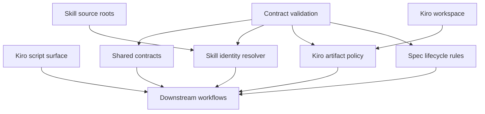
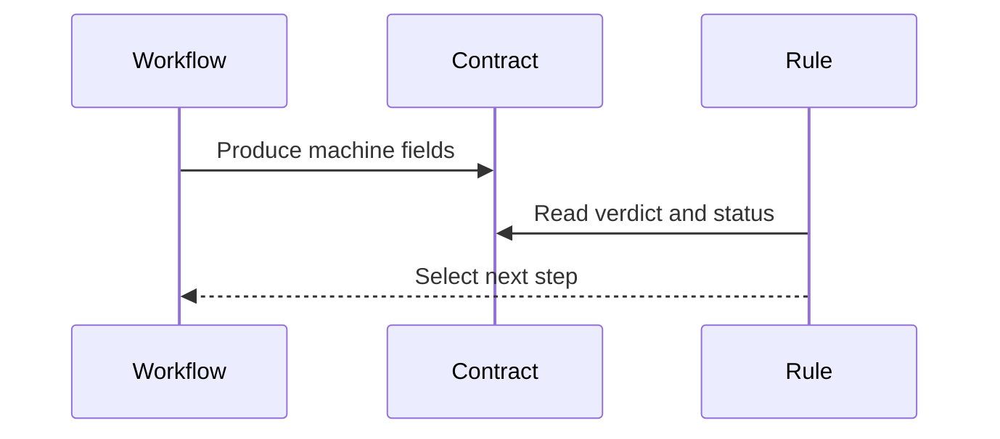
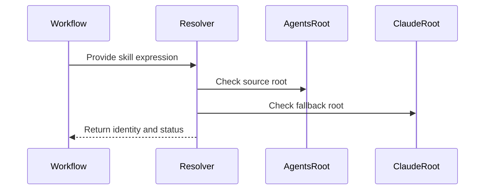
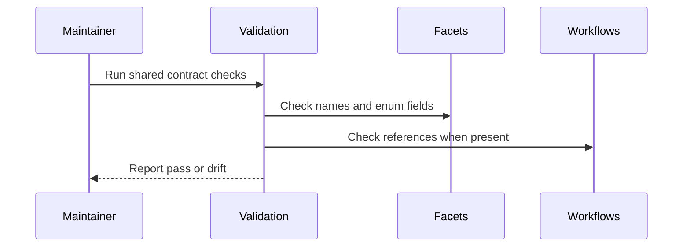

# Design Document

## Overview

`kiro-shared-workflow-contracts` は、TAKT ネイティブな Kiro workflow が共有する contract layer を定義します。対象は output contract facets、skill identity resolver、`.kiro/*` artifact operation policy、`spec.json` lifecycle rules、Kiro-specific validation checks です。

この spec は `kiro-workflow-surface` が公開する `kiro:*` namespace に依存します。個別 workflow の YAML と実行手順は下流 spec が実装し、本 spec はそれらが参照する共通契約と drift detection だけを所有します。

### Goals

- status、validation、review、debug、completion の結果を TAKT rule から参照できる parseable contract にする
- `kiro-impl`、`$kiro-impl`、`/kiro-impl` を同じ canonical skill identity へ正規化する
- `.kiro/steering/` と `.kiro/specs/<feature>/` の読み書き規約を workflow 間で共有する
- `spec.json` phase/approval 更新の意味を一貫させる
- Kiro-specific workflow/facet validation で shared contract drift を検出する

### Non-Goals

- `kiro-spec-status`、`kiro-spec-*`、`kiro-discovery`、`kiro-spec-batch`、`kiro-impl` の full workflow implementation
- README/README.ja の migration table や旧 `cc-sdd:*` shim
- OpenSpec workflow と `.kiro/*` artifact の統合
- implementation task selection、code edit policy、checkbox 更新タイミング

## Boundary Commitments

### This Spec Owns

- Kiro output contract facet の名前、verdict enum、機械判定用フィールド
- skill identity normalization と host-specific source root lookup の規約
- `.kiro/steering/` と `.kiro/specs/<feature>/` の artifact operation policy
- `spec.json` phase/approval/ready_for_implementation の lifecycle update rules
- Kiro-specific contract/facet/workflow reference validation

### Out of Boundary

- 個別 `kiro-*` workflow YAML の step 構成、prompt、loop control
- spec 生成内容そのもの、review/debug の判断ロジック、implementation execution
- `kiro:*` npm script 公開 surface と migration shim
- TAKT built-in の一般 validation を置き換えること
- Kiro skill 本文を TAKT facet に複製して独自 prompt として維持すること

### Allowed Dependencies

- Upstream `kiro-workflow-surface` の `kiro:*` namespace、major-version policy、OpenSpec 分離方針
- 既存 `.takt/{en,ja}/facets/` と `.takt/{en,ja}/workflows/` の配置規約
- `.agents/skills/kiro-*` と `.claude/skills/kiro-*` を source asset として読む既存 skill 配置
- Node.js 22+ による repository-local validation script 実行

### Revalidation Triggers

- output contract の tag、field name、verdict enum の追加・削除・改名
- `spec.json` lifecycle value、approval field、auto-approve semantics の変更
- `.kiro/steering/` または `.kiro/specs/<feature>/` の artifact layout 変更
- skill source root の優先順位や supported host の追加
- 下流 `kiro-*` workflow が shared contract 名や facet path を新しく参照するとき

## Architecture

### Existing Architecture Analysis

現在の `.takt/{en,ja}/facets/output-contracts/` には `cc-sdd-*` 系の contract が存在し、review、gap analysis、impl validation などの結果形式を Markdown contract として定義しています。`.takt/{en,ja}/workflows/` は workflow YAML から facet 名を参照する構造です。

一方で、Kiro 互換 workflow の共通概念である skill identity normalization、`.kiro/*` artifact 操作、`spec.json` lifecycle update rules は独立した共通 contract としてまとまっていません。この spec では既存配置を崩さず、Kiro-specific な共通 facet と validation harness を追加します。Kiro-specific facet は `node_modules/takt/builtins/{lang}/facets` の既定 facet を親として使える場合、`extends` による差分記述を優先し、親 facet の全文コピーを避けます。

### Architecture Pattern & Boundary Map

Selected pattern: shared contract layer。下流 workflow は本 spec の contract/facet/policy を参照し、個別 workflow の step 実装はそれぞれの spec に閉じます。



Key decisions:

- Kiro contract は `kiro-*` 名で新規定義し、既存 `cc-sdd-*` contract は互換参照のための既存資産として扱う。
- output contract は human summary と machine fields を分け、TAKT rule は machine fields を参照する。
- skill source root は `.agents/skills` と `.claude/skills` を source asset として解決し、runtime control plane にはしない。
- validation は shared contract の形と参照整合性を検証し、個別 workflow の full behavior を検証しない。
- built-in facet と責務が重なる Kiro-specific facet は、TAKT runtime が Markdown facet inheritance を解決できる場合に `extends` で親 facet を参照し、Kiro 固有の差分だけを本文に書く。
- Kiro skill の手順を実行する instruction facet は `extends_skill` / `extends_skill_section` を frontmatter に持つ thin adapter とし、Kiro skill 本文をコピーしない。
- Kiro workflow の再実行上限は TAKT runtime の `loop_monitors.threshold` を唯一の source of truth とし、facet や validation script に独自 retry counter を置かない。
- unreleased の既存 `kiro-*` workflow/facet は互換維持対象ではない。Kiro skill と矛盾する場合は削除または再作成する。

### Technology Stack

| Layer | Choice / Version | Role in Feature | Notes |
|-------|------------------|-----------------|-------|
| Workflow contract | TAKT facet Markdown | output contract、policy、instruction の共通定義 | `.takt/{en,ja}/facets/` に配置 |
| Built-in facet inheritance | TAKT builtins facet Markdown | Kiro-specific facet の親 facet と差分記述 | `node_modules/takt/builtins/{lang}/facets` を参照 |
| Kiro skill inheritance | Kiro skill Markdown | Kiro skill section を source of truth とする thin adapter | `.agents/skills/kiro-*` / `.claude/skills/kiro-*` を参照 |
| Loop monitoring | TAKT workflow YAML | review/repair/debug loop の上限と非生産的反復の打ち切り | `loop_monitors.threshold` だけに上限を置く |
| Workflow reference | TAKT workflow YAML | 下流 workflow が shared contract を参照する対象 | 本 spec では存在時の参照検証のみ |
| Source asset lookup | filesystem paths | `.agents/skills/kiro-*` と `.claude/skills/kiro-*` の解決 | 実行 control plane ではない |
| Validation | Node.js 22+ script/test | contract shape、enum、facet reference の drift detection | 個別 workflow の実装完了は要求しない |
| Spec workspace | `.kiro/steering/`, `.kiro/specs/` | artifact operation policy と lifecycle state | OpenSpec artifact とは分離 |

## File Structure Plan

### Directory Structure

```text
.
├── .takt/
│   ├── en/
│   │   └── facets/
│   │       ├── instructions/
│   │       │   └── kiro-resolve-skill-identity.md
│   │       ├── output-contracts/
│   │       │   ├── kiro-completion-verification.md
│   │       │   ├── kiro-debug-decision.md
│   │       │   ├── kiro-status.md
│   │       │   ├── kiro-validation-result.md
│   │       │   └── kiro-review-verdict.md
│   │       └── policies/
│   │           ├── kiro-artifact-operations.md
│   │           └── kiro-spec-lifecycle.md
│   ├── ja/
│   │   └── facets/
│   │       ├── instructions/
│   │       │   └── kiro-resolve-skill-identity.md
│   │       ├── output-contracts/
│   │       │   ├── kiro-completion-verification.md
│   │       │   ├── kiro-debug-decision.md
│   │       │   ├── kiro-status.md
│   │       │   ├── kiro-validation-result.md
│   │       │   └── kiro-review-verdict.md
│   │       └── policies/
│   │           ├── kiro-artifact-operations.md
│   │           └── kiro-spec-lifecycle.md
├── scripts/
│   └── validate-kiro-shared-contracts.mjs
└── tests/
    └── kiro-shared-workflow-contracts.test.mjs
```

### Created Files

- `.takt/en/facets/output-contracts/kiro-status.md` / `.takt/ja/facets/output-contracts/kiro-status.md` — feature existence、phase、approval、ready 判定を返す status contract。
- `.takt/en/facets/output-contracts/kiro-validation-result.md` / `.takt/ja/facets/output-contracts/kiro-validation-result.md` — `PASS`、`FAIL`、`NEEDS_FIX`、`BLOCKED` と validation evidence を返す validation contract。
- `.takt/en/facets/output-contracts/kiro-review-verdict.md` / `.takt/ja/facets/output-contracts/kiro-review-verdict.md` — Kiro skill の `VERDICT: APPROVED | REJECTED`、findings、requirement/task references を返す review supplement contract。
- `.takt/en/facets/output-contracts/kiro-debug-decision.md` / `.takt/ja/facets/output-contracts/kiro-debug-decision.md` — root cause、selected action、retry eligibility、abort reason を返す debug contract。
- `.takt/en/facets/output-contracts/kiro-completion-verification.md` / `.takt/ja/facets/output-contracts/kiro-completion-verification.md` — completion approval、remaining work、verification evidence を返す completion contract。
- `.takt/en/facets/instructions/kiro-resolve-skill-identity.md` / `.takt/ja/facets/instructions/kiro-resolve-skill-identity.md` — `$kiro-*`、`/kiro-*`、npm script expression を canonical skill identity に正規化する手順。
- `.takt/en/facets/policies/kiro-artifact-operations.md` / `.takt/ja/facets/policies/kiro-artifact-operations.md` — `.kiro/steering/` と `.kiro/specs/<feature>/` の読み書き規約。
- `.takt/en/facets/policies/kiro-spec-lifecycle.md` / `.takt/ja/facets/policies/kiro-spec-lifecycle.md` — `spec.json` phase/approval/ready_for_implementation 更新規約。
- `scripts/validate-kiro-shared-contracts.mjs` — Kiro shared contract の enum、required fields、skill identity fixtures、facet references を検証する repository-local script。
- `tests/kiro-shared-workflow-contracts.test.mjs` — validation script を test runner から実行し、shared contract drift を regression として検出する。

### Modified Files

- `package.json` — `validate:kiro-shared-contracts` と `test:kiro-shared-contracts` を追加し、shared contract validation を repository-local command と test runner から実行できる形にする。
- 下流 `.takt/{en,ja}/workflows/kiro-*.yaml` — 本 spec では変更しない。存在する場合に validation の参照対象になる。

### Component to File Mapping

- `KiroOutputContractCatalog` — `.takt/{en,ja}/facets/output-contracts/kiro-status.md`、`kiro-validation-result.md`、`kiro-review-verdict.md`、`kiro-debug-decision.md`、`kiro-completion-verification.md`
- `SkillIdentityResolver` — `.takt/{en,ja}/facets/instructions/kiro-resolve-skill-identity.md`
- `KiroArtifactAccessPolicy` — `.takt/{en,ja}/facets/policies/kiro-artifact-operations.md`
- `SpecLifecycleStateContract` — `.takt/{en,ja}/facets/policies/kiro-spec-lifecycle.md`
- `KiroWorkflowReferenceRules` — `scripts/validate-kiro-shared-contracts.mjs` の workflow reference validation section
- `ContractFacetBundle` — `.takt/{en,ja}/facets/` 配下の Kiro shared facet file set
- `SharedContractValidationHarness` — `scripts/validate-kiro-shared-contracts.mjs` と `tests/kiro-shared-workflow-contracts.test.mjs`

## Requirements Traceability

| Requirement | Summary | Components | Interfaces | Flows |
|-------------|---------|------------|------------|-------|
| 1.1 | status contract | KiroOutputContractCatalog | Output contract | Shared contract consumption |
| 1.2 | validation verdict | KiroOutputContractCatalog | Output contract | Shared contract consumption |
| 1.3 | review verdict | KiroOutputContractCatalog | Output contract | Shared contract consumption |
| 1.4 | debug decision | KiroOutputContractCatalog | Output contract | Shared contract consumption |
| 1.5 | completion verification | KiroOutputContractCatalog | Output contract | Shared contract consumption |
| 1.6 | human summary と machine fields の分離 | KiroOutputContractCatalog, SharedContractValidationHarness | Output contract, validation | Contract validation |
| 2.1 | skill expression normalization | SkillIdentityResolver | Instruction contract | Skill identity resolution |
| 2.2 | source root lookup | SkillIdentityResolver | Instruction contract | Skill identity resolution |
| 2.3 | missing source root error | SkillIdentityResolver, KiroOutputContractCatalog | Error shape | Skill identity resolution |
| 2.4 | source asset と runtime control plane の分離 | SkillIdentityResolver | Policy | Skill identity resolution |
| 2.5 | normalization fixtures | SharedContractValidationHarness | Validation script | Contract validation |
| 3.1 | steering loading rules | KiroArtifactAccessPolicy | Policy | Artifact operation |
| 3.2 | feature resolution rules | KiroArtifactAccessPolicy | Policy | Artifact operation |
| 3.3 | phase artifact requirements | KiroArtifactAccessPolicy, SpecLifecycleStateContract | Policy | Artifact operation |
| 3.4 | artifact error categories | KiroArtifactAccessPolicy, KiroOutputContractCatalog | Error shape | Artifact operation |
| 3.5 | OpenSpec separation | KiroArtifactAccessPolicy | Policy | Artifact operation |
| 4.1 | requirements phase update | SpecLifecycleStateContract | Lifecycle rules | Lifecycle update |
| 4.2 | design phase update | SpecLifecycleStateContract | Lifecycle rules | Lifecycle update |
| 4.3 | tasks phase update | SpecLifecycleStateContract | Lifecycle rules | Lifecycle update |
| 4.4 | auto-approve semantics | SpecLifecycleStateContract | Lifecycle rules | Lifecycle update |
| 4.5 | lifecycle revalidation | SpecLifecycleStateContract, SharedContractValidationHarness | Validation script | Contract validation |
| 5.1 | output contract enum validation | SharedContractValidationHarness, KiroOutputContractCatalog | Validation script | Contract validation |
| 5.2 | skill identity validation | SharedContractValidationHarness, SkillIdentityResolver | Validation script | Contract validation |
| 5.3 | artifact/lifecycle consistency validation | SharedContractValidationHarness, KiroArtifactAccessPolicy, SpecLifecycleStateContract | Validation script | Contract validation |
| 5.4 | workflow facet reference validation | SharedContractValidationHarness, KiroWorkflowReferenceRules | Validation script | Contract validation |
| 5.5 | no full workflow behavior dependency | SharedContractValidationHarness | Validation scope | Contract validation |
| 6.1 | downstream reference names | ContractFacetBundle | Facet bundle | Shared contract consumption |
| 6.2 | no downstream-specific logic | ContractFacetBundle, KiroWorkflowReferenceRules | Policy | Shared contract consumption |
| 6.3 | downstream revalidation on contract change | KiroWorkflowReferenceRules | Validation rules | Contract validation |
| 6.4 | `kiro:*` namespace consistency | KiroWorkflowReferenceRules | Policy | Shared contract consumption |
| 7.1 | built-in facet 継承を優先する | BuiltinFacetInheritancePolicy, ContractFacetBundle | Policy | Contract validation |
| 7.2 | runtime-supported facet parent id を定義する | BuiltinFacetInheritancePolicy | Data model | Contract validation |
| 7.3 | 親 facet 不在を fail-fast する | SharedContractValidationHarness, BuiltinFacetInheritancePolicy | Validation | Contract validation |
| 7.4 | runtime 未対応を前提不足として扱う | SharedContractValidationHarness, BuiltinFacetInheritancePolicy | Validation | Contract validation |
| 7.5 | full custom facet の理由を要求する | BuiltinFacetInheritancePolicy, ContractFacetBundle | Policy | Shared contract consumption |

## Components and Interfaces

| Component | Domain/Layer | Intent | Req Coverage | Key Dependencies | Contracts |
|-----------|--------------|--------|--------------|------------------|-----------|
| KiroOutputContractCatalog | Facet contracts | Kiro workflow の共通 output shape を定義する | 1.1, 1.2, 1.3, 1.4, 1.5, 1.6, 2.3, 3.4, 5.1 | TAKT facets P0 | State |
| SkillIdentityResolver | Facet instruction | skill 呼び出し表現と source root lookup を正規化する | 2.1, 2.2, 2.3, 2.4, 2.5 | `.agents/skills`, `.claude/skills` P0 | Service |
| KiroArtifactAccessPolicy | Facet policy | `.kiro/*` artifact の読み書き境界を定義する | 3.1, 3.2, 3.3, 3.4, 3.5, 5.3 | `.kiro/steering`, `.kiro/specs` P0 | State |
| SpecLifecycleStateContract | Facet policy | `spec.json` phase/approval update rules を定義する | 4.1, 4.2, 4.3, 4.4, 4.5, 5.3 | `spec.json` P0 | State |
| BuiltinFacetInheritancePolicy | Facet policy / Validation | built-in facet の親参照、差分記述、unsupported fail-fast を定義する | 7.1, 7.2, 7.3, 7.4, 7.5 | `node_modules/takt/builtins/{lang}/facets` P0 | State, Batch |
| KiroWorkflowReferenceRules | Validation rules | 下流 workflow の shared contract 参照規約を定義する | 5.4, 6.1, 6.2, 6.3, 6.4 | downstream workflow YAML P1 | Service |
| ContractFacetBundle | Facet bundle | en/ja の Kiro shared facets を対応する名前で提供する | 6.1, 6.2 | `.takt/en`, `.takt/ja` P0 | State |
| SharedContractValidationHarness | Validation | shared contract drift を test failure として検出する | 1.6, 2.5, 4.5, 5.1, 5.2, 5.3, 5.4, 5.5 | Node.js 22+ P0 | Service, Batch |

### Contract Layer

#### KiroOutputContractCatalog

| Field | Detail |
|-------|--------|
| Intent | status、validation、review、debug、completion の共通 output contract を提供する |
| Requirements | 1.1, 1.2, 1.3, 1.4, 1.5, 1.6, 2.3, 3.4, 5.1 |

**Responsibilities & Constraints**

- 各 contract に machine-readable な `verdict`、`status`、`category`、`evidence` 相当のフィールドを定義する。
- human summary は読みやすい説明に閉じ、TAKT rule が参照する値とは分ける。
- enum は下流 workflow が条件分岐に使うため、変更時は revalidation trigger とする。
- error shape は skill root missing、artifact missing、invalid lifecycle など共通カテゴリを表現できるようにする。

**Dependencies**

- Inbound: 下流 Kiro workflows — output format として参照する (P0)
- Outbound: TAKT output contract facet loader — Markdown contract を読み込む (P0)
- Outbound: `SharedContractValidationHarness` — required fields と enum を検証する (P0)

**Contracts**: Service [ ] / API [ ] / Event [ ] / Batch [ ] / State [x]

##### State Management

- State model: `.takt/{en,ja}/facets/output-contracts/kiro-*.md`
- Persistence & consistency: en/ja contract は同じ tag、field name、enum を持つ
- Concurrency strategy: validation script が language pair drift を検出する

#### SkillIdentityResolver

| Field | Detail |
|-------|--------|
| Intent | Kiro skill の呼び出し表現を canonical identity と source root に解決する |
| Requirements | 2.1, 2.2, 2.3, 2.4, 2.5 |

**Responsibilities & Constraints**

- `$kiro-impl`、`/kiro-impl`、`kiro-impl`、`kiro:impl` などを canonical `kiro-impl` へ正規化する。npm script は `kiro:spec:quick -> kiro-spec-quick` のように surface spec の authoritative map を通して skill identity へ変換する。
- `.agents/skills/<identity>/SKILL.md` と `.claude/skills/<identity>/SKILL.md` を source asset root として扱う。
- source root がない場合は `BLOCKED` 相当の error category を返す contract を使う。
- source root の存在は workflow 実行可否の判断材料であり、TAKT runtime の制御面にはしない。

**Dependencies**

- Inbound: 下流 workflows — skill 名を受け取る step から参照する (P0)
- Outbound: `.agents/skills/kiro-*`、`.claude/skills/kiro-*` — source asset lookup (P0)
- Outbound: `KiroOutputContractCatalog` — missing source root error shape (P0)

**Contracts**: Service [x] / API [ ] / Event [ ] / Batch [ ] / State [ ]

##### Service Interface

```typescript
type KiroSkillInput = string;
type KiroSkillIdentity =
  | "kiro-debug"
  | "kiro-discovery"
  | "kiro-impl"
  | "kiro-review"
  | "kiro-spec-batch"
  | "kiro-spec-design"
  | "kiro-spec-init"
  | "kiro-spec-quick"
  | "kiro-spec-requirements"
  | "kiro-spec-status"
  | "kiro-spec-tasks"
  | "kiro-steering"
  | "kiro-steering-custom"
  | "kiro-validate-design"
  | "kiro-validate-gap"
  | "kiro-validate-impl"
  | "kiro-verify-completion";

interface KiroSkillResolution {
  readonly identity: KiroSkillIdentity;
  readonly sourceRoots: readonly string[];
  readonly status: "FOUND" | "MISSING";
  readonly errorCategory?: "UNSUPPORTED_KIRO_IDENTITY" | "SKILL_SOURCE_MISSING";
}
```

- Preconditions: input は workflow invocation または agent command から渡された文字列。
- Postconditions: known skill は同じ canonical identity と deterministic な source root candidates を返す。
- Invariants: `kiro:*` npm script 名は必要に応じて対応する `kiro-*` skill identity へ変換されるが、`opsx:*` は Kiro skill identity に含めない。

### Artifact Policy Layer

#### KiroArtifactAccessPolicy

| Field | Detail |
|-------|--------|
| Intent | `.kiro/steering/` と `.kiro/specs/<feature>/` の artifact 操作規約を定義する |
| Requirements | 3.1, 3.2, 3.3, 3.4, 3.5, 5.3 |

**Responsibilities & Constraints**

- steering は `.kiro/steering/roadmap.md` を中心に、存在する steering files だけを読む。
- feature は `.kiro/specs/<feature>/` の directory と `brief.md` / phase artifacts の存在から解決する。
- phase ごとの必須 artifact を定義し、missing や inconsistent state を共通 error category に分類する。
- OpenSpec artifact は `.kiro/*` contract に混ぜない。

**Dependencies**

- Inbound: 下流 Kiro workflows — artifact read/write policy として参照する (P0)
- Outbound: `.kiro/steering/`、`.kiro/specs/` — artifact workspace (P0)
- Outbound: `SpecLifecycleStateContract` — phase と required artifacts の整合性 (P0)

**Contracts**: Service [ ] / API [ ] / Event [ ] / Batch [ ] / State [x]

##### State Management

- State model: `.kiro/steering/*.md`、`.kiro/specs/<feature>/{brief.md,spec.json,requirements.md,design.md,tasks.md}`。`research.md` は design phase の optional supplemental artifact として扱い、存在する場合は validation input に含める。
- Persistence & consistency: artifact の存在と `spec.json.phase` が矛盾しないこと
- Concurrency strategy: workflow は対象 feature directory に閉じて書き込み、roadmap は batch controller など所有 spec が明示する場合だけ更新する

#### SpecLifecycleStateContract

| Field | Detail |
|-------|--------|
| Intent | `spec.json` の phase と approvals の更新意味を標準化する |
| Requirements | 4.1, 4.2, 4.3, 4.4, 4.5, 5.3 |

**Responsibilities & Constraints**

- requirements/design/tasks 各 phase 完了時の `phase`、`generated`、`approved`、`ready_for_implementation` を定義する。
- auto-approve mode は generated と approved を同時に true にできるが、通常 mode との差分を contract に明記する。
- 未知の lifecycle value を導入する場合は shared contract と downstream workflows の revalidation を必要とする。

**Dependencies**

- Inbound: spec generation workflows — phase completion時に参照する (P0)
- Inbound: status/validation workflows — current lifecycle 判定に参照する (P0)
- Outbound: `spec.json` — lifecycle state persistence (P0)

**Contracts**: Service [ ] / API [ ] / Event [ ] / Batch [ ] / State [x]

##### State Management

| Phase | Required artifact | Required generated state | Auto-approved ready state |
|-------|-------------------|--------------------------|---------------------------|
| `initialized` | `spec.json`, `requirements.md` draft | all generated false | ready false |
| `requirements-generated` | `requirements.md` | requirements.generated true | requirements.approved true when `-y` |
| `design-generated` | `design.md`、optional `research.md` | requirements approved, design.generated true | design.approved true when `-y` |
| `tasks-generated` | `tasks.md` | requirements/design approved, tasks.generated true | tasks.approved true and ready true when `-y` |

### Validation Layer

#### KiroWorkflowReferenceRules

| Field | Detail |
|-------|--------|
| Intent | downstream workflow が shared contract を参照するためのルールを定義する |
| Requirements | 5.4, 6.1, 6.2, 6.3, 6.4 |

**Responsibilities & Constraints**

- downstream workflow が参照する output contract 名、policy 名、instruction 名を Kiro shared facet に限定して検証できるようにする。
- `kiro:*` namespace と矛盾する identity を導入しない。
- downstream-specific prompt、task selection、loop behavior は本 component に入れない。

**Dependencies**

- Inbound: `SharedContractValidationHarness` — workflow YAML の参照検証に使う (P0)
- Outbound: `.takt/{en,ja}/workflows/kiro-*.yaml` — 存在時に検証対象として読む (P1)
- Outbound: `ContractFacetBundle` — allowed facet reference set (P0)

**Contracts**: Service [x] / API [ ] / Event [ ] / Batch [ ] / State [ ]

##### Service Interface

```typescript
interface KiroWorkflowReferenceValidation {
  readonly workflowPath: string;
  readonly ok: boolean;
  readonly missingFacetReferences: readonly string[];
  readonly unsupportedContractNames: readonly string[];
}
```

- Preconditions: workflow YAML は存在する場合だけ検証対象になる。
- Postconditions: missing facet reference や unsupported contract name があれば validation failure になる。
- Invariants: workflow の実行成功や behavior correctness は検証しない。

#### ContractFacetBundle

| Field | Detail |
|-------|--------|
| Intent | en/ja の shared Kiro facets を同じ contract set として提供する |
| Requirements | 6.1, 6.2 |

**Responsibilities & Constraints**

- language pair ごとに同じ logical contract 名を提供する。
- 日本語 facet は自然な日本語で書き、tag、enum、field name は ASCII のまま一致させる。
- 下流 workflow が参照する canonical facet name を一箇所で検証できるようにする。

**Dependencies**

- Inbound: 下流 workflows — facet references として使用する (P0)
- Outbound: `.takt/en/facets/`、`.takt/ja/facets/` — physical facet files (P0)

**Contracts**: Service [ ] / API [ ] / Event [ ] / Batch [ ] / State [x]

##### State Management

- State model: shared Kiro facet file set
- Persistence & consistency: en/ja の file basename と machine-readable contract terms は一致する
- Concurrency strategy: validation script が片言語のみの追加や enum drift を検出する

#### SharedContractValidationHarness

| Field | Detail |
|-------|--------|
| Intent | shared contract drift を repository-local validation として検出する |
| Requirements | 1.6, 2.5, 4.5, 5.1, 5.2, 5.3, 5.4, 5.5 |

**Responsibilities & Constraints**

- output contract facets の required enum と machine fields を検証する。
- skill identity normalization fixtures を検証する。
- artifact policy と lifecycle rules の required phase/approval terms を検証する。
- workflow YAML が存在する場合だけ Kiro-specific facet reference を検証する。
- 個別 workflow の full behavior や YAML 完成を成功条件にしない。

**Dependencies**

- Inbound: test runner / maintainer — validation command として実行する (P0)
- Outbound: `KiroOutputContractCatalog`、`SkillIdentityResolver`、`KiroArtifactAccessPolicy`、`SpecLifecycleStateContract`、`KiroWorkflowReferenceRules` — 検証対象 (P0)
- External: Node.js 22+ — script runtime (P0)

**Contracts**: Service [x] / API [ ] / Event [ ] / Batch [x] / State [ ]

##### Service Interface

```typescript
interface KiroSharedContractValidationResult {
  readonly ok: boolean;
  readonly failures: readonly string[];
}

interface KiroSharedContractValidationService {
  validateOutputContracts(): KiroSharedContractValidationResult;
  validateSkillIdentityFixtures(): KiroSharedContractValidationResult;
  validateArtifactLifecycleTerms(): KiroSharedContractValidationResult;
  validateWorkflowFacetReferences(): KiroSharedContractValidationResult;
}
```

- Preconditions: repository checkout contains `.takt/` and optional `.kiro/` workspace.
- Postconditions: required shared contract drift is reported as a non-zero validation result.
- Invariants: missing downstream `kiro-*.yaml` files do not fail this spec's validation.

##### Batch / Job Contract

- Trigger: `node scripts/validate-kiro-shared-contracts.mjs`
- Input / validation: repository root、facet files、skill root fixtures、optional workflow YAML
- Output / destination: stdout に summary、stderr または failure list に drift details
- Idempotency & recovery: repository state は変更しない。失敗時は missing/invalid contract を示すだけにする

## System Flows

### Shared Contract Consumption



### Skill Identity Resolution



### Contract Validation



## Data Models

### Facet Inheritance Contract

Kiro-specific facet が built-in facet を継承する場合、TAKT 0.43.0 が解決できる単独行の `{extends: parent}` directive で親 facet を明示します。

```markdown
{extends: validation}
```

TAKT 0.43.0 の Markdown facet inheritance は同じ facet kind 内の bare facet name だけを親として解決します。たとえば output contract facet は `{extends: validation}`、instruction facet は `{extends: plan}`、policy facet は `{extends: coding}` のように書きます。validation harness は `.takt/{lang}/facets/<kind>/<name>.md` の facet kind と `{extends: parent}` から `node_modules/takt/builtins/{lang}/facets/<kind>/<parent>.md` を親として解決し、親が存在しない場合は `BUILTIN_FACET_NOT_FOUND`、TAKT runtime が directive を解決できない場合は `FACET_EXTENDS_UNSUPPORTED` を返します。`instructions/plan` のような type-qualified facet id は runtime が対応した後に再検証して採用します。

### Kiro Skill Inheritance Contract

Kiro skill の実行手順を TAKT workflow へ写像する instruction facet は、Markdown frontmatter で参照元 skill と section を明示します。この contract は TAKT runtime に未知 field を追加しないため、workflow YAML ではなく facet frontmatter に置きます。

```markdown
---
extends_skill: kiro-impl
extends_skill_section: Autonomous Mode Algorithm
---
```

`extends_skill_section` は `.agents/skills/<skill>/SKILL.md` または `.claude/skills/<skill>/SKILL.md` に存在する section heading を原文のまま書きます。日本語 facet でも section heading は翻訳しません。本文は TAKT 固有の input artifact、output contract、rule condition、artifact write boundary の写像だけを書き、Kiro skill 本文を再掲しません。

validation harness は以下を検出します。

- `extends_skill` が canonical Kiro skill identity として解決できること
- `extends_skill_section` が参照元 `SKILL.md` に存在すること
- en/ja facet の `extends_skill`、`extends_skill_section`、machine field、enum が一致すること
- Kiro skill 本文の長いコピーが adapter facet に混入していないこと
- Kiro-specific facet が workflow から参照されず未使用のまま残っていないこと

### Workflow Shape Contract

Kiro workflow は Kiro skill が要求する作業単位を TAKT step と rule へ展開します。generation / implementation workflow は単一 prompt step wrapper ではなく、context collection、phase execution、review/validation、repair/debug、finalization の必要 step を接続します。status / validation workflow は read-only なので、evidence collection、classification/validation、report の step に閉じ、artifact 更新や repair loop を持ちません。

再実行上限は workflow YAML の `loop_monitors.threshold` だけに置きます。adapter facet、output contract、validation script は `maxAttempts`、`retryCount`、独自 loop health counter を持ちません。既存 workflow の phase 再利用は `workflow_call` や shell 経由の `takt -w` ではなく、同じ adapter facet と shared validation helper を複数 step から参照する形で行います。

### Kiro Skill Field Contract

Kiro skill が構造化出力を定義している場合、TAKT rule の primary machine field はその field 名と enum をそのまま使います。shared `kiro-*` output contract は補助的な説明や evidence の整理には使えますが、Kiro skill field を別名の `validation.verdict` や `review.verdict` へ翻訳しません。

### Output Contract Enum Set

| Contract | Machine field | Allowed values |
|----------|---------------|----------------|
| `kiro-status` | `status` | `FOUND`, `MISSING`, `INVALID` |
| `kiro-status` | `readiness` | `READY`, `NOT_READY`, `INCONSISTENT` |
| `kiro-impl` implementer | `STATUS` | `READY_FOR_REVIEW`, `BLOCKED`, `NEEDS_CONTEXT` |
| `kiro-review` reviewer | `VERDICT` | `APPROVED`, `REJECTED` |
| `kiro-debug` debugger | `NEXT_ACTION` | `RETRY_TASK`, `BLOCK_TASK`, `STOP_FOR_HUMAN` |
| `kiro-validate-impl` feature validator | `DECISION` | `GO`, `NO-GO`, `MANUAL_VERIFY_REQUIRED` |
| `kiro-spec-tasks` graph sanity | review result | `PASS`, `NEEDS_FIXES`, `RETURN_TO_DESIGN` |
| shared validation supplement | `verdict` | `PASS`, `FAIL`, `NEEDS_FIX`, `BLOCKED` |

### Artifact Error Categories

| Category | Meaning | Typical consumer action |
|----------|---------|-------------------------|
| `FEATURE_NOT_FOUND` | `.kiro/specs/<feature>/` が存在しない | stop or discovery guidance |
| `ARTIFACT_MISSING` | phase に必要な Markdown artifact がない | run previous phase |
| `SPEC_JSON_INVALID` | `spec.json` が読めない、または required fields がない | repair or abort |
| `LIFECYCLE_INCONSISTENT` | phase と approvals/artifacts が矛盾する | validate and repair |
| `SKILL_SOURCE_MISSING` | canonical skill の source root がない | blocked |
| `UNSUPPORTED_KIRO_IDENTITY` | Kiro skill として解決できない | abort or route elsewhere |

## Testing Strategy

- `KiroOutputContractCatalog`: en/ja の `kiro-*.md` output contract に required machine field と allowed enum が書かれていることを検証する。対象: 1.1, 1.2, 1.3, 1.4, 1.5, 1.6, 5.1
- `SkillIdentityResolver`: `kiro-impl`、`$kiro-impl`、`/kiro-impl`、`kiro:impl` が同じ canonical identity へ解決され、unknown skill が `UNSUPPORTED_KIRO_IDENTITY`、missing source が `SKILL_SOURCE_MISSING` になることを検証する。対象: 2.1, 2.2, 2.3, 2.5, 5.2
- `KiroArtifactAccessPolicy` と `SpecLifecycleStateContract`: phase names、approval fields、required artifacts、OpenSpec separation の terms が policy に存在し、矛盾した lifecycle terms がないことを検証する。対象: 3.1, 3.2, 3.3, 3.4, 3.5, 4.1, 4.2, 4.3, 4.4, 5.3
- `BuiltinFacetInheritancePolicy`: Kiro-specific facet の `{extends: parent}` directive が bare facet name を使い、同じ facet kind の `node_modules/takt/builtins/{lang}/facets` 親 facet へ解決できることを検証する。TAKT runtime が inheritance 未対応の場合は `FACET_EXTENDS_UNSUPPORTED` として失敗させる。対象: 7.1, 7.2, 7.3, 7.4, 7.5
- `KiroSkillInheritancePolicy`: Kiro-specific instruction facet の `extends_skill` と `extends_skill_section` が参照元 Kiro skill に存在し、en/ja で同じ machine mapping を持ち、Kiro skill 本文をコピーしていないことを検証する。対象: 8.1, 8.2, 8.3, 8.4, 8.5, 8.6
- `KiroWorkflowShapeRules`: generation / implementation workflow が単一 step wrapper ではなく、Kiro skill の review/repair/debug/finalization loop を `loop_monitors.threshold` で接続していること、read-only workflow が artifact 更新 loop を持たないことを検証する。対象: 9.1, 9.2, 9.3, 9.4
- `KiroSkillFieldContract`: `STATUS`、`VERDICT`、`NEXT_ACTION`、`DECISION` などの Kiro skill field が workflow rule の primary field として使われ、独自 `validation.verdict` へ翻訳されていないことを検証する。対象: 10.1, 10.2, 10.3, 10.4, 10.5, 10.6
- `KiroWorkflowReferenceRules`: `.takt/{en,ja}/workflows/kiro-*.yaml` が存在する場合に、shared facet references が解決できることを検証する。対象: 5.4, 6.1, 6.3, 6.4
- Scope guard: validation script が downstream workflow YAML の未実装を failure にしないことを検証する。対象: 5.5, 6.2

## Integration & Migration Notes

- `kiro-workflow-surface` の実装後に本 spec を実装する。`kiro:*` script 名と command identity は upstream の定義を再利用する。
- 既存 `cc-sdd-*` workflow/facet は維持し、documentation では非推奨として扱う。Kiro workflow への透過 alias や fail-fast shim へ置き換えない。
- unreleased の既存 `kiro-*` workflow と Kiro instruction facet は互換維持対象ではない。Kiro skill inheritance contract と workflow shape contract に合わないものは削除・再作成してよい。
- en/ja facets は同じ machine-readable field と enum を持つ。自然言語部分だけを各言語で最適化する。
- 下流 workflow 実装時は、本 spec の validation script を拡張して新しい `kiro-*.yaml` の facet reference を検証対象に含める。
- 下流 workflow の Kiro-specific facet は `BuiltinFacetInheritancePolicy` を参照し、built-in facet と責務が重なる場合は `extends` で差分だけを書く。full custom にする場合は、親候補がない、親の責務が違う、または runtime が inheritance 未対応である理由を design または validation finding に残す。
- 下流 workflow の Kiro-specific instruction facet は `KiroSkillInheritancePolicy` を参照し、Kiro skill の該当 section を source of truth とする thin adapter として実装する。Kiro skill が更新された場合は adapter の入出力写像だけを再検証する。

## Open Questions / Risks

- TAKT rule が Markdown output contract 内のどの field marker を最も安定して参照できるかは、既存 engine の contract parsing 実装を実装時に再確認する必要がある。
- `kiro:spec:quick` と `$kiro-spec-quick` のように npm script と skill 名が完全に同じ文字列でない入口は、上流 surface の mapping と矛盾しない fixture として扱う必要がある。
- en/ja の自然言語差分が machine fields の drift を隠す可能性があるため、validation は basename だけでなく enum と required field を見る。
