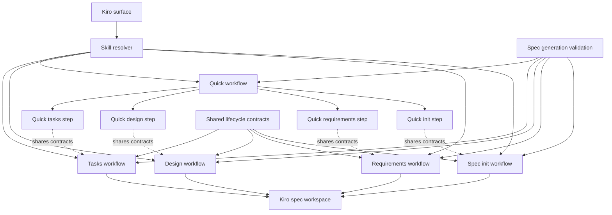
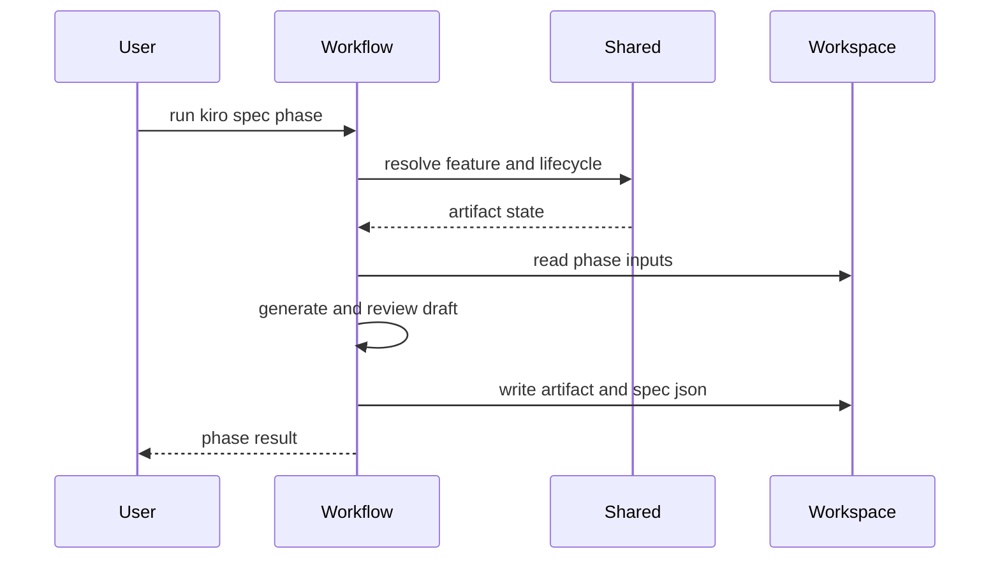
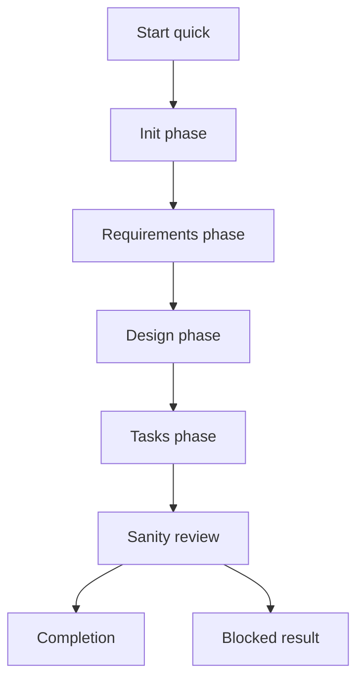

# Design Document

## Overview

`kiro-spec-generation-workflows` は、個別 feature spec の lifecycle を TAKT workflow として実行可能にします。`kiro-spec-init`、`kiro-spec-requirements`、`kiro-spec-design`、`kiro-spec-tasks`、`kiro-spec-quick` を対象にし、`.kiro/specs/<feature>` 配下の artifact と `spec.json` phase/approval を一貫して更新します。

この spec は上流の `kiro-workflow-surface` と `kiro-shared-workflow-contracts` に依存します。workflow surface は `kiro:*` entrypoint と skill identity の前提を提供し、shared contracts は `.kiro/*` artifact operation policy と lifecycle state contract を提供します。本 spec は個別 spec artifact の生成 workflow に集中し、discovery/batch orchestration と implementation execution は下流 spec に残します。

### Goals

- Kiro-compatible な個別 spec directory を初期化できる
- requirements/design/tasks を phase gate と review gate 付きで生成できる
- `spec.json` の generated/approved/ready state を phase ごとに一貫更新できる
- `kiro-spec-quick` を standalone workflow の安全な composition として提供する
- spec generation workflow と artifact contract の drift を repository-local validation で検出できる

### Non-Goals

- `kiro-discovery` の routing、roadmap 更新、dependency wave、cross-spec review
- `kiro-impl` の task selection、code edit、review/debug/verify loop
- status/validation workflow の read-only full implementation
- OpenSpec artifact model と `.kiro/*` artifact model の統合
- 旧 `cc-sdd-*` workflow の prompt 手順を完全保存すること

## Boundary Commitments

### This Spec Owns

- `kiro-spec-init`、`kiro-spec-requirements`、`kiro-spec-design`、`kiro-spec-tasks`、`kiro-spec-quick` の TAKT workflow YAML と phase progression
- requirements/design/tasks/research artifact の生成契約と review gate 接続
- 個別 feature spec の `spec.json` phase/approval/ready update behavior
- quick path の automatic/interactive mode と final sanity review
- spec generation workflow/facet/lifecycle reference validation

### Out of Boundary

- `kiro-discovery` の single/multi/mixed routing と `brief.md`/roadmap 作成
- `kiro-spec-batch` の dependency wave、parallel worker dispatch、cross-spec consistency review
- `kiro-impl` の implementation task execution と checkbox progress update
- `kiro-spec-status`、`kiro-validate-*` の full behavior
- package/installer/README の public `kiro:*` surface migration

### Allowed Dependencies

- `kiro-workflow-surface` の `kiro:*` namespace と `$kiro-*` skill identity の正規表現
- `kiro-shared-workflow-contracts` の `KiroArtifactAccessPolicy`、`SpecLifecycleStateContract`、`SkillIdentityResolver`、`KiroOutputContractCatalog`
- 既存 `.agents/skills/kiro-spec-*` の phase rules と `.kiro/settings/templates/specs/*`
- 既存 `.takt/{en,ja}/facets/` と `.takt/{en,ja}/workflows/` の配置規約
- Node.js 22+ による repository-local validation script/test 実行

### Revalidation Triggers

- shared `spec.json` lifecycle phase、approval field、auto-approve semantics の変更
- `.kiro/specs/<feature>` の artifact layout、required section、template path の変更
- `kiro:*` npm script と `kiro-spec-*` skill identity の mapping 変更
- requirements/design/tasks review gate の verdict enum や output contract field の変更
- downstream discovery/batch または implementation workflow が生成 artifact の section や task annotation を新しく参照するとき

## Architecture

### Existing Architecture Analysis

既存 repo には `cc-sdd-requirements`、`cc-sdd-design`、`cc-sdd-tasks` などの workflow YAML と facet が存在します。これらは requirements/design/tasks の生成に必要な persona、instruction、policy、output contract を持ちますが、Kiro-compatible な `kiro-spec-*` workflow としての phase gate、shared lifecycle contract、quick path composition はまだ分離されていません。

上流 `kiro-shared-workflow-contracts` は、`.kiro/*` artifact operation policy、skill identity normalization、`SpecLifecycleStateContract` を定義します。本 spec の workflow は、それらを参照しながら個別 spec の書き込みに閉じます。roadmap は discovery/batch 側の所有物であり、本 spec の workflow は対象 feature directory 以外を通常更新しません。

### Architecture Pattern & Boundary Map

Selected pattern: phase-gated workflow bundle。各 standalone workflow は 1 phase の artifact と lifecycle 更新を所有します。quick workflow は TAKT runtime で未確定な外部 workflow 呼び出しに依存せず、同じ instruction/policy/output contract を参照する phase step を 1 つの YAML 内に直列展開する composition layer として振る舞います。



Key decisions:

- standalone workflow と quick workflow は同じ Kiro-specific instruction/policy/output contract を source of truth として参照する。quick path は `workflow_call` や shell 経由の `takt -w ...` 再起動に依存せず、同一 YAML 内の phase step として init、requirements、design、tasks、sanity review を直列化する。
- `spec.json` の更新は shared `SpecLifecycleStateContract` の phase table に沿って行う。
- `research.md` は design phase の補助 artifact として生成するが、design decision の結論は `design.md` にも残す。
- task annotation は downstream `kiro-impl` の入力契約になるため、`_Boundary:_` と `_Depends:_` を省略しない。
- workflow validation は spec generation の workflow/facet/lifecycle contract を検証し、discovery/batch と implementation の full behavior は検証しない。
- Kiro-specific generation facets は shared `BuiltinFacetInheritancePolicy` に従い、`node_modules/takt/builtins/{lang}/facets` の planning/task-decomposition/output-contract 系 built-in facet を継承できる場合は差分だけを書く。

### Technology Stack

| Layer | Choice / Version | Role in Feature | Notes |
|-------|------------------|-----------------|-------|
| Workflow runtime | TAKT workflow YAML | `kiro-spec-*` phase execution と quick composition | `.takt/{en,ja}/workflows/` に配置。quick は single-YAML phase step 展開 |
| Facets | TAKT facet Markdown | phase instruction、policy、output contract を定義 | built-in facet 継承を優先し、既存 `cc-sdd-*` facet は参考に留める |
| Built-in facet inheritance | TAKT builtins facet Markdown | planning/task-decomposition 系の親 facet と差分記述 | shared `BuiltinFacetInheritancePolicy` を参照 |
| Spec workspace | `.kiro/specs/<feature>` | `spec.json` と Markdown artifact の永続化 | roadmap 更新は out of boundary |
| Templates | `.kiro/settings/templates/specs/*` | 初期 artifact と document structure の入力 | template missing は supported error |
| Validation | Node.js 22+ script/test | workflow/facet/lifecycle drift を検出 | downstream workflow 未実装を failure にしない |

## File Structure Plan

### Directory Structure

```text
.
├── .takt/
│   ├── en/
│   │   ├── workflows/
│   │   │   ├── kiro-spec-init.yaml
│   │   │   ├── kiro-spec-requirements.yaml
│   │   │   ├── kiro-spec-design.yaml
│   │   │   ├── kiro-spec-tasks.yaml
│   │   │   └── kiro-spec-quick.yaml
│   │   └── facets/
│   │       ├── instructions/
│   │       │   ├── kiro-spec-init.md
│   │       │   ├── kiro-spec-requirements.md
│   │       │   ├── kiro-spec-design.md
│   │       │   ├── kiro-spec-tasks.md
│   │       │   └── kiro-spec-quick.md
│   │       ├── output-contracts/
│   │       │   ├── kiro-spec-generation-result.md
│   │       │   └── kiro-spec-sanity-review.md
│   │       └── policies/
│   │           ├── kiro-spec-generation.md
│   │           └── kiro-spec-task-annotations.md
│   ├── ja/
│   │   ├── workflows/
│   │   │   ├── kiro-spec-init.yaml
│   │   │   ├── kiro-spec-requirements.yaml
│   │   │   ├── kiro-spec-design.yaml
│   │   │   ├── kiro-spec-tasks.yaml
│   │   │   └── kiro-spec-quick.yaml
│   │   └── facets/
│   │       ├── instructions/
│   │       │   ├── kiro-spec-init.md
│   │       │   ├── kiro-spec-requirements.md
│   │       │   ├── kiro-spec-design.md
│   │       │   ├── kiro-spec-tasks.md
│   │       │   └── kiro-spec-quick.md
│   │       ├── output-contracts/
│   │       │   ├── kiro-spec-generation-result.md
│   │       │   └── kiro-spec-sanity-review.md
│   │       └── policies/
│   │           ├── kiro-spec-generation.md
│   │           └── kiro-spec-task-annotations.md
├── .kiro/
│   └── settings/
│       └── templates/
│           └── specs/
│               └── tasks.md
├── scripts/
│   └── validate-kiro-spec-generation-workflows.mjs
├── package.json
└── tests/
    └── kiro-spec-generation-workflows.test.mjs
```

### Created Files

- `.takt/{en,ja}/workflows/kiro-spec-init.yaml` — feature spec directory の初期化、template 読み込み、初期 lifecycle update を実行する workflow。
- `.takt/{en,ja}/workflows/kiro-spec-requirements.yaml` — context loading、EARS generation、requirements review gate、requirements lifecycle update を実行する workflow。
- `.takt/{en,ja}/workflows/kiro-spec-design.yaml` — requirements approval gate、discovery/research、design synthesis、design review gate、design lifecycle update を実行する workflow。
- `.takt/{en,ja}/workflows/kiro-spec-tasks.yaml` — approvals gate、task plan generation、task plan review、task graph sanity review、tasks lifecycle update を実行する workflow。
- `.takt/{en,ja}/workflows/kiro-spec-quick.yaml` — init、requirements、design、tasks と final sanity review を同一 YAML 内の phase step として順に実行する workflow。外部 workflow 呼び出しや CLI 再起動は使わない。
- `.takt/{en,ja}/facets/instructions/kiro-spec-*.md` — 各 phase の生成手順と gate 条件を Kiro-specific に分離した instruction facets。
- `.takt/{en,ja}/facets/policies/kiro-spec-generation.md` — requirements/design/tasks の phase gate、artifact write、metadata update の共通 policy。
- `.takt/{en,ja}/facets/policies/kiro-spec-task-annotations.md` — `_Boundary:_`、`_Depends:_`、`(P)`、numeric requirement coverage の task annotation policy。
- `.takt/{en,ja}/facets/output-contracts/kiro-spec-generation-result.md` — phase completion、created/updated files、next phase、blocking reason を返す output contract。
- `.takt/{en,ja}/facets/output-contracts/kiro-spec-sanity-review.md` — quick path と tasks phase の lightweight sanity review verdict を返す output contract。
- `scripts/validate-kiro-spec-generation-workflows.mjs` — workflow/facet references、language pair、lifecycle terms、task annotation policy を検証する script。
- `tests/kiro-spec-generation-workflows.test.mjs` — validation script を repository-local test runner から実行する regression test。

### Modified Files

- `package.json` — repository-local validation wiring として `validate:kiro-spec-generation-workflows` と `test:kiro-spec-generation-workflows` を追加する。public `kiro:*` surface と legacy shim は `kiro-workflow-surface` の責務のまま扱う。
- `.kiro/settings/templates/specs/tasks.md` — Kiro tasks の canonical annotation grammar に合わせ、全 executable task が `_Boundary:_` と `_Depends:_` を出力できる template guidance へ更新する。
- `.kiro/specs/<feature>/{spec.json,requirements.md,design.md,research.md,tasks.md}` — runtime で対象 feature spec に生成される artifact。設計上の出力先であり、この spec 実装時に固定の feature directory を作る責務ではない。

### Component to File Mapping

- `SpecGenerationWorkflowBundle` — `.takt/{en,ja}/workflows/kiro-spec-*.yaml`
- `SpecArtifactLifecycleAdapter` — `.takt/{en,ja}/facets/policies/kiro-spec-generation.md`
- `SpecInitializationWorkflow` — `.takt/{en,ja}/workflows/kiro-spec-init.yaml`、`.takt/{en,ja}/facets/instructions/kiro-spec-init.md`
- `RequirementsGenerationWorkflow` — `.takt/{en,ja}/workflows/kiro-spec-requirements.yaml`、`.takt/{en,ja}/facets/instructions/kiro-spec-requirements.md`
- `DesignGenerationWorkflow` — `.takt/{en,ja}/workflows/kiro-spec-design.yaml`、`.takt/{en,ja}/facets/instructions/kiro-spec-design.md`
- `TasksGenerationWorkflow` — `.takt/{en,ja}/workflows/kiro-spec-tasks.yaml`、`.takt/{en,ja}/facets/instructions/kiro-spec-tasks.md`、`.takt/{en,ja}/facets/policies/kiro-spec-task-annotations.md`
- `QuickGenerationWorkflow` — `.takt/{en,ja}/workflows/kiro-spec-quick.yaml`、`.takt/{en,ja}/facets/instructions/kiro-spec-quick.md`、`.takt/{en,ja}/facets/output-contracts/kiro-spec-sanity-review.md`
- `SpecGenerationValidationHarness` — `scripts/validate-kiro-spec-generation-workflows.mjs`、`tests/kiro-spec-generation-workflows.test.mjs`

## System Flows

### Standalone Phase Flow



各 standalone workflow は、対象 feature の現在 state を shared contract で確認してから artifact を書きます。review gate が `BLOCKED` または gap を返す場合、artifact と metadata を成功状態へ進めません。

### Quick Path Flow



quick path は standalone workflow と同じ phase contract を再利用する composition です。automatic mode では phase 間の user prompt を省略しますが、phase gate、auto-approve update、final sanity review は省略しません。TAKT 0.43.x の local schema では `workflow_call` の実行構文を実装根拠として採用しないため、quick workflow は `workflow_call` step や `Bash` による `takt -w kiro-spec-*` 再起動を使わず、`quick-init`、`quick-requirements`、`quick-design`、`quick-tasks`、`quick-sanity-review` の各 step を 1 YAML 内に持ちます。

## Requirements Traceability

| Requirement | Summary | Components | Interfaces | Flows |
|-------------|---------|------------|------------|-------|
| 1.1 | `spec.json` と draft requirements 作成 | SpecInitializationWorkflow, SpecArtifactLifecycleAdapter | Workflow, State | Standalone phase |
| 1.2 | `brief.md` だけの directory reuse | SpecInitializationWorkflow | Workflow | Standalone phase |
| 1.3 | feature name conflict handling | SpecInitializationWorkflow, SpecGenerationWorkflowBundle | Output contract | Standalone phase |
| 1.4 | initialized lifecycle state | SpecArtifactLifecycleAdapter | State | Standalone phase |
| 1.5 | roadmap/OpenSpec を初期化対象外にする | SpecInitializationWorkflow | Policy | Standalone phase |
| 2.1 | requirements context loading | RequirementsGenerationWorkflow | Workflow | Standalone phase |
| 2.2 | EARS と numeric IDs | RequirementsGenerationWorkflow | Policy | Standalone phase |
| 2.3 | ambiguity blocking | RequirementsGenerationWorkflow, SpecGenerationWorkflowBundle | Output contract | Standalone phase |
| 2.4 | requirements lifecycle update | RequirementsGenerationWorkflow, SpecArtifactLifecycleAdapter | State | Standalone phase |
| 2.5 | requirements で design ownership を決めない | RequirementsGenerationWorkflow | Policy | Standalone phase |
| 3.1 | design approval gate | DesignGenerationWorkflow, SpecArtifactLifecycleAdapter | State | Standalone phase |
| 3.2 | design required sections | DesignGenerationWorkflow | Output contract | Standalone phase |
| 3.3 | research artifact と design conclusion | DesignGenerationWorkflow | State | Standalone phase |
| 3.4 | requirements/design gap blocking | DesignGenerationWorkflow, SpecGenerationWorkflowBundle | Output contract | Standalone phase |
| 3.5 | design lifecycle update | DesignGenerationWorkflow, SpecArtifactLifecycleAdapter | State | Standalone phase |
| 4.1 | tasks approval gate | TasksGenerationWorkflow, SpecArtifactLifecycleAdapter | State | Standalone phase |
| 4.2 | task annotation completeness | TasksGenerationWorkflow | Policy | Standalone phase |
| 4.3 | parallel marker policy | TasksGenerationWorkflow | Policy | Standalone phase |
| 4.4 | task graph blocking | TasksGenerationWorkflow, QuickGenerationWorkflow | Output contract | Standalone phase |
| 4.5 | ready lifecycle update | TasksGenerationWorkflow, SpecArtifactLifecycleAdapter | State | Standalone phase |
| 5.1 | quick automatic sequence | QuickGenerationWorkflow | Workflow | Quick path |
| 5.2 | quick interactive prompts | QuickGenerationWorkflow | Workflow | Quick path |
| 5.3 | quick auto-approve semantics | QuickGenerationWorkflow, SpecArtifactLifecycleAdapter | State | Quick path |
| 5.4 | final sanity review | QuickGenerationWorkflow | Output contract | Quick path |
| 5.5 | discovery/batch/implementation exclusion | QuickGenerationWorkflow | Policy | Quick path |
| 6.1 | workflow/facet reference validation | SpecGenerationValidationHarness, SpecGenerationWorkflowBundle | Validation script | Validation |
| 6.2 | lifecycle contract validation | SpecGenerationValidationHarness, SpecArtifactLifecycleAdapter | Validation script | Validation |
| 6.3 | phase-specific section validation | SpecGenerationValidationHarness | Validation script | Validation |
| 6.4 | shared contract change detection | SpecGenerationValidationHarness | Validation script | Validation |
| 6.5 | downstream full behavior exclusion | SpecGenerationValidationHarness | Validation scope | Validation |
| 6.6 | built-in facet inheritance validation | SpecGenerationValidationHarness | Validation script | Validation |

## Components and Interfaces

| Component | Domain/Layer | Intent | Req Coverage | Key Dependencies | Contracts |
|-----------|--------------|--------|--------------|------------------|-----------|
| SpecGenerationWorkflowBundle | Workflow | `kiro-spec-*` workflow の entrypoint と共通 result shape をまとめる | 1.3, 2.3, 3.4, 6.1 | SkillIdentityResolver P0, KiroOutputContractCatalog P0 | Service, State |
| SpecArtifactLifecycleAdapter | Policy / State | `.kiro/specs/<feature>` の phase artifact と `spec.json` update を shared contract に合わせる | 1.1, 1.4, 2.4, 3.1, 3.5, 4.1, 4.5, 5.3, 6.2 | KiroArtifactAccessPolicy P0, SpecLifecycleStateContract P0 | Service, State |
| SpecInitializationWorkflow | Workflow | brief または description から初期 spec artifact を作る | 1.1, 1.2, 1.3, 1.5 | SpecArtifactLifecycleAdapter P0, templates P0 | Batch |
| RequirementsGenerationWorkflow | Workflow | EARS requirements を生成し review gate を通す | 2.1, 2.2, 2.3, 2.4, 2.5 | SpecArtifactLifecycleAdapter P0, requirements rules P0 | Batch |
| DesignGenerationWorkflow | Workflow | design/research を生成し design review gate を通す | 3.1, 3.2, 3.3, 3.4, 3.5 | SpecArtifactLifecycleAdapter P0, design rules P0 | Batch |
| TasksGenerationWorkflow | Workflow | implementation tasks と task graph sanity review を生成する | 4.1, 4.2, 4.3, 4.4, 4.5 | SpecArtifactLifecycleAdapter P0, task rules P0 | Batch |
| QuickGenerationWorkflow | Workflow | standalone phase workflow を automatic/interactive mode で合成する | 5.1, 5.2, 5.3, 5.4, 5.5 | SpecGenerationWorkflowBundle P0 | Batch |
| SpecGenerationValidationHarness | Validation | spec generation workflow と artifact contract の drift を検出する | 6.1, 6.2, 6.3, 6.4, 6.5, 6.6 | workflow files P0, facets P0, shared contracts P0 | Service, Batch |

### Workflow Bundle Layer

#### SpecGenerationWorkflowBundle

| Field | Detail |
|-------|--------|
| Intent | `kiro-spec-*` workflow の entrypoint、phase result、blocking result を統一する |
| Requirements | 1.3, 2.3, 3.4, 6.1 |

**Responsibilities & Constraints**

- `kiro-spec-init`、`kiro-spec-requirements`、`kiro-spec-design`、`kiro-spec-tasks`、`kiro-spec-quick` を canonical workflow として扱う。
- 各 workflow の result は phase、updated files、next action、blocking reason を machine-readable に返す。
- `kiro-discovery`、`kiro-spec-batch`、`kiro-impl` の step を bundle に含めない。

**Dependencies**

- Inbound: `kiro:*` npm script surface と `$kiro-*` invocation — workflow selection に使う (P0)
- Outbound: `SkillIdentityResolver` — input identity の正規化 (P0)
- Outbound: `KiroOutputContractCatalog` — supported error と validation result shape (P0)

**Contracts**: Service [x] / API [ ] / Event [ ] / Batch [ ] / State [x]

##### Service Interface

```typescript
type KiroSpecGenerationPhase =
  | "init"
  | "requirements"
  | "design"
  | "tasks"
  | "quick";

type KiroSpecGenerationVerdict =
  | "PASS"
  | "NEEDS_FIX"
  | "BLOCKED";

interface KiroSpecGenerationValidation {
  readonly verdict: KiroSpecGenerationVerdict;
  readonly evidence: readonly string[];
  readonly findings: readonly string[];
  readonly sharedContractValidation: KiroSharedContractValidationResult;
}

interface KiroSpecGenerationResult {
  readonly phase: KiroSpecGenerationPhase;
  readonly validation: KiroSpecGenerationValidation;
  readonly featureName: string;
  readonly updatedFiles: readonly string[];
  readonly nextAction?: string;
  readonly blockingReason?: string;
}
```

- Preconditions: feature input または description input が workflow へ渡されている。
- Postconditions: `PASS` の場合は該当 phase の artifact と `spec.json` が整合している。
- Invariants: `BLOCKED` の場合は success phase へ `spec.json` を進めない。

#### SpecArtifactLifecycleAdapter

| Field | Detail |
|-------|--------|
| Intent | feature spec artifact の読み書きと `spec.json` lifecycle update を統一する |
| Requirements | 1.1, 1.4, 2.4, 3.1, 3.5, 4.1, 4.5, 5.3, 6.2 |

**Responsibilities & Constraints**

- `.kiro/specs/<feature>` に閉じて artifact を読み書きする。
- shared `SpecLifecycleStateContract` の expected state に沿って `phase`、`generated`、`approved`、`ready_for_implementation` を更新する。
- auto-approve mode と通常 mode の差分を workflow result に残す。
- roadmap と OpenSpec artifacts を更新しない。

**Dependencies**

- Inbound: standalone phase workflows と quick workflow — lifecycle update を要求する (P0)
- Outbound: `KiroArtifactAccessPolicy` — artifact access boundary (P0)
- Outbound: `SpecLifecycleStateContract` — expected lifecycle state (P0)
- Outbound: `.kiro/specs/<feature>/spec.json` — state persistence (P0)

**Contracts**: Service [x] / API [ ] / Event [ ] / Batch [ ] / State [x]

##### Service Interface

```typescript
type SpecLifecyclePhase =
  | "initialized"
  | "requirements-generated"
  | "design-generated"
  | "tasks-generated";

interface SpecLifecycleUpdate {
  readonly featureName: string;
  readonly phase: SpecLifecyclePhase;
  readonly autoApprove: boolean;
  readonly generatedArtifacts: readonly string[];
  readonly updatedAt: string;
}
```

- Preconditions: phase ごとの required input artifact が存在し、shared policy 上の error state ではない。
- Postconditions: artifact write と `spec.json` update が同じ phase result として報告される。
- Invariants: tasks approved true のときだけ `ready_for_implementation` は true になる。

### Phase Workflow Layer

#### SpecInitializationWorkflow

| Field | Detail |
|-------|--------|
| Intent | feature spec directory と初期 artifact を作る |
| Requirements | 1.1, 1.2, 1.3, 1.5 |

**Responsibilities & Constraints**

- `brief.md` があれば description の source of truth として使う。
- discovery-created directory に `brief.md` だけがある場合は再利用する。
- `spec.json` と draft `requirements.md` を template から作成する。
- initialization は roadmap や OpenSpec artifacts を触らない。

**Dependencies**

- Inbound: user invocation、quick workflow — init phase を開始する (P0)
- Outbound: `.kiro/settings/templates/specs/init.json`、`requirements-init.md` — initial artifact template (P0)
- Outbound: `SpecArtifactLifecycleAdapter` — initialized state update (P0)

**Contracts**: Service [ ] / API [ ] / Event [ ] / Batch [x] / State [ ]

##### Batch / Job Contract

- Trigger: `kiro-spec-init` または quick phase 1。
- Input / validation: description、feature name candidate、optional `brief.md`。
- Output / destination: `.kiro/specs/<feature>/spec.json`、`.kiro/specs/<feature>/requirements.md`。
- Idempotency & recovery: `brief.md` only directory は再利用し、既存 completed spec は上書きしない。

#### RequirementsGenerationWorkflow

| Field | Detail |
|-------|--------|
| Intent | requirements.md を EARS と review gate に沿って生成する |
| Requirements | 2.1, 2.2, 2.3, 2.4, 2.5 |

**Responsibilities & Constraints**

- brief、draft requirements、roadmap、存在する steering files、EARS rules、requirements review gate を読む。
- acceptance criteria は EARS fixed phrase と numeric ID を保持する。
- scope ambiguity が残る場合は `BLOCKED` とし、requirements を成功状態にしない。
- requirements phase では design の file ownership や workflow implementation details を決めない。

**Dependencies**

- Inbound: user invocation、quick workflow — requirements phase を開始する (P0)
- Outbound: requirements rules/templates — EARS と review gate (P0)
- Outbound: `SpecArtifactLifecycleAdapter` — requirements-generated state update (P0)

**Contracts**: Service [ ] / API [ ] / Event [ ] / Batch [x] / State [ ]

##### Batch / Job Contract

- Trigger: `kiro-spec-requirements` または quick phase 2。
- Input / validation: initialized spec、brief/draft、steering context、requirements rules。
- Output / destination: `.kiro/specs/<feature>/requirements.md`。
- Idempotency & recovery: review gate が落ちた場合は blocking result を返し、phase を進めない。

#### DesignGenerationWorkflow

| Field | Detail |
|-------|--------|
| Intent | requirements から design.md と research.md を生成する |
| Requirements | 3.1, 3.2, 3.3, 3.4, 3.5 |

**Responsibilities & Constraints**

- requirements approval を確認し、`-y` または quick automatic mode では approvals を明示的に更新する。
- design は boundary-first で、File Structure Plan と Requirements Traceability を必ず含める。
- discovery findings と synthesis decisions は `research.md` に残し、design decision の結論は `design.md` にも記録する。
- real requirements/design gap があれば design を確定しない。

**Dependencies**

- Inbound: user invocation、quick workflow — design phase を開始する (P0)
- Outbound: design rules/templates — discovery、synthesis、review gate (P0)
- Outbound: `SpecArtifactLifecycleAdapter` — design-generated state update (P0)

**Contracts**: Service [ ] / API [ ] / Event [ ] / Batch [x] / State [ ]

##### Batch / Job Contract

- Trigger: `kiro-spec-design` または quick phase 3。
- Input / validation: requirements.md、spec.json approval state、optional research.md。
- Output / destination: `.kiro/specs/<feature>/design.md`、`.kiro/specs/<feature>/research.md`。
- Idempotency & recovery: merge mode では既存 design を reference context とし、requirements coverage を再検証する。

#### TasksGenerationWorkflow

| Field | Detail |
|-------|--------|
| Intent | implementation-ready な tasks.md を生成する |
| Requirements | 4.1, 4.2, 4.3, 4.4, 4.5 |

**Responsibilities & Constraints**

- requirements/design approvals を確認し、auto-approve mode では両方を明示的に true にする。
- すべての executable task に requirement coverage、observable completion、`_Boundary:_`、`_Depends:_` を含める。
- `.kiro/settings/templates/specs/tasks.md` の既存 optional guidance は Kiro-specific canonical grammar で上書きし、Boundary と Depends が optional のまま残らないようにする。
- dependency がない task は必ず `_Depends:_ none` と書き、parser は `none` を empty dependency set として扱う。
- `(P)` marker は non-overlapping boundary と明示 dependency に基づく場合だけ付与する。
- task plan review と lightweight task graph sanity review が落ちた場合は tasks を成功状態にしない。

**Dependencies**

- Inbound: user invocation、quick workflow — tasks phase を開始する (P0)
- Outbound: tasks rules/templates — task generation、parallel analysis、sanity review (P0)
- Outbound: `SpecArtifactLifecycleAdapter` — tasks-generated state update (P0)

**Contracts**: Service [ ] / API [ ] / Event [ ] / Batch [x] / State [ ]

##### Batch / Job Contract

- Trigger: `kiro-spec-tasks` または quick phase 4。
- Input / validation: approved requirements、approved design、task generation rules。
- Output / destination: `.kiro/specs/<feature>/tasks.md`。
- Idempotency & recovery: hidden prerequisite や boundary overlap が見つかった場合は `NEEDS_FIX` または `BLOCKED` を返す。

#### QuickGenerationWorkflow

| Field | Detail |
|-------|--------|
| Intent | standalone phase workflow を mode に応じて連続実行する |
| Requirements | 5.1, 5.2, 5.3, 5.4, 5.5 |

**Responsibilities & Constraints**

- automatic mode は `quick-init`、`quick-requirements`、`quick-design`、`quick-tasks` を同一 YAML 内で連続実行する。
- interactive mode は phase 間 approval を要求する。
- design/tasks 呼び出しでは standalone workflow と同じ `-y` semantics を使う。
- final sanity review で requirements/design/tasks の矛盾、missing prerequisite、task annotation を確認する。
- discovery/batch/implementation execution は quick path に含めない。
- `workflow_call`、subprocess 経由の `takt -w ...`、または nested pipeline 起動には依存しない。

**Dependencies**

- Inbound: user invocation — quick generation を開始する (P0)
- Outbound: `SpecGenerationWorkflowBundle` — standalone workflow と共有する phase contract と result shape (P0)
- Outbound: `SpecArtifactLifecycleAdapter` — final state 確認 (P0)

**Contracts**: Service [ ] / API [ ] / Event [ ] / Batch [x] / State [ ]

##### Batch / Job Contract

- Trigger: `kiro-spec-quick`。
- Input / validation: description または feature name、mode flag。
- Output / destination: complete spec artifacts and quick summary。
- Idempotency & recovery: phase failure 時はそこで停止し、manual recovery command を返す。
- Implementation constraint: quick phase step は standalone workflow と同じ facet basename、result contract、lifecycle policy を参照し、validation harness が step parity を検証する。

### Validation Layer

#### SpecGenerationValidationHarness

| Field | Detail |
|-------|--------|
| Intent | spec generation workflow と shared lifecycle contract の drift を検出する |
| Requirements | 6.1, 6.2, 6.3, 6.4, 6.5, 6.6 |

**Responsibilities & Constraints**

- en/ja の `kiro-spec-*` workflow と facets の basename parity を検証する。
- lifecycle update terms が shared `SpecLifecycleStateContract` と矛盾しないことを検証する。
- generated artifact contract に phase-specific required sections が含まれることを検証する。
- `kiro-spec-quick` が `workflow_call` や shell 経由の nested `takt` 実行に依存せず、standalone phase workflow と同じ facet/result contract を参照する phase step parity を検証する。
- `.kiro/settings/templates/specs/tasks.md` と task annotation policy が `_Boundary:_` / `_Depends:_ none` の canonical grammar と矛盾しないことを検証する。
- `package.json` に repository-local `validate:kiro-spec-generation-workflows` と `test:kiro-spec-generation-workflows` が存在することを検証する。
- Kiro-specific generation facet が `BuiltinFacetInheritancePolicy` に従い、継承可能な built-in facet を全文コピーしていないことを検証する。
- downstream discovery/batch と implementation workflow の full behavior を検証しない。

**Dependencies**

- Inbound: test runner / maintainer — validation command として実行する (P0)
- Outbound: `.takt/{en,ja}/workflows/kiro-spec-*.yaml` — workflow reference target (P0)
- Outbound: `.takt/{en,ja}/facets/` — facet reference target (P0)
- Outbound: shared contract files — lifecycle and artifact policy terms (P0)

**Contracts**: Service [x] / API [ ] / Event [ ] / Batch [x] / State [ ]

##### Service Interface

```typescript
interface SpecGenerationValidationResult {
  readonly validation: KiroSharedContractValidationResult;
  readonly checkedWorkflows: readonly string[];
  readonly checkedFacets: readonly string[];
  readonly findings: readonly string[];
}
```

- Preconditions: repository root から workflow/facet files を読める。
- Postconditions: missing workflow、missing facet、lifecycle drift、annotation policy drift が findings に出る。
- Invariants: downstream workflow が未実装であること自体は failure にしない。

## Data Models

### Domain Model

- `FeatureSpec` — `.kiro/specs/<feature>` directory と lifecycle state を持つ個別 spec。
- `SpecArtifact` — `requirements.md`、`design.md`、`research.md`、`tasks.md` の phase output。
- `LifecycleState` — `spec.json.phase`、`approvals.*.generated`、`approvals.*.approved`、`ready_for_implementation`。
- `GenerationPhaseResult` — workflow phase の validation verdict、updated files、next action、blocking reason。
- `TaskAnnotation` — downstream implementation が読む `_Requirements:_`、`_Boundary:_`、`_Depends:_`、`(P)` marker。

### Logical Data Model

| Entity | Key | Fields | Consistency Rule |
|--------|-----|--------|------------------|
| FeatureSpec | feature name | directory path, optional brief, spec json | feature directory に閉じて更新する |
| SpecJson | file path | phase, approvals, ready flag, timestamps | shared lifecycle phase table と一致する |
| MarkdownArtifact | file path | artifact type, required sections | phase ごとの required sections を満たす |
| GenerationResult | phase run | validation.verdict, updated files, blocking reason | `PASS` のときだけ lifecycle を進める |
| TaskAnnotation | task id | requirements, boundary, depends, parallel marker | tasks.md の全 executable task に存在する |

## Error Handling

- `FEATURE_NOT_FOUND` — 対象 feature directory がなく、init 以外の phase を実行できない。
- `ARTIFACT_MISSING` — phase prerequisite の artifact が存在しない。
- `LIFECYCLE_INCONSISTENT` — `spec.json` phase と approvals/artifacts が矛盾している。
- `REVIEW_GATE_FAILED` — requirements/design/task review gate が local repair で通らない。
- `SPEC_GAP_FOUND` — requirements と design、または design と task graph の間に実質的な gap がある。
- `TEMPLATE_MISSING` — `.kiro/settings/templates/specs/*` の必要 template がない。

これらは shared `KiroOutputContractCatalog` の supported error shape に寄せ、workflow は success state へ `spec.json` を進めません。

## Testing Strategy

- `SpecGenerationWorkflowBundle`: en/ja の `kiro-spec-*` workflow が存在し、canonical phase 名と result contract を参照することを検証する。対象: 1.3, 2.3, 3.4, 6.1
- `SpecArtifactLifecycleAdapter`: initialized、requirements-generated、design-generated、tasks-generated の expected `spec.json` update が shared lifecycle contract と一致することを検証する。対象: 1.4, 2.4, 3.5, 4.5, 6.2
- `SpecInitializationWorkflow`: `brief.md` only directory reuse、template missing、name conflict の fixtures を検証する。対象: 1.1, 1.2, 1.3, 1.5
- `RequirementsGenerationWorkflow`: EARS fixed phrase、numeric requirement IDs、scope ambiguity blocking を contract-level fixture で検証する。対象: 2.1, 2.2, 2.3, 2.5
- `DesignGenerationWorkflow`: required design sections、research artifact output、requirements/design gap blocking を fixture で検証する。対象: 3.1, 3.2, 3.3, 3.4
- `TasksGenerationWorkflow`: `_Boundary:_`、`_Depends:_`、numeric requirement coverage、parallel marker の policy compliance を検証する。対象: 4.1, 4.2, 4.3, 4.4
- `QuickGenerationWorkflow`: automatic mode の phase order、interactive prompt gate、final sanity review、out-of-boundary guard、nested workflow/CLI call の不使用を検証する。対象: 5.1, 5.2, 5.3, 5.4, 5.5
- `SpecGenerationValidationHarness`: workflow/facet parity、phase-specific required sections、shared contract drift、task template annotation grammar、package script wiring、downstream full behavior exclusion を検証する。対象: 6.1, 6.2, 6.3, 6.4, 6.5
- `SpecGenerationValidationHarness`: Kiro-specific facet の `extends` frontmatter が shared `BuiltinFacetInheritancePolicy` に従い、親 built-in facet が存在すること、または full custom の理由があることを検証する。対象: 6.6

## Integration & Migration Notes

- 既存 `cc-sdd-*` facet は参考実装として利用できるが、Kiro-specific workflow は `kiro-spec-*` 名で作る。
- public npm script の `kiro:*` 追加と legacy shim は `kiro-workflow-surface` の実装に従う。本 spec は public surface ではなく repository-local validation wiring として `package.json` の `validate:kiro-spec-generation-workflows` / `test:kiro-spec-generation-workflows` を担当する。
- shared contract が未実装の場合、実装順は `kiro-shared-workflow-contracts` の validation harness と lifecycle policy を先に通してから本 spec に進む。
- built-in facet を継承できる phase instruction/policy/output contract は親候補を棚卸しし、Kiro 固有の artifact section、lifecycle update、approval semantics、task annotation だけを差分として記述する。
- downstream `kiro-discovery-batch-workflows` は、本 spec の standalone phase workflow または同じ phase contract を呼ぶだけにし、requirements/design/tasks の生成ロジックを重複実装しない。

## Open Questions / Risks

- `kiro:spec:quick` と `kiro-spec-quick` の mapping は `kiro-workflow-surface` の script catalog と一致させる必要がある。
- 既存 `cc-sdd-*` workflow からどの facet を再利用し、どれを Kiro-specific に分けるかは実装時に最小差分で判断する。
- tasks annotation は dependency がない場合に `_Depends:_ none` を canonical grammar とし、下流 parser と cross-spec review も同じ表現を読む。既存 template が optional annotation を示す場合は本 spec で template guidance を更新する。
