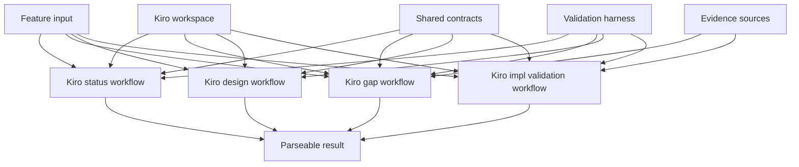
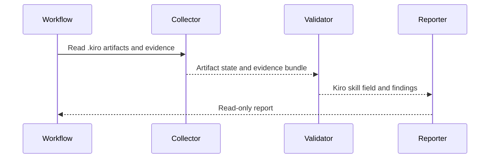
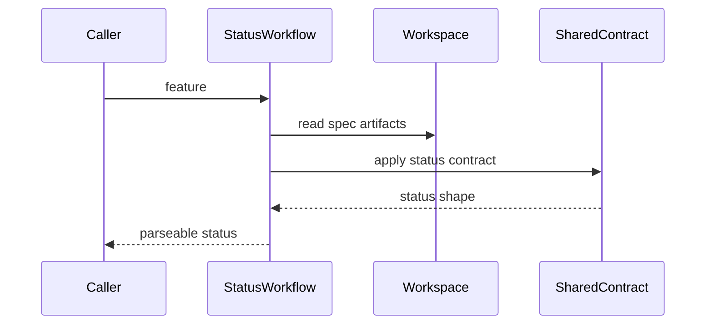
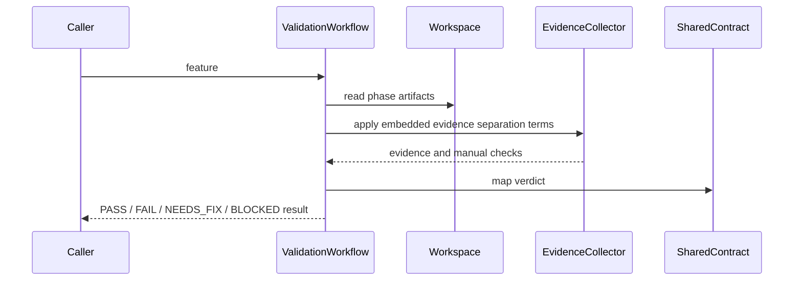

# Design Document

## Overview

`kiro-status-validation-workflows` は、Kiro-compatible SDD workspace の状態確認と検証判定を TAKT workflow として提供します。対象ユーザーは spec generation workflow、implementation workflow、reviewer、maintainer です。これらの利用者は `kiro-spec-status` と `kiro-validate-*` の結果を読んで、次 phase へ進めるか、人間の修正が必要か、または external evidence が不足しているかを判断します。

この spec は read-only validation layer です。`.kiro/specs/<feature>/` と `.kiro/steering/` を読み、Kiro validation skill が定義する primary field と `kiro-shared-workflow-contracts` の補助 status / validation result contract に従って結果を返します。spec artifact の生成、設計修正、implementation task execution、tasks.md checkbox 更新は扱いません。

### Goals

- `kiro-spec-status` で phase、approval、artifact consistency、ready-for-implementation を安定して報告する
- `kiro-validate-gap`、`kiro-validate-design`、`kiro-validate-impl` で後続 workflow が使える Kiro skill field と validation supplement を返す
- evidence と manual verification requirement を分け、検証不能な項目を成功扱いにしない
- 既存 `cc-sdd-validate-*` workflow/facet の配置規約を保ちながら、Kiro-specific な workflow 名と shared contract 参照へ移行する

### Non-Goals

- requirements/design/tasks の生成や更新
- `kiro-spec-batch`、cross-spec review、roadmap 更新
- `kiro-impl` の task selection、code edit、review/debug loop、checkbox 更新
- `kiro-shared-workflow-contracts` が所有する output contract enum や artifact policy の再定義
- OpenSpec validation workflow の置き換え

## Boundary Commitments

### This Spec Owns

- `kiro-spec-status`、`kiro-validate-gap`、`kiro-validate-design`、`kiro-validate-impl` の workflow YAML
- 各 workflow が使う Kiro-specific instruction facets と validation sequence
- status/readiness、gap/design/impl validation の判定 flow
- shared status / validation result contract への output mapping
- Kiro status/validation workflow の存在、facet reference、read-only boundary を検証する regression check

### Out of Boundary

- shared output contract facet の enum、required field、artifact policy 本体
- `kiro:*` npm script surface と migration shim
- spec artifact generation、artifact auto-fix、implementation execution
- review/debug sub-workflow の実行と retry loop
- `.kiro/steering/roadmap.md` の更新

### Allowed Dependencies

- Upstream `kiro-shared-workflow-contracts` の `kiro-status`、`kiro-validation-result`、`kiro-artifact-operations`、`kiro-spec-lifecycle`、skill identity policy
- Upstream `kiro-workflow-surface` の canonical `kiro:*` namespace と workflow naming policy
- 既存 `.takt/{en,ja}/workflows/cc-sdd-validate-*.yaml` と `.takt/{en,ja}/facets/instructions/cc-sdd-validate-*.md` の構成パターン
- repository-local Node.js 22+ validation script と既存 test command への接続

### Revalidation Triggers

- shared status / validation result contract の verdict enum、field name、tag の変更
- `spec.json` lifecycle state、approval field、ready-for-implementation semantics の変更
- `.kiro/specs/<feature>/` の artifact layout や required phase artifact の変更
- `kiro:*` script 名または workflow YAML 名の追加・削除・改名
- 下流 spec generation / implementation workflow が status/validation verdict の扱いを変更するとき

## Architecture

### Existing Architecture Analysis

現在の repository には `.takt/{en,ja}/workflows/cc-sdd-validate-gap.yaml`、`cc-sdd-validate-design.yaml`、`cc-sdd-validate-impl.yaml` と対応する instruction / output-contract facets が存在します。これらは cc-sdd 名義の validation workflow として利用されています。

Kiro-compatible surface では、workflow 名は `kiro-*` に移行し、結果の機械判定は `kiro-shared-workflow-contracts` が定義する shared contract を参照します。この spec は既存配置と language pair の考え方を維持しつつ、Kiro-specific な status/validation workflow と read-only validation harness を追加します。

### Architecture Pattern & Boundary Map

Selected pattern: read-only validation workflow layer。各 workflow は artifact reader と shared contract を使って判定を返し、artifact writer や implementation executor には依存しません。



Key decisions:

- `kiro-spec-status` は status contract を使い、`kiro-validate-*` は validation result contract を使う。
- workflow は `.kiro/*` artifact を読むだけにし、不整合を見つけても修復は提案に留める。
- workflow は単一 prompt step wrapper にせず、evidence collection、classification/validation、report の step に分ける。
- implementation validation は task execution を行わず、task completion と evidence の整合性だけを判定する。
- `kiro-validate-impl` は Kiro skill の `DECISION: GO | NO-GO | MANUAL_VERIFY_REQUIRED` を primary machine field として扱い、shared `verdict` は補助分類に限定する。
- `kiro-validate-design` と `kiro-validate-gap` も Kiro skill section を `extends_skill` / `extends_skill_section` で継承した thin adapter とし、Kiro skill 本文はコピーしない。
- read-only workflow には修正 loop、debug loop、implementation retry loop を入れない。修正が必要な場合は generation/implementation workflow に戻す next action を report する。
- validation harness は workflow/facet reference と read-only boundary を検証し、個別 feature の実装完了までは検証しない。
- Kiro-specific instruction facet は shared `BuiltinFacetInheritancePolicy` に従い、`node_modules/takt/builtins/{lang}/facets` の validation/review 系 built-in facet を継承できる場合は差分だけを書く。

### Technology Stack

| Layer | Choice / Version | Role in Feature | Notes |
|-------|------------------|-----------------|-------|
| Workflow runtime | TAKT workflow YAML | `kiro-spec-status` と `kiro-validate-*` の step / facet orchestration | `.takt/{en,ja}/workflows/` に配置 |
| Prompt/facet contract | TAKT facet Markdown | status / validation 手順と output contract 参照 | `.takt/{en,ja}/facets/` に配置 |
| Built-in facet inheritance | TAKT builtins facet Markdown | validation/review 系の親 facet と差分記述 | shared `BuiltinFacetInheritancePolicy` を参照 |
| Kiro skill adapter | TAKT instruction facet | Kiro validation skill section と TAKT input/output/rule の写像 | `extends_skill` / `extends_skill_section` を使う |
| Shared contract | Kiro shared facets | machine verdict、artifact policy、lifecycle semantics | 上流 spec の成果物を参照 |
| Spec workspace | `.kiro/steering/`, `.kiro/specs/` | status と validation の read-only input | OpenSpec artifact は対象外 |
| Validation | Node.js 22+ script/test | workflow existence、facet reference、read-only boundary の drift detection | 個別 feature completion は対象外 |

## File Structure Plan

### Directory Structure

```text
.
├── .takt/
│   ├── en/
│   │   ├── facets/
│   │   │   └── instructions/
│   │   │       ├── kiro-report-spec-status.md
│   │   │       ├── kiro-validate-gap-readiness.md
│   │   │       ├── kiro-validate-design-readiness.md
│   │   │       ├── kiro-validate-impl-readiness.md
│   │   │       └── kiro-collect-validation-evidence.md
│   │   └── workflows/
│   │       ├── kiro-spec-status.yaml
│   │       ├── kiro-validate-gap.yaml
│   │       ├── kiro-validate-design.yaml
│   │       └── kiro-validate-impl.yaml
│   ├── ja/
│   │   ├── facets/
│   │   │   └── instructions/
│   │   │       ├── kiro-report-spec-status.md
│   │   │       ├── kiro-validate-gap-readiness.md
│   │   │       ├── kiro-validate-design-readiness.md
│   │   │       ├── kiro-validate-impl-readiness.md
│   │   │       └── kiro-collect-validation-evidence.md
│   │   └── workflows/
│   │       ├── kiro-spec-status.yaml
│   │       ├── kiro-validate-gap.yaml
│   │       ├── kiro-validate-design.yaml
│   │       └── kiro-validate-impl.yaml
├── scripts/
│   └── validate-kiro-status-validation-workflows.mjs
└── tests/
    └── kiro-status-validation-workflows.test.mjs
```

### Created Files

- `.takt/{en,ja}/facets/instructions/kiro-report-spec-status.md` — feature existence、phase、approval、artifact consistency、ready-for-implementation を読む status 手順。
- `.takt/{en,ja}/facets/instructions/kiro-validate-gap-readiness.md` — requirements と current codebase evidence から gap validation verdict を作る手順。
- `.takt/{en,ja}/facets/instructions/kiro-validate-design-readiness.md` — requirements/design の coverage、boundary、file structure、validation hooks を検証する手順。
- `.takt/{en,ja}/facets/instructions/kiro-validate-impl-readiness.md` — tasks、task completion、test/build evidence、manual verification を検証する手順。
- `.takt/{en,ja}/facets/instructions/kiro-collect-validation-evidence.md` — validation workflow 共通の evidence と `MANUAL_VERIFICATION_REQUIRED` finding の分離規約。TAKT workflow YAML の `instruction` は単一参照であるため、gap/implementation workflow では readiness facet に同じ証跡分離語彙を埋め込む。
- `.takt/{en,ja}/workflows/kiro-spec-status.yaml` — `kiro-spec-status` workflow。
- `.takt/{en,ja}/workflows/kiro-validate-gap.yaml` — `kiro-validate-gap` workflow。
- `.takt/{en,ja}/workflows/kiro-validate-design.yaml` — `kiro-validate-design` workflow。
- `.takt/{en,ja}/workflows/kiro-validate-impl.yaml` — `kiro-validate-impl` workflow。
- `scripts/validate-kiro-status-validation-workflows.mjs` — Kiro status/validation workflow の existence、facet reference、shared contract reference、read-only boundary を検証する script。
- `tests/kiro-status-validation-workflows.test.mjs` — validation script を test runner から実行する regression test。

### Modified Files

- `package.json` — `validate:kiro-status-validation-workflows` と `test:kiro-status-validation-workflows` を追加し、status/validation workflow drift を repository-local command と test runner から実行できる形にする。`kiro:*` public script surface の所有権は本 spec にはない。

### Component to File Mapping

- `KiroSpecStatusWorkflow` — `.takt/{en,ja}/workflows/kiro-spec-status.yaml`、`.takt/{en,ja}/facets/instructions/kiro-report-spec-status.md`
- `KiroGapValidationWorkflow` — `.takt/{en,ja}/workflows/kiro-validate-gap.yaml`、`.takt/{en,ja}/facets/instructions/kiro-validate-gap-readiness.md`
- `KiroDesignValidationWorkflow` — `.takt/{en,ja}/workflows/kiro-validate-design.yaml`、`.takt/{en,ja}/facets/instructions/kiro-validate-design-readiness.md`
- `KiroImplValidationWorkflow` — `.takt/{en,ja}/workflows/kiro-validate-impl.yaml`、`.takt/{en,ja}/facets/instructions/kiro-validate-impl-readiness.md`
- `KiroEvidenceCollector` — `.takt/{en,ja}/facets/instructions/kiro-collect-validation-evidence.md`
- `KiroReadinessEvaluator` — workflow YAML の branch conditions と status/readiness instruction facet
- `KiroValidationOutputMapper` — workflow YAML の output contract reference と validation result mapping
- `StatusValidationWorkflowValidationHarness` — `scripts/validate-kiro-status-validation-workflows.mjs`、`tests/kiro-status-validation-workflows.test.mjs`

## System Flows

### Read-Only Step Shape



この flow は artifact write step を持ちません。validation が `NO-GO`、`BLOCKED`、manual verification を返す場合でも、この spec は修正を実行せず、修正先 workflow と理由だけを report します。

### Status Flow



Status workflow は `spec.json` と phase artifact の整合性を読むだけです。missing や inconsistent state は error category として返し、修復は行いません。

### Validation Flow



Validation workflow は artifact state と evidence を分けて扱います。証跡がない項目は shared validation result contract の `findings` に `category: "MANUAL_VERIFICATION_REQUIRED"` として写像し、`PASS` verdict の根拠には含めません。

## Data Models

### Kiro Validation Adapter Map

| Workflow | Kiro skill source | Primary machine field | Read-only output |
|----------|-------------------|-----------------------|------------------|
| `kiro-spec-status` | `kiro-spec-status` | status/readiness fields | feature existence、phase、approval、artifact inconsistency |
| `kiro-validate-gap` | `kiro-validate-gap` | skill-defined validation result | existing implementation evidence、missing components、manual verification |
| `kiro-validate-design` | `kiro-validate-design` | skill-defined validation result | requirements coverage、boundary findings、design gaps |
| `kiro-validate-impl` | `kiro-validate-impl` | `DECISION` | task completion、test/build evidence、manual verification |

shared validation supplement の `verdict` は後続 workflow の人間向け分類に使えますが、Kiro skill が `DECISION` などの field を定義している場合はその field を rule condition の primary にします。

## Requirements Traceability

| Requirement | Summary | Components | Interfaces | Flows |
|-------------|---------|------------|------------|-------|
| 1.1 | feature status の parseable report | KiroSpecStatusWorkflow, KiroReadinessEvaluator, KiroValidationOutputMapper | Status output contract | Status Flow |
| 1.2 | missing feature の停止可能な error | KiroSpecStatusWorkflow, KiroValidationOutputMapper | Status error category | Status Flow |
| 1.3 | lifecycle inconsistency と missing artifact の分離 | KiroSpecStatusWorkflow, KiroReadinessEvaluator | Artifact policy | Status Flow |
| 1.4 | human summary と machine field の分離 | KiroValidationOutputMapper | Status output contract | Status Flow |
| 2.1 | gap validation result | KiroGapValidationWorkflow, KiroEvidenceCollector | Validation result contract | Validation Flow |
| 2.2 | requirements 不足時の failure verdict | KiroGapValidationWorkflow, KiroReadinessEvaluator | Validation result contract | Validation Flow |
| 2.3 | manual verification finding | KiroGapValidationWorkflow, KiroEvidenceCollector | Validation result findings | Validation Flow |
| 2.4 | gap validation の read-only 境界 | KiroGapValidationWorkflow | Artifact policy | Validation Flow |
| 3.1 | design readiness validation | KiroDesignValidationWorkflow, KiroReadinessEvaluator | Validation result contract | Validation Flow |
| 3.2 | design artifact/lifecycle 不足時の failure verdict | KiroDesignValidationWorkflow, KiroReadinessEvaluator | Lifecycle policy | Validation Flow |
| 3.3 | boundary violation finding | KiroDesignValidationWorkflow, KiroValidationOutputMapper | Finding output | Validation Flow |
| 3.4 | design.md を自動修正しない | KiroDesignValidationWorkflow | Read-only policy | Validation Flow |
| 4.1 | implementation validation result | KiroImplValidationWorkflow, KiroEvidenceCollector | Validation result contract | Validation Flow |
| 4.2 | tasks/ready state 不足時の failure verdict | KiroImplValidationWorkflow, KiroReadinessEvaluator | Lifecycle policy | Validation Flow |
| 4.3 | task completion と evidence mismatch | KiroImplValidationWorkflow, KiroEvidenceCollector | Evidence contract | Validation Flow |
| 4.4 | task execution と checkbox 更新をしない | KiroImplValidationWorkflow | Read-only policy | Validation Flow |
| 5.1 | shared validation result contract の利用 | KiroValidationOutputMapper | Validation result contract | Validation Flow |
| 5.2 | PASS verdict と根拠 | KiroValidationOutputMapper, KiroEvidenceCollector | Verdict mapping | Validation Flow |
| 5.3 | FAIL/NEEDS_FIX/BLOCKED verdict の分類 | KiroValidationOutputMapper, KiroReadinessEvaluator | Verdict mapping | Validation Flow |
| 5.4 | unverified item の分離 | KiroEvidenceCollector, KiroValidationOutputMapper | Validation result findings | Validation Flow |
| 6.1 | `.kiro/*` read-only boundary | KiroSpecStatusWorkflow, KiroGapValidationWorkflow, KiroDesignValidationWorkflow, KiroImplValidationWorkflow | Artifact policy | Status Flow, Validation Flow |
| 6.2 | shared contract change revalidation | StatusValidationWorkflowValidationHarness | Validation script | Harness validation |
| 6.3 | downstream 内部 logic への非依存 | KiroValidationOutputMapper | Shared contract output | Validation Flow |
| 6.4 | OpenSpec validation と分離 | StatusValidationWorkflowValidationHarness | Scope guard | Harness validation |

## Components and Interfaces

| Component | Domain/Layer | Intent | Req Coverage | Key Dependencies | Contracts |
|-----------|--------------|--------|--------------|------------------|-----------|
| KiroSpecStatusWorkflow | Workflow | feature status と readiness を返す | 1.1, 1.2, 1.3, 1.4, 6.1 | shared status contract P0, `.kiro/specs` P0 | Service, State |
| KiroGapValidationWorkflow | Workflow | requirements と current implementation gap を判定する | 2.1, 2.2, 2.3, 2.4, 6.1 | shared validation result P0, codebase evidence P1 | Service, Batch |
| KiroDesignValidationWorkflow | Workflow | design の coverage と boundary readiness を判定する | 3.1, 3.2, 3.3, 3.4, 6.1 | requirements/design artifacts P0 | Service, Batch |
| KiroImplValidationWorkflow | Workflow | task completion と evidence 整合性を判定する | 4.1, 4.2, 4.3, 4.4, 6.1 | tasks artifact P0, test/build evidence P1 | Service, Batch |
| KiroEvidenceCollector | Facet instruction | evidence と `MANUAL_VERIFICATION_REQUIRED` finding を分ける | 2.3, 4.1, 4.3, 5.2, 5.4 | filesystem/codebase evidence P1 | Service |
| KiroReadinessEvaluator | Workflow logic | phase、approval、artifact consistency から gate 判定を作る | 1.1, 1.3, 2.2, 3.2, 4.2, 5.3 | lifecycle policy P0 | Service, State |
| KiroValidationOutputMapper | Workflow output | status/validation result contract へ verdict を写像する | 1.4, 3.3, 5.1, 5.2, 5.3, 5.4, 6.3 | shared output contracts P0 | Service |
| StatusValidationWorkflowValidationHarness | Validation | workflow/facet reference と read-only scope drift を検出する | 6.2, 6.4 | workflow YAML P0, shared contracts P0 | Batch |

### Workflow Layer

#### KiroSpecStatusWorkflow

| Field | Detail |
|-------|--------|
| Intent | `.kiro/specs/<feature>/` の状態を読み、status/readiness を返す |
| Requirements | 1.1, 1.2, 1.3, 1.4, 6.1 |

**Responsibilities & Constraints**

- feature directory、`spec.json`、phase artifact の存在を確認する。
- phase、approvals、ready-for-implementation、artifact consistency を status contract に写像する。
- missing feature と lifecycle inconsistency を区別する。
- artifact の作成、更新、修復を行わない。

**Dependencies**

- Inbound: `kiro:*` script surface と downstream workflow — status query として呼び出す (P0)
- Outbound: `.kiro/specs/<feature>/` — read-only artifact source (P0)
- Outbound: shared `kiro-status` output contract — result shape (P0)

**Contracts**: Service [x] / API [ ] / Event [ ] / Batch [ ] / State [x]

##### Service Interface

```typescript
type KiroStatusState = SharedKiroStatusContract["status"];
type KiroReadinessState = SharedKiroStatusContract["readiness"];

interface KiroSpecStatusResult {
  readonly feature: string;
  readonly status: KiroStatusState;
  readonly readiness: KiroReadinessState;
  readonly phase?: string;
  readonly approvals?: Readonly<Record<string, boolean>>;
  readonly readyForImplementation: boolean;
  readonly missingArtifacts: readonly string[];
  readonly errorCategory?: SharedKiroArtifactErrorCategory;
  readonly summary: string;
}
```

- Preconditions: feature 名が workflow target として渡されている。
- Postconditions: machine field と summary が分離された status result を返す。
- Invariants: `.kiro/*` artifact は変更しない。

#### KiroGapValidationWorkflow

| Field | Detail |
|-------|--------|
| Intent | requirements と current codebase の差分を検証し、design phase 前の validation verdict を返す |
| Requirements | 2.1, 2.2, 2.3, 2.4, 6.1 |

**Responsibilities & Constraints**

- requirements artifact と feature lifecycle を検証前提として確認する。
- existing implementation、missing components、integration points、recommended next action を validation result にまとめる。
- codebase evidence が不足する場合は `findings` の `category: "MANUAL_VERIFICATION_REQUIRED"` に分離する。
- requirements/design/tasks artifact を生成または更新しない。

**Dependencies**

- Inbound: spec generation workflow または人間 reviewer — design 前検証として呼び出す (P0)
- Outbound: `.kiro/specs/<feature>/requirements.md` — read-only input (P0)
- Outbound: repository codebase — evidence source (P1)
- Outbound: shared `kiro-validation-result` output contract — result shape (P0)

**Contracts**: Service [x] / API [ ] / Event [ ] / Batch [x] / State [ ]

#### KiroDesignValidationWorkflow

| Field | Detail |
|-------|--------|
| Intent | design の requirements coverage、boundary、file structure、validation hooks を検証する |
| Requirements | 3.1, 3.2, 3.3, 3.4, 6.1 |

**Responsibilities & Constraints**

- requirements と design の存在、approval state、phase consistency を確認する。
- Boundary Commitments、File Structure Plan、requirements traceability、validation hooks の欠落を finding として返す。
- 下流 spec の責務を吸収している記述を boundary violation として扱う。
- design.md を自動修正しない。

**Dependencies**

- Inbound: reviewer、spec generation workflow — design gate として呼び出す (P0)
- Outbound: `.kiro/specs/<feature>/requirements.md`、`design.md`、optional `research.md`、`spec.json` — read-only input (P0)
- Outbound: shared validation result contract — result shape (P0)

**Contracts**: Service [x] / API [ ] / Event [ ] / Batch [x] / State [ ]

#### KiroImplValidationWorkflow

| Field | Detail |
|-------|--------|
| Intent | implementation 後に task completion と evidence の整合性を検証する |
| Requirements | 4.1, 4.2, 4.3, 4.4, 6.1 |

**Responsibilities & Constraints**

- tasks artifact、ready-for-implementation、task checkbox、test/build evidence を確認する。
- incomplete work、evidence mismatch、manual verification finding を分けて報告する。
- implementation task を実行しない。
- tasks.md checkbox を更新しない。

**Dependencies**

- Inbound: `kiro-iterative-implementation-workflow` または maintainer — completion gate として呼び出す (P0)
- Outbound: `.kiro/specs/<feature>/tasks.md`、`spec.json` — read-only input (P0)
- Outbound: repository test/build evidence — evidence source (P1)
- Outbound: shared validation result contract — result shape (P0)

**Contracts**: Service [x] / API [ ] / Event [ ] / Batch [x] / State [ ]

### Shared Validation Helpers

#### KiroEvidenceCollector

| Field | Detail |
|-------|--------|
| Intent | workflow が参照した証跡と未検証項目を分離する |
| Requirements | 2.3, 4.1, 4.3, 5.2, 5.4 |

**Responsibilities & Constraints**

- codebase scan、test/build result、task completion evidence を workflow output に渡せる粒度で整理する。
- 確認できた evidence と確認できなかった manual verification finding を混同しない。
- evidence のない項目を `PASS` verdict の根拠に含めない。

**Dependencies**

- Inbound: gap/implementation validation workflow — readiness facet に埋め込む evidence separation 語彙として参照する (P0)
- Outbound: repository files、test/build logs — read-only evidence source (P1)

**Contracts**: Service [x] / API [ ] / Event [ ] / Batch [ ] / State [ ]

##### Service Interface

```typescript
interface KiroValidationEvidence {
  readonly observed: readonly string[];
  readonly missing: readonly string[];
  readonly manualVerificationRequired: readonly string[];
}
```

- Preconditions: validation target と確認対象 artifact が明確である。
- Postconditions: observed evidence と `MANUAL_VERIFICATION_REQUIRED` finding が分離される。
- Invariants: evidence collection は repository state を変更しない。

#### KiroReadinessEvaluator

| Field | Detail |
|-------|--------|
| Intent | phase、approval、artifact consistency から workflow gate 判定を作る |
| Requirements | 1.1, 1.3, 2.2, 3.2, 4.2, 5.3 |

**Responsibilities & Constraints**

- requirements/design/tasks phase ごとの必須 artifact と approval state を評価する。
- missing artifact と lifecycle inconsistency を別カテゴリとして出す。
- `FAIL`、`NEEDS_FIX`、`BLOCKED` の分類を shared lifecycle policy に合わせる。

**Dependencies**

- Inbound: status/gap/design/impl validation workflow — gate 判定として使用する (P0)
- Outbound: shared artifact policy と lifecycle policy — expected state (P0)

**Contracts**: Service [x] / API [ ] / Event [ ] / Batch [ ] / State [x]

#### KiroValidationOutputMapper

| Field | Detail |
|-------|--------|
| Intent | workflow 内部判定を shared status / validation result contract に写像する |
| Requirements | 1.4, 3.3, 5.1, 5.2, 5.3, 5.4, 6.3 |

**Responsibilities & Constraints**

- `PASS`、`FAIL`、`NEEDS_FIX`、`BLOCKED` の machine verdict を安定して出す。
- human summary、machine finding、error category、evidence を分ける。shared `kiro-validation-result` contract に存在しない `reason` や `manual_verification_required` field は追加せず、停止理由は `findings.message` と `error_category`、未検証項目は `findings.category: "MANUAL_VERIFICATION_REQUIRED"` に写像する。
- downstream workflow の task selection や generation prompt を要求しない。

**Dependencies**

- Inbound: all Kiro status/validation workflows — output step として参照する (P0)
- Outbound: shared `kiro-status` と `kiro-validation-result` contract — output shape (P0)

**Contracts**: Service [x] / API [ ] / Event [ ] / Batch [ ] / State [ ]

### Validation Layer

#### StatusValidationWorkflowValidationHarness

| Field | Detail |
|-------|--------|
| Intent | Kiro status/validation workflow の drift を repository-local check で検出する |
| Requirements | 6.2, 6.4 |

**Responsibilities & Constraints**

- en/ja の workflow YAML と instruction facets が揃っていることを検証する。
- workflow が shared status / validation result contract を参照することを検証する。
- read-only boundary に反する artifact write instruction や OpenSpec workflow への誤接続を検出する。
- 個別 feature の implementation 完了や code coverage は検証対象にしない。

**Dependencies**

- Inbound: test runner — regression test として実行する (P0)
- Outbound: `.takt/{en,ja}/workflows/kiro-*.yaml`、`.takt/{en,ja}/facets/` — validation target (P0)
- Outbound: upstream shared contracts — required reference names (P0)

**Contracts**: Service [ ] / API [ ] / Event [ ] / Batch [x] / State [ ]

##### Batch Contract

- Trigger: repository-local test/check command。
- Input / validation: Kiro status/validation workflow file set、instruction facet file set、shared contract reference names。
- Output / destination: pass/fail result と missing reference / boundary violation の一覧。
- Idempotency & recovery: read-only scan なので繰り返し実行しても repository state は変わらない。

## Testing Strategy

- `KiroSpecStatusWorkflow` は、missing feature、initialized feature、requirements/design/tasks generated、lifecycle inconsistency の fixture で status verdict と missing artifact category を検証する。
- `KiroGapValidationWorkflow` は、requirements missing、requirements present with no evidence、requirements present with observed integration points の fixture で shared validation verdict と `MANUAL_VERIFICATION_REQUIRED` finding separation を検証する。
- `KiroDesignValidationWorkflow` は、Boundary Commitments missing、File Structure Plan missing、requirements traceability incomplete、out-of-boundary absorption の fixture で actionable finding を検証する。
- `KiroImplValidationWorkflow` は、tasks missing、ready state false、unchecked task、test/build evidence missing、manual verification remaining を `findings` に写像する fixture で verdict を検証する。
- `StatusValidationWorkflowValidationHarness` は、en/ja file parity、shared contract reference、read-only instruction、OpenSpec separation を検証する。
- `StatusValidationWorkflowValidationHarness` は、Kiro-specific instruction facet の `{extends: parent}` 単独行 directive が shared `BuiltinFacetInheritancePolicy` に従い、同じ facet kind の bare parent name として解決できること、または full custom の理由があることを検証する。

## Integration & Migration Notes

- `kiro-workflow-surface` が `kiro:*` scripts を公開するため、本 spec は public `kiro:*` script ownership を持たない。ただし `validate:kiro-status-validation-workflows` / `test:kiro-status-validation-workflows` の repository-local validation wiring は本 spec が所有する。
- `kiro-shared-workflow-contracts` の output contract が未実装の場合、この spec の workflow validation は shared contract missing として失敗する設計にする。
- 既存 `cc-sdd-validate-*` workflow は参照元として使えるが、Kiro workflow の canonical output は shared Kiro contract に合わせる。
- built-in facet を継承できる instruction は親候補を棚卸しし、Kiro 固有の artifact/lifecycle 判定だけを差分として記述する。TAKT runtime が `extends` 未対応の場合は shared validation の `FACET_EXTENDS_UNSUPPORTED` に従って前提不足として扱う。
- 並列実装では、instruction facet、workflow YAML、validation harness を別 boundary として進められる。ただし workflow YAML は instruction facet と shared contract reference が揃ってから統合する。

## Open Questions / Risks

- test/build evidence の取得元は repository ごとに異なるため、初期実装では evidence を「存在確認できた証跡」と `MANUAL_VERIFICATION_REQUIRED` finding に分けるところまでを contract とし、実行方法の自動推定は避ける。
- downstream `kiro-iterative-implementation-workflow` が completion verification をより厳密に要求する場合は、shared contract の field 追加と本 workflow の再検証が必要になる。
