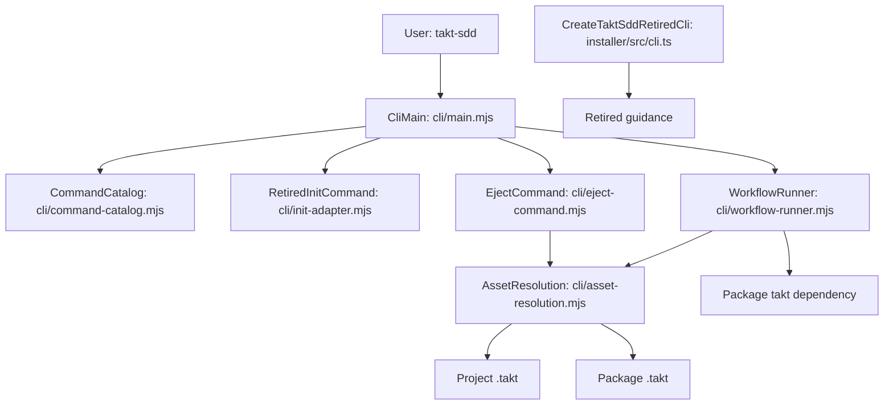
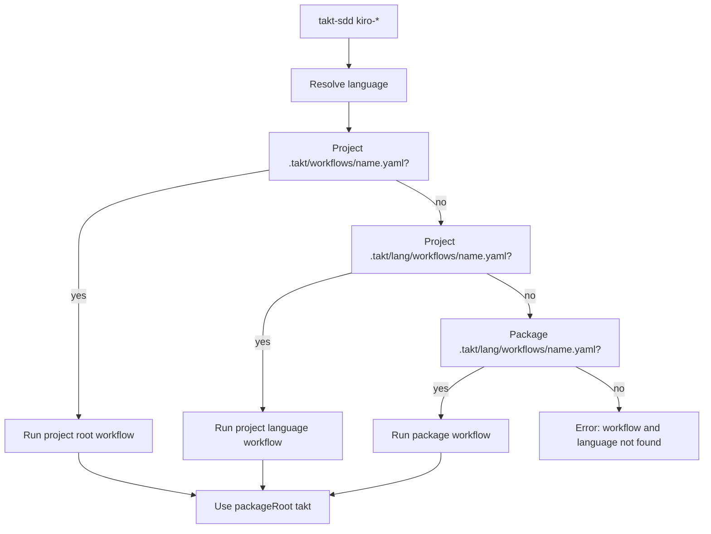
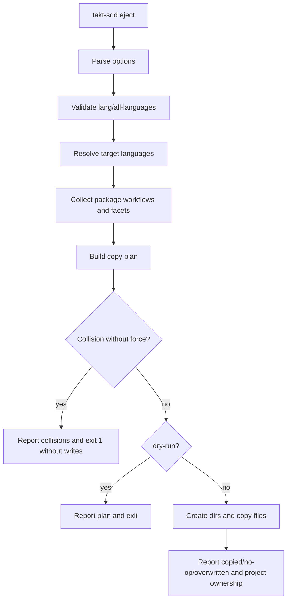
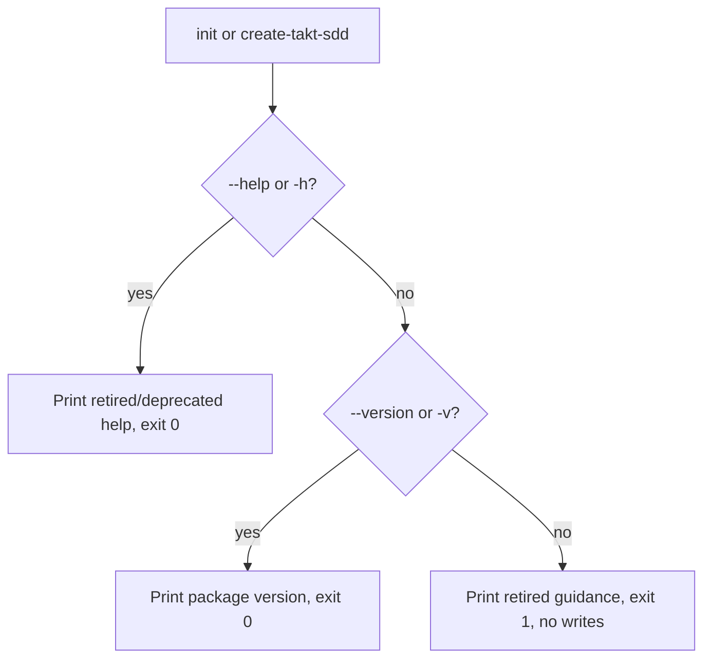
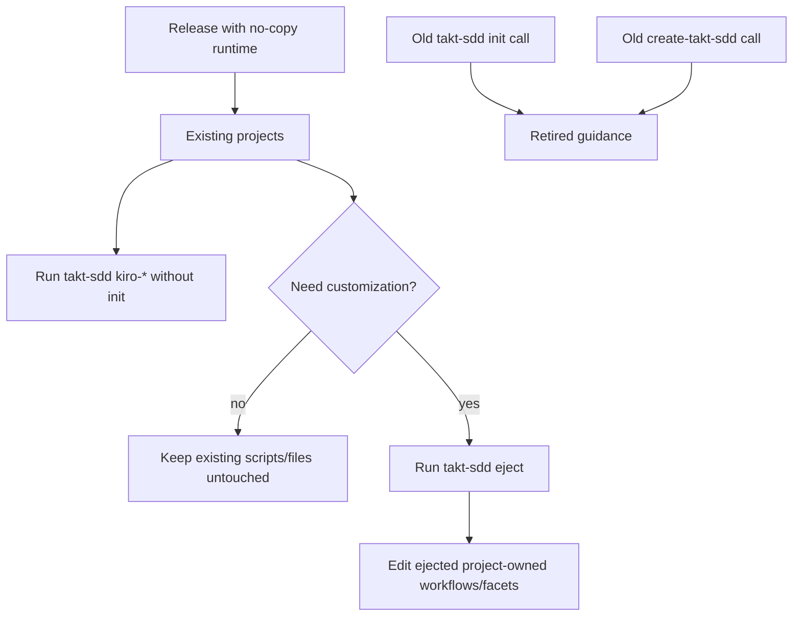

# 設計

## 概要
takt-sdd の通常実行を project-local asset copy 前提から、installed package に同梱された workflows/facets を直接使う実行モデルへ切り替える。利用者は `takt-sdd kiro-*` をそのまま実行でき、`.takt/` が未作成でも package bundled workflow が選ばれる。

カスタマイズが必要な場合だけ `takt-sdd eject` で workflows/facets を project-owned files として取り出す。`init` と `create-takt-sdd` は当面 command と package を残すが、help 以外は書き込みをせず retired guidance を返す。

### 目標
- workflow/facet の通常利用から project-local copy と manifest update を外す。
- project-local workflow を明示 override として維持しつつ、package workflow と project facets の暗黙混在を防ぐ。
- `eject` を唯一の明示 copy 導線にし、collision を事前検出して partial write を避ける。
- `init` と `create-takt-sdd` の旧導線を安全な案内に変える。
- README/CHANGELOG に major version を上げない破壊的挙動変更として移行手順を残す。

### 非目標
- workflow 単位、facet 単体、差分単位の部分 eject。
- `.takt/config.yaml` や `.takt/.manifest.json` の作成・更新。
- package.json scripts や `scripts/kiro-staged.mjs` の自動追加・削除。
- ejected files の prune、空 directory cleanup、package から削除済み asset の自動削除。
- npm registry 上での package deprecate 操作、major version bump。

## 境界コミットメント

### このスペックが所有するもの
- `takt-sdd` CLI の runtime asset resolution。
- `takt-sdd init` の retired help/guidance と no-write behavior。
- `takt-sdd eject` の argument parsing、asset plan、collision handling、copy apply、result messaging。
- `create-takt-sdd` public CLI の retired help/guidance と no-write behavior。
- README/CHANGELOG の migration guidance と BREAKING BEHAVIOR CHANGE の明示。

### 境界外
- TAKT 本体の facet resolution 実装。takt-sdd は選択 workflow path を渡し、facet は workflow からの相対参照として解決させる。
- 既存 project-local workflow/facet の内容移行、整合性修復、prune。
- `scripts/kiro-staged.mjs` の利用者側 copy 削除や npm scripts の rewrite。
- installer core の download/copy/manifest/package.json merge 機能の再設計。public CLI から到達しないようにすることだけを所有する。

### 許可する依存
- Node.js 標準 library: `fs`, `path`, `crypto`, `module`, `child_process`, `url`。
- installed `takt-sdd` package root 配下の `.takt/{en,ja}/workflows` と `.takt/{en,ja}/facets`。
- installed `takt-sdd` package root の `takt` dependency。
- 既存 `cli/command-catalog.mjs` の supported/retired workflow catalog。
- 既存 `node:test` ベースの test harness と package artifact validator。

### 再検証トリガー
- TAKT が workflow file から facet を相対解決する前提を変更した場合。
- package bundled asset layout `.takt/{en,ja}/{workflows,facets}` を変更した場合。
- supported workflow catalog、retired workflow catalog、public command names を変更した場合。
- language source priority、eject collision policy、retired command exit code を変更した場合。
- `create-takt-sdd` package の publish artifact や bin entry を変更した場合。

## アーキテクチャ

### 既存アーキテクチャ分析
- `cli/main.mjs` は global option parsing と top-level command dispatch を持つ。現在は `init` と supported workflow の実行前に installer build を要求している。
- `cli/workflow-runner.mjs` は preflight、workflow path 解決、packageRoot `takt` 実行を持つ。workflow path は project `.takt/` のみを候補にしている。
- `cli/init-adapter.mjs` は init parser と installer core delegation を持つ。廃止後は旧 copy semantics を保持しない retired command adapter に変える。
- `installer/src/cli.ts` は `create-takt-sdd` の public entry で、現在は `install()` により download、copy、manifest、package.json merge へ進む。
- `.takt/{en,ja}` は package artifact に含まれる authoritative bundled assets であり、今後は通常実行時の default source になる。

### アーキテクチャパターンと境界マップ
採用パターンは「CLI command routing + shared asset resolution + plan/apply eject」。runtime と eject で language policy を共有し、copy safety は `EjectCommand` に閉じ込める。



**Architecture Integration（アーキテクチャ統合）**:
- 採用パターン: top-level command dispatch は既存 `main` に維持し、asset 解決だけを shared module に切り出す。
- 機能境界: workflow 実行は `WorkflowRunner`、copy は `EjectCommand`、廃止案内は retired command adapters が所有する。
- 維持する既存パターン: supported workflow catalog、packageRoot `takt` resolution、`node:test` による CLI unit/integration tests。
- 新規コンポーネントの根拠: `AssetResolution` は runtime と eject の language policy 重複を避ける。`EjectCommand` は manifest を使わない copy plan を独立させる。
- ステアリング準拠: `.takt/{en,ja}` の asset layout、`cli/` と `installer/` の分離、退役 command の明示 rejection を維持する。

### 技術スタック

| レイヤー | 選択／バージョン | 機能内での役割 | メモ |
|----------|------------------|----------------|------|
| CLI | Node.js ESM | `takt-sdd` command routing、workflow run、eject | 既存 `cli/*.mjs` に合わせる |
| Installer CLI | TypeScript | `create-takt-sdd` retired guidance | public entry のみ変更 |
| Data/Storage | filesystem | package assets と project files の読み書き | manifest は新規作成・更新しない |
| Runtime | Node.js 22+, packageRoot `takt` | workflow execution | project-local `takt` は不要 |
| Tests | `node:test` | CLI behavior、copy plan、package artifact validation | 既存 test style を維持 |

## ファイル構造計画

### ディレクトリ構造
```text
cli/
├── main.mjs                  # CliMain: top-level dispatch に eject と retired init を追加
├── command-catalog.mjs       # CommandCatalog: help surface に eject と deprecated init を反映
├── workflow-runner.mjs       # WorkflowRunner: package fallback と simplified preflight を使用
├── asset-resolution.mjs      # AssetResolution: language と workflow asset candidate の共有解決
├── eject-command.mjs         # EjectCommand: parse, plan, dry-run, apply, result messaging
└── init-adapter.mjs          # RetiredInitCommand: init help/guidance のみ、installer delegation を削除

installer/src/
├── cli.ts                    # CreateTaktSddRetiredCli: help/version と retired guidance のみ
├── i18n.ts                   # retired help/guidance message を保持
└── install.ts                # public CLI から呼ばれない legacy install core として残置

tests/
├── takt-sdd-cli.test.mjs     # runtime resolution, main dispatch, help, retired init/create smoke
├── takt-sdd-eject.test.mjs   # EjectCommand plan/apply/dry-run/collision tests
├── takt-sdd-init-policy.test.mjs # retired init no-write tests に再編
└── takt-sdd-package-artifact.test.mjs # package files と deprecated copy surface の検証

README.md                       # DocumentationMigration: 英語 migration guidance
README.ja.md                    # DocumentationMigration: 日本語 migration guidance
CHANGELOG.md                    # DocumentationMigration: breaking behavior change の記録
```

### 変更対象ファイル
- `cli/main.mjs` — `init` を retired command として処理し、`eject` dispatch を追加する。supported workflow 実行前の installer build check を不要にする。
- `cli/command-catalog.mjs` — top-level help に `eject` を追加し、`init` を deprecated guidance として表示する。
- `cli/workflow-runner.mjs` — `AssetResolution` を使って project root override、project language override、package bundled workflow の順に解決する。project-local `takt` binary check を削除する。
- `cli/asset-resolution.mjs` — language resolution と workflow path resolution を提供する新規 module。
- `cli/eject-command.mjs` — eject の parser、copy plan、collision policy、write apply を提供する新規 module。
- `cli/init-adapter.mjs` — old parser/delegation を retired help/guidance へ置き換える。
- `installer/src/cli.ts` — help/version 以外は retired guidance を表示して exit 1 にし、`install()` を呼ばない。
- `installer/src/i18n.ts` — `create-takt-sdd` の retired help/guidance を英日 message として持つ。
- `installer/src/install.ts` — public entry から到達しないことを前提に残す。必要に応じて未使用 import を後続 task で整理する。
- `tests/takt-sdd-cli.test.mjs` — runtime package fallback、project override precedence、preflight simplification、help dispatch を更新する。
- `tests/takt-sdd-eject.test.mjs` — eject の plan/apply/dry-run/collision/no-prune/no-config tests を追加する。
- `tests/takt-sdd-init-policy.test.mjs` — retired init の no-write と旧 option validation skip を検証する。
- `tests/takt-sdd-package-artifact.test.mjs` — package bundled assets と no-copy default の packaging expectation を更新する。
- `installer/src/install.test.ts` — `create-takt-sdd` public CLI が install core に到達しないこと、retired help/guidance を検証する。
- `README.md`、`README.ja.md` — no-copy runtime、`eject`、retired `init`/`create-takt-sdd`、manual npm scripts を説明する。
- `CHANGELOG.md` — BREAKING BEHAVIOR CHANGE と migration を明記する。

## システムフロー

### Workflow 実行


選択された workflow path だけを `takt` に渡す。package workflow が選択された場合は package facets を相対参照し、project-local facet-only files は関与しない。project workflow が選択された場合も package facets fallback は実装しない。

### Eject


plan は write 前に全対象 file を分類する。collision があり `--force` がない場合は、missing file があっても何も作成しない。

### Retired commands


`takt-sdd init` は旧 target dir や `--force` を検証しない。`create-takt-sdd` も通常実行では install core に到達しない。

## 要件トレーサビリティ

| 要件 | 要約 | コンポーネント | インターフェース | フロー |
|------|------|----------------|------------------|--------|
| 1.1 | project workflow がない場合 package workflow を解決 | AssetResolution, WorkflowRunner | `resolveWorkflowAsset()` | Workflow 実行 |
| 1.2 | legacy root override を最優先 | AssetResolution | `WorkflowSource.kind = "project-root"` | Workflow 実行 |
| 1.3 | language-specific project override を次に優先 | AssetResolution | `WorkflowSource.kind = "project-language"` | Workflow 実行 |
| 1.4 | `.takt/` なしでも package workflow を実行 | WorkflowRunner | `preflight()` | Workflow 実行 |
| 1.5 | package workflow に project facets を混ぜない | WorkflowRunner | selected workflow path only | Workflow 実行 |
| 1.6 | project workflow の facet 不足を package fallback で隠さない | WorkflowRunner | no facet fallback | Workflow 実行 |
| 2.1 | config `language` を最優先 | AssetResolution | `resolveLanguage()` | Workflow 実行, Eject |
| 2.2 | manifest `lang` を read-only fallback | AssetResolution | `resolveLanguage()` | Workflow 実行, Eject |
| 2.3 | language default は `en` | AssetResolution | `resolveLanguage()` | Workflow 実行, Eject |
| 2.4 | project-local `takt` binary 不在で拒否しない | WorkflowRunner | simplified `preflight()` | Workflow 実行 |
| 2.5 | packageRoot `takt` を使う | WorkflowRunner | `resolveTaktBin()` | Workflow 実行 |
| 2.6 | missing workflow error は init を求めない | WorkflowRunner | `PreflightError` message | Workflow 実行 |
| 3.1 | `init --help/-h` は exit 0 | RetiredInitCommand, CliMain | `buildInitHelpText()` | Retired commands |
| 3.2 | help 以外の `init` は guidance exit 1 | RetiredInitCommand, CliMain | `runRetiredInit()` | Retired commands |
| 3.3 | `init` は files を変更しない | RetiredInitCommand | no installer delegation | Retired commands |
| 3.4 | old option validation より guidance 優先 | RetiredInitCommand | args passthrough | Retired commands |
| 3.5 | bundled assets と `eject` を案内 | RetiredInitCommand | guidance text | Retired commands |
| 4.1 | `eject --help/-h` は usage exit 0 | EjectCommand, CliMain | `buildEjectHelpText()` | Eject |
| 4.2 | option なしは resolved language のみ | EjectCommand, AssetResolution | `parseEjectArgs()` | Eject |
| 4.3 | `--lang` は指定 language のみ | EjectCommand | `EjectOptions.languages` | Eject |
| 4.4 | `--all-languages` は en/ja | EjectCommand | `EjectOptions.languages` | Eject |
| 4.5 | `--lang` と `--all-languages` は排他 | EjectCommand | `UsageError` | Eject |
| 4.6 | workflows/facets だけを plan | EjectCommand | `buildEjectPlan()` | Eject |
| 4.7 | config/manifest/script/package を除外 | EjectCommand | asset collector filter | Eject |
| 5.1 | missing target は create | EjectCommand | `PlanItem.action = "copy"` | Eject |
| 5.2 | same content は no-op | EjectCommand | `PlanItem.action = "skip"` | Eject |
| 5.3 | different content は collision | EjectCommand | `PlanItem.action = "collision"` | Eject |
| 5.4 | collision without force は write zero exit 1 | EjectCommand | `applyEjectPlan()` precondition | Eject |
| 5.5 | collision with force は overwrite | EjectCommand | `PlanItem.action = "overwrite"` | Eject |
| 5.6 | dry-run は plan 表示のみ | EjectCommand | `runEject()` | Eject |
| 5.7 | dry-run collision without force は exit 1 | EjectCommand | `runEject()` | Eject |
| 5.8 | dry-run force は overwrite 予定 exit 0 | EjectCommand | `runEject()` | Eject |
| 5.9 | success result と project-owned warning | EjectCommand | result messaging | Eject |
| 5.10 | config を変更しないことを表示 | EjectCommand | result messaging | Eject |
| 5.11 | ja only で config 不一致なら manual setting 案内 | EjectCommand, AssetResolution | `getProjectConfigLanguage()` | Eject |
| 5.12 | prune しない | EjectCommand | no deletion operations | Eject |
| 6.1 | `create-takt-sdd --help/-h` は exit 0 | CreateTaktSddRetiredCli | retired help | Retired commands |
| 6.2 | help 以外は guidance exit 1 | CreateTaktSddRetiredCli | retired guidance | Retired commands |
| 6.3 | `create-takt-sdd` は files を変更しない | CreateTaktSddRetiredCli | no install call | Retired commands |
| 6.4 | `takt-sdd` と `eject` を案内 | CreateTaktSddRetiredCli | guidance text | Retired commands |
| 6.5 | published package が copy 動作に戻らない | CreateTaktSddRetiredCli, package artifact tests | bin behavior tests | Retired commands |
| 7.1 | project workflow override 維持 | AssetResolution, WorkflowRunner | workflow source precedence | Workflow 実行 |
| 7.2 | facet-only files を package workflow に適用しない | WorkflowRunner | selected workflow path only | Workflow 実行 |
| 7.3 | package.json scripts を自動変更しない | RetiredInitCommand, CreateTaktSddRetiredCli, EjectCommand | no package.json writes | Retired commands, Eject |
| 7.4 | `scripts/kiro-staged.mjs` を自動変更しない | RetiredInitCommand, CreateTaktSddRetiredCli, EjectCommand | no script writes | Retired commands, Eject |
| 7.5 | manifest は read-only fallback だけ | AssetResolution, EjectCommand | `resolveLanguage()` | Workflow 実行, Eject |
| 8.1 | CHANGELOG に破壊的変更を明示 | DocumentationMigration | changelog text | Documentation |
| 8.2 | README に package bundled runtime を説明 | DocumentationMigration | README sections | Documentation |
| 8.3 | README に `eject` を説明 | DocumentationMigration | README sections | Documentation |
| 8.4 | README に retired init/create を説明 | DocumentationMigration | README sections | Documentation |
| 8.5 | manual npm script 例を示す | DocumentationMigration | README examples | Documentation |
| 8.6 | major bump なしの breaking を隠さない | DocumentationMigration | README/CHANGELOG wording | Documentation |

## コンポーネントとインターフェース

| コンポーネント | レイヤー | 意図 | 要件カバー範囲 | 主要依存 | 契約 |
|----------------|----------|------|----------------|----------|------|
| CliMain | CLI | top-level command routing | 3, 4, workflow dispatch | CommandCatalog, RetiredInitCommand, EjectCommand, WorkflowRunner | Service |
| CommandCatalog | CLI | public help と workflow catalog | 4.1, 8.4 | SUPPORTED_WORKFLOWS | Service |
| AssetResolution | CLI shared | language と workflow asset source を解決 | 1, 2, 7 | fs, path, packageRoot `.takt` | Service |
| WorkflowRunner | CLI runtime | selected workflow を packageRoot `takt` で実行 | 1, 2, 7 | AssetResolution, packageRoot `takt` | Service |
| RetiredInitCommand | CLI migration | `init` の deprecated help/guidance | 3, 7 | stdout/stderr | Service |
| EjectCommand | CLI migration | bundled workflows/facets の explicit copy | 4, 5, 7 | AssetResolution, fs, crypto | Service |
| CreateTaktSddRetiredCli | Installer CLI | `create-takt-sdd` retired guidance | 6, 7 | i18n, package.json version | Service |
| DocumentationMigration | Docs | migration と breaking behavior の明示 | 8 | README, CHANGELOG | Document |

### CLI shared

#### AssetResolution

| 項目 | 詳細 |
|------|------|
| 意図 | language と workflow asset source を read-only に解決する |
| 要件 | 1.1, 1.2, 1.3, 1.4, 2.1, 2.2, 2.3, 7.1, 7.5 |

**責務と制約**
- `.takt/config.yaml` の `language: en|ja` を最優先で読む。
- `.takt/.manifest.json` の `lang: en|ja` は legacy fallback として読むだけにする。
- default language は `en`。
- workflow source precedence は project root、project language、package language の順に固定する。
- config/manifest の作成、更新、削除は行わない。

**サービスインターフェース**
```typescript
type Lang = "en" | "ja";
type LanguageSource = "config" | "manifest" | "default";
type WorkflowSourceKind = "project-root" | "project-language" | "package";

interface ResolvedLanguage {
  readonly lang: Lang;
  readonly source: LanguageSource;
}

interface ResolvedWorkflow {
  readonly workflowPath: string;
  readonly kind: WorkflowSourceKind;
  readonly lang: Lang;
}

interface AssetResolutionService {
  resolveLanguage(projectRoot: string): ResolvedLanguage;
  getProjectConfigLanguage(projectRoot: string): Lang | undefined;
  resolveWorkflowAsset(input: {
    readonly projectRoot: string;
    readonly packageRoot: string;
    readonly lang: Lang;
    readonly workflowName: string;
  }): ResolvedWorkflow | undefined;
}
```
- Preconditions: `projectRoot` と `packageRoot` は absolute path。
- Postconditions: file writes は発生しない。
- Invariants: `ja` 解決時に `en` workflow へ fallback しない。

#### WorkflowRunner

| 項目 | 詳細 |
|------|------|
| 意図 | supported workflow を resolved workflow path と packageRoot `takt` で実行する |
| 要件 | 1.1-1.6, 2.4, 2.5, 2.6, 7.1, 7.2 |

**責務と制約**
- supported workflow catalog validation 後の workflow name だけを受ける。
- preflight は language と workflow asset の存在だけを確認する。
- project package.json の `takt` dependency や project-local `node_modules/.bin/takt` は実行可否に使わない。
- selected workflow path を `-w` で TAKT に渡し、facet fallback は実装しない。

**サービスインターフェース**
```typescript
interface CliContext {
  readonly projectRoot: string;
  readonly packageRoot: string;
}

interface PreflightResult {
  readonly lang: Lang;
  readonly workflowPath: string;
  readonly workflowSource: WorkflowSourceKind;
}

interface SpawnedProcess {
  on(event: "close", listener: (code: number | null, signal: NodeJS.Signals | null) => void): void;
}

type SpawnImplementation = (
  nodeExec: string,
  args: readonly string[],
  options: { readonly cwd: string; readonly stdio: "inherit" },
) => SpawnedProcess;

interface WorkflowRunnerService {
  preflight(ctx: CliContext, workflowName: string): PreflightResult;
  runWorkflow(
    workflowName: string,
    forwarded: readonly string[],
    ctx: CliContext,
    spawnImpl?: SpawnImplementation,
  ): Promise<number>;
}
```
- Preconditions: `workflowName` は `CommandCatalog` で supported と判定済み。
- Postconditions: missing workflow の error は workflow name と language を含み、`init` 実行を求めない。
- Invariants: takt binary は `resolveTaktBin(ctx.packageRoot)` で解決する。

### CLI migration commands

#### RetiredInitCommand

| 項目 | 詳細 |
|------|------|
| 意図 | `takt-sdd init` を no-write の廃止案内にする |
| 要件 | 3.1, 3.2, 3.3, 3.4, 3.5, 7.3, 7.4 |

**責務と制約**
- `--help` と `-h` は deprecated help を stdout に出し exit 0。
- help 以外は旧 args を検証せず、retired guidance を stderr に出し exit 1。
- installer core、package.json、manifest、script copy に到達しない。

**サービスインターフェース**
```typescript
interface RetiredInitCommandService {
  buildInitHelpText(version: string): string;
  buildInitRetiredGuidance(): string;
  runRetiredInit(argv: readonly string[]): number;
}
```

#### EjectCommand

| 項目 | 詳細 |
|------|------|
| 意図 | bundled workflows/facets だけを explicit に project へ取り出す |
| 要件 | 4.1-4.7, 5.1-5.12, 7.3, 7.4, 7.5 |

**責務と制約**
- `--lang en|ja`、`--all-languages`、`--force`、`--dry-run`、`--help/-h` を扱う。
- `--lang` と `--all-languages` は排他。
- copy source は package `.takt/<lang>/workflows/**/*` と `.takt/<lang>/facets/**/*` のみ。
- target は project `.takt/<lang>/workflows/**/*` と `.takt/<lang>/facets/**/*` のみ。
- collision without force では write phase に入らない。
- delete/prune は行わない。
- `ja` だけを eject した後の manual setting guidance は `getProjectConfigLanguage()` で `.takt/config.yaml` だけを読んで判定する。manifest fallback が `ja` でも、config に `language: ja` がなければ guidance を表示する。

**サービスインターフェース**
```typescript
type EjectAction = "copy" | "skip" | "collision" | "overwrite";

interface EjectOptions {
  readonly languages: readonly Lang[] | "resolved";
  readonly force: boolean;
  readonly dryRun: boolean;
}

interface EjectPlanItem {
  readonly action: EjectAction;
  readonly lang: Lang;
  readonly sourcePath: string;
  readonly targetPath: string;
  readonly relativePath: string;
}

interface EjectPlan {
  readonly items: readonly EjectPlanItem[];
  readonly collisions: readonly EjectPlanItem[];
}

interface EjectCommandService {
  buildEjectHelpText(version: string): string;
  parseEjectArgs(argv: readonly string[]): EjectOptions;
  buildEjectPlan(ctx: CliContext, options: EjectOptions): EjectPlan;
  runEject(argv: readonly string[], ctx: CliContext): Promise<number>;
}
```
- Preconditions: package asset directories exist for requested language。
- Postconditions: dry-run は file writes を行わない。
- Invariants: plan に `.takt/config.yaml`、`.takt/.manifest.json`、`scripts/kiro-staged.mjs`、`package.json` は含まれない。

#### CreateTaktSddRetiredCli

| 項目 | 詳細 |
|------|------|
| 意図 | `create-takt-sdd` を no-write retired guidance にする |
| 要件 | 6.1, 6.2, 6.3, 6.4, 6.5, 7.3, 7.4 |

**責務と制約**
- `--help/-h` は retired help を stdout に出し exit 0。
- `--version/-v` は package version を stdout に出し exit 0。
- help/version 以外は args を検証せず retired guidance を stderr に出し exit 1。
- `install()`、download、copy、manifest、package.json merge には到達しない。

**サービスインターフェース**
```typescript
interface CreateTaktSddRetiredCliService {
  parseRetiredCliMode(argv: readonly string[]): "help" | "version" | "guidance";
  buildRetiredHelpText(lang: Lang): string;
  buildRetiredGuidance(lang: Lang): string;
  main(argv: readonly string[]): Promise<number>;
}
```

### Documentation

#### DocumentationMigration

| 項目 | 詳細 |
|------|------|
| 意図 | no-copy runtime と breaking migration を文書化する |
| 要件 | 8.1, 8.2, 8.3, 8.4, 8.5, 8.6 |

**責務と制約**
- README と README.ja に通常実行が package bundled assets を使うことを説明する。
- customization は `takt-sdd eject` と説明する。
- `init` と `create-takt-sdd` は retired guidance only と説明する。
- npm scripts を使いたい場合の手動例は `takt-sdd kiro-*` を呼ぶ形にする。
- CHANGELOG に BREAKING BEHAVIOR CHANGE と major version を上げない点を明記する。

## エラーハンドリング

### エラー戦略
- user input errors は typed `UsageError` として stderr に出し exit 1。
- missing workflow は `PreflightError` として workflow name、language、探した asset 種別を含める。
- eject collision は runtime exception ではなく plan result として扱い、collision list を表示して exit 1。
- unexpected filesystem errors は既存 CLI と同じく message を stderr に出し exit 1。

### エラー分類と応答
- User Errors:
  - `takt-sdd eject --lang ja --all-languages` — 競合 option を示し、書き込みなし exit 1。
  - invalid `--lang` — `en` または `ja` を要求する message で exit 1。
  - requested language の package assets 不在 — package artifact が壊れていることを示して exit 1。
- Runtime Errors:
  - supported workflow が project/package いずれにもない — workflow name と language を示し、`init` ではなく package install/version 確認を促す。
  - packageRoot `takt` が解決できない — package installation problem として既存 `resolveTaktBin` error を返す。
- Migration Errors:
  - `init` と `create-takt-sdd` 通常実行 — retired guidance と `takt-sdd eject` 案内を表示して exit 1。

### 監視
専用 telemetry は追加しない。CLI の stdout/stderr と tests を観測面にする。

## テスト戦略

### Unit Tests
- `AssetResolution.resolveLanguage()` が config、manifest、default の順に language を返すことを検証する。`lang` ではなく config `language` を読む。
- `AssetResolution.resolveWorkflowAsset()` が root override、language override、package workflow の順に解決し、`ja` から `en` へ fallback しないことを検証する。
- `EjectCommand.parseEjectArgs()` が `--lang`、`--all-languages`、`--force`、`--dry-run`、排他エラーを扱うことを検証する。
- `EjectCommand.buildEjectPlan()` が missing、same、collision、overwrite planned を分類し、対象外 files を含めないことを検証する。
- retired init/create の help/guidance builder が package bundled runtime と `eject` を案内することを検証する。

### Integration Tests
- `.takt/` がない temporary project で supported workflow の preflight が package workflow を選ぶことを検証する。
- project root workflow と project language workflow が package workflow より優先されることを検証する。
- project package.json に `takt` dependency があり `node_modules/.bin/takt` がなくても preflight が失敗しないことを検証する。
- `takt-sdd init . --force --lang bogus --dry-run` が旧 option validation ではなく retired guidance を返し、target directory に何も書かないことを検証する。
- `create-takt-sdd --lang bogus` が old validation ではなく retired guidance を返し、current directory に何も書かないことを検証する。

### Eject Behavior Tests
- `takt-sdd eject --dry-run` が resolved language の workflows/facets plan を表示し、file writes を行わないことを検証する。
- collision without force では missing file も含めて write zero で exit 1 になることを検証する。
- `--force` は differing target files を overwrite し、same content は no-op として扱うことを検証する。
- `--dry-run --force` は overwrite 予定を表示するが file を変更しないことを検証する。
- `--all-languages` は en/ja 両方を plan に含め、config/manifest/script/package.json を作らないことを検証する。
- `--lang ja` で project config に `language: ja` がない場合、manual setting guidance が表示されることを検証する。

### Documentation/Artifact Tests
- README/README.ja に package bundled runtime、`eject`、retired `init`/`create-takt-sdd`、manual npm scripts 例があることを検証する。
- CHANGELOG に `BREAKING BEHAVIOR CHANGE` と major version を上げない旨があることを検証する。
- package artifact に `.takt/en` と `.takt/ja` workflows/facets が含まれ続け、runtime source として使えることを検証する。
- `create-takt-sdd` bin smoke が retired guidance only で `install()` に到達しないことを検証する。

## 移行戦略



- 既存 project-local workflows は override としてそのまま動く。
- 既存 project-local facets だけがある場合、package workflow へ自動適用されない。必要なら workflow も eject して project-owned set として扱う。
- 旧 scripts は自動変更しない。利用者が npm scripts を維持したい場合は README の手動例に従い `takt-sdd kiro-*` を呼ぶ形へ変更する。
- manifest は legacy language fallback としてのみ読む。新規 manifest は作らない。

## セキュリティ考慮事項
- network access は追加しない。`eject` は installed package assets と project filesystem のみを扱う。
- copy target は project root 配下の `.takt/<lang>/workflows` と `.takt/<lang>/facets` に限定する。
- path traversal を避けるため、package asset collector は package asset base からの relative path だけを使い、absolute path や `..` を含む target を拒否する。
- secret scanning や credential handling は既存 package artifact validator に委ねる。

## 性能とスケーラビリティ
- workflow resolution は最大 3 candidate の存在確認だけであり、通常実行への影響は小さい。
- eject は package workflows/facets の全 file を走査するが、対象は package asset 数に限定される。
- hash 計算は source/target file ごとに一度だけ行う。dry-run と real write は同じ plan を使うため二重走査を避ける。
