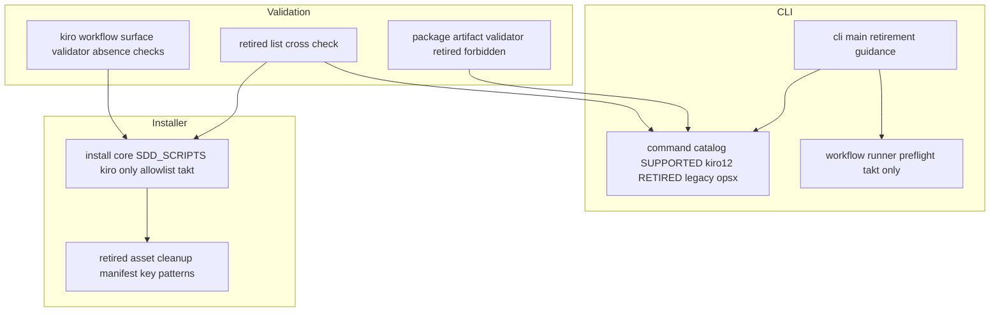
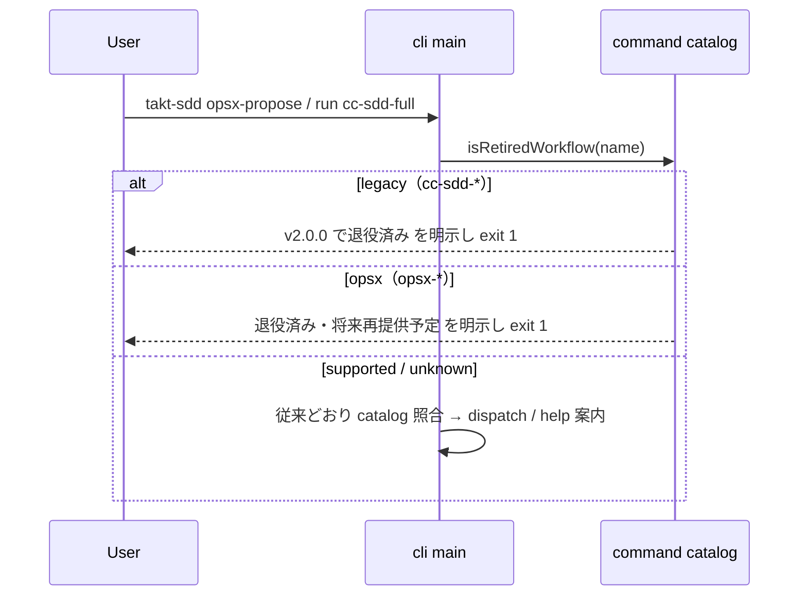

# 技術設計書: retire-legacy-workflow-surface

## 概要

**Purpose（目的）**: この機能はメンテナーと takt-sdd 利用者に、`kiro-*` のみで完結する v2.0.0 の公開 surface を提供する。legacy `cc-sdd-*` と `opsx-*` の workflow・npm scripts・init 内部初期化・依存伝播を一括退役し、配布物と検証を退役後の前提に揃える。

**Users（ユーザー）**: メンテナーが surface の縮小と major release の記録のために利用する。既存利用者は update 時の後始末と退役案内によって v2.0.0 へ移行する。

**Impact（影響）**: 現在の配布資産（workflow 30 種/言語）を 15 種/言語（kiro 12 + internal 3)へ縮小する。`installer/src/install.ts` から OpenSpec / cc-sdd 初期化を削除し、依存伝播 allowlist を `takt` のみへ縮小する。`takt-sdd-global-cli` スペックが確立した公開 command catalog（kiro 12 + opsx 5）を kiro 12 のみへ置き換える（同スペックの再検証トリガー「公開 command catalog の変更」に該当し、本スペックがその再検証を所有する）。

### 目標

- 配布資産・npm scripts・CLI catalog・init policy から cc-sdd-* / opsx-* を退役し、退役 command には案内付き拒否を提供する。
- v1.x 導入済み project の update で、未カスタマイズの退役資産を安全に後始末する。
- 退役を breaking change として記録し、次回 release を v2.0.0 にする。
- 退役後の surface を機械検証（validate:all・artifact validator・smoke）で固定する。

### 非目標

- OpenSpec workflow の再提供（後続スペック。本スペックは退役のみ）。
- `.agents/skills/**`・`.claude/skills/**` の opsx / cc-sdd 系 agent skill の変更。
- 対象 project のユーザー所有物（`openspec/` ディレクトリ、カスタマイズ済み資産、独自 scripts/依存）の削除。
- npm publish の実行、release.yml の仕組み自体の変更。
- `.kiro/steering/` の更新（退役後に `/kiro-steering` sync で追従する。research.md 判断 7）。

## 境界コミットメント

### このスペックが所有するもの

- `.takt/en/`・`.takt/ja/` からの cc-sdd-*（10）/ opsx-*（5）workflow と退役専用 facet の削除、および「同梱資産 = kiro 12 + internal 3」の新しい drift 不変条件。
- CLI の退役分類契約: `RETIRED_WORKFLOWS`（legacy / opsx の 2 系統）と退役案内メッセージ、公開 catalog の kiro 12 への縮小。
- install policy の退役: `SDD_SCRIPTS` の kiro:* 限定、OpenSpec / cc-sdd 初期化の削除、依存伝播 allowlist `["takt"]`、退役資産 cleanup（`RETIRED_MANIFEST_KEY_PATTERNS` 駆動）。
- root package.json の `cc-sdd:*` / `opsx:*` scripts と openspec / cc-sdd 依存宣言の削除。
- 互換検証の反転（存在強制 → 不在強制）と artifact validator / CLI テスト群の退役後整合。
- breaking change の記録と v2.0.0 判定の検証手順。
- README.md / README.ja.md / COMMON.md の退役後の記述。

### 境界外

- openspec workflow の再設計・再提供（後続スペックが catalog 追加・init 連携を新規に設計する）。
- `scripts/takt.sh` と `scripts/kiro-staged.mjs` の変更（takt.sh は kiro:* の現役実行依存。research.md 判断 5）。
- kiro-* workflow / facet の内容変更、`.takt/.manifest.json` schema の変更。
- 対象 project に既に merge 済みの `cc-sdd:*` / `opsx:*` scripts の削除（package.json はユーザー編集物として残置。後始末対象は manifest 管理下の file のみ）。
- npm registry 上の旧バージョンや create-takt-sdd の公開済み版の扱い。

### 許可する依存

- Node.js 組み込み module のみ（新規 runtime 依存なし。退役により root dependencies は `takt` のみになる）。
- CLI 層 → `installer/dist/`・`cli/command-catalog.mjs` への既存 import 経路（方向は従来どおり）。
- installer は CLI 層（`cli/**`・`bin/**`）を import してはならない。退役名リストは catalog（CLI 用）と installer（cleanup 用）に分かれて定義され、整合は検証層が固定する（research.md 判断・調査ログ「退役名リストの配置」）。
- 検証 scripts / tests は全層を参照可。

### 再検証トリガー

- `RETIRED_WORKFLOWS` または `RETIRED_MANIFEST_KEY_PATTERNS` の集合変更（openspec 再提供スペックは必ずここに触れる）。
- `SUPPORTED_WORKFLOWS` の集合変更。
- 依存伝播 allowlist（現 `["takt"]`）の変更。
- manifest 管理下ファイルの削除ポリシー（hash 一致時のみ削除）の変更。
- root package.json の scripts / dependencies 構成の変更。

## アーキテクチャ

### 既存アーキテクチャ分析

- **CLI 層**（takt-sdd-global-cli で確立）: catalog（SUPPORTED 17 / EXCLUDED {legacy 10, internal 3}）→ dispatch（init → run 正規化 → legacy 拒否 → catalog 照合 → unknown）→ runner（preflight で opsx の openspec binary 検査、SDD 3 依存の binary 検査）。
- **install core**: `installFromSource` が manifest / sync / merge / OpenSpec・cc-sdd init を所有。sync は source に無いファイルを削除しない。明示削除の前例は `removeLegacyOpsxScript`（hash 比較 + customized skip + 空ディレクトリ掃除、update 限定）のみ。
- **検証層**: `validate-kiro-workflow-surface.mjs` が legacy の存在を強制（`legacyScripts` / `migrationPairs` / README 移行表）。`validate-package-artifact.mjs` は catalog 駆動で必須 file set と OPENSPEC / CC_SDD 定数整合を検証。
- **解消する技術的負債**: legacy 存在強制の検証群、`tests/kiro-iterative-implementation-workflow.test.mjs` の cc-sdd-impl.yaml フィクスチャ依存、init 統合テストの cc-sdd local 解決シーディング（退役で不要化し network-free が構造化される）。

### アーキテクチャパターンと境界マップ

採用パターンは **静的退役リスト + 既存削除前例の一般化**（research.md パターン評価 A）。manifest 差分による汎用 prune は誤削除リスク（要件 5.5）のため不採用。



### 依存方向

従来どおり `cli/command-catalog.mjs → installer/dist → CLI adapter → cli/main.mjs → bin/`（右が左を import）。installer は CLI 層を import しない。退役名は catalog と installer の 2 箇所定義とし、検証層（scripts / tests）が両者の整合を機械検証する。

### 技術スタック

| レイヤー | 選択／バージョン | 機能内での役割 | メモ |
|-------|------------------|-----------------|-------|
| CLI / 検証 | JavaScript ESM（.mjs）、node:test | 退役分類・案内・検証反転 | 新規依存なし |
| install core | TypeScript（installer/src → dist） | init 退役・cleanup 一般化 | OPENSPEC_* / CC_SDD_* 定数と関連関数を物理削除 |
| 依存構成 | root dependencies: `takt`（exact pin）のみ | 配布 runtime | `@fission-ai/openspec`・`cc-sdd` を削除 |
| release | conventional-changelog-action v6（既存） | v2.0.0 判定 | `feat!:` + `BREAKING CHANGE:` footer で major（検証済み） |

## ファイル構造計画

### 削除対象

```
.takt/en/workflows/cc-sdd-*.yaml          # 10 ファイル
.takt/en/workflows/opsx-*.yaml            # 5 ファイル
.takt/ja/workflows/cc-sdd-*.yaml          # 10 ファイル
.takt/ja/workflows/opsx-*.yaml            # 5 ファイル
.takt/en/facets/**（退役専用 59 ファイル） # cc-sdd 専用 41 + opsx 専用 16 + cc-sdd∩opsx のみ共有 2（research.md 調査ログ）
.takt/ja/facets/**（en ミラー + ja 固有の退役専用分） # 実装時に言語ごとの参照解析で確定（例: ja の opsx-implementer.md）
```

> kiro-* / *-ai-quality-gate と共有される facet はゼロ（調査済み）。削除後の参照整合は既存 facet 参照検証が回帰検出する。

### 変更対象ファイル

- `cli/command-catalog.mjs` — `SUPPORTED_WORKFLOWS` を kiro 12 へ縮小。`EXCLUDED_WORKFLOWS` を `{ internal }` のみへ。`RETIRED_WORKFLOWS = { legacy: cc-sdd-* 10, opsx: opsx-* 5 }` と `isRetiredWorkflow(name)` を新設（`isLegacyWorkflow` は置換・削除）。help text から opsx を除去。
- `cli/main.mjs` — 分類を init → run 正規化 → retired 判定（系統別メッセージ）→ catalog 照合 → unknown へ。cc-sdd は「v2.0.0 で退役済み」、opsx は「退役済み・将来再提供予定」。
- `cli/workflow-runner.mjs` — opsx 用 openspec binary preflight を削除。宣言済み SDD 依存の binary 検査を `takt` のみへ縮小。
- `installer/src/install.ts` — `SDD_SCRIPTS` を kiro:* のみへ。`OPENSPEC_*` / `CC_SDD_*` 定数、`initializeOpenSpecProject` / `initializeCcSddProject` / `buildCcSddExecArgs`、opsx-cli.sh install block を削除。`resolveSddDependencySet` allowlist を `["takt"]` へ。`removeLegacyOpsxScript` を `RETIRED_MANIFEST_KEY_PATTERNS` 駆動の `removeRetiredFiles` へ一般化（dry-run は削除予定の表示のみ）。
- `installer/src/install.test.ts` — 退役後 policy の回帰（allowlist takt のみ、cleanup の delete / skip / dry-run、削除済み API のテスト撤去）。
- `package.json` — `cc-sdd:*`（10）/ `opsx:*`（5）scripts 削除、`@fission-ai/openspec`（dependencies）/ `cc-sdd`（devDependencies）削除。kiro:* と files allowlist は無変更。
- `scripts/validate-kiro-workflow-surface.mjs` — legacy 存在強制（`legacyScripts` / `migrationPairs` / `validateLegacyDeprecationPolicy` / `validateInstalledLegacyScripts` / README 移行表・`opsx:full` 強制）を不在強制へ反転。kiro 純度検証は維持。
- `scripts/validate-package-artifact.mjs` — 必須 file set を catalog 縮小に追従（自動）。退役 workflow / facet 資産を forbidden patterns に追加。OPENSPEC / CC_SDD の version 整合検証を撤去し takt exact pin 検証は維持。catalog の `RETIRED_WORKFLOWS` ↔ installer の cleanup パターンのクロスチェックを追加。
- `tests/kiro-workflow-surface.test.mjs` — 反転後の validator に追従（cc-sdd:* 注入で fail する negative case 化）。
- `tests/kiro-iterative-implementation-workflow.test.mjs` — フィクスチャを `cc-sdd-impl.yaml` から `kiro-impl.yaml` 直読みへ差し替え。
- `tests/takt-sdd-cli.test.mjs` — catalog 17→12、RETIRED 分類、退役案内（cc-sdd / opsx 系統別）、preflight 縮小に追従。
- `tests/takt-sdd-init-policy.test.mjs` — OpenSpec / cc-sdd init 不実行の固定、cc-sdd local 解決シーディングの撤去、update cleanup（delete / customized skip / dry-run 表示 / manifest 記録除去 / ユーザー所有物不削除）の統合テスト追加。
- `tests/takt-sdd-global-install-smoke.test.mjs` — help の opsx 不在、cc-sdd-full / opsx-full の退役案内拒否（run 形式含む）へ更新。
- `README.md` / `README.ja.md` / `COMMON.md` — 公開 command を kiro 12 のみに、退役の明記と opsx 再提供方針、update 後始末挙動、OpenSpec / cc-sdd init・依存伝播の記述除去、cc-sdd 移行表の整理。

> 新規ファイルなし。`scripts/takt.sh`・`scripts/kiro-staged.mjs`・`bin/takt-sdd.mjs`・`cli/init-adapter.mjs` は無変更（init-adapter は core の退役を透過的に受ける）。ReleaseBreakingRecord はファイル変更を伴わない手順のみのコンポーネント（breaking commit の作成と release dry-run 検証）であり、変更対象ファイルを持たない。

## システムフロー

### 退役 command の拒否



退役判定は spawn・preflight より前に完結し、workflow 実行プロセスを起動しない（要件 2.5）。

### update 時の退役資産 cleanup

1. `installFromSource` が update（manifest あり）を検出する。
2. manifest.files の key を `RETIRED_MANIFEST_KEY_PATTERNS` と照合し、一致 key を cleanup 候補にする（fresh install では候補なし）。
3. dry-run の場合: 削除予定一覧を表示し、削除・manifest 更新を行わない（要件 5.3）。
4. 非 dry-run: on-disk hash が manifest 記録と一致 → 削除 + 空ディレクトリ掃除 + 削除ログ。不一致（カスタマイズ済み）→ 警告のみで残置（要件 5.1, 5.2）。
5. 新 manifest は現 source 由来の file のみで再構成され、退役 key は記録から消える（要件 5.4）。
6. パターン外のファイル（`openspec/`、ユーザー追加物）は走査対象外（要件 5.5）。

## 要件トレーサビリティ

| 要件 | 要約 | コンポーネント | 検証 |
|------|------|----------------|------|
| 1.1, 1.2 | 退役 workflow を配布物から除去 | WorkflowAssetRetirement | drift test（不在）+ artifact validator forbidden |
| 1.3, 1.5 | 専用 facet 削除・共有 facet 維持 | WorkflowAssetRetirement | facet 参照検証 + validate:all green |
| 1.4 | kiro 12 + internal 3 の言語ペア維持 | WorkflowAssetRetirement, CommandCatalog | 双方向 drift test |
| 2.1, 2.2 | help は kiro のみ | CommandCatalog | CLI unit test |
| 2.3, 2.4 | 系統別の退役案内拒否（run 形式含む） | CliMain, CommandCatalog | CLI unit test + smoke |
| 2.5 | 拒否時に spawn 不到達 | CliMain | mock spawn test |
| 2.6 | unknown は従来どおり | CliMain | CLI unit test |
| 3.1, 3.2 | cc-sdd:*/opsx:* scripts 削除・kiro:* 維持 | RootPackageMetadata | surface validator（不在強制） |
| 3.3 | 退役専用補助 script の除外 | RootPackageMetadata | 該当なしの確認（takt.sh は現役・維持）|
| 3.4 | 導入 scripts は kiro:* のみ | InstallCore | installer unit test |
| 4.1, 4.2 | OpenSpec / cc-sdd init 不実行 | InstallCore | init 統合テスト（外部 process 不起動） |
| 4.3, 4.4 | 依存伝播は takt のみ | InstallCore（VersionPolicy） | allowlist unit test |
| 4.5 | create-takt-sdd の結果同等性 | InstallCore | 既存委譲固定テスト（共有 core 経由で構造保証） |
| 4.6 | ユーザー追加 scripts/依存の維持 | InstallCore | 既存 merge 意味論の回帰テスト |
| 5.1–5.4 | update cleanup（削除/skip/dry-run/manifest） | RetiredAssetCleanup | init-policy 統合テスト |
| 5.5 | ユーザー所有物の不削除 | RetiredAssetCleanup | パターン外不走査の unit test |
| 6.1, 6.3 | artifact から退役資産排除と混入検出 | PackageArtifactValidator | forbidden patterns + negative case |
| 6.2 | openspec / cc-sdd 依存宣言の不在 | RootPackageMetadata, PackageArtifactValidator | 依存検証 |
| 6.4 | kiro surface 必須資産の維持 | PackageArtifactValidator | 必須 file set（catalog 追従） |
| 7.1–7.3 | breaking 記録と v2.0.0・変更履歴 | ReleaseBreakingRecord | release dry-run プレビュー |
| 8.1 | 検証一式 green | 全コンポーネント | validate:all + 全 test suite + CI |
| 8.2 | 互換検証の前提更新 | SurfaceValidatorAlignment | 反転後 negative case |
| 8.3, 8.4 | ドキュメント追従（日英） | Documentation | 記載項目チェック |

## コンポーネントとインターフェース

| コンポーネント | レイヤー | 意図 | 要件 | 契約 |
|----------------|----------|------|------|------|
| WorkflowAssetRetirement | assets | 退役資産の削除と言語ペア維持 | 1.1–1.5 | State |
| CommandCatalog | CLI | kiro 12 catalog と RETIRED 分類の正本 | 1.4, 2.1, 2.2 | Service, State |
| CliMain | CLI | 退役案内 dispatch | 2.3–2.6 | Service |
| WorkflowRunner | CLI | preflight の takt 限定化 | 2.5（間接）, 4.3 | Service |
| InstallCore（VersionPolicy 含む） | installer | init 退役・scripts/依存縮小 | 3.4, 4.1–4.6 | Service |
| RetiredAssetCleanup | installer | update 時の退役資産後始末 | 5.1–5.5 | Service |
| RootPackageMetadata | packaging | scripts / 依存宣言の削除 | 3.1–3.3, 6.2 | State |
| SurfaceValidatorAlignment | validation | 互換検証の不在強制への反転 | 8.1, 8.2 | Batch |
| PackageArtifactValidator | validation | 退役後 artifact 境界の機械検証 | 6.1–6.4 | Batch |
| ReleaseBreakingRecord | release | breaking 記録と v2.0.0 検証 | 7.1–7.3 | Batch |
| Documentation | docs | 退役後の利用手順 | 8.3, 8.4 | — |

### CommandCatalog（変更）

```typescript
// cli/command-catalog.mjs
const SUPPORTED_WORKFLOWS: readonly string[];   // kiro 12 のみ
const EXCLUDED_WORKFLOWS: Readonly<Record<"internal", readonly string[]>>;  // internal 3 のみ
const RETIRED_WORKFLOWS: Readonly<Record<"legacy" | "opsx", readonly string[]>>;  // cc-sdd 10 / opsx 5
function isSupportedWorkflow(name: string): boolean;
function isRetiredWorkflow(name: string): "legacy" | "opsx" | undefined;  // isLegacyWorkflow を置換
function buildHelpText(version: string): string;  // init / kiro-* / run / global options のみ列挙
```

- 不変条件: 同梱 workflow 資産の全数 = SUPPORTED ∪ EXCLUDED.internal（双方向 drift test）。RETIRED の各 entry に対応する資産が同梱されて**いない**ことを test で固定する。
- `isLegacyWorkflow` の削除は CLI 層内の契約変更（消費者は cli/main.mjs と tests のみ。調査済み）。

### CliMain（変更）

- 分類順: `init` → `run` 正規化 → `isRetiredWorkflow`（"legacy" → cc-sdd 退役 message / "opsx" → 再提供予定付き message、いずれも exit 1・spawn 不到達）→ `isSupportedWorkflow` → unknown（従来どおり help 案内）。
- message 文言は要件 2.3 / 2.4 の内容（退役済み・v2.0.0・将来再提供）を含む。exit code 規約は従来（typed error → 1）を維持。

### WorkflowRunner（変更）

- preflight step 3（opsx の openspec binary 検査）を削除。step 4 の宣言済み SDD 依存検査は `takt` のみを対象とする。
- それ以外（language 解決・strict 2 候補解決・takt 解決・引数組み立て・spawn）は無変更。

### InstallCore / VersionPolicy（変更）

- `SDD_SCRIPTS` を kiro:*（14 entry）のみへ縮小（要件 3.4）。
- `resolveSddDependencySet` の allowlist を `["takt"]` へ（signature 不変。要件 4.3, 4.4）。
- OpenSpec / cc-sdd 初期化（関数・定数・呼び出し・opsx-cli.sh install block）を物理削除（research.md 判断 3。要件 4.1, 4.2）。
- 既存 merge 意味論（ユーザーの既存 scripts / 依存は維持、不足のみ追加）は無変更（要件 4.6）。`install()` → `installFromSource` 委譲構造は維持（要件 4.5）。

### RetiredAssetCleanup（新設・installer 内）

```typescript
// installer/src/install.ts
const RETIRED_MANIFEST_KEY_PATTERNS: readonly RegExp[];
// .takt/workflows/(cc-sdd-|opsx-).*\.yaml、退役専用 facet 名、scripts/opsx-cli.sh を網羅

function planRetiredRemovals(manifest: Manifest | null, cwd: string): readonly string[];  // dry-run 表示にも使用
function removeRetiredFiles(cwd: string, manifest: Manifest, msg: Messages): void;
// 前例 removeLegacyOpsxScript の一般化: hash 一致のみ削除・不一致は警告 skip・空親ディレクトリ掃除
```

- Preconditions: update（manifest 非 null）でのみ発火。Postconditions: 削除済み key は新 manifest に現れない。Invariants: パターン外の path に触れない（要件 5.5）。
- `removeLegacyOpsxScript` は本機構の 1 entry（`scripts/opsx-cli.sh`）として吸収・削除する。

### SurfaceValidatorAlignment（変更）

- 反転内容: package.json と installer `SDD_SCRIPTS` に `cc-sdd:*` / `opsx:*` が存在したら fail。配布資産に cc-sdd-* / opsx-* workflow が存在したら fail。README 移行表・`opsx:full` 記述の強制を撤去。
- 維持: `KIRO_SCRIPT_SET_DRIFT`、kiro workflow 内 `cc-sdd-` 文字列禁止、`opsx:apply` の UNSUPPORTED_KIRO_IDENTITY。

### PackageArtifactValidator（変更）

- forbidden patterns に `.takt/{en,ja}/workflows/(cc-sdd-|opsx-)*.yaml` と退役専用 facet 名を追加（要件 6.3）。
- version 整合は takt exact pin のみ（OPENSPEC / CC_SDD 検証を撤去。要件 6.2）。
- クロスチェック: catalog の RETIRED 名集合と installer の cleanup パターンが同じ退役集合を表すことを検証（リスト二重定義のドリフト緩和）。

### ReleaseBreakingRecord（手順）

- main 反映時に `feat!:` + `BREAKING CHANGE:` footer のコミットを含める（実装コミットに付与または `--allow-empty` の専用コミット）。
- `release.yml` の `workflow_dispatch`（`dry_run: true`）で次期 version が v2.0.0 になることをプレビュー検証する（要件 7.2）。footer 文言に cc-sdd-* / opsx-* 退役と opsx 再提供方針を記載し changelog に載せる（要件 7.3）。

### Documentation（変更）

- README.md / README.ja.md: Global CLI 節を kiro 12 のみに更新、退役の明記（cc-sdd: 退役済み / opsx: 退役済み・将来再提供）、update 後始末挙動、導入手順から OpenSpec / cc-sdd init・依存の記述除去、cc-sdd 移行表の整理（npm scripts 互換の終了を明記）。COMMON.md は command surface 整合の最小更新。日英は意味的に揃える。

## データモデル

- **Manifest**（schema 無変更）: cleanup は既存 `files: Record<key, sha256>` の読み取りと再構成のみ。
- **RETIRED_WORKFLOWS / RETIRED_MANIFEST_KEY_PATTERNS**: 静的 readonly 定義。catalog 側は名前集合、installer 側は manifest key パターン。両者の整合は検証層が固定。

## エラーハンドリング

- **退役 command**: 系統別の明示 message + exit 1。takt を起動しない（要件 2.3–2.5）。
- **cleanup 時のカスタマイズ検出**: hash 不一致 → 既存 `fileSkippedCustomized` 形式の警告で残置（要件 5.2）。
- **既存の typed error 規約**（UsageError / InitError / PreflightError → stderr + exit 1）は無変更。openspec binary 不足の Preflight error は preflight 縮小に伴い消滅する。

## テスト戦略

### Unit Tests

1. catalog: SUPPORTED が kiro 12、RETIRED が {legacy 10, opsx 5}、`isRetiredWorkflow` の系統判定、help から opsx / cc-sdd 不在（2.1, 2.2）。
2. 双方向 drift: 同梱資産 = SUPPORTED ∪ internal、RETIRED 資産の非同梱（1.1, 1.2, 1.4）。
3. dispatch: cc-sdd-full / opsx-propose / run 形式それぞれの退役 message と exit 1、mock spawn 不到達、unknown の従来挙動（2.3–2.6）。
4. `resolveSddDependencySet`: takt のみ抽出、openspec / cc-sdd の非伝播（4.3, 4.4）。
5. cleanup: パターン照合、hash 一致削除 / 不一致 skip、パターン外不走査（5.1, 5.2, 5.5）。

### Integration Tests

1. fresh init: OpenSpec / cc-sdd の外部 process 不起動（注入 runner 不要化の確認）、scripts merge が kiro:* のみ（3.4, 4.1, 4.2）。
2. update cleanup: v1.x 相当 fixture（manifest + 退役資産配置）→ 未変更資産の削除と manifest 記録除去、カスタマイズ済み警告残置、dry-run の削除予定表示と write ゼロ、`openspec/` 残置（5.1–5.5）。
3. surface validator 反転: cc-sdd:* script を fixture に注入すると fail する negative case（8.2）。

### E2E Tests

1. artifact: 退役資産の forbidden 検出 negative case、必須 file set の kiro 追従、依存宣言の不在（6.1–6.4）。
2. smoke: help に opsx 不在、`cc-sdd-full` / `run cc-sdd-full` / `opsx-full` / `run opsx-full` の退役案内拒否、init dry-run write ゼロ維持（8.1）。

### Release 検証

- `workflow_dispatch`（dry_run: true）で v2.0.0 判定をプレビュー（7.1–7.2）。

## セキュリティ考慮事項

- 退役により init の外部 process 起動（openspec / cc-sdd）と registry 依存が消え、攻撃面・network 依存はともに縮小する。cleanup は manifest 管理下 + hash 一致の file のみ削除し、ユーザー所有物に触れない。

## 移行戦略

- 実装は単一 PR（資産削除 → CLI / installer / 検証反転 → ドキュメント）で行い、CI（validate:all + 全 suite + smoke）green を merge 条件とする。
- merge 時に breaking commit を含め、release dry-run で v2.0.0 を確認してから定期 release に委ねる。npm publish は従来どおり手動。
- 既存 v1.x 利用者への移行パス: `npm i -g takt-sdd@2` → `takt-sdd init .`（update）で退役資産が後始末される。project の package.json に残る cc-sdd:* / opsx:* scripts はユーザー所有物として残置され、参照先 workflow が無いため実行時に takt の解決 error になる（README に手動削除を案内）。
- steering（product.md / tech.md の互換記述）は merge 後に `/kiro-steering` sync で追従させる（境界外）。
