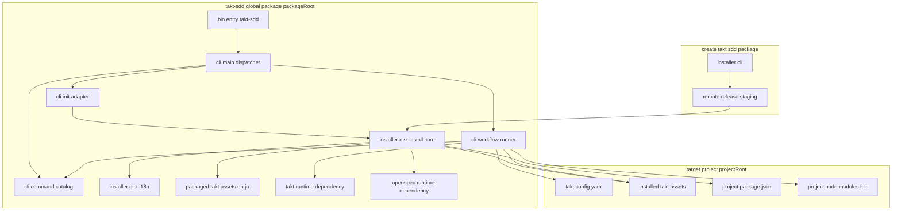
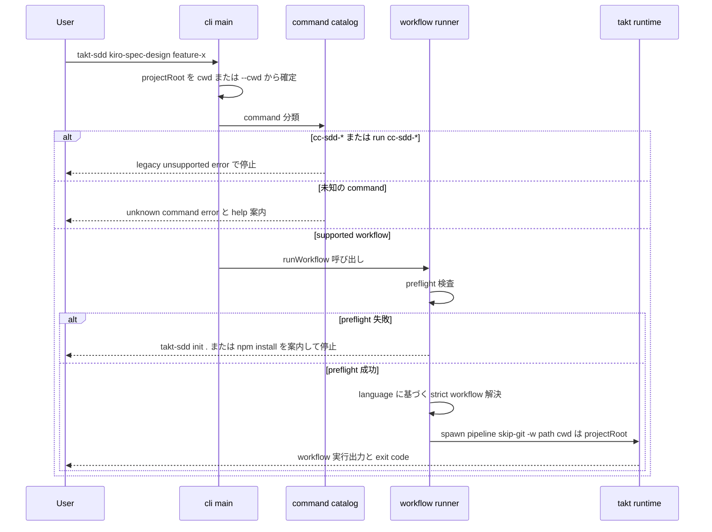

# 技術設計書: takt-sdd-global-cli

## 概要

**Purpose（目的）**: この機能は takt-sdd 利用者に、`npm install -g takt-sdd` から `takt-sdd init .` と `takt-sdd kiro-*` / `takt-sdd opsx-*` まで一貫した global CLI surface を提供する。repo-local npm scripts や開発 checkout を知らなくても、package version と一致した workflow/facet 資産で SDD workflow を起動できるようにする。

**Users（ユーザー）**: takt-sdd 利用者が対象 project の初期化と workflow 実行のために利用する。メンテナーが package artifact boundary と公開 surface の回帰検証のために利用する。

**Impact（影響）**: 現在 `private: true` で bin を持たない root package を、公開可能な npm package（`bin`、`files` allowlist、runtime dependencies 付き）に変える。`installer/src/install.ts` の install policy を staging と分離して `takt-sdd init` から再利用し、`create-takt-sdd` の既存挙動は維持する。

### 目標

- `npm install -g takt-sdd` 後に PATH から `takt-sdd` command（help / version / init / workflow command）を実行可能にする。
- `takt-sdd init <dir>` を package 同梱 `.takt` assets で実行し、既存 installer の manifest / customized skip / overwrite policy と同等の結果を保証する。
- `kiro-*` / `opsx-*` の supported command と `run <supported-workflow>` を提供し、legacy `cc-sdd-*` を明示拒否する。
- package artifact の allowlist / forbidden file 検証と、isolated global install smoke を CI で決定論的に実行可能にする。

### 非目標

- `create-takt-sdd` の廃止・互換破壊、cc-sdd CLI 自体の変更、TAKT workflow/facet の意味的再設計。
- `.takt/.manifest.json` schema の変更、install profile/toggle、TAKT git automation opt-in。
- npm publish automation / release pipeline の構築（後続 spec）。
- CLI メッセージの i18n 拡張（init flow 内の既存 i18n 再利用に留める。research.md 判断 8）。

## 境界コミットメント

### このスペックが所有するもの

- root `takt-sdd` package の公開境界: `bin`、`files` allowlist、runtime `dependencies`、publish metadata（`private` 解除、license、engines、repository）。
- global CLI surface: `takt-sdd init <dir>`、supported `kiro-*` / `opsx-*` command、`run <workflow>`、`--help` / `--version` / `--cwd`、`cc-sdd-*` の明示拒否、公開 command catalog の定義。
- shared install core の継ぎ目: `installer/src/install.ts` 内の `installFromSource(options, source)` 契約と、SDD dependency set の allowlist 抽出契約。
- packaged asset source: packageRoot を asset root として使う init 経路（network 不使用）。
- init / workflow 実行時の language preference 解決規則（`--lang` > `.takt/config.yaml` の read-only 参照 > manifest の `lang` > `en`）。
- workflow 実行 preflight 契約（init 済み検査、language 資産検査、project-local dependency 検査）と packageRoot/projectRoot の path ownership。
- package artifact validation（allowlist / forbidden file）と isolated global install smoke、global CLI に関する README / README.ja / COMMON の記述。

### 境界外

- `create-takt-sdd` の公開 CLI 名・`--tag` / `--layout` の意味・remote tarball staging の挙動（`installFromSource` への委譲リファクタを除き無変更）。
- `.takt/.manifest.json` schema と customized skip 判定アルゴリズム自体（再利用のみ）。
- TAKT workflow / facet の内容、Kiro spec generation rule、`.agents/skills/**`。
- `cc-sdd-*` workflow を global CLI の supported command にすること（npm scripts 互換資産としての同梱とは区別する）。
- `takt-sdd init` での `npm install` 自動実行、`--tag` / profile / toggle の追加。
- `.takt/config.yaml` の作成・変更。config.yaml はユーザー所有ファイルであり、global（`~/.takt/config.yaml`）または project 単位でユーザーが作成・管理する。CLI は読み取りのみ行う。
- npm publish automation。

### 許可する依存

- Node.js 組み込み module（`node:fs` / `node:path` / `node:child_process` / `node:test` ほか）。CLI 層に外部 argument parser 等の新規 runtime 依存を追加しない。
- `installer/dist/`（compiled install core / i18n）への相対 import。CLI 層が依存してよい唯一の policy 実装。
- package 同梱 `.takt/en/**`・`.takt/ja/**`・`scripts/kiro-staged.mjs`（asset として参照。`scripts/kiro-staged.mjs` を実行時 import しない）。
- root package の pinned runtime dependencies: `takt`（workflow spawn 用、packageRoot 側）、`@fission-ai/openspec`（init 内部起動用）。
- `npm exec` による pinned `cc-sdd` 起動（既存 installer policy の再利用）。
- 違反となる依存: CLI から `scripts/takt.sh` / 開発 checkout / projectRoot 側 `takt` binary への依存、installer から CLI 層（`cli/**`、`bin/**`）への依存。

### 再検証トリガー

- `installFromSource` の signature または `InstallSource` 契約の変更。
- `.takt/.manifest.json` schema、customized skip / overwrite 判定の変更。
- SDD dependency allowlist（`takt` / `@fission-ai/openspec` / `cc-sdd`）または pinned version の変更。
- 公開 command catalog（supported workflow 集合）の追加・削除。
- root `package.json` の `files` allowlist の変更。
- `.takt/config.yaml` の `language:` semantics の変更。

## アーキテクチャ

### 既存アーキテクチャ分析

- **installer（`installer/src/install.ts`）**: manifest hash 管理、customized file skip、update 時 overwrite 判定、dry-run plan、package.json scripts / devDependencies merge、OpenSpec / cc-sdd の固定 version 内部起動を持つ。ただし remote tarball staging（tag 解決・download・extract・`tar` 検査）が同一関数に同居している。
- **workflow 実行（`scripts/kiro-staged.mjs` / `scripts/takt.sh`）**: `.takt/config.yaml` の language を読む解決 pattern を持つが、repoRoot 固定・repo-local wrapper 優先で global CLI には流用不可。言語間 fallback は repo 開発向けの意図であり、global CLI の strict 解決とは別物として扱う（research.md 判断 5）。
- **尊重する境界**: Kiro 基盤（`kiro:*`）、旧 CC-SDD 互換（`cc-sdd:*`）、OpenSpec（`opsx:*`）の分離（steering: structure.md）。`kiro:*` npm scripts は canonical surface のまま残る。
- **解消する技術的負債**: installer 定数 `OPENSPEC_VERSION = "1.3.1"` と root devDependency `1.4.1` の drift、root devDependencies 全件 merge による開発依存漏洩の latent bug（allowlist 抽出に置換）。

### アーキテクチャパターンと境界マップ

採用パターンは **shared install core + thin CLI adapter**（research.md の Option B を精緻化）。asset source は `{ rootDir, version }` のデータ契約とし、remote staging（create-takt-sdd）と packaged source（global init）は core の外側に置く。



**Architecture Integration（アーキテクチャ統合）**:

- 採用パターン: shared install core + thin CLI adapter。policy は 1 code path（installer/src）に保ち、CLI は staging・引数解析・preflight のみを所有する。
- ドメイン境界: `packageRoot`（CLI / 同梱資産 / takt・openspec runtime）と `projectRoot`（`.takt` / `.kiro` / `openspec` / `package.json` / project-local binaries）を明示分離。暗黙 fallback での混線を禁止する。
- 維持する既存パターン: manifest / customized skip / dry-run / scripts・devDeps merge / OpenSpec・cc-sdd init ordering、`scripts/validate-*.mjs` + `tests/*.test.mjs` の検証ペア、installer の手書き argument parser スタイル。
- 新規コンポーネントの根拠: CLI 層（公開 surface の所有者が不在）、packaged asset source（network 不使用 init の要件 2.2）、artifact validator / install smoke（requirement 7・8 の機械検証が不在）。
- ステアリング準拠: 検証スクリプト第一級（tech.md）、`kiro:*` canonical surface との非矛盾、en/ja 資産の言語ペア構造維持。

### 依存方向

`CommandCatalog / 定数 → installer/dist install core → CLI adapter（init / runner）→ cli main → bin entry`。左から右へのみ import を許す。installer/src は CLI 層を import してはならない（逆方向依存はレビューで error として扱う）。tests / scripts は全層を参照可。

### 技術スタック

| レイヤー | 選択／バージョン | 機能内での役割 | メモ |
|-------|------------------|-----------------|-------|
| CLI | JavaScript ESM（`.mjs`）、Node.js >= 20.19.0 | bin entry、引数解析、dispatch、preflight | 新規 runtime 依存なし。engines は installer と揃える |
| install core | TypeScript（`installer/src` → `installer/dist`） | manifest / sync / merge / OpenSpec・cc-sdd init | root artifact に compiled dist を同梱（research.md 判断 1） |
| workflow runtime | `takt`（exact pin、0.43 系で実装時確定） | packageRoot 側 dependency として workflow spawn | `dependencies` へ移動。floating 解決禁止 |
| spec ツール | `@fission-ai/openspec` 1.4.1（exact pin） | init 内部の `openspec init` 起動 | 定数 `OPENSPEC_VERSION` を 1.4.1 に整合 |
| 互換ツール | `cc-sdd` 3.0.2 | `npm exec` pinned 起動 + 対象 devDependencies へ追加 | root devDependencies に追記し allowlist 経由で伝播 |
| テスト | `node:test`、`npm pack --json` | 単体 / 統合 / artifact / smoke 検証 | real provider 不要（8.6） |

## ファイル構造計画

### ディレクトリ構造（新規）

```
bin/
└── takt-sdd.mjs               # shebang 付き entry。cli/main.mjs へ委譲し exit code を返すのみ
cli/
├── main.mjs                   # global 引数解析（--cwd/--help/--version）、command dispatch、エラー→exit code 変換
├── command-catalog.mjs        # SUPPORTED_WORKFLOWS 静的定義、supported/legacy 判定、help text 生成
├── init-adapter.mjs           # init command: --tag 拒否、language 解決、packaged source で core 呼び出し、config.yaml upsert、npm install 案内
└── workflow-runner.mjs        # preflight、strict workflow 解決、packageRoot takt 解決、引数組み立て、spawn
scripts/
└── validate-package-artifact.mjs   # npm pack --json の allowlist / forbidden file 検証
tests/
├── takt-sdd-cli.test.mjs               # CLI 単体（catalog/引数/拒否/help/version/引数組み立て、spawn は mock）
├── takt-sdd-init-policy.test.mjs       # packaged source init の統合（fixture target、manifest/skip/force/dry-run/lang）
├── takt-sdd-package-artifact.test.mjs  # validator と対になる pack contents 検証
└── takt-sdd-global-install-smoke.test.mjs  # pack → isolated prefix install → PATH 経由 E2E
```

### 変更対象ファイル

- `package.json` — `private` 解除、`bin` / `files` / `license` / `engines` / `repository` 追加、`dependencies`（takt / openspec の exact pin）への再編、`devDependencies` へ `cc-sdd: 3.0.2` 追記、`build:installer`（installer build の単一入口）/ `prepack`（`build:installer` へ委譲）と新規 `validate:*` / `test:*` scripts 追加。新規 `test:takt-sdd-*` scripts は実行前に `build:installer` の完了を保証する形で定義する（fresh clone での `ERR_MODULE_NOT_FOUND` を防ぐ）。
- `installer/src/install.ts` — `installFromSource(options, source)` の切り出し（manifest / sync / merge / dry-run / OpenSpec・cc-sdd init）。`install()` は remote staging（`tar` 検査・tag 解決・download・extract）後に委譲する形へ再編。SDD dependency set を allowlist 抽出関数 `resolveSddDependencySet` に置換。`OPENSPEC_VERSION` を `1.4.1` へ整合。
- `installer/src/install.test.ts` — `installFromSource` 直接呼び出しの policy 回帰、`install()` の委譲固定、allowlist 抽出と定数整合の検証を追加。
- `.github/workflows/ci.yml` — `global-cli` job 追加（installer build → CLI 単体/統合 test → artifact validator → global install smoke）。
- `README.md` / `README.ja.md` / `COMMON.md` — global install、`takt-sdd init .` → `npm install` の手順、supported command 一覧、`run` 形式、`cc-sdd-*` global CLI 拒否、opsx-explore の実行モード差（npm script との違い）を記載。

> 既存の `scripts/kiro-staged.mjs`・`scripts/takt.sh`・`installer/src/cli.ts`・`installer/src/i18n.ts` は無変更（kiro-staged.mjs は packaged asset として同梱されるのみ）。

## システムフロー

### workflow command dispatch



フロー上の判断: preflight は spawn より前に完結し、失敗時に `takt` process を一切起動しない（6.5、4.5）。spawn の exit code はそのまま CLI の exit code になる。

### init flow（packaged asset source）

1. `init` 引数解析。`--tag` 検出時は「global init では unsupported」を明示して停止（2.3）。
2. targetDir = `resolve(--cwd ?? process.cwd(), <dir>)`（dir positional は必須）。
3. language 解決: `--lang` 明示 > 既存 `.takt/config.yaml` の `language:`（read-only 参照） > 既存 manifest の `lang` > `en`（2.5–2.7。research.md 判断 3 改訂）。
4. `installFromSource({ lang, force, dryRun, layout: "modern", cwd: targetDir }, { rootDir: packageRoot, version: packageVersion })` を呼ぶ。network access・GitHub download は構造上発生しない（2.2）。
5. dry-run 時: core が plan 表示のみ行い、file write / OpenSpec init / cc-sdd init を行わない（3.4）。
6. 非 dry-run 成功時: language preference は manifest の `lang` として記録される（共有 core の既存挙動）。`.takt/config.yaml` には一切書き込まない。既存 config.yaml の `language:` と導入言語が異なる場合は警告のみ表示する（workflow 解決は常に config.yaml 優先のため。6.6）。
7. 次の手順として `npm install` を案内する。自動実行はしない（2.4）。

## 要件トレーサビリティ

| 要件 | 要約 | コンポーネント | インターフェース | フロー |
|------|------|----------------|------------------|--------|
| 1.1 | global install で `takt-sdd` を PATH 提供 | RootPackageMetadata, GlobalCliEntry | `bin` field, `bin/takt-sdd.mjs` | global install smoke |
| 1.2 | `--help` が init / kiro-* / opsx-* / run を表示 | CliMain, CommandCatalog | `buildHelpText` | — |
| 1.3 | `--version` が package version を表示 | CliMain | `main(argv)` | — |
| 1.4 | 公開 artifact に metadata / runtime deps を同梱 | RootPackageMetadata | `package.json`（bin/files/dependencies/engines） | — |
| 2.1 | init が package 同梱 `.takt` assets を導入 | InitAdapter, InstallCore | `runInit`, `installFromSource` | init flow |
| 2.2 | init は GitHub release download を使わない | InitAdapter（packaged source） | `InstallSource` 契約 | init flow 手順 4 |
| 2.3 | `--tag` を明示拒否 | InitAdapter | `parseInitArgs` | init flow 手順 1 |
| 2.4 | `npm install` 自動実行せず案内 | InitAdapter | `runInit` 事後出力 | init flow 手順 7 |
| 2.5 | 新規 project の既定 language は `en` | InitAdapter | `resolveLanguagePreference` | init flow 手順 3 |
| 2.6 | `--lang` で preference 導入・更新 | InitAdapter, InstallCore | `resolveLanguagePreference` + manifest `lang` 記録 | init flow 手順 3, 6 |
| 2.7 | 既存 config.yaml の preference 尊重 | InitAdapter | `resolveLanguagePreference` | init flow 手順 3 |
| 3.1 | manifest/update/customized skip policy 維持 | InstallCore | `installFromSource`（既存 `syncRelativeFiles` 経路） | init flow 手順 4 |
| 3.2 | customized file を既定で上書きしない | InstallCore | manifest hash 比較（既存） | — |
| 3.3 | `--force` は既存 installer と同義 | InitAdapter, InstallCore | `CoreInstallOptions.force` | — |
| 3.4 | dry-run は write / OpenSpec / cc-sdd init なし | InstallCore, InitAdapter | dry-run 経路 | init flow 手順 5 |
| 3.5 | init と create-takt-sdd の結果同等性 | InstallCore, RemoteStaging | `install()` → `installFromSource` 委譲 | — |
| 4.1 | takt / openspec@1.4.x / cc-sdd@3.x の devDeps 追加・維持 | VersionPolicy, InstallCore | `resolveSddDependencySet` | init flow 手順 4 |
| 4.2 | 同一 package version で一貫した dependency version | VersionPolicy, RootPackageMetadata | exact pin（package.json 正本） | — |
| 4.3 | floating tag を実行時解決しない | VersionPolicy | 静的 package.json 読み取りのみ | — |
| 4.4 | workflow 起動に repo-local wrapper 不要 | WorkflowRunner | `resolveTaktBin`（packageRoot 固定） | dispatch flow |
| 4.5 | opsx で OpenSpec 不足時に npm install を促し停止 | Preflight | `preflight` | dispatch flow |
| 4.6 | 互換 scripts project の不足 dependency を明示 | Preflight | `PreflightResult.missingDependencies` | dispatch flow |
| 5.1 | supported `kiro-*` command の提供 | CommandCatalog, CliMain | `SUPPORTED_WORKFLOWS`（kiro 12） | dispatch flow |
| 5.2 | supported `opsx-*` command の提供 | CommandCatalog, CliMain | `SUPPORTED_WORKFLOWS`（opsx 5） | dispatch flow |
| 5.3 | `--pipeline --skip-git` を常時付与 | WorkflowRunner | `buildWorkflowArgs` | dispatch flow |
| 5.4 | `cc-sdd-*` command を明示拒否 | CommandCatalog, CliMain | `isLegacyWorkflow` | dispatch flow |
| 5.5 | `run <workflow>` は catalog 内のみ実行 | CliMain, CommandCatalog | run dispatch → `isSupportedWorkflow` | dispatch flow |
| 5.6 | `run cc-sdd-*` も拒否 | CliMain, CommandCatalog | run dispatch → `isLegacyWorkflow` | dispatch flow |
| 5.7 | legacy `cc-sdd:*` を supported にしない | CommandCatalog, CatalogDriftTest | catalog 不変条件 + 双方向 drift test（`EXCLUDED_WORKFLOWS` 分類） | — |
| 6.1 | 実行 directory を既定 project root に | CliMain | `CliContext.projectRoot` | dispatch flow |
| 6.2 | `--cwd <dir>` で project root 指定 | CliMain | global option 解析 | dispatch flow |
| 6.3 | package 実行資産と project artifacts の非混線 | CliMain, WorkflowRunner | `CliContext`、spawn `cwd: projectRoot` | dispatch flow |
| 6.4 | repo-local wrapper / 開発 checkout 不要 | WorkflowRunner | `resolveTaktBin`（takt.sh 非依存） | dispatch flow |
| 6.5 | 未 init / 資産・依存不足で自動修復せず停止 | Preflight | `preflight` | dispatch flow |
| 6.6 | workflow 解決で config language を尊重 | WorkflowRunner | `resolveWorkflowPathStrict` | dispatch flow |
| 7.1 | 必要な `.takt` assets と CLI runtime を同梱 | RootPackageMetadata | `files` allowlist | — |
| 7.2 | runs / session state / credentials 等を除外 | RootPackageMetadata, PackageArtifactValidator | `files` allowlist + forbidden patterns | — |
| 7.3 | 互換用 `cc-sdd-*` assets の同梱を許容 | RootPackageMetadata | `.takt/en/`・`.takt/ja/` 同梱 | — |
| 7.4 | 期待配布 file set と実 contents の整合検証 | PackageArtifactValidator | `npm pack --json` 照合 | — |
| 7.5 | forbidden runtime state / credentials の混入検出 | PackageArtifactValidator | forbidden pattern 検査 | — |
| 8.1 | isolated install + PATH 経由検証 | GlobalInstallSmoke | temp prefix へ tarball install | — |
| 8.2 | `--help` と `init . --dry-run` の実行確認 | GlobalInstallSmoke | PATH 経由実行 | — |
| 8.3 | 未初期化 preflight の明示 error 確認 | GlobalInstallSmoke, Preflight | 非 0 exit + 案内文言 | — |
| 8.4 | `cc-sdd-*` / `run cc-sdd-*` 拒否の確認 | GlobalInstallSmoke, CommandCatalog | 非 0 exit + unsupported 文言 | — |
| 8.5 | package forbidden file exclusion の確認 | PackageArtifactValidator, GlobalInstallSmoke | tarball contents 検査 | — |
| 8.6 | real provider smoke を必須にしない | CiIntegration | mock / deterministic path のみの job 構成 | — |
| 8.7 | documentation の更新 | Documentation | README / README.ja / COMMON | — |

## コンポーネントとインターフェース

| コンポーネント | ドメイン／レイヤー | 意図 | 要件カバー範囲 | 主要依存 (P0/P1) | 契約 |
|----------------|--------------------|------|----------------|-------------------|------|
| RootPackageMetadata | packaging | 公開 package 境界の定義 | 1.1, 1.4, 4.2, 7.1–7.3 | npm pack 仕様 (P0) | State |
| GlobalCliEntry | CLI | bin entry（委譲のみ） | 1.1 | CliMain (P0) | Service |
| CliMain | CLI | 引数解析・dispatch・exit code | 1.2, 1.3, 5.4–5.6, 6.1–6.3 | CommandCatalog (P0), InitAdapter (P0), WorkflowRunner (P0) | Service |
| CommandCatalog | CLI | 公開 command set の正本 | 1.2, 5.1, 5.2, 5.4–5.7 | 同梱 workflow assets (P1) | Service, State |
| InitAdapter | CLI | packaged source での init | 2.1–2.7, 3.3, 3.4 | InstallCore (P0) | Service |
| WorkflowRunner（Preflight 含む） | CLI | preflight・解決・spawn | 4.4–4.6, 5.3, 6.3–6.6 | takt dependency (P0), project assets (P0) | Service |
| InstallCore | installer | 共有 install policy | 2.1, 3.1–3.5, 4.1 | i18n (P1), openspec dep (P1), npm exec cc-sdd (P1) | Service |
| VersionPolicy | installer | SDD dependency set の決定 | 4.1–4.3 | root package.json (P0) | Service |
| PackageArtifactValidator | validation | pack contents の機械検証 | 7.4, 7.5, 8.5 | npm pack --json (P0) | Batch |
| GlobalInstallSmoke | validation | isolated E2E 検証 | 8.1–8.5 | npm registry（pinned deps）(P1) | Batch |
| CiIntegration | validation | CI job 構成 | 8.6 | 既存 ci.yml (P1) | Batch |
| Documentation | docs | 利用手順の記述 | 8.7 | — | — |

### Packaging layer

#### RootPackageMetadata

| 項目 | 詳細 |
|-------|--------|
| 意図 | `takt-sdd` を公開可能 package にする metadata と artifact 境界の定義 |
| 要件 | 1.1, 1.4, 4.2, 7.1, 7.2, 7.3 |

**責務と制約**

- `private` を解除し、`bin: { "takt-sdd": "bin/takt-sdd.mjs" }`、`license: "(MIT OR Apache-2.0)"`、`engines: { node: ">=20.19.0" }`、`repository` を定義する。
- `dependencies`: `takt`（exact pin。実装時に lockfile と整合する 0.43 系で確定）、`@fission-ai/openspec: "1.4.1"`。`devDependencies` に `cc-sdd: "3.0.2"` を追加（VersionPolicy の抽出対象）。
- `files` allowlist（artifact 境界の正本）:
  - 含める: `bin/`、`cli/`、`.takt/en/`、`.takt/ja/`、`scripts/kiro-staged.mjs`、`installer/dist/`（`!installer/dist/**/*.test.js`）、`installer/package.json`、`README.ja.md`、`COMMON.md`（`package.json`・`README.md`・`LICENSE-*` は npm が自動同梱）。
  - 構造的に除外される: `.takt/config.yaml`、`.takt/runs/`、`.takt/session-state.json`、`.takt/persona_sessions.json`、`.kiro/`、`tests/`、`scripts/`（kiro-staged.mjs 以外）、`installer/src/`、`.github/`。
- `build:installer` script を installer build の単一入口として定義し、`prepack` と新規 `test:takt-sdd-*` scripts はこれに委譲する。`prepack` により `installer/dist` 不在の pack を防ぎ、artifact 側は PackageArtifactValidator が `installer/dist/install.js` の同梱を必須 file set として検証する。

**Implementation Notes（実装メモ）**

- Integration: `.takt/en/` / `.takt/ja/` の同梱により legacy `cc-sdd-*` workflow YAML も artifact に含まれる（7.3。command surface とは独立）。
- Validation: allowlist の実効結果は PackageArtifactValidator が `npm pack --json` で照合する。
- Risks: `private` 解除により誤 publish が可能になる。publish 手順は本 spec の boundary 外であり、CI validator 通過を前提とする手動運用とする。

### CLI layer

#### GlobalCliEntry

| 項目 | 詳細 |
|-------|--------|
| 意図 | shebang 付き bin entry。`cli/main.mjs` へ委譲し process exit のみ担う |
| 要件 | 1.1 |

**実装メモ**: ロジックを持たない（test 対象は CliMain に集約）。`#!/usr/bin/env node` + `process.exit(await main(process.argv.slice(2)))`。

#### CliMain

| 項目 | 詳細 |
|-------|--------|
| 意図 | global 引数解析、command 分類と dispatch、エラーの exit code 変換 |
| 要件 | 1.2, 1.3, 5.4, 5.5, 5.6, 6.1, 6.2, 6.3 |

**責務と制約**

- global option: `--cwd <dir>`（projectRoot 上書き）、`--help` / `-h`、`--version` / `-v`。`CliContext` を構築し adapter へ渡す。
- command 分類の優先順位: `init` → `run <workflow>` → catalog 照合 → legacy 判定 → unknown。`run` 形式は直接 command 形式と同一 dispatch 経路（同一の preflight・引数組み立て）に正規化する。
- `--version` は packageRoot の `package.json` から読む。`--help` は CommandCatalog の `buildHelpText` を表示する。
- typed error（下記エラーハンドリング）を捕捉し、stderr へ message を出して exit code 1 を返す。workflow spawn の exit code はそのまま伝播する。
- `installer/dist/install.js` が不在の場合（未 build の開発 checkout）、`npm run build:installer` を案内する明示 error で停止する。published artifact ではこの分岐に到達しない（PackageArtifactValidator が dist 同梱を保証）。

**契約種別**: Service [x]

##### サービスインターフェース

```typescript
// cli/main.mjs（JS ESM。JSDoc で同等の型を宣言する）
interface CliContext {
  readonly projectRoot: string;  // resolve(--cwd ?? process.cwd())
  readonly packageRoot: string;  // bin/cli module 位置から導出
}

function main(argv: readonly string[]): Promise<number>;
```

- Preconditions: なし（任意の argv を受ける）。
- Postconditions: 戻り値は process exit code。supported command 以外で takt process を spawn しない。
- Invariants: `projectRoot` と `packageRoot` は一度確定したら 1 実行内で不変。

#### CommandCatalog

| 項目 | 詳細 |
|-------|--------|
| 意図 | 公開 command set（supported workflow 名）の単一の正本 |
| 要件 | 1.2, 5.1, 5.2, 5.4, 5.5, 5.6, 5.7 |

**責務と制約**

- `SUPPORTED_WORKFLOWS`（静的配列、17 entry）:
  - kiro（12）: `kiro-discovery`, `kiro-spec-init`, `kiro-spec-requirements`, `kiro-spec-design`, `kiro-spec-tasks`, `kiro-spec-quick`, `kiro-spec-batch`, `kiro-spec-status`, `kiro-impl`, `kiro-validate-gap`, `kiro-validate-design`, `kiro-validate-impl`
  - opsx（5）: `opsx-propose`, `opsx-apply`, `opsx-archive`, `opsx-explore`, `opsx-full`
- catalog 外: `cc-sdd-*`（legacy として拒否）、`kiro-steering` / `kiro-steering-custom`（workflow 資産未実装の staged surface）、`*-ai-quality-gate`（内部検証用）。research.md 判断 6。
- 除外分類の明示: catalog と並んで `EXCLUDED_WORKFLOWS`（`legacy: cc-sdd-* 10 件` / `internal: kiro-ai-quality-gate, kiro-discovery-ai-quality-gate, kiro-spec-ai-quality-gate`）を module 内に静的定義し、同梱 workflow 資産の全数が「catalog または除外分類のいずれか」に属することを不変条件とする。
- 不変条件: catalog に `cc-sdd-` prefix の entry を含めない（5.7）。各 entry は `.takt/en/workflows/<name>.yaml` と `.takt/ja/workflows/<name>.yaml` の両方が package に同梱されている。

##### サービスインターフェース

```typescript
const SUPPORTED_WORKFLOWS: readonly string[];
const EXCLUDED_WORKFLOWS: Readonly<Record<"legacy" | "internal", readonly string[]>>;
function isSupportedWorkflow(name: string): boolean;
function isLegacyWorkflow(name: string): boolean;   // /^cc-sdd-/ 判定
function buildHelpText(version: string): string;    // init / kiro-* / opsx-* / run / global options を列挙
```

**実装メモ**: catalog と同梱資産の整合は `tests/takt-sdd-cli.test.mjs` の**双方向** drift test で固定する。(a) catalog の各 entry に en/ja 両資産が存在すること、(b) `.takt/en/workflows/*.yaml` の全 workflow 名が catalog または `EXCLUDED_WORKFLOWS` のいずれかに分類されること、を検証し、未分類の新規資産はテスト失敗にする。これにより workflow 資産の追加は必ず「公開するか除外するか」の明示的な分類判断（レビュー対象）を強制される。

#### InitAdapter

| 項目 | 詳細 |
|-------|--------|
| 意図 | packaged asset source による `takt-sdd init <dir>` の実行 |
| 要件 | 2.1, 2.2, 2.3, 2.4, 2.5, 2.6, 2.7, 3.3, 3.4 |

**責務と制約**

- init 専用引数: `<dir>`（必須 positional）、`--lang en|ja`、`--force`、`--dry-run`。`--tag` は「global init では unsupported（package 同梱 assets が正本）」の明示 error で停止する。`--layout` は公開しない（`modern` 固定。research.md 判断 9）。
- language 解決は本 adapter が所有する。`.takt/config.yaml` は読み取りのみで、作成・変更しない（ユーザー所有。research.md 判断 3 改訂）。既存 config.yaml の `language:` と導入言語が異なる場合は警告のみ表示する。
- `InstallSource` として `{ rootDir: packageRoot, version: <root package version> }` を渡す。network access を行う code path を持たない。
- `npm install` の自動実行を行わず、成功時に次手順（`npm install`）を案内する。

**依存**

- 流出: InstallCore `installFromSource` — install policy の実行（P0）。installer/dist i18n `getMessages` — init 進捗メッセージ（P1）。

##### サービスインターフェース

```typescript
// cli/init-adapter.mjs
interface InitCommandOptions {
  readonly targetDir: string;          // resolve 済み絶対 path
  readonly lang: "en" | "ja" | undefined;  // --lang 明示値
  readonly force: boolean;
  readonly dryRun: boolean;
}

interface LanguageResolution {
  readonly lang: "en" | "ja";
  readonly source: "flag" | "config" | "manifest" | "default";
}

function runInit(options: InitCommandOptions, ctx: CliContext): Promise<number>;
function resolveLanguagePreference(explicitLang: "en" | "ja" | undefined, targetDir: string): LanguageResolution;
```

- Preconditions: `targetDir` は存在する directory（不在時は明示 error）。
- Postconditions: dry-run 時は targetDir に一切の write がない。非 dry-run 成功時、導入言語が manifest の `lang` に記録されている。
- Invariants: `.takt/config.yaml` を作成・変更しない（読み取りのみ）。config.yaml を manifest に登録しない。

#### WorkflowRunner（Preflight を含む）

| 項目 | 詳細 |
|-------|--------|
| 意図 | preflight → strict workflow 解決 → packageRoot takt での spawn |
| 要件 | 4.4, 4.5, 4.6, 5.3, 6.3, 6.4, 6.5, 6.6 |

**責務と制約**

- **Preflight**（spawn 前に完結。失敗時は自動修復せず明示 error で停止）:
  1. language 確定: `.takt/config.yaml` の `language:`（存在する場合。read-only、6.6）> manifest の `lang` > `en`。config.yaml の不在自体は error にしない（ユーザー所有の任意ファイル。takt は global config / 既定値へ fallback する）。
  2. 対象 workflow の strict 解決可能性。不能なら未初期化または language 資産不足として `takt-sdd init .` を案内（6.5, 6.6）。
  3. `opsx-*` の場合: `<projectRoot>/node_modules/.bin/openspec` の存在。不在なら `npm install` を案内（4.5）。
  4. project `package.json` が SDD devDependencies（takt / openspec / cc-sdd）を宣言しているのに対応 binary が `node_modules/.bin` に無い場合、不足一覧を error message に含める（4.6）。
- **strict 解決**: 候補は `.takt/workflows/<name>.yaml` → `.takt/<lang>/workflows/<name>.yaml` の 2 つのみ。言語間 fallback を行わない（research.md 判断 5）。
- **takt 解決**: `require.resolve("takt/package.json", { paths: [packageRoot] })` から bin script path を確定し、`process.execPath` で起動する。projectRoot 側 takt・PATH 上の takt・`scripts/takt.sh` を参照しない（4.4, 6.4）。
- **引数組み立て**: `["--pipeline", "--skip-git", "-w", workflowPath, ...flags, "-t", taskText?]`。command 名より後の positional は結合して `-t` の値にし、flag（`-`/`--` 始まり）はそのまま forward する。`run` 形式も同一規則（5.3）。
- **spawn**: `cwd: projectRoot`、`stdio: "inherit"`。takt が書く artifacts（`.kiro/` / `.takt/runs/` 等）はすべて projectRoot 側に閉じる（6.3）。

##### サービスインターフェース

```typescript
// cli/workflow-runner.mjs
interface PreflightResult {
  readonly lang: "en" | "ja";
  readonly workflowPath: string;
  readonly missingDependencies: readonly string[];  // 空でなければ PreflightError
}

function preflight(ctx: CliContext, workflowName: string): PreflightResult;  // 失敗時 PreflightError を throw
function resolveWorkflowPathStrict(projectRoot: string, lang: "en" | "ja", name: string): string | undefined;
function resolveTaktBin(packageRoot: string): { nodeExec: string; taktCliJs: string };
function buildWorkflowArgs(workflowPath: string, forwarded: readonly string[]): string[];
function runWorkflow(
  workflowName: string,
  forwarded: readonly string[],
  ctx: CliContext,
  spawnImpl?: SpawnLike,   // test 用注入点。既定は node:child_process spawn
): Promise<number>;
```

- Preconditions: `workflowName` は catalog 照合済み（CliMain の責務）。
- Postconditions: preflight 失敗時は takt process が起動されない。成功時の戻り値は takt の exit code。
- Invariants: takt binary は常に packageRoot 由来。`--pipeline --skip-git` が引数列に常に含まれる。

### Installer layer（shared install core）

#### InstallCore

| 項目 | 詳細 |
|-------|--------|
| 意図 | manifest / sync / merge / OpenSpec・cc-sdd init を asset source 非依存の単一 code path として提供 |
| 要件 | 2.1, 3.1, 3.2, 3.3, 3.4, 3.5, 4.1 |

**責務と制約**

- 既存 `install()` から staging 後の処理を `installFromSource(options, source)` として切り出す。policy の意味（manifest hash 管理、customized file skip、update overwrite 判定、fresh install 時の `--force` ガード、dry-run plan、SDD_SCRIPTS merge、OpenSpec / cc-sdd init ordering）は一切変更しない。
- `install()`（create-takt-sdd 用）は `tar` 検査・tag 解決・download・extract を行ったうえで `installFromSource` に委譲する。remote 固有の依存（network / `tar`）を core から排除する。
- manifest の `version` には `source.version`（remote: tag 由来 / packaged: root package version）を記録する。
- devDependencies merge は `resolveSddDependencySet`（VersionPolicy）経由に置換する。

**依存**

- 流入: InitAdapter（packaged source）、installer cli（remote source 経由）— P0。
- 流出: installer/dist i18n（P1）、`@fission-ai/openspec`（init 内部起動、P1）、`npm exec` による pinned cc-sdd（P1）。

##### サービスインターフェース

```typescript
// installer/src/install.ts（TypeScript）
export interface InstallSource {
  readonly rootDir: string;   // `.takt/`・`scripts/kiro-staged.mjs`・`package.json` を含む staged root
  readonly version: string;   // manifest に記録する asset version
}

export type CoreInstallOptions = Omit<InstallOptions, "tag">;  // lang / force / dryRun / layout / cwd

export function installFromSource(options: CoreInstallOptions, source: InstallSource): Promise<void>;
export function install(options: InstallOptions): Promise<void>;  // 既存 signature 維持。staging 後に installFromSource へ委譲
```

- Preconditions: `source.rootDir` に `.takt/<lang>/` と `scripts/kiro-staged.mjs` が存在する（欠落時は既存どおり明示 error）。
- Postconditions: 同一 `source` 内容・同一 target 状態・同一 options に対し、manifest / customized skip / overwrite 判定の結果は呼び出し元（remote / packaged）に依らず同一（3.5）。
- Invariants: dry-run 時に file write・OpenSpec init・cc-sdd init を行わない（3.4）。

**実装メモ**

- Integration: 既存 `install.test.ts` の対象 API（`install`、`syncRelativeFiles`、`buildCcSddExecArgs` 等）は維持。`install()` が `installFromSource` に委譲することを unit test で固定し、policy の二重実装を防ぐ（3.5 の構造的保証）。
- Risks: 切り出し時の挙動差。緩和: 切り出し前後で既存 installer test suite が無変更で green であることを完了条件にする。

#### VersionPolicy

| 項目 | 詳細 |
|-------|--------|
| 意図 | 対象 project へ伝播する SDD dependency set と version の決定論的な決定 |
| 要件 | 4.1, 4.2, 4.3 |

**責務と制約**

- 正本は asset root の `package.json`（packaged 経路では root package.json そのもの）。`dependencies ∪ devDependencies` から明示 allowlist `["takt", "@fission-ai/openspec", "cc-sdd"]` のみを抽出する。全件 merge を廃止し、開発依存の漏洩を構造的に遮断する。
- 実行時に npm registry へ version 解決を行わない（`latest` 等の floating 解決の禁止、4.3）。
- `OPENSPEC_VERSION` 定数を `1.4.1` に更新し、installer / root package.json との整合を test で固定する。`CC_SDD_VERSION = "3.0.2"` は維持。

##### サービスインターフェース

```typescript
// installer/src/install.ts
export function resolveSddDependencySet(pkg: {
  readonly dependencies?: Readonly<Record<string, string>>;
  readonly devDependencies?: Readonly<Record<string, string>>;
}): Record<string, string>;
```

- Postconditions: 戻り値の key は allowlist の部分集合。値は package.json に書かれた version 文字列そのもの。

### Validation layer

#### PackageArtifactValidator

| 項目 | 詳細 |
|-------|--------|
| 意図 | `npm pack` artifact の allowlist / forbidden file の機械検証 |
| 要件 | 7.4, 7.5, 8.5 |

**契約種別**: Batch [x]

##### バッチ／ジョブ契約

- Trigger: `npm run validate:package-artifact`（CI の global-cli job および手動）。
- Input / validation: `npm pack --dry-run --json` の file list。
  - 必須 file set: `bin/takt-sdd.mjs`、`cli/*.mjs`、`.takt/en/workflows/*.yaml`・`.takt/ja/workflows/*.yaml`（catalog 全 entry 分 + 互換 `cc-sdd-*`）、`.takt/{en,ja}/facets/**`、`scripts/kiro-staged.mjs`、`installer/dist/install.js`・`installer/dist/i18n.js`・`installer/package.json`、`package.json`、`README.md`、`README.ja.md`、`COMMON.md`、`LICENSE-*`。
  - forbidden patterns: `.takt/config.yaml`、`.takt/runs/**`、`.takt/session-state.json`、`.takt/persona_sessions.json`、`**/*.log`、`.kiro/**`、`.claude/**`、`.agents/**`、`openspec/**`、`tests/**`、`installer/src/**`、`installer/dist/**/*.test.js`、`.github/**`、`.env*`、`*credential*`、`*secret*`、`*token*`、`scripts/`（`kiro-staged.mjs` 以外）。
- Output / destination: 不整合の一覧を stderr に出し非 0 exit。
- Idempotency & recovery: 読み取り専用・冪等。

#### GlobalInstallSmoke

| 項目 | 詳細 |
|-------|--------|
| 意図 | tarball を isolated npm prefix へ install し、PATH 経由の公開 surface を E2E 検証 |
| 要件 | 8.1, 8.2, 8.3, 8.4, 8.5 |

**契約種別**: Batch [x]

##### バッチ／ジョブ契約

- Trigger: `npm run test:takt-sdd-global-install-smoke`（CI の global-cli job）。
- Input / validation:
  1. `npm pack` で tarball 生成（prepack により installer build 済み）。
  2. temp directory を npm prefix として `npm install -g <tarball>`（依存は exact pin で決定論）。
  3. `PATH=<prefix>/bin` 前置で検証: `takt-sdd --help`（init / kiro-* / opsx-* / run の表示）、`takt-sdd --version`（package version 一致）、空 project での `takt-sdd init . --dry-run`（exit 0・write なし）、未初期化 directory での workflow command（非 0 exit + `takt-sdd init .` 案内）、`takt-sdd cc-sdd-full` と `takt-sdd run cc-sdd-full`（非 0 exit + unsupported 文言）。
  4. tarball contents に forbidden file が無いこと（validator と同一 pattern で二重確認）。
- Idempotency & recovery: temp prefix / temp project を毎回生成・破棄。real provider・provider credential を使用しない。
- Network 境界: npm registry へのアクセス（手順 2 の pinned 依存解決）を要する step は本テストファイル 1 つに隔離する。他のすべての test / validator は network 不要を維持する。環境変数 `TAKT_SDD_SKIP_INSTALL_SMOKE=1` で明示 skip（skip 理由を出力）でき、offline 開発を阻害しない。CI はこの変数を設定せず常時実行する。依存は exact pin のため、registry 到達可能な環境では結果は決定論的。

#### CiIntegration

| 項目 | 詳細 |
|-------|--------|
| 意図 | global CLI 検証を CI に決定論的に組み込む |
| 要件 | 8.6 |

**実装メモ**: `.github/workflows/ci.yml` に `global-cli` job を追加する。手順: checkout → Node setup → `npm ci`（root / installer）→ installer build（`build:installer`）→ `tests/takt-sdd-cli.test.mjs`・`tests/takt-sdd-init-policy.test.mjs`・`tests/takt-sdd-package-artifact.test.mjs` → `validate:package-artifact` → global install smoke（`TAKT_SDD_SKIP_INSTALL_SMOKE` は設定しない = 常時実行）。real provider key を要求する step を含めない（8.6）。既存 installer / validate-workflows job は無変更。

### Docs

#### Documentation

| 項目 | 詳細 |
|-------|--------|
| 意図 | global CLI の導入・利用・制約の記述 |
| 要件 | 8.7 |

**実装メモ**: README.md / README.ja.md に「Global CLI」節を追加: `npm install -g takt-sdd` → `takt-sdd init .` → `npm install` の導入手順、supported `kiro-*` / `opsx-*` command 一覧と `run <supported-workflow>` 形式、`--cwd` / `--lang` / `--force` / `--dry-run`、`cc-sdd-*` が global CLI では拒否されること（npm scripts 互換は別経路として残ること）、opsx-explore の実行モード差（research.md 判断 4）。COMMON.md は command surface 記述の整合のみ最小更新。日英の説明は意味的に揃える。

## データモデル

この機能は永続データを新設しない。関与する構造は以下のとおり。

- **Manifest（`.takt/.manifest.json`、既存 schema 無変更）**: `{ version, installedAt, lang, files: Record<manifestKey, sha256> }`。packaged 経路では `version` に root package version が入る。language fallback の解決材料（判断 3）として `lang` を読み取りに使う。
- **InstallSource（新設、in-memory）**: `{ rootDir: string, version: string }`。remote staging 結果と packageRoot の共通表現。
- **`.takt/config.yaml` の `language:` key**: `^language:\s*(en|ja)\s*$` 形式の 1 line を読み取りのみ行う。file の作成・変更はしない（ユーザー所有。takt は global config / 既定値への fallback を持つため project config.yaml は任意）。
- **CommandCatalog entry**: workflow 名文字列の readonly 配列。catalog ⊆ 同梱資産の整合は test で保証する。
- **PreflightResult**: `{ lang, workflowPath, missingDependencies }`（in-memory、上記インターフェース参照）。

## エラーハンドリング

### エラー戦略

CLI 層は typed error を throw し、CliMain が一元的に stderr 出力 + exit code 1 に変換する。InstallCore は既存の `errorExit` / `CcSddInitError` 挙動を維持する（再利用範囲では変更しない）。workflow spawn は takt の exit code をそのまま伝播する（CLI は成功を偽装しない）。

### エラー分類と応答

**Usage error（利用者の入力誤り）**: 不正 option / `<dir>` 欠落 / `--lang` 不正値 → usage 文字列と `--help` 案内。`init --tag` → 「`--tag` is not supported by global init（package 同梱 assets が正本）」を明示して停止（2.3）。

**Unsupported command**: `cc-sdd-*` および `run cc-sdd-*` → 「legacy `cc-sdd-*` workflows are not supported by the global CLI」を明示して停止（5.4, 5.6）。未知の command → unknown command + help 案内。いずれも takt を起動しない。

**Preflight error（環境不足）**: workflow 資産の strict 解決不能（未初期化 / language 資産不足）→ `takt-sdd init .` を案内（6.5）。openspec binary 不足（opsx）/ 宣言済み SDD dependency の binary 不足 → 不足物を列挙して `npm install` を案内（4.5, 4.6）。自動修復は行わない。config.yaml の不在は error 条件ではない。

**Init error**: target directory 不在、core からの `CcSddInitError` / OpenSpec init 失敗 → core の既存 message 形式（`formatExecError`）を維持して非 0 exit。

**Runtime error**: takt spawn 失敗（ENOENT 等）→ packageRoot 側 takt 解決失敗として report（projectRoot への fallback はしない）。takt 非 0 exit → 同 code で終了。

**Setup error（開発 checkout のみ）**: `installer/dist` 不在 → `npm run build:installer` を案内して停止。module import の生エラー（`ERR_MODULE_NOT_FOUND`）を利用者に露出させない。

### 監視

CLI はログ基盤を持たない。観測点は exit code と stderr message であり、その契約自体を unit test / smoke が固定する。

## テスト戦略

### Unit Tests（`tests/takt-sdd-cli.test.mjs`、`installer/src/install.test.ts` 追加分）

1. CommandCatalog（双方向 drift test）: 17 entry すべてに `.takt/en/workflows/` と `.takt/ja/workflows/` の YAML が存在し、`cc-sdd-` prefix entry が存在しない。加えて同梱 workflow 資産の全数が catalog または `EXCLUDED_WORKFLOWS` に分類済みであり、未分類資産があれば失敗する（5.1, 5.2, 5.7 の drift 防止）。
2. CliMain 分類: `kiro-spec-design` → dispatch、`cc-sdd-full` / `run cc-sdd-full` → 拒否 message、未知 command → help 案内、`--help` に init / kiro-* / opsx-* / run が含まれる（1.2, 5.4–5.6）。
3. `buildWorkflowArgs`: `--pipeline --skip-git -w <path>` の常時包含、positional → `-t` 変換、flag forward（5.3）。
4. `resolveLanguagePreference`: flag > config > manifest > en の優先順位 4 case + init が `.takt/config.yaml` を作成・変更しないこと（2.5–2.7）。
5. `resolveSddDependencySet`: allowlist 抽出（takt / openspec / cc-sdd のみ）、開発依存の非伝播、`OPENSPEC_VERSION` / `CC_SDD_VERSION` と package.json の整合（4.1–4.3）。

### Integration Tests（`tests/takt-sdd-init-policy.test.mjs`）

1. packaged source での fresh init: manifest 生成、`.takt/<lang>` 資産配置、SDD scripts / devDeps merge（2.1, 3.1, 4.1）。
2. update での customized file skip と hash 一致時 overwrite（3.1, 3.2）、`--force` の fresh install ガード解除（3.3）。
3. `init . --dry-run`: file write ゼロ・OpenSpec / cc-sdd init 不実行・network 不使用（download 系関数への到達がないこと）（2.2, 3.4）。
4. `install()` が `installFromSource` へ委譲することの固定（3.5。policy 二重実装の回帰検出）。
5. WorkflowRunner + mock spawn: preflight 失敗各 case（workflow 資産不足 / openspec 不足 / 宣言済み依存の binary 不足）で spawn 不到達（4.5, 4.6, 6.5）、config.yaml 不在でも manifest lang で実行可能なこと、`--cwd` 指定時の projectRoot / spawn cwd（6.1–6.3）、ja config での `.takt/ja/workflows` 解決と fallback 非実施（6.6）。

### E2E Tests（`tests/takt-sdd-package-artifact.test.mjs`、`tests/takt-sdd-global-install-smoke.test.mjs`）

1. `npm pack --json` の必須 file set / forbidden patterns 照合（7.1–7.5, 8.5）。
2. isolated prefix への global install → PATH 経由 `takt-sdd --help` / `--version`（1.1, 1.3, 8.1, 8.2）。
3. PATH 経由 `takt-sdd init . --dry-run` 成功、未初期化 project での明示 preflight error、`cc-sdd-*` / `run cc-sdd-*` 拒否（8.2–8.4）。

### CI（要件 8.6）

global-cli job は上記すべてを mock / deterministic path で実行し、real provider credential を必須にしない。

## セキュリティ考慮事項

- package artifact から provider credentials・runtime state（`.takt/runs`、session/persona state）・`.env` 系を構造的に除外し（files allowlist）、PackageArtifactValidator が forbidden pattern で混入を検出する（7.2, 7.5）。
- `takt-sdd init` は network を使用しない（packaged source）。非 dry-run の init が外部 process を起動するのは既存 policy どおり pinned OpenSpec / cc-sdd init のみで、version は floating 解決しない。
- CLI は環境変数から credential を読み取らず、takt への env passthrough のみ行う（provider 認証は TAKT 側の所有）。

## 移行戦略

- root package の `private` 解除と publish metadata 追加は、CI の artifact validator / smoke green を前提に同一 PR で行う。npm publish の実行自体は boundary 外（手動、automation は後続 spec）。
- 既存利用者への影響: `create-takt-sdd`・`kiro:*` / `opsx:*` / `cc-sdd:*` npm scripts は無変更。installer リファクタは既存 test suite 無変更 green を完了条件とする。
- create-takt-sdd 導入済み project は追加の init なしで global workflow command を利用できる（manifest の `lang` と導入済み資産をそのまま尊重する）。`.takt/config.yaml` は必要な場合のみユーザーが global（`~/.takt/config.yaml`）または project に作成する。
