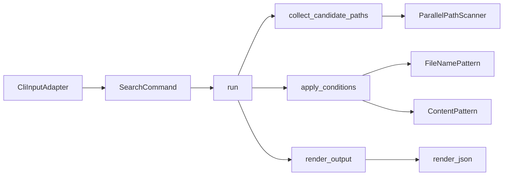

# qfind 技術設計

## 概要
- 目的: `qfind` は、大規模ディレクトリを対象に、glob 条件・regex 条件・`.gitignore`・最大深度制限を適用し、text/JSON で結果を返す CLI を提供する。
- 対象ユーザー: コード探索を行う開発者、JSON 出力を他ツールへ連携する自動化利用者。
- 影響範囲: CLI 入力境界、候補収集、条件適用、出力整形、`src`/`tests` のユニット・統合テスト。

## アーキテクチャ

### パターン
- パターン: 単一実行フロー（`collect -> filter -> render`）を中心としたモジュール分割
- レイヤー責務:
  - 入力境界: `CliInputAdapter` が CLI 引数を `SearchCommand` に変換
  - 探索: `collect_candidate_paths` が `ParallelPathScanner` を使って候補を収集
  - 条件適用: `apply_conditions` が glob/regex 条件を適用
  - 出力: `render_output` が text/JSON を切り替え

### 境界マップ

### 技術スタック
| 領域 | 採用技術 | 役割 |
|---|---|---|
| 言語/ビルド | Rust / Cargo | CLI 実行・テスト実行 |
| CLI | clap | 引数パースと入力エラー処理 |
| 探索 | ignore / rayon | `.gitignore` 尊重と並列走査 |
| 条件判定 | globset / regex | ファイル名・内容一致判定 |
| 出力 | serde / serde_json | JSON 形式出力 |
| テスト | cargo test / assert_cmd / tempfile | ユニット・統合テスト |

## コンポーネントとインターフェース

### サマリー表
| コンポーネント | 層 | 意図 | インターフェース |
|---|---|---|---|
| `CliInputAdapter` | 入力境界 | 引数を型安全に受理して `SearchCommand` を生成 | `from_env()`, `parse_from_iter(...)` |
| `SearchCommand` | アプリケーション入力モデル | 実行条件を不変で保持 | `new(...)`, 各 getter |
| `collect_candidate_paths` | 探索境界（公開API） | 候補パス収集を単機能で公開 | `collect_candidate_paths(search_root, depth_limit)` |
| `ParallelPathScanner` | 探索実装 | 並列走査、`.gitignore`、深度制限、issues収集 | `collect_candidate_paths(...)`, `scan_paths(...)` |
| `PathScannerPort` | 探索契約 | 探索実装の契約を定義 | `scan_paths(search_root, depth_limit)` |
| `apply_conditions` | 条件適用 | glob→regex の順で候補を絞り込む | `apply_conditions(candidate_paths, search_command)` |
| `render_output` / `render_json` | 出力 | text/JSON を切り替えて標準出力へ書き出す | `render_output(paths, json_output)`, `render_json(paths)` |

### 実装上の責務

#### 1. `CliInputAdapter`
- 入力: CLI 引数
- 出力: `SearchCommand`
- 責務: 無効 glob/regex/max-depth を実行前に `QfindError` として返す
- 非責務: ディレクトリ走査、内容検索、出力整形

#### 2. `collect_candidate_paths` / `ParallelPathScanner`
- 入力: `search_root`, `depth_limit`
- 出力: 候補パス（`Vec<PathBuf>`）
- 責務:
  - Rayon ベース並列走査
  - `.gitignore` が存在する場合のみ除外適用
  - 深度制限（0/N）適用
  - 読み取り不可を `ScanIssue` として収集しつつ探索継続
  - 決定的順序になるようソート
- 非責務: glob/regex 判定、出力形式選択

#### 3. `apply_conditions`
- 入力: `candidate_paths`, `SearchCommand`
- 出力: 条件適用後の `Vec<PathBuf>`
- 責務:
  - glob 指定時のみ `FileNamePattern::matches_path` を適用
  - regex 指定時のみ `ContentPattern::is_match_in_file` を適用
  - `PermissionDenied` はスキップして継続
- 非責務: 候補収集、JSON 直列化

#### 4. `render_output` / `render_json`
- 入力: 結果パス配列、`json_output`
- 出力: 標準出力
- 責務:
  - `--json` 指定時: JSON 配列（各要素に `path`）を出力
  - 非指定時: 通常テキスト（1行1パス）を出力
- 非責務: 条件判定、探索処理

## データモデル

### ドメインモデル
| 型 | 種別 | 属性 | 不変条件 |
|---|---|---|---|
| `SearchCommand` | 入力モデル | `search_root`, `file_name_pattern`, `content_pattern`, `depth_limit`, `json_output` | 各 optional 条件は `None` のとき未適用 |
| `FileNamePattern` | 値オブジェクト | `raw`, `matcher` | glob 構文が有効 |
| `ContentPattern` | 値オブジェクト | `raw`, `regex` | regex 構文が有効 |
| `DepthLimit` | 値オブジェクト | `value` | 0 以上の整数 |
| `ScanSnapshot` | 探索スナップショット | `candidate_paths`, `issues` | 候補と issues を同一走査から保持 |
| `ScanIssue` | 走査問題 | `path`, `detail`, `permission_denied` | `permission_denied` で継続可否判断を保持 |

## 要件トレーサビリティ
| 要件 | サマリー | 実装 | テスト |
|---|---|---|---|
| 1.1 | glob 指定時は一致パスのみ | `apply_conditions` + `FileNamePattern::matches_path` | `tests/file_name_pattern_contract.rs` |
| 1.2 | glob 未指定時は除外しない | `apply_conditions` の `None` 分岐 | `src/search_command.rs` tests / `tests/cli_input_contract.rs` |
| 1.3 | 無効 glob は非0終了 | `CliInputAdapter::parse_from_iter` + `QfindError` | `tests/cli_input_contract.rs` |
| 1.4 | glob 0件でも成功 | `apply_conditions` + `run` 正常終了 | `tests/cli_input_contract.rs` |
| 2.1 | regex 一致ファイルのみ | `apply_conditions` + `ContentPattern::is_match_in_file` | `tests/content_pattern_contract.rs` |
| 2.2 | regex 未指定時は除外しない | `apply_conditions` の `None` 分岐 | `src/search_command.rs` tests |
| 2.3 | 無効 regex は非0終了 | `CliInputAdapter::parse_from_iter` + `QfindError` | `tests/cli_input_contract.rs` |
| 2.4 | regex 0件でも成功 | `apply_conditions` + `run` 正常終了 | `tests/content_pattern_contract.rs` |
| 3.1 | `.gitignore` を尊重 | `ParallelPathScanner::build_walker` | `src/parallel_path_scanner.rs` tests |
| 3.2 | ignore対象のみでも成功 | `run` 正常終了（空結果許容） | `tests/cli_input_contract.rs` |
| 3.3 | `.gitignore` 非存在時は未適用 | `build_walker` + 実ファイル有無に依存 | `src/parallel_path_scanner.rs` tests |
| 4.1 | Rayon 並列走査 | `WalkBuilder::build_parallel` | `src/parallel_path_scanner.rs` tests |
| 4.2 | 並列でも結果内容同一 | 収集後ソート (`par_sort_unstable`) | `src/parallel_path_scanner.rs` tests |
| 4.3 | 権限不足でも継続 | `scan_paths` / `apply_conditions` の `PermissionDenied` 継続 | `src/parallel_path_scanner.rs` tests / `tests/cli_input_contract.rs` |
| 5.1 | JSONオプションでJSON配列 | `render_output` -> `render_json` | `tests/cli_input_contract.rs` |
| 5.2 | 非JSONは通常text | `render_output` の text 分岐 | `tests/cli_input_contract.rs` |
| 5.3 | JSONかつ0件で `[]` | `render_json`（空配列シリアライズ） | `tests/cli_input_contract.rs` |
| 5.4 | JSON要素に `path` | `JsonPath { path }` | `tests/cli_input_contract.rs` |
| 6.1 | 深度N以下のみ探索 | `walk_max_depth` + `DepthLimit` | `src/parallel_path_scanner.rs` tests / `tests/cli_input_contract.rs` |
| 6.2 | 深度0は直下のみ | `walk_max_depth`（0 -> 1） | `src/parallel_path_scanner.rs` tests / `tests/cli_input_contract.rs` |
| 6.3 | 不正深度は非0終了 | `DepthLimit::parse` + `QfindError` | `tests/cli_input_contract.rs` |
| 7.1 | `cargo init` 構成 | `Cargo.toml`, `src/main.rs`, `src/lib.rs` | プロジェクト構成 |
| 7.2 | ユニットテストを含む | `src/*.rs` 内 `#[cfg(test)]` 群 | `cargo test --lib` |
| 7.3 | 統合テストを含む | `tests/*.rs` | `cargo test --test ...` |
| 7.4 | 全テスト成功 | テストゲート | `cargo test` |
| 8.1 | 1/2/3/6を同時満足して探索 | `run` の順序（collect→filter） | `tests/cli_input_contract.rs` |
| 8.2 | 確定結果を入力に出力決定 | `run` の順序（filter→render） | `tests/cli_input_contract.rs` |
| 8.3 | テストで1〜6を検証 | ユニット + 統合の組み合わせ | `cargo test` |

## エラー処理戦略
- 入力エラー: `CliInputAdapter` / `DepthLimit` / 各 Pattern の `parse` で検出し、`QfindError` に集約して非0終了。
- 継続可能エラー: `PermissionDenied` は探索・内容検索で継続（結果から除外）。
- 致命エラー: 予期しない読み取り失敗、JSON 直列化失敗は `QfindError` を返して終了。
- 終了コード: `QfindError::exit_code` で入力異常（2）と実行時異常（1）を分離。

## テスト戦略
- ユニットテスト:
  - 入力境界: `src/cli_input_adapter.rs`, `src/depth_limit.rs`
  - 条件判定: `src/file_name_pattern.rs`, `src/content_pattern.rs`
  - 探索境界: `src/parallel_path_scanner.rs`
- 統合テスト:
  - CLI 契約: `tests/cli_input_contract.rs`
  - 条件ごとの振る舞い: `tests/file_name_pattern_contract.rs`, `tests/content_pattern_contract.rs`
- 品質ゲート:
  - `cargo test` 成功
  - `cargo clippy --all-targets --all-features -- -D warnings` 成功
