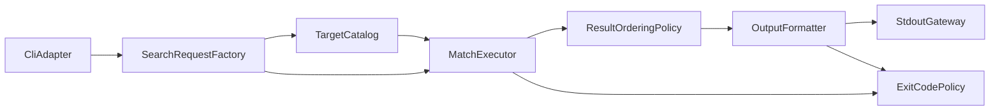

# qgrep 技術設計

## 概要
- 目的: `qgrep` を Rust 製CLIとして設計し、要件1〜9の受け入れ条件を満たす構造を定義する。
- 対象ユーザー: 大規模ソースツリーを日常的に検索する開発者、CI/自動化スクリプトからgrep互換CLIを利用する運用者。
- 影響範囲:
  - 新規 Rust プロジェクト構成（`cargo init`）
  - CLI入力、探索、検索、整列、出力、終了コード判定
  - ユニットテストと統合テストの追加

## アーキテクチャ
### パターン
- 採用パターン: レイヤード + 検索パイプライン
- 境界:
  - Interface Adapter: CLI引数と標準出力/標準エラー
  - Application: 検索要求の構築、探索、検索実行の調停
  - Domain: パターン種別、フィルタ規則、整列規則、終了コード規則
  - Infrastructure: ファイルシステム探索、並列実行基盤、JSONシリアライズ

### 境界マップ
| レイヤー | 主責務 | 主な公開インターフェース |
|---|---|---|
| Interface Adapter | CLI引数の受理、出力モード選択 | `CliAdapter::parse` |
| Application | 要求の正規化、探索〜検索の実行フロー | `SearchRequestFactory::build`, `MatchExecutor::execute` |
| Domain | 一貫した判定規則（フィルタ/整列/終了コード） | `TargetFilterPolicy::accept`, `ResultOrderingPolicy::sort`, `ExitCodePolicy::decide` |
| Infrastructure | `.gitignore` 対応探索、並列検索、JSON Lines生成 | `TargetCatalog::collect`, `OutputFormatter::render_jsonl` |

### 技術スタック
| 領域 | 採用技術 |
|---|---|
| 言語/ビルド | Rust / Cargo |
| CLI | `clap` |
| パターン照合 | `regex` |
| 探索と `.gitignore` | `ignore` |
| 並列実行 | `rayon` |
| JSON出力 | `serde`, `serde_json` |

### コンポーネント連携図

## コンポーネントとインターフェース
### サマリー
| コンポーネント | 責務 | 公開インターフェース |
|---|---|---|
| `CliAdapter` | CLI入力を構造化入力へ変換 | `parse(argv) -> Result<SearchRequestInput, CliInputError>` |
| `SearchRequestFactory` | 入力値検証と `SearchRequest` 構築 | `build(input) -> Result<SearchRequest, RequestBuildError>` |
| `TargetCatalog` | 検索対象ファイル集合を決定 | `collect(request) -> Result<Vec<CandidateFile>, CatalogError>` |
| `TargetFilterPolicy` | include/exclude 判定を一元化 | `accept(path, filter) -> bool` |
| `MatchExecutor` | ファイル検索を実行し結果を収集 | `execute(request, files) -> SearchOutcome` |
| `ResultOrderingPolicy` | 出力順序の決定（path→line） | `sort(records) -> Vec<MatchRecord>` |
| `OutputFormatter` | テキスト/JSON Linesの出力表現を生成 | `render_text(records)`, `render_jsonl(records)` |
| `ExitCodePolicy` | GNU grep互換の終了コード決定 | `decide(outcome) -> ExitStatus` |
| `ProjectLayout` | `cargo init` 構成とテスト配置契約 | `validate_layout() -> Result<(), LayoutError>` |

### 各コンポーネント詳細
#### `CliAdapter`
- 責務: CLI引数（検索モード、対象、フィルタ、コンテキスト、出力形式）を `SearchRequestInput` として返す。
- 境界: CLI仕様に依存。ドメイン型生成は `SearchRequestFactory` に委譲。

#### `SearchRequestFactory`
- 責務: 検索モードの選択、不正正規表現・不正コンテキスト値の検出。
- 境界: 成功時は必ずドメイン不変条件を満たす `SearchRequest` を返す。

#### `TargetCatalog`
- 責務: ファイル/ディレクトリ入力を受け、再帰探索 + `.gitignore` 適用 + フィルタ適用済み候補を返す。
- 境界: 探索戦略は内部詳細。外部には候補ファイル集合のみ公開。

#### `TargetFilterPolicy`
- 責務: パス/拡張子の include/exclude 判定を統一。
- 不変条件: include と exclude が衝突する場合は exclude 優先。

#### `MatchExecutor`
- 責務: 候補ファイル群への検索実行、マッチ結果と実行中エラーを `SearchOutcome` に集約。
- 境界: 並列実行の有無を隠蔽し、呼び出し側に同一の結果モデルを返す。

#### `ResultOrderingPolicy`
- 責務: 並列実行後の非決定順序を、`path` 昇順・`line_number` 昇順へ正規化。
- 不変条件: 出力順序は実行回数に依存せず決定的。

#### `OutputFormatter`
- 責務: テキスト形式（`path:line:content`）とJSON Lines形式を切り替えて生成。
- 境界: JSON出力時はプレーンテキスト行を生成しない。

#### `ExitCodePolicy`
- 責務: GNU grep 互換規則で `0/1/2` を決定。
- 規則: 実行エラーが1件でもあれば `2` を返す。

#### `ProjectLayout`
- 責務: `cargo init` 構成と `cargo test` でユニット/統合テストが同時実行される配置を維持。
- 境界: 実行時ロジックとは分離し、開発時契約として扱う。

## データモデル
### ドメインモデル
| 型 | 種別 | 主属性 | 不変条件 |
|---|---|---|---|
| `SearchRequest` | 集約ルート | `pattern`, `target`, `filter`, `context_window`, `output_mode` | 構築時に全入力検証済み |
| `SearchPattern` | 値オブジェクト | `RegexPattern` / `FixedPattern` | `RegexPattern` は妥当な式のみ保持 |
| `SearchTarget` | 値オブジェクト | `FilePath` / `DirectoryPath` | 対象は必ず1つ以上 |
| `TargetFilter` | 値オブジェクト | `include_paths`, `exclude_paths`, `include_extensions`, `exclude_extensions` | 衝突時は除外優先 |
| `ContextWindow` | 値オブジェクト | `before`, `after` | 非負整数のみ |
| `MatchRecord` | エンティティ | `path`, `line_number`, `line`, `before_context`, `after_context` | `line_number >= 1` |
| `SearchOutcome` | 集約 | `records`, `issue_count` | `issue_count > 0` なら終了コード候補は `2` |
| `ExitStatus` | 値オブジェクト | `Matched(0)`, `NoMatch(1)`, `Error(2)` | GNU grep互換 |

### 論理データモデル
| 論理集合 | キー/整列 | 用途 |
|---|---|---|
| `CandidateFileSet` | `path` 一意 | 探索後の検索対象集合 |
| `MatchRecordList` | `path ASC`, `line_number ASC` | 画面表示/JSON出力の決定順序 |
| `IssueList` | 発生順 | 実行エラー集約と終了コード判定 |

## 要件トレーサビリティ
| 要件 | サマリー | コンポーネント | インターフェース |
|---|---|---|---|
| 1 (1.1-1.4) | 検索方式選択と不正正規表現検出 | `CliAdapter`, `SearchRequestFactory`, `MatchExecutor` | `parse`, `build`, `execute` |
| 2 (2.1-2.4) | 再帰探索と `.gitignore` 尊重 | `TargetCatalog` | `collect` |
| 3 (3.1-3.5) | パス/拡張子 include・exclude フィルタ | `TargetFilterPolicy`, `TargetCatalog` | `accept`, `collect` |
| 4 (4.1-4.3) | テキスト一致行出力 | `OutputFormatter` | `render_text` |
| 5 (5.1-5.6) | 前後コンテキストと値検証 | `SearchRequestFactory`, `OutputFormatter` | `build`, `render_text` |
| 6 (6.1-6.4) | 並列検索と決定順序 | `MatchExecutor`, `ResultOrderingPolicy` | `execute`, `sort` |
| 7 (7.1-7.7) | JSON Lines 出力 | `OutputFormatter` | `render_jsonl` |
| 8 (8.1-8.4) | GNU grep互換終了コード | `ExitCodePolicy` | `decide` |
| 9 (9.1-9.8) | Cargo構成とユニット/統合テスト | `ProjectLayout` | `validate_layout` |

## エラー処理戦略
- エラー分類
  - 入力エラー: 不正正規表現、不正コンテキスト値
  - 実行エラー: ファイル読み取り不可、探索失敗、出力生成失敗
- 判定規則
  - 実行エラーが1件以上: 終了コード `2`
  - 実行エラーなし + マッチ0件: 終了コード `1`
  - 実行エラーなし + マッチ1件以上: 終了コード `0`
- 重要制約
  - マッチが存在しても実行エラーがあれば `2`（要件8.4）
  - JSON出力時、結果行はJSONのみ（要件7.7）

## テスト戦略
### ユニットテスト
- `SearchRequestFactory`
  - 正規表現/固定文字列切替（1.1〜1.3）
  - 不正正規表現でエラー（1.4）
  - コンテキスト値検証（5.6）
- `TargetFilterPolicy`
  - include/exclude 判定と exclude 優先（3.1〜3.5）
- `ResultOrderingPolicy`
  - `path` 昇順・`line_number` 昇順（6.3〜6.4）
- `ExitCodePolicy`
  - `0/1/2` 決定規則（8.1〜8.4）

### 統合テスト
- CLIテキスト出力検証（4.1〜4.3）
- 前後コンテキスト検証（5.1〜5.5）
- 再帰探索と `.gitignore` 尊重（2.1〜2.4）
- JSON Lines 出力検証（7.1〜7.7）
- 並列検索時の決定順序検証（6.1〜6.4）
- 終了コード検証（8.1〜8.4）

### E2Eテスト
- 実ファイルツリーに対するコマンド実行で、主要シナリオ（マッチあり/なし/エラー）を検証。
- `cargo test` 実行でユニット・統合が同時に走ることを継続確認（9.7〜9.8）。
