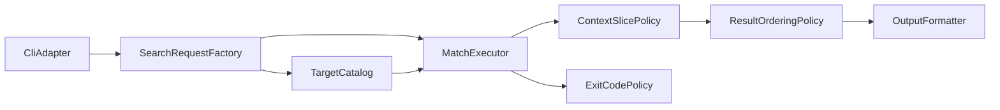

# qgrep 技術設計

## 概要
- 目的: Rust製CLI `qgrep` の技術設計を定義し、要件1〜9の受け入れ条件を満たす実装方針を確定する。
- 対象ユーザー: 大規模コードベースを日常的に検索する開発者、grep互換終了コードを前提に自動化を組む運用者。
- 影響範囲:
  - Rustプロジェクト初期化（`cargo init`）
  - CLI入力、探索、検索、整列、出力、終了コード判定
  - ユニットテストと統合テストの同時成立

### ギャップ分析の反映
- 推奨実装アプローチ: **C: ハイブリッド**（実装は新規作成、設計資産は流用）
- 工数見積: **M (3-7日)**
- リスク見積: **Medium**
- 設計時に固定する論点:
  - 並列検索後の決定的順序（`path ASC`→`line_number ASC`）
  - エラー優先終了コード（マッチ有でもエラー時は `2`）
  - コンテキスト境界（先頭/末尾不足時）

## アーキテクチャ
### パターン
- 採用パターン: レイヤード + 検索パイプライン
- 境界:
  - Interface Adapter: CLI引数と標準出力/標準エラー
  - Application: 検索要求構築、探索、検索実行の調停
  - Domain: フィルタ判定、整列規則、終了コード規則、コンテキスト抽出規則
  - Infrastructure: ファイル探索、`.gitignore` 適用、並列実行、JSONシリアライズ

### 境界マップ
| レイヤー | 主責務 | 主な公開インターフェース |
|---|---|---|
| Interface Adapter | CLI入力の受理、出力モード選択 | `CliAdapter::parse` |
| Application | 要求正規化、探索〜検索フロー調停 | `SearchRequestFactory::build`, `MatchExecutor::execute` |
| Domain | フィルタ/コンテキスト/整列/終了コードの規則定義 | `TargetFilterPolicy::accept`, `ContextSlicePolicy::slice`, `ResultOrderingPolicy::sort`, `ExitCodePolicy::decide` |
| Infrastructure | `.gitignore` 対応探索、並列検索、JSON Lines整形 | `TargetCatalog::collect`, `OutputFormatter::render_jsonl` |

### 技術スタック
| 領域 | 採用技術 |
|---|---|
| 言語/ビルド | Rust / Cargo |
| CLI入力 | `clap` |
| パターン照合 | `regex` |
| 再帰探索 + `.gitignore` | `ignore` |
| 並列実行 | `rayon` |
| JSON出力 | `serde`, `serde_json` |

### コンポーネント連携図

## コンポーネントとインターフェース
### サマリー
| コンポーネント | 責務 | 公開インターフェース |
|---|---|---|
| `CliAdapter` | CLI入力を構造化入力へ変換 | `parse(argv) -> Result<SearchRequestInput, CliInputError>` |
| `SearchRequestFactory` | 入力値検証と `SearchRequest` 構築 | `build(input) -> Result<SearchRequest, RequestBuildError>` |
| `TargetCatalog` | 検索対象ファイル集合を決定 | `collect(request) -> Result<Vec<CandidateFile>, CatalogError>` |
| `TargetFilterPolicy` | パス/拡張子 include/exclude 判定を一元化 | `accept(path, filter) -> bool` |
| `MatchExecutor` | 候補ファイルに対する検索実行と結果集約 | `execute(request, files) -> SearchOutcome` |
| `ContextSlicePolicy` | 前後コンテキスト抽出規則を一元化 | `slice(hit, lines, window) -> ContextSlice` |
| `ResultOrderingPolicy` | 出力順序の正規化（path→line） | `sort(records) -> Vec<MatchRecord>` |
| `OutputFormatter` | テキスト/JSON Linesの表現切替 | `render_text(records)`, `render_jsonl(records)` |
| `ExitCodePolicy` | GNU grep互換終了コード判定 | `decide(outcome) -> ExitStatus` |
| `ProjectLayout` | `cargo init` 構成とテスト配置契約の維持 | `validate_layout() -> Result<(), LayoutError>` |

### 各コンポーネント詳細
#### `CliAdapter`
- 責務: 検索パターン、対象パス、フィルタ、コンテキスト、出力モードを受理し `SearchRequestInput` として返す。
- 境界: CLI構文の責務のみを持ち、ドメイン不変条件の保証は行わない。

#### `SearchRequestFactory`
- 責務: `SearchRequestInput` から `SearchRequest` を構築し、無効入力を `RequestBuildError` に変換する。
- 境界: 正規表現妥当性とコンテキスト値妥当性の検証責務を持つ。

#### `TargetCatalog`
- 責務: ファイル/ディレクトリ入力を受け、再帰探索・`.gitignore` 適用・フィルタ適用済み候補を返す。
- 境界: 探索方式は内部詳細として隠蔽し、候補集合のみを公開する。

#### `TargetFilterPolicy`
- 責務: include/exclude、拡張子include/excludeの衝突判定を統一する。
- 評価契約:
  - パスフィルタ文法は `glob` とする。
  - パス比較対象は「探索起点ディレクトリ相対パス（区切りは `/`）」とする。
  - パス比較は大文字小文字を区別する。
  - 拡張子比較は先頭 `.` を除去して小文字正規化した値で行う。
  - include 未指定時は全件候補、exclude 指定は常に優先する。
- 不変条件: include と exclude の同時一致は exclude 優先。

#### `MatchExecutor`
- 責務: 候補ファイル群に対する検索処理を実行し、マッチ結果と実行中問題を `SearchOutcome` に集約する。
- 境界: 並列処理の有無を外部へ露出しない。

#### `ContextSlicePolicy`
- 責務: `-A/-B/-C` で要求された文脈の抽出範囲を定義する。
- 不変条件:
  - ファイル先頭/末尾を超える範囲は切り詰める。
  - 近接マッチで文脈範囲が重なる場合、同一 `(path, line_number)` は1回のみ返す。

#### `ResultOrderingPolicy`
- 責務: 並列実行後の結果順序を決定的な順序に正規化する。
- 不変条件: 同一入力では実行回数に依存しない順序を返す。

#### `OutputFormatter`
- 責務: テキスト形式（`path:line:content`）とJSON Lines形式を切り替えて出力表現を生成する。
- テキスト出力契約:
  - 一致行: `path:line_number:line`。
  - コンテキスト行: `path-line_number-line`（一致行と識別可能な区切りを使用）。
  - 非連続グループ境界: `--` を1行出力。
  - JSON出力指定時は上記テキスト行を出力しない。
- 境界: 出力フォーマット定義のみを担い、検索・整列・終了コード判定は担わない。

#### `ExitCodePolicy`
- 責務: `SearchOutcome` を GNU grep 互換終了コードへ変換する。
- 規則: 実行中問題が1件以上ある場合はマッチ有無より `2` を優先。

#### `ProjectLayout`
- 責務: `cargo init` 起点の構成と `cargo test` でのユニット/統合同時実行を維持する。
- 境界: 実行時ロジックではなく開発時契約を扱う。

## データモデル
### ドメインモデル
| 型 | 種別 | 主属性 | 不変条件 |
|---|---|---|---|
| `SearchRequest` | 集約ルート | `pattern`, `target`, `filter`, `context_window`, `output_mode` | 構築時に入力検証済み |
| `SearchPattern` | 値オブジェクト | `RegexPattern` / `FixedPattern` | `RegexPattern` は妥当式のみ |
| `SearchTarget` | 値オブジェクト | `FilePath` / `DirectoryPath` | 検索起点は1つ以上 |
| `TargetFilter` | 値オブジェクト | `include_paths`, `exclude_paths`, `include_extensions`, `exclude_extensions` | `glob` 文法・相対パス比較・拡張子小文字正規化 |
| `ContextWindow` | 値オブジェクト | `before`, `after` | 非負整数のみ |
| `ContextSlice` | 値オブジェクト | `before_context`, `after_context` | 返却行は常に実在行のみ、重複行なし |
| `MatchRecord` | エンティティ | `path`, `line_number`, `line`, `before_context`, `after_context` | `line_number >= 1` |
| `SearchIssue` | エンティティ | `path`, `kind`, `message`, `continuable` | `kind` と `continuable` の組み合わせが有効表に含まれる |
| `SearchOutcome` | 集約 | `records`, `issues` | `issues` 非空なら終了コード候補は `2` |
| `ExitStatus` | 値オブジェクト | `Matched(0)`, `NoMatch(1)`, `Error(2)` | GNU grep互換 |

### 論理データモデル
| 論理集合 | キー/整列 | 用途 |
|---|---|---|
| `CandidateFileSet` | `path` 一意 | 探索後の検索対象集合 |
| `MatchRecordList` | `path ASC`, `line_number ASC` | テキスト/JSONの決定順序 |
| `SearchIssueList` | `path ASC`, `kind ASC` | エラーの決定的集約と監視出力 |

## 要件トレーサビリティ
| 要件 | サマリー | コンポーネント | インターフェース |
|---|---|---|---|
| 1 (1.1-1.4) | 検索方式切替と不正正規表現検出 | `CliAdapter`, `SearchRequestFactory`, `MatchExecutor` | `parse`, `build`, `execute` |
| 2 (2.1-2.4) | 再帰探索と `.gitignore` 適用 | `TargetCatalog` | `collect` |
| 3 (3.1-3.6) | パス/拡張子フィルタと0件時の無出力 | `TargetFilterPolicy`, `TargetCatalog` | `accept`, `collect` |
| 4 (4.1-4.3) | 行番号・ファイル名付きテキスト出力 | `OutputFormatter` | `render_text` |
| 5 (5.1-5.8) | 前後コンテキスト出力と境界制御 | `SearchRequestFactory`, `ContextSlicePolicy`, `OutputFormatter` | `build`, `slice`, `render_text` |
| 6 (6.1-6.4) | `rayon` 並列検索と決定順序 | `MatchExecutor`, `ResultOrderingPolicy` | `execute`, `sort` |
| 7 (7.1-7.8) | JSON Lines 出力契約 | `OutputFormatter` | `render_jsonl` |
| 8 (8.1-8.4) | GNU grep互換終了コード | `ExitCodePolicy` | `decide` |
| 9 (9.1-9.8) | `cargo init` 構成とテスト運用 | `ProjectLayout` | `validate_layout` |

## エラー処理戦略
### エラー分類
| `SearchIssue.kind` | 例 | 継続可否 | 標準エラー出力 |
|---|---|---|---|
| `TargetOpenDenied` | 権限不足でファイルを開けない | 継続 | `qgrep:error:path:kind:message` |
| `TargetReadFailed` | 読み取り中I/O失敗 | 継続 | `qgrep:error:path:kind:message` |
| `TargetDecodeFailed` | テキストデコード失敗 | 継続 | `qgrep:error:path:kind:message` |
| `OutputWriteFailed` | 標準出力/標準エラーへの書き込み失敗 | 中断 | `qgrep:error:path:kind:message` |
| `InvalidInput` | 不正正規表現/不正コンテキスト値 | 中断 | `qgrep:error:-:kind:message` |

### 判定規則
- 実行中問題が1件以上: 終了コード `2`
- 実行中問題なし + マッチ0件: 終了コード `1`
- 実行中問題なし + マッチ1件以上: 終了コード `0`

### 設計制約
- マッチが存在しても実行中問題があれば `2`（要件8.4）。
- `SearchIssueList` は決定順序（`path ASC`, `kind ASC`）で集約する。
- JSON出力時はJSON Linesのみを出力（要件7.7/7.8）。

## テスト戦略
### ユニットテスト
- `SearchRequestFactory`
  - 正規表現/固定文字列切替（1.1〜1.3）
  - 不正正規表現・不正コンテキスト値（1.4, 5.6）
- `TargetFilterPolicy`
  - `glob` 一致規則、探索起点相対比較、拡張子正規化（3.1〜3.5）
  - フィルタ後0件時の出力契約前提（3.6）
- `ContextSlicePolicy`
  - 先頭/末尾境界での切り詰め（5.7, 5.8）
  - 近接マッチ時の重複行排除（5.1〜5.4）
- `ResultOrderingPolicy`
  - `path` と `line_number` の決定順序（6.3, 6.4）
- `ExitCodePolicy`
  - `0/1/2` 判定（8.1〜8.4）

### 統合テスト
- CLIテキスト出力（`path:line:content`）とコンテキスト行形式（`path-line-content`）の検証（4.1〜4.3, 5.1〜5.5）
- 非連続グループで `--` が出力されることの検証（5.1〜5.4）
- 再帰探索 + `.gitignore`（2.1〜2.4）
- JSON Lines出力（7.1〜7.8）
- 並列検索時の順序（6.1〜6.4）
- 終了コードと標準エラー契約（8.1〜8.4）

### E2Eテスト
- 実ファイルツリーに対するCLI実行で、マッチあり/なし/エラーの主要シナリオを検証する。
- `cargo test` でユニット/統合同時実行を継続確認する（9.7, 9.8）。
